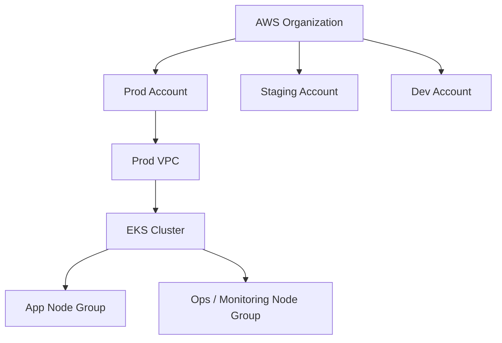
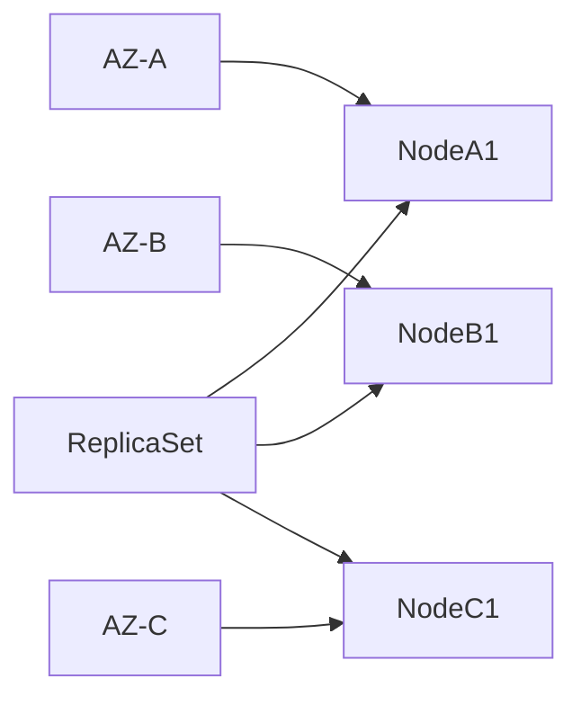
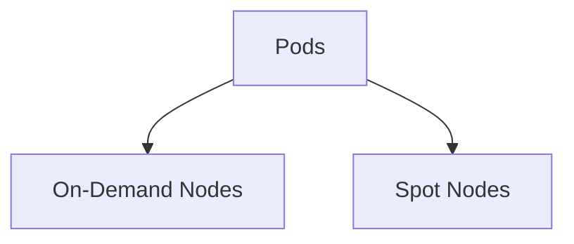
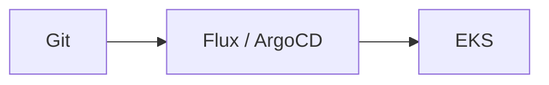
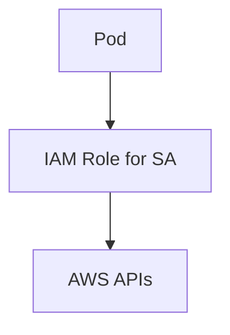

Please check https://aws.github.io/aws-eks-best-practices/ for more comprehensive EKS best practice!

##
##
##

# Amazon EKS Best Practices – Architecture, Reliability, Performance, Cost & Security 

> Primary reference:
> [https://aws.github.io/aws-eks-best-practices/](https://aws.github.io/aws-eks-best-practices/)

This document consolidates **architecture, reliability, performance efficiency, cost optimization, operations, monitoring, and security best practices** for running Amazon EKS at scale, across **prod, staging, and multi-tenant environments**.

---

## 1. Architecture Principles

### 1.1 Multi-Tenancy & Isolation Strategy

Isolation should be applied **progressively**, depending on blast radius tolerance and compliance requirements.

| Isolation Layer   | Use When                                         |
| ----------------- | ------------------------------------------------ |
| **AWS Account**   | Strong isolation, compliance, billing separation |
| **VPC / Cluster** | Prod vs non-prod, regulatory boundaries          |
| **Node Group**    | Workload class separation                        |
| **Namespace**     | Logical isolation only (not security)            |

#### Recommended Pattern



---

### 1.2 Node Group Segmentation

Create **dedicated node groups (node pools)** by workload purpose:

| Node Group  | Purpose                               |
| ----------- | ------------------------------------- |
| Application | Stateless app workloads               |
| Ops         | CI/CD, monitoring, logging            |
| System      | Core add-ons, CNI, controllers        |
| Spot        | Cost-optimized non-critical workloads |

This:

* Limits blast radius
* Enables targeted autoscaling
* Simplifies debugging

---

## 2. Reliability & Availability

### 2.1 VPC & Networking

* Use a **dedicated VPC per EKS cluster**
* Avoid multiple CIDRs per VPC unless required
* Avoid CNI custom networking unless pod IP exhaustion requires it
* Plan CIDR ranges **up front** (future scaling!)

---

### 2.2 Multi-AZ Design

* Always deploy worker nodes across **multiple AZs**
* Spread pod replicas across AZs



---

### 2.3 Node Failure & Autoscaling

* Use **Managed Node Groups**
* Enable **Cluster Autoscaler**
* Maintain **buffer capacity** (don’t run at 100%)
* Avoid overly large instances (blast radius)

---

### 2.4 Pod Resilience

| Feature                     | Why                       |
| --------------------------- | ------------------------- |
| Pod Disruption Budgets      | Prevent cascading outages |
| Liveness / Readiness probes | Fast failure detection    |
| HPA                         | Scale based on load       |
| Circuit breakers            | Avoid retry storms        |

---

### 2.5 Storage Reliability

* Prefer **EFS** for shared, reschedulable workloads
* Use **EBS** with AZ-aware scheduling:

```yaml
nodeSelector:
  topology.kubernetes.io/zone: us-east-1c
```

* Use **AWS Backup** for EBS/EFS
* For metrics: **Thanos + S3** (multi-AZ safe)

---

### 2.6 Node Lifecycle Events

Install **aws-node-termination-handler**:

* Spot interruptions
* Scheduled maintenance
* Instance rebalance events

This prevents:

* Sudden pod loss
* Data corruption
* Stuck terminations

---

## 3. Performance Efficiency

### 3.1 Instance Sizing

Understand tradeoffs:

| Many Small Nodes   | Few Large Nodes     |
| ------------------ | ------------------- |
| Faster scaling     | Lower overhead      |
| Higher overhead    | Larger blast radius |
| Better bin-packing | Slower recovery     |

Avoid maxing pod density per node.

---

### 3.2 Pod Resource Management

**Always define requests & limits**:

```yaml
resources:
  requests:
    cpu: "500m"
    memory: "512Mi"
  limits:
    cpu: "1"
    memory: "1Gi"
```

Without limits:

* kubelet loses control
* Node OOM cascades occur (exactly what you saw)

---

### 3.3 CPU & Latency-Sensitive Workloads

* Use `cpuManagerPolicy: static`
* Pin workloads requiring exclusive CPUs
* Consider **single-AZ node groups** for ultra-low latency (e.g. Spark)

⚠️ Validate availability tradeoffs carefully.

---

### 3.4 Observability for Performance

* X-Ray / OpenTelemetry for tracing
* Identify bottlenecks between services
* Monitor pod startup latency during scaling

---

## 4. Cost Optimization

### 4.1 Compute Cost Controls

* Use **Cluster Autoscaler**
* Right-size pods using historical metrics
* Use **Spot Instances** for:

  * CI
  * Batch
  * Staging



---

### 4.2 Storage & Managed Services

* Prefer managed services (RDS, OpenSearch, etc.)
* Reduce operational overhead
* Improve cost predictability

---

### 4.3 Cost Visibility

* Tag all AWS resources
* Label Kubernetes resources
* Use tools like `kube-resource-report`
* Align costs with teams / namespaces

---

## 5. Operations & Deployment

### 5.1 Infrastructure as Code

Use **one** of:

* Terraform
* CloudFormation
* eksctl
* AWS CDK

Never mutate clusters manually.

---

### 5.2 GitOps & CI/CD

* Use Flux / ArgoCD
* Enforce PR-based changes
* Maintain auditability



---

### 5.3 Upgrades & Runbooks

Practice:

* Cluster upgrades
* Node group rolling updates
* Node drain procedures
* Failure injection

Chaos engineering should be routine, not exceptional.

---

## 6. Monitoring, Logging & Tracing

### 6.1 Monitoring

* Define **SLOs / SLIs**
* Track:

  * MTTD
  * MTTR
* Use:

  * Prometheus + Grafana
  * CloudWatch Container Insights
  * Control plane metrics

---

### 6.2 Logging

* Enable **Control Plane Logging**
* Prefer **DaemonSet log collectors** on EC2
* Use **Sidecars** for Fargate
* Centralize logs via:

  * Fluent Bit
  * Firehose
  * S3 + Athena

---

### 6.3 Tracing

* Use X-Ray or OpenTelemetry
* Monitor blue-green and canary deploys
* Detect latency regressions early

---

## 7. Security Best Practices

### 7.1 Shared Responsibility Awareness

Responsibility differs by mode:

| Mode                | You Manage           |
| ------------------- | -------------------- |
| Self-managed nodes  | OS, kubelet, runtime |
| Managed Node Groups | OS partially         |
| Fargate             | Only pods            |

---

### 7.2 Identity & Access

* Enable **IRSA**
* Avoid node IAM roles for apps
* Use fine-grained permissions



---

### 7.3 Network Security

* Use **NetworkPolicies** (Calico)
* Use **Security Groups for Pods**
* Segment east-west traffic

---

### 7.4 Secrets & Encryption

* Enable **KMS encryption for Secrets**
* Rotate keys
* Avoid plaintext env vars

---

### 7.5 Auditing & Detection

* Enable CloudTrail for EKS API
* Forward logs to S3
* Retain > 90 days
* Consider Falco / runtime detection

---

## 8. Configuration & Service Discovery

* App Mesh for service mesh use cases
* AWS Cloud Map for service discovery
* Consul integration if required

---

## 9. Final Notes

This guidance is intentionally **defense-in-depth**:

* No single control is sufficient
* Failures *will* happen
* The goal is **containment, fast detection, and graceful recovery**

---

## 📌 Suggested Repo Structure

```
eks-best-practices/
├── architecture.md
├── reliability.md
├── performance.md
├── cost.md
├── security.md
├── diagrams/
│   └── *.mmd
└── runbooks/
```

##
##


## Architecture
- Think about multi-tenancy, isolation for different environment or different workload
    - Isolation at account level using AWS organization
    - Isolation at the network layer ie. different VPC & different cluster
    - Use different Nodes Group (Node pool) for different purpose/category e.g. create dedicated node groups for Operational tools such as CI/CD tool, Monitoring tool, Centralize logging system. 
    - Separate namespace for different workload
 
## Reliability | [Principles](https://docs.aws.amazon.com/wellarchitected/latest/reliability-pillar/design-principles.html)
- Recommended to use dedicated VPC for EKS
  - [Modular and Scalable Amazon EKS Architecture](https://docs.aws.amazon.com/quickstart/latest/amazon-eks-architecture/welcome.html)
  - Plan your VPC & Subnet CIDR, avoid complexity of using [multiple CIDRs in a VPC](https://aws.amazon.com/premiumsupport/knowledge-center/eks-multiple-cidr-ranges/) and [CNI custom networking](https://docs.aws.amazon.com/eks/latest/userguide/cni-custom-network.html)
- Understand and check [Service Quota of EKS/Fargate](https://docs.aws.amazon.com/eks/latest/userguide/service-quotas.html) and other related services
- Implement [Cluster Autoscaler](https://aws.github.io/aws-eks-best-practices/cluster-autoscaling/) to automatically adjust the  size of an EKS cluster up and down based on scheduling demands.
- Consider the number of worker nodes and service degradation if there is node/AZ failure. 
  - Mind the RTO.
  - Consider to have buffer node. 
- Consider not to choose very large instance type to reduce blast radius.
- Enable Horizontal Pod Autoscaler to use CPU utilization  or custom metrics to scale out pods.
- Use Infrastructure as code (Kubernetes manifest files and templates to provision EKS clusters/nodes etc) to track changes and  provide auditability
- Use [multiple AZs](https://aws.amazon.com/blogs/containers/amazon-eks-cluster-multi-zone-auto-scaling-groups/). Spread out application replicas to different worker node  availability zones for redundancy
  - Mind with your persistent pods that use EBS as PersistentVolume. Use annotation e.g `topology.kubernetes.io/zone=us-east-1c`
- Highly available and scalable worker nodes using Auto Scaling Groups, use node group
  - Consider to use [Managed Node Groups](https://docs.aws.amazon.com/eks/latest/userguide/managed-node-groups.html) for easy setup and high available nodes while updates or temination
  - Consider to use Fargate so you don't have to manage worker nodes. But please beware of Fargate limitation.
- Consider to separate Node Group for your application and utility functions eg. Logging databse, Service Mesh Control Plane
- Deploy [aws-node-termination-handler](https://github.com/aws/aws-node-termination-handler). It detects if node will be unavailable/terminated such as Spot interuption then ensure no new work is scheduled there, then drain it, removing any existing work. [Tutorial](https://eksworkshop.com/beginner/150_spotworkers/deployhandler/) | [Announcement](https://aws.amazon.com/about-aws/whats-new/2019/11/aws-supports-automated-draining-for-spot-instance-nodes-on-kubernetes/)
- Configure [Pod Disruption Budgets](https://kubernetes.io/docs/concepts/workloads/pods/disruptions/) (PDBs) to limits the number of Pods of a replicated application that are down simultaneously from [voluntary disruptions](https://kubernetes.io/docs/concepts/workloads/pods/disruptions/#voluntary-and-involuntary-disruptions) eg. when upgrading, rolling deployment and [other use case](https://kubernetes.io/docs/tasks/run-application/configure-pdb/#think-about-how-your-application-reacts-to-disruptions). 
- Use AWS Backup to backup EFS and EBS
- Use EFS for Storage Class : Using EFS does not require pre-provisioning the  capacity and enables more efficient pod migrations between worker nodes  (removing node-attached  storage)
- Install [Node Problem Detector](https://github.com/kubernetes/node-problem-detector) to provide actionable data  to heal clusters.
- Avoid configuration mistake such as using Anti-affinity that makes pod cannot be rescheduled due to node failure.
- Use Liveness and Readiness Probes
- Practice chaos engineering, use [available tools to automate](https://landscape.cncf.io/category=chaos-engineering&format=card-mode&grouping=category).
  - Kill Pods Randomly During Testing
- Implement failure management in microservice level, e.g. Circuit breaker pattern, Control and limit retry calls (exponential backoff), throttling, make services stateless where possible
- Practice how to upgrade the cluster and worker nodes to new version.
  - Practice how to drain the worker nodes.
- Practice Chaos engineering
- Use CI/CD tools, automate and having process flow (approval/review) for infrastructure changes. Consider to implement Gitops.
- Use multi-AZ solution for persistent volume eg. [Thanos+S3 for Prometheus](https://aws.amazon.com/blogs/opensource/improving-ha-and-long-term-storage-for-prometheus-using-thanos-on-eks-with-s3/)

## Performance Efficiency | [Principles](https://docs.aws.amazon.com/wellarchitected/latest/performance-efficiency-pillar/design-principles.html)
- Inform AWS support if you need to pre-scale the Control Plane (Master node & Etcd) in case of sudden load increment
- Choose the right [EC2 instance type](https://aws.amazon.com/ec2/instance-types/) for your worker node.
  - Undestand the [pros & cons](https://learnk8s.io/kubernetes-node-size) of using many small node instances or few large node instances. Consider the OS overhead, time required to pull image in a new instance when it scale, kubelet overhead, system pod overhead, etc.  
  - Understand the pod density limitation ([maximum number of pods](https://github.com/awslabs/amazon-eks-ami/blob/master/files/eni-max-pods.txt) supported by each instance type)
- Use single-AZ node groups if necessary. Typically, one of the best practices is to run a microservice across Multi-AZ for availability, but for some workload (such as Spark) that need micro-second latency, having high network I/O operation and transient, it is make send to use single-AZ.
- Understand the [performance limitation of Fargate](https://github.com/aws/containers-roadmap/issues/715). Do the load test before going to production.
- Ensure your pod requests the resources it needs. Define `request` and `limit` resources such as CPU, memory
- Detect bottleneck/latency in a microservice with X-Ray, or [other tracing/APM products](https://landscape.cncf.io/category=tracing&format=card-mode&grouping=category)
- Choose the right storage backend. Use [Amazon FSx for Lustre](https://aws.amazon.com/fsx/lustre/) and its [CSI Driver](https://github.com/kubernetes-sigs/aws-fsx-csi-driver) if your persistent container need high-performance file system
- Monitor pod & nodes resource consumption and detech bottlenect. You can use CloudWatch, [CloudWatch Container Insight](https://docs.aws.amazon.com/AmazonCloudWatch/latest/monitoring/ContainerInsights.html), or [other products](https://landscape.cncf.io/category=monitoring&format=card-mode&grouping=category)
- If needed, launch instances (worker nodes) in [Placement Groups](https://docs.aws.amazon.com/AWSEC2/latest/UserGuide/placement-groups.html) to leverage low latency without any slowing. You can use this [CloudFormation Template](https://github.com/aws-samples/aws-eks-deep-learning-benchmark/blob/master/blog-post-sample/eks_cluster/amazon-eks-nodegroup-placementgroup.yaml) to add new node groups with non-blocking, non-oversubscribed, fully bi-sectional connectivity.
- If needed, setup [Kubernetes CPU Management policy to 'static'](https://kubernetes.io/docs/tasks/administer-cluster/cpu-management-policies/#cpu-management-policies) for some pods who need exclusive CPUs 
 
## Cost Optimization
- Minimize the wasted (unused) resources when using EC2 as worker node. 
  - Choose the right EC2 instance type and use cluster auto scaling. 
  - Consider to use Fargate 
  - Consider to use a tool like [kube-resource-report](https://github.com/hjacobs/kube-resource-report) to visualizing the slack cost and right sizing the requests for the containers in a pod.
- Use Spot Instances or mix On-Demand and Spot by utilizing [Spot Fleet](https://aws.amazon.com/blogs/aws/ec2-fleet-manage-thousands-of-on-demand-and-spot-instances-with-one-request/). Consider using Spot instances for Test/Staging env.
- Use Reserved Instance or Saving Plans
- Use single-AZ node groups for workload with high network I/O operation (e.g. Spark) to reduce cross-AZ communication. But please validate if running Single-AZ wouldn’t compromise availability of your system.
- Consider managed services for supporting tool such as monitoring, service mesh, cetralized logging, to redure your team effort & cost
- Tag all AWS resources when possible and use Labels to tag Kubernetes resources so that you can easily analyze the cost.
- Consider to use self-manage Kubernetes (not using EKS) for non-HA cluster. You can setup using [Kops](https://github.com/kubernetes/kops) for your small k8s cluster. 
- Use Node Affinities using nodeSelector for pod that requires specific EC2 instance type.
 
## Operation: [Principles](https://docs.aws.amazon.com/wellarchitected/latest/operational-excellence-pillar/design-principles.html)
- Use IaC tool for provisioning the EKS cluster such as
  - CloudFormation. 
    - [Reference deloyment](https://aws.amazon.com/quickstart/architecture/amazon-eks/)
    - [Deploy self-manage nodes](https://amazon-eks.s3.us-west-2.amazonaws.com/cloudformation/2020-08-12/amazon-eks-nodegroup.yaml)
  - [Terraform](https://learn.hashicorp.com/tutorials/terraform/eks) 
  - [Eksctl](https://eksctl.io/)
  - [AWS CDK](https://medium.com/faun/spawning-an-autoscaling-eks-cluster-52977aa8b467)
- Consider to use package manager like [Helm](https://docs.aws.amazon.com/eks/latest/userguide/helm.html) to helps you install and manage applications.
- Automate cluster management and applicatoin deployment using [GitOps](https://www.weave.works/technologies/gitops/). You can use tools like [Flux](https://fluxcd.io/) or [others](https://github.com/weaveworks/awesome-gitops | [workshop](https://www.eksworkshop.com/intermediate/260_weave_flux/)
- Use [CI/CD tools](https://landscape.cncf.io/category=continuous-integration-delivery&format=card-mode&grouping=category)
- Practice to do EKS upgrade (rolling update), create runbook.
      - [GitHub - hellofresh/eks-rolling-update: EKS Rolling Update is a utility for updating the launch configuration of worker nodes in an EKS cluster.](https://github.com/hellofresh/eks-rolling-update)
      - [Open Sourcing EKS Rolling Update: A Tool for Updating Amazon EKS Clusters](https://engineering.hellofresh.com/open-sourcing-eks-rolling-update-a-tool-for-updating-amazon-eks-clusters-5cef5b497a95)
- Monitoring
  - Understand your Workload Health. Define KPI/SLO and metrics/SLI then monitor through your dashboard & setup alerts
  - Understand your Operational Health. Define KPI and metrics such as mean time to detect an incident (MTTD), and mean time to recovery (MTTR) from an incident. 
  - Use detailed monitoring using [Container Insights for EKS](https://docs.aws.amazon.com/en_pv/AmazonCloudWatch/latest/monitoring/Container-Insights-setup-EKS-quickstart.html) to drill down into service, pods performance. It also provides diagnostic information and consider to view additional metrics and additional levels of granularity when a problem occurs.
  - Monitor [control plane metrics using Prometheus](https://docs.aws.amazon.com/en_pv/eks/latest/userguide/prometheus.html)
  - [Monitoring using Prometheus & Grafana](https://www.eksworkshop.com/intermediate/240_monitoring/)
- Logging
  - Consider DaemonSet vs Sidecar mechanism. DaemonSet is preferable EC2 worker node, but you need to use Sidecar pattern for Fargate.
  - [Control Plane Logging](https://docs.aws.amazon.com/en_pv/eks/latest/userguide/control-plane-logs.html)
  - You can use [EFK stack](https://www.eksworkshop.com/intermediate/230_logging/) or [FluentBit, Kinesis Data Firehouse, S3 and Athena](https://aws.amazon.com/blogs/opensource/centralized-container-logging-fluent-bit/)
- Tracing
  - Monitor fine-graid transaction using X-Ray [eksworkshop.com](https://eksworkshop.com/x-ray/). It is good to monitor blu-green deployment too. [Other tools](https://landscape.cncf.io/category=tracing&format=card-mode&grouping=category)
- Practice the Chaos Engineering, you can automate using [some tools](https://landscape.cncf.io/category=chaos-engineering&format=card-mode&grouping=category)
- Configuration
  - Appmesh + EKS demo / lab: [GitHub - PaulMaddox/aws-appmesh-helm: AWS App Mesh ❤ K8s](https://github.com/PaulMaddox/aws-appmesh-helm)    
  - AWS Cloud Map:
    - [AWS Cloud Map: Easily create and maintain custom maps of your applications | AWS News Blog](https://aws.amazon.com/blogs/aws/aws-cloud-map-easily-create-and-maintain-custom-maps-of-your-applications/)
    - AWS CloudMap + Consul:
      - [AWS re:Invent 2018: NEW LAUNCH! Introducing AWS Cloud Map (CON366) - YouTube](https://youtu.be/fMGd9IUaotE?t=1982)
      - [AWS Cloud Map and Consul Catalog Sync - YouTube](https://www.youtube.com/watch?v=203K6JIpYcI)
      - [Managing Microservice Deployments on AWS with HashiCorp Consul - YouTube](https://www.youtube.com/watch?v=gZLbF26hBps)

## Security | [Principles](https://docs.aws.amazon.com/wellarchitected/latest/security-pillar/design-principles.html)
- Understand the [shared responsibility model](https://aws.amazon.com/blogs/containers/introducing-cis-amazon-eks-benchmark/) for different EKS operation modes (self-managed nodes, managed node group, Fargate)
- [AWS Security Best Practices for EKS](https://aws.github.io/aws-eks-best-practices/) 
- Integrating security into your container pipeline | [workshop](https://container-devsecops.awssecworkshops.com/)
- Use [CNI custom networking](https://docs.aws.amazon.com/eks/latest/userguide/cni-custom-network.html), if your pod need to have different Security Group with its nodes, or pods to be placed in private subnets but the node is actually in public subnet.
- [Cloudtrail EKS API log](https://docs.aws.amazon.com/en_pv/eks/latest/userguide/logging-using-cloudtrail.html)
  - Consinder to enable continuous delivery of CloudTrail events to an Amazon S3 bucket by [creating a trail](https://docs.aws.amazon.com/awscloudtrail/latest/userguide/cloudtrail-create-and-update-a-trail.html) to records events < past 90 days
- Use network policy for East-West traffic: [Calico](https://docs.aws.amazon.com/en_pv/eks/latest/userguide/calico.html) 
- Use [security groups for pods](https://aws.amazon.com/blogs/containers/introducing-security-groups-for-pods/) only for K8s > v1.17. See some [consideration](https://docs.aws.amazon.com/eks/latest/userguide/security-groups-for-pods.html)
- [Introducing Fine-Grained IAM Roles for Service Accounts | AWS Open Source Blog](https://aws.amazon.com/blogs/opensource/introducing-fine-grained-iam-roles-service-accounts/)
- [Use AWS Key Management Service (KMS) keys to provide envelope encryption of Kubernetes secrets stored](https://aws.amazon.com/blogs/containers/using-eks-encryption-provider-support-for-defense-in-depth/)

Packer for AMI build : [Packer configuration for building a custom EKS AMI](https://github.com/awslabs/amazon-eks-ami)

 
 

 
