```mermaid
flowchart TD
    %% Lanes
    subgraph IC[Incident Commander]
        A[🔔 Detect/Alert]
        B{Declare Incident?}
        C[Set Severity<br/>+ Open Channel]
        D[Direct Investigation<br/>Assign Tasks]
        H[📌 Close Incident]
    end

    subgraph Resp[Responders]
        E[Investigate & Diagnose]
        F[Mitigate / Rollback / Patch]
        G[Validate Recovery]
    end

    subgraph Liaison[Customer Liaison]
        L1[Update Status Page]
        L2[Manage Expectations]
        L3[Send Resolution Notice]
    end

    subgraph Scribe[Scribe]
        S1[📓 Capture Timeline]
        S2[Track Actions Taken]
        S3[Draft Postmortem Doc]
    end

    subgraph Post[Postmortem & Improvement]
        P1[Blameless RCA]
        P2[Identify Short/Long Term Fixes]
        P3[Update Runbooks & Playbooks]
    end

    %% Flow
    A --> B
    B -- Yes --> C
    B -- No --> Z[🕑 Monitor & Reassess]

    C --> D
    D --> E
    E --> F
    F --> G
    G --> H

    %% Liaison hooks
    C --> L1
    E --> L2
    H --> L3

    %% Scribe hooks
    C --> S1
    E --> S2
    H --> S3

    H --> P1
    P1 --> P2
    P2 --> P3

    %% Styling
    style IC fill:#e3f2fd,stroke:#1565c0,stroke-width:2px
    style Resp fill:#fff3e0,stroke:#ef6c00,stroke-width:2px
    style Liaison fill:#ede7f6,stroke:#4527a0,stroke-width:2px
    style Scribe fill:#f3e5f5,stroke:#6a1b9a,stroke-width:2px
    style Post fill:#e8f5e9,stroke:#2e7d32,stroke-width:2px

```

## Operational Excellence: SII Process — 2025 Edition

*(for Engineering / SRE / Platform teams)*

### Scenario

You step away from your desk for a moment and return to alerts: critical services backed by your team have crashed. Chaos looms. Do you wait and hope things stabilize, or do you stand up an incident command process to drive order, communication, and resolution?

In the fast-evolving world of distributed systems, a broken service is often just the symptom—not the root problem. Your incident management process must be **clear but agile**, robust but adaptable, and always improving. Below is a modern take on incident management (IM) as of 2025, blending established best practices with emergent trends.

---

## Key Roles & Responsibilities

These roles mirror classic frameworks (e.g. ICS, ITIL) but with modern posture.

* **Incident Commander (IC)** — Decision maker, resolves roadblocks, owns prioritization.
* **Escalation Lead** — Elevated decision authority (for edge cases or large-impact incidents).
* **Scribe / Communications Lead** — Maintains timeline, documents decisions, publishes status updates.
* **Customer Liaison / Stakeholder Lead** — Manages internal and external stakeholder communications (status pages, SLAs, client updates).
* **Responder(s)** — Engineers, operators, domain experts working on diagnosis and mitigation steps.

Clear hand-off, chain of responsibility, and single primary authority (IC) = less confusion under stress.

---

## When to Declare an Incident

* A **detectable threshold** is crossed (SLO, error rate, latency) and persists.
* Multiple symptoms coalesce (e.g., database errors + API failures) pointing to systemic failure.
* A user-facing outage or SLA violation, or high business impact (e.g. revenue affected).
* In doubt: err on the side of declaring low-severity incident early. It’s easier to de-escalate than scramble mid-outage.

Declaration triggers the formal IM process — roles, timelines, communications — not ad-hoc firefighting.

---

## Incident Lifecycle (Modernized)

Here’s a streamlined, 2025-aware flow:

1. **Detection & Triage**

   * Automated alerting, anomaly detection, event correlation.
   * Triage to validate incident scope, assign severity, gather relevant context.

2. **Team Formation & Role Assignment**

   * IC, scribe, response team, stakeholder liaisons.
   * Spin up a war room (virtual, Slack, Zoom) and central communication channel.

3. **Investigation & Mitigation**

   * Diagnose root cause (logs, traces, telemetry).
   * Apply mitigations (rollbacks, feature toggles, partial shutdowns).
   * Use dependency maps / service catalogs to understand blast radius.

4. **Resolution & Recovery**

   * Validate system health (observability metrics).
   * Restore full capacity gradually, monitor for regressions.

5. **Incident Closure**

   * Ensure all mitigations are stable.
   * Document what changed, how it was resolved, any open friction or follow-up.
   * Communicate closure to stakeholders.

6. **Postmortem & Continuous Improvement**

   * Blameless debrief, root cause analysis (e.g. 5 Whys, fishbone).
   * Action items assigned (short-term, long-term).
   * KM / runbook updates, regression tests, and systemic fixes.
   * Track metrics and trends over time.

7. **Review & Metrics**

   * Time to detect, time to mitigate, customer impact window, SLA breaches.
   * Trend analysis to identify recurring failure modes.

---

## Trends & Modern Considerations (2025+)

* **AI / Assistive SRE tooling** — Use LLMs or automation to surface relevant runbooks or suggest next steps (with guardrails).
* **Chat-native incident workflows** — Slack / Teams integrations to triage, escalate, coordinate without context switching.
* **Smart alert routing & correlation** — Use ML to group alerts and reduce noise.
* **Automated status pages / stakeholder updates** — Triggered by system state, reducing manual delay.
* **Service metadata & dependency graphing** — Understand upstream/downstream impacts in real time.
* **Blameless culture & feedback loops** — Psychological safety, transparency, continuous learning.
* **Post-incident analytics** — Use dashboards to spot hotspots or capacity constraints trending upward.

---

## Sample Process Flow (High-Level)

| Phase               | Objective                                             |
| ------------------- | ----------------------------------------------------- |
| Detection / Triage  | Identify incidents early, assign severity & owners    |
| Mobilize            | Set up roles, communication, stakeholder notification |
| Diagnose & Mitigate | Find root cause, apply stabilization                  |
| Recover & Validate  | Bring system back to baseline, monitor                |
| Close & Document    | Official closure + communication                      |
| Postmortem & Learn  | Root cause, assigned actions, preventive improvements |

---

## Governance & Standards

* Use established structures like **Incident Command System (ICS)** for scaled response. ([Wikipedia][1])
* Align with standards like **ISO 22320 (Emergency Management)** for crisis response frameworks. ([Wikipedia][2])
* Incorporate **Service Catalog / CMDB** to map services to owners, dependencies, and escalations.
* Define **severity taxonomy** (P1 / P2 / P3 / P4 or equivalent) with clear definitions for impact, users affected, and recovery thresholds.

---

## Communication Best Practices

* Use a **single #incident channel** (Slack/Teams) for responders & stakeholders.
* Public status pages should be automatically updated or templated by the scribe.
* Provide **regular cadence updates** (every 15/30 mins or as defined) even if “no changes”.
* Use **impact-first messaging** for stakeholder updates (e.g. “Service X is degraded”, “mitigation applied”, “expected recovery in 15 minutes”).
* After incident, publish an executive summary + deeper technical postmortem.

---

## Sample Glossary (2025 Edition)

* **IC (Incident Commander)** — leads the incident resolution efforts
* **Scribe / Communications Lead** — handles narrative and stakeholder updates
* **Mitigation** — short-term fix to reduce impact
* **Fix / Remediation** — permanent corrective action
* **Postmortem** — structured review, lessons learned
* **Severity / Priority** — classification for incident urgency
* **Blast Radius** — the extent of system(s)/users affected

---

## Why This Matters in 2025

* Systems are more distributed (microservices, multi-cloud, edge), increasing complexity.
* Alert fatigue is real — smarter correlation & filtering is needed.
* Teams are remote / global — clarity in roles & communication is non-negotiable.
* Automation and assistive tools are maturing — your process must integrate them.
* Cultures that learn from incidents grow resilient; ones that blame lose trust and suppress reporting.

---

##
##
