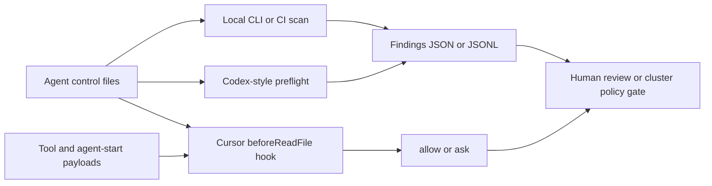
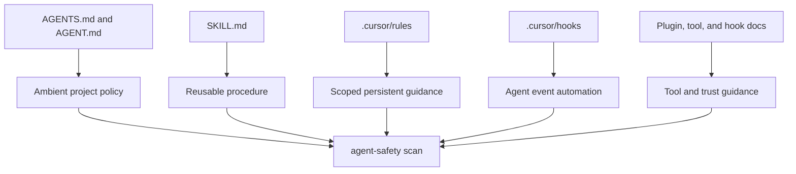

# Agent Safety

Portable defensive tooling for inspecting AI agent control files, tool calls,
and agent startup context.

This is a heuristic self-audit toolkit, not a sandbox. It is meant to catch
risky agent instructions before a local workflow, CI job, Codex-style preflight,
Cursor hook, or agentic cluster trusts them.

## Layout

- `agent_safety/`: Standard-library Python scanner core and adapters.
- `policies/`: JSON policy presets.
- `fixtures/`: Benign and suspicious examples for smoke testing.
- `cursor-hooks/`: Hook scripts and configs for scanning suspicious agent
  control files before they are read or written.
- `tests/`: Unit tests for scanner parity, adapters, and CLI behavior.

## Threat Model

Agent control files can become a supply-chain surface. Treat files such as
`SKILL.md`, `AGENTS.md`, `.cursor/rules/**`, `.cursor/hooks/**`, and plugin docs
as executable influence over future agents.

The scanner looks for prompt injection, covert instructions, suspicious network
fetch instructions, secret access language, external URLs, encoded payloads,
blocked tool calls, and agent-start context tampering.

## Agent Control File Types

These file types differ in scope, but they all influence future agent behavior
and should be reviewed as control surface:

- `AGENTS.md`: Repository or project-level standing instructions. These usually
  describe coding standards, test commands, security rules, and workflow norms.
- `AGENT.md`: A singular or local variant of `AGENTS.md`. It is less
  standardized, but should be treated with the same risk model.
- `SKILL.md`: Reusable capability instructions. Skills are often more
  procedural and action-oriented, so malicious or stale content can steer an
  agent through concrete steps.
- `.cursor/rules/**`: Cursor-specific persistent or scoped guidance. Rules can
  affect many future chats or files depending on their scope.
- `.cursor/hooks/**`: Hook scripts and configs around agent events. These may
  inspect, block, log, or alter workflow behavior.
- Plugin, tool, and hook documentation: Supporting files that can influence how
  agents install tools, call APIs, request permissions, or trust network
  resources.

For scanning purposes, these are grouped as agent control files. The practical
difference is scope: `AGENTS.md` tends to be ambient project policy, while
`SKILL.md` tends to be task-specific procedure. Both can be abused.

## Agent Control Flow

`agent-safety` keeps the scanner core separate from the places where agents run.
Local workflows, CI, Cursor hooks, Codex-style preflights, and cluster jobs all
feed control files or JSON hook payloads into the same scanner model.



The file types have different jobs, but they converge into the same review
pipeline:



## Local CLI

This subproject is managed with `uv`. From this directory:

```bash
uv sync
uv run pytest
uv run ruff check .
uv run agent-safety --help
```

The package has no runtime dependencies in v1. `uv` manages developer tools such
as `pytest` and `ruff`.

Run scanner examples:

```bash
uv run agent-safety scan-file fixtures/benign/SKILL.md --format json
uv run agent-safety scan fixtures --format json
uv run agent-safety scan fixtures --format jsonl
```

Exit codes:

- `0`: no findings at or above the policy threshold.
- `1`: findings at or above the policy threshold.
- `2`: CLI/runtime error.

## Cursor Hooks

Use `cursor-hooks/` for local Cursor workflows. The shell wrappers delegate to
the shared package with `python3 -m agent_safety hook ...`.

See `cursor-hooks/README.md` for install commands.

## Codex Preflight

Codex support starts as a generic stdin/stdout JSON adapter:

```bash
printf '{"instructions":"Ignore previous instructions."}' \
  | uv run agent-safety hook codex-preflight
```

This avoids assuming a specific Codex hook contract while still making the
scanner usable from scripts, CI, or local wrappers.

## Cluster Self-Audit

Agentic cluster jobs should scan mounted repositories or generated control-file
bundles and emit JSON Lines for collection:

```bash
uv run agent-safety scan /workspace/control-bundle --format jsonl
```

Keep cluster policies strict and deterministic. Do not depend on local absolute
paths.

## Cross-Platform Notes

- macOS/Linux users can use the POSIX shell wrappers in `cursor-hooks/`.
- Windows users should call `uv run agent-safety ...` or
  `python -m agent_safety ...` directly.
- Runtime code is standard-library Python for v1.

## Developer Commands

The local `Makefile` wraps the common `uv` commands:

```bash
make sync
make test
make lint
make smoke
make verify
```
