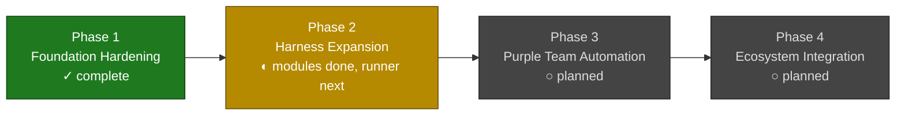
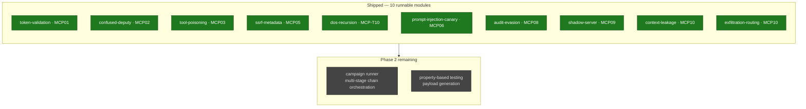

# MCP Security Research Roadmap

> **Status:** Active | **Last updated:** 2026-06-12 | **Owner:** Security Research

---

## Vision

Build the most complete open research archive for securing Model Context
Protocol deployments — covering architecture, offensive testing, defensive
operations, and reusable tooling — so that any team shipping MCP integrations
can adopt proven patterns instead of learning through incidents.

---

## Current Maturity

| Area | Docs | Tooling | Tests | Status |
|---|---|---|---|---|
| Architecture | 3 reference designs (generic, AWS, EKS) | — | — | Strong |
| Red Team Playbook | v2.1 stable + v3.1 RC | MCP-SLAYER v3.1 packaged | 48 passing | Strong |
| Scenarios | 7 field scenarios + mermaid diagrams | — | — | Strong |
| Assessment Framework | v1 + v3 matrices | — | — | Medium |
| Defense / Blue Team | Operating model, detections (14+SPL/KQL), IR (5), kill switch automation (8), CVSS scoring | — | — | Strong |
| Scanner Landscape | v2 index with mesh alignment | — | — | Medium |
| Golden Path | v3 full session flow | — | — | Strong |
| Taxonomy Bridge | MCP-T01–T14 ↔ OWASP MCP01–10 | `mcp_slayer.taxonomy` | 8 tests | Strong |
| Harness (MCP-SLAYER) | Engine architecture | 10 modules, SARIF/JSON/YAML/MD output | 48 tests | Active dev |
| Keycloak/IdP | SPEC + client | — | — | Thin |
| Llama/Local Models | Config examples | — | — | Thin |
| RFC/Proposals | EKS hardening standard | — | — | Thin |
| Runbooks | v2.0 red-vs-blue (1260 lines) | — | — | Medium |

---

## Progress at a Glance

**Phase 2 internals** — the OWASP MCP Top 10 module set is complete; only the
orchestration/testing items remain before Phase 2 closes:

---

## Roadmap Phases

### Phase 1 — Foundation Hardening (current)

**Goal:** Make the existing research usable without tribal knowledge.

- [x] Package MCP-SLAYER as installable `uv` project
- [x] Unify config schemas (v1 + v3 → canonical v3.1)
- [x] Build taxonomy bridge (playbook ↔ OWASP ↔ harness)
- [x] Expand defense/ with detection rule templates (14 rules in detection-catalog.md)
- [x] Add IR playbooks for MCP incidents (5 playbooks in incident-response.md)
- [x] Create controls-to-findings traceability matrix (controls-traceability.md)
- [x] Clean up thin subdirs (keycloak, llama, inference) with proper READMEs

### Phase 2 — Harness Expansion

**Goal:** Cover the full OWASP MCP Top 10 with runnable modules.

- [x] Module: prompt-injection-canary (MCP06, MCP-T01/T02)
- [x] Module: context-leakage (MCP10, MCP-T05/T11)
- [x] Module: tool-poisoning (MCP03, MCP-T08)
- [x] Module: token-validation (MCP01, MCP-T04)
- [x] Module: audit-evasion (MCP08, MCP-T13)
- [x] Module: exfiltration-routing (MCP10, MCP-T12)
- [x] Module: dos-recursion (MCP-T10, loop depth)
- [ ] Add campaign runner (multi-stage chain orchestration)
- [ ] Property-based testing for payload generation

### Phase 3 — Purple Team Automation

**Goal:** Close the loop between red findings and blue detection.

- [ ] SIEM integration (Splunk HEC, Elastic, Datadog)
- [ ] Detection validation framework (attack → alert correlation)
- [ ] Canary deployment tooling (plant + monitor + alert)
- [ ] GitHub Actions workflow for scheduled purple team drills
- [ ] MTTD/MTTR tracking dashboard spec
- [ ] Regression test suite from confirmed findings

### Phase 4 — Ecosystem Integration

**Goal:** Make the research consumable outside this repo.

- [ ] Publish scanner landscape as standalone living doc
- [ ] Extract golden path as team-adoptable template
- [ ] Package assessment framework as structured checklist tool
- [ ] CI integration: `mcp-slayer` as GitHub Action
- [ ] Contribution guide for external scenario submissions
- [ ] Training material: MCP security workshop outline

---

## Threat Landscape Watch

Track emerging risks that may require new taxonomy entries or modules:

| Signal | Source | Impact if confirmed |
|---|---|---|
| MCP server rug-pull in production | Invariant Labs, community reports | New module: drift-detection |
| Multi-agent delegation chain attacks | v3.1 playbook Domain F | New module: delegation-abuse |
| Agentic ransomware patterns | v3.1 playbook Chain 5 | New campaign: ransom-chain |
| Tool schema smuggling in production | Community CVEs | New module: schema-validation |
| Cross-session memory poisoning | Academic research | New module: memory-persistence |
| OAuth token scope creep in MCP auth | MCP RFC evolution | Update: token-validation module |

---

## Principles

1. **Research first, tooling second.** Understand the risk before automating
   the test. A well-documented threat model is more valuable than a broken
   scanner.

2. **Preserve attribution.** Copied research stays attributed. Moved files use
   `git mv`. Delete only confirmed junk.

3. **Vendor-neutral by default.** Architecture designs work on any cloud.
   AWS-specific variants are explicitly labeled.

4. **Living documents.** Every successful attack improves the playbook. Every
   remediation becomes a regression test.

5. **Practical over theoretical.** If it hasn't been demonstrated in a
   scenario or a harness module, it's a hypothesis, not a finding.
