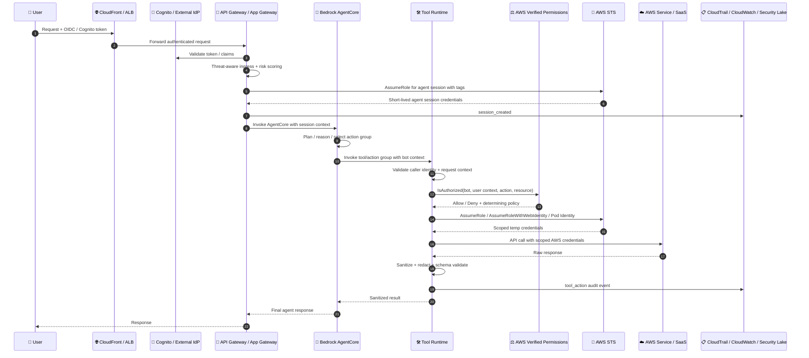

# Zero-Trust AWS Agentic Mesh: Secure Tool Execution Architecture

*v0.1 — AWS-native, hardened, Bedrock AgentCore-aligned*

---



---

## Security Model: AWS-Native Bot Identity with User Context

### Core Principle: The AWS Agent Acts, Not the User

The agent should operate as an AWS workload principal, not as the human user.

The human user’s identity is carried as context for policy, logging, risk evaluation, tenant isolation, and response shaping — but the user’s original OIDC token is never forwarded to tools or downstream services.

In AWS terms:

| Concept | AWS-Native Implementation |
|---|---|
| Bot identity | IAM role for Bedrock agent / AgentCore runtime |
| User context | Session tags, invocation context, structured payload |
| Tool identity | IAM role per Lambda / ECS task / EKS service account |
| Policy engine | AWS Verified Permissions and IAM |
| Short-lived credentials | AWS STS |
| Workload identity | IAM roles, IRSA, EKS Pod Identity, Lambda execution roles, ECS task roles |
| Audit | CloudTrail, CloudWatch Logs, Security Lake |
| Network isolation | VPC, Security Groups, NACLs, VPC endpoints, PrivateLink |
| Secret management | AWS Secrets Manager, SSM Parameter Store, KMS |
| Response control | Tool-side sanitization and Bedrock guardrails |

---

## Token and Session Context Model

In the earlier design, the gateway minted a bot-scoped JWT.

In the AWS-native model, the preferred pattern is:

1. Validate the user token at ingress.
2. Convert the request into an agent invocation.
3. Attach user/session context as immutable structured metadata.
4. Use IAM roles and STS session tags for authorization and audit.
5. Never forward the user’s raw access token downstream.

### Example Agent Session Context

```json
{
  "agent_principal": {
    "type": "aws_iam_role",
    "role_arn": "arn:aws:iam::123456789012:role/bedrock-agent-prod",
    "agent_id": "bedrock-agent://customer-support-prod-v2"
  },
  "user_context": {
    "user_id": "user-123",
    "team": "engineering",
    "tenant": "acme-corp",
    "session_id": "sess-abc-xyz",
    "risk_score": 0.12,
    "auth_method": "mfa",
    "idp": "cognito",
    "groups": ["engineering", "repo-admins"]
  },
  "tool_context": {
    "allowed_actions": ["repo:read", "pr:write"],
    "request_id": "req_8b2d1f4a",
    "agent_session_ttl_seconds": 300
  }
}
```

### STS Session Tags

Where AWS IAM needs to enforce tenant or bot boundaries, propagate trusted context as STS session tags.

Example tags:

```text
bot-id=bedrock-agent-prod-v2
tenant=acme-corp
user-id=user-123
team=engineering
session-id=sess-abc-xyz
risk-score=0.12
auth-method=mfa
request-id=req_8b2d1f4a
```

Recommended required tags:

- `bot-id`
- `tenant`
- `user-id`
- `session-id`
- `request-id`
- `auth-method`
- `risk-score`

The important distinction is that these tags are asserted by the trusted gateway or agent runtime, not by the end user.

---

# Five-Layer AWS Defense Model

## Layer 0 — Threat-Aware AWS Ingress

Before AgentCore receives the request, place a hardened AWS ingress layer in front of it.

Recommended AWS services:

| Control | AWS Service |
|---|---|
| DDoS protection | AWS Shield |
| Edge filtering | AWS WAF |
| Authn | Amazon Cognito, IAM Identity Center, external OIDC/SAML IdP |
| API boundary | Amazon API Gateway, Application Load Balancer, Lambda authorizer |
| Bot/risk signals | WAF Bot Control, GuardDuty, Cognito advanced security, custom risk service |
| Rate limiting | API Gateway usage plans, WAF rate-based rules |
| Session store | DynamoDB with TTL |
| Audit | CloudTrail, CloudWatch Logs |

### Threat Signal Model

```typescript
interface ThreatSignals {
  ipReputation: "clean" | "vpn" | "tor" | "known-bad";
  geoVelocityKmH: number;
  deviceKnown: boolean;
  mfaVerified: boolean;
  recentDeniedActions: number;
  wafLabels: string[];
  guardDutyFindings: number;
  impossibleTravel: boolean;
}

function computeRiskScore(signals: ThreatSignals): number {
  let score = 0;

  if (signals.ipReputation === "vpn") score += 0.15;
  if (signals.ipReputation === "tor") score += 0.35;
  if (signals.ipReputation === "known-bad") score += 0.75;
  if (signals.geoVelocityKmH > 900) score += 0.25;
  if (!signals.deviceKnown) score += 0.15;
  if (!signals.mfaVerified) score += 0.25;
  if (signals.recentDeniedActions > 3) score += 0.2;
  if (signals.guardDutyFindings > 0) score += 0.3;
  if (signals.impossibleTravel) score += 0.35;

  return Math.min(score, 1);
}
```

The gateway embeds the resulting `risk_score` into the agent invocation context and, where appropriate, STS session tags.

### Layer 0 Requirements

- User token terminates at ingress.
- Raw user token is not forwarded to Bedrock, tools, Lambda, ECS, EKS, or SaaS connectors.
- Risk score is calculated once by a trusted component.
- MFA state is preserved as signed/trusted context.
- High-risk requests can be blocked before invoking the agent.

---

## Layer 1 — Agent Identity Translation

### AWS-Native Replacement for Bot-Scoped JWTs

In the original model, the Protocol Gateway minted a bot JWT.

In the AWS model, the Gateway assumes or invokes an IAM role representing the agent session. The agent’s identity is an IAM role, not the user.

Example roles:

```text
arn:aws:iam::123456789012:role/agent-gateway-prod
arn:aws:iam::123456789012:role/bedrock-agent-prod-v2
arn:aws:iam::123456789012:role/tool-github-connector-prod
arn:aws:iam::123456789012:role/tool-s3-retriever-prod
```

### Session Creation Flow

1. User authenticates via Cognito or external IdP.
2. Gateway validates token.
3. Gateway computes risk.
4. Gateway creates `request_id` and `session_id`.
5. Gateway invokes Bedrock AgentCore using the gateway IAM role.
6. Gateway passes trusted context to AgentCore.
7. Bedrock AgentCore invokes only approved action groups/tools.
8. Tools independently authorize every action.

### Example STS AssumeRole with Session Tags

```bash
aws sts assume-role \
  --role-arn arn:aws:iam::123456789012:role/bedrock-agent-prod-v2 \
  --role-session-name req_8b2d1f4a \
  --duration-seconds 900 \
  --tags \
    Key=bot-id,Value=bedrock-agent-prod-v2 \
    Key=tenant,Value=acme-corp \
    Key=user-id,Value=user-123 \
    Key=session-id,Value=sess-abc-xyz \
    Key=request-id,Value=req_8b2d1f4a \
    Key=auth-method,Value=mfa
```

### Trust Policy for Agent Role

```json
{
  "Version": "2012-10-17",
  "Statement": [
    {
      "Sid": "OnlyGatewayCanAssumeAgentRole",
      "Effect": "Allow",
      "Principal": {
        "AWS": "arn:aws:iam::123456789012:role/agent-gateway-prod"
      },
      "Action": "sts:AssumeRole",
      "Condition": {
        "StringEquals": {
          "aws:RequestTag/bot-id": "bedrock-agent-prod-v2"
        },
        "ForAllValues:StringEquals": {
          "aws:TagKeys": [
            "bot-id",
            "tenant",
            "user-id",
            "session-id",
            "request-id",
            "auth-method"
          ]
        }
      }
    }
  ]
}
```

### Attack Mitigations

- User token cannot be replayed against tools.
- Agent role can only be assumed by the trusted gateway.
- Required STS tags prevent untagged or ambiguous sessions.
- CloudTrail records role assumption and session identity.
- Tool roles are separate from agent roles.

---

## Layer 2 — AWS Workload Identity

AWS-native workload identity depends on where the tool runs.

| Runtime | Workload Identity |
|---|---|
| Lambda tool/action group | Lambda execution role |
| ECS/Fargate tool | ECS task role |
| EKS tool | IRSA or EKS Pod Identity |
| Bedrock agent | Bedrock service role / agent execution role |
| Step Functions orchestration | State machine execution role |
| App Runner | Instance role |
| EC2 | Instance profile |

### Recommended Pattern

Use one IAM role per tool connector.

Examples:

```text
tool-github-connector-prod
tool-jira-connector-prod
tool-s3-retriever-prod
tool-payroll-readonly-prod
tool-customer-db-readonly-prod
```

Avoid shared “agent-tools-prod” roles. Shared roles make blast radius and audit boundaries too large.

---

## Layer 2A — EKS Tools with IRSA

For Kubernetes-hosted tools, IRSA maps a Kubernetes service account to an IAM role using the EKS OIDC provider.

### Service Account

```yaml
apiVersion: v1
kind: ServiceAccount
metadata:
  name: github-connector
  namespace: ai-tools
  annotations:
    eks.amazonaws.com/role-arn: arn:aws:iam::123456789012:role/tool-github-connector-prod
```

### IAM Trust Policy for IRSA

```json
{
  "Version": "2012-10-17",
  "Statement": [
    {
      "Sid": "AllowGithubConnectorServiceAccount",
      "Effect": "Allow",
      "Principal": {
        "Federated": "arn:aws:iam::123456789012:oidc-provider/oidc.eks.us-east-1.amazonaws.com/id/EXAMPLED539D4633E53DE1B716D3041E"
      },
      "Action": "sts:AssumeRoleWithWebIdentity",
      "Condition": {
        "StringEquals": {
          "oidc.eks.us-east-1.amazonaws.com/id/EXAMPLED539D4633E53DE1B716D3041E:sub": "system:serviceaccount:ai-tools:github-connector",
          "oidc.eks.us-east-1.amazonaws.com/id/EXAMPLED539D4633E53DE1B716D3041E:aud": "sts.amazonaws.com"
        }
      }
    }
  ]
}
```

### EKS NetworkPolicy

```yaml
apiVersion: networking.k8s.io/v1
kind: NetworkPolicy
metadata:
  name: github-connector-ingress
  namespace: ai-tools
spec:
  podSelector:
    matchLabels:
      app: github-connector
  policyTypes:
    - Ingress
    - Egress
  ingress:
    - from:
        - namespaceSelector:
            matchLabels:
              name: bedrock-agent-tools
        - podSelector:
            matchLabels:
              app: agent-tool-dispatcher
      ports:
        - protocol: TCP
          port: 8443
  egress:
    - to:
        - namespaceSelector:
            matchLabels:
              name: aws-vpc-endpoints
      ports:
        - protocol: TCP
          port: 443
```

### Attack Mitigations

- A compromised pod cannot assume another tool’s IAM role.
- Namespace and service account binding constrains identity.
- NetworkPolicy blocks lateral movement.
- STS credentials are short-lived and scoped to the tool role.

---

## Layer 2B — Lambda Tools / Bedrock Action Groups

For Bedrock Agents, action groups commonly invoke AWS Lambda functions. In this pattern:

- Bedrock uses an agent service role.
- Bedrock invokes a specific Lambda action group.
- Lambda runs under a dedicated execution role.
- Lambda validates the agent/session context.
- Lambda calls Verified Permissions.
- Lambda uses scoped AWS permissions.

### Lambda Resource Policy

```json
{
  "Version": "2012-10-17",
  "Statement": [
    {
      "Sid": "OnlyBedrockAgentCanInvoke",
      "Effect": "Allow",
      "Principal": {
        "Service": "bedrock.amazonaws.com"
      },
      "Action": "lambda:InvokeFunction",
      "Resource": "arn:aws:lambda:us-east-1:123456789012:function:github-connector-prod",
      "Condition": {
        "StringEquals": {
          "AWS:SourceAccount": "123456789012"
        },
        "ArnLike": {
          "AWS:SourceArn": "arn:aws:bedrock:us-east-1:123456789012:agent/*"
        }
      }
    }
  ]
}
```

### Lambda Execution Role Policy

```json
{
  "Version": "2012-10-17",
  "Statement": [
    {
      "Sid": "AllowVerifiedPermissions",
      "Effect": "Allow",
      "Action": [
        "verifiedpermissions:IsAuthorized",
        "verifiedpermissions:IsAuthorizedWithToken"
      ],
      "Resource": "arn:aws:verifiedpermissions::123456789012:policy-store/ps-abc123"
    },
    {
      "Sid": "AllowReadSpecificSecret",
      "Effect": "Allow",
      "Action": ["secretsmanager:GetSecretValue"],
      "Resource": "arn:aws:secretsmanager:us-east-1:123456789012:secret:github/app/prod-*"
    },
    {
      "Sid": "AllowKmsDecryptForSecret",
      "Effect": "Allow",
      "Action": ["kms:Decrypt"],
      "Resource": "arn:aws:kms:us-east-1:123456789012:key/abcd-1234"
    }
  ]
}
```

---

## Layer 3 — Authorization with AWS Verified Permissions

### Why Verified Permissions Instead of OPA?

OPA is excellent, but for a wholly AWS-native architecture, AWS Verified Permissions provides a managed Cedar policy engine with:

- Centralized authorization decisions
- Fine-grained authorization
- Policy stores
- Policy templates
- Auditability through CloudTrail
- Integration with Cognito or external identity context
- Explicit allow/deny style policies

The tool still performs local input validation, but authorization is delegated to Verified Permissions.

---

## Cedar Entity Model

### Principal

The principal is the bot/agent, not the user.

```json
{
  "identifier": {
    "entityType": "Agent",
    "entityId": "bedrock-agent-prod-v2"
  },
  "attributes": {
    "awsRoleArn": "arn:aws:iam::123456789012:role/bedrock-agent-prod-v2"
  }
}
```

### User Context Entity

```json
{
  "identifier": {
    "entityType": "UserContext",
    "entityId": "user-123"
  },
  "attributes": {
    "tenant": "acme-corp",
    "team": "engineering",
    "authMethod": "mfa",
    "riskScore": {
      "decimal": "0.12"
    },
    "sessionId": "sess-abc-xyz"
  }
}
```

### Resource

```json
{
  "identifier": {
    "entityType": "Repository",
    "entityId": "acme-corp/repo-1"
  },
  "attributes": {
    "tenant": "acme-corp",
    "sensitivity": "internal"
  }
}
```

### Action

```json
{
  "actionType": "Action",
  "actionId": "repo:read"
}
```

---

## Example Cedar Policies

### Default Tenant-Bound Read

```cedar
permit (
  principal == Agent::"bedrock-agent-prod-v2",
  action in [
    Action::"repo:read",
    Action::"pr:write"
  ],
  resource
)
when {
  context.user.tenant == resource.tenant &&
  context.user.riskScore < decimal("0.70") &&
  context.user.team == "engineering"
};
```

### Destructive Actions Require MFA and Low Risk

```cedar
permit (
  principal == Agent::"bedrock-agent-prod-v2",
  action == Action::"repo:delete",
  resource
)
when {
  context.user.tenant == resource.tenant &&
  context.user.authMethod == "mfa" &&
  context.user.riskScore < decimal("0.40") &&
  context.user.team == "engineering"
};
```

### Explicit Block for Cross-Tenant Access

```cedar
forbid (
  principal,
  action,
  resource
)
when {
  context.user.tenant != resource.tenant
};
```

### Explicit Block for High Risk

```cedar
forbid (
  principal,
  action,
  resource
)
when {
  context.user.riskScore >= decimal("0.70")
};
```

---

## Tool Authorization Flow

```typescript
import {
  VerifiedPermissionsClient,
  IsAuthorizedCommand,
} from "@aws-sdk/client-verifiedpermissions";

interface UserContext {
  userId: string;
  tenant: string;
  team: string;
  authMethod: "none" | "password" | "mfa";
  riskScore: number;
  sessionId: string;
}

interface AuthzInput {
  agentId: string;
  user: UserContext;
  action: string;
  resourceType: string;
  resourceId: string;
  resourceTenant: string;
}

const client = new VerifiedPermissionsClient({ region: "us-east-1" });

export async function authorize(input: AuthzInput): Promise<void> {
  const result = await client.send(
    new IsAuthorizedCommand({
      policyStoreId: process.env.POLICY_STORE_ID,
      principal: {
        entityType: "Agent",
        entityId: input.agentId,
      },
      action: {
        actionType: "Action",
        actionId: input.action,
      },
      resource: {
        entityType: input.resourceType,
        entityId: input.resourceId,
      },
      context: {
        contextMap: {
          user: {
            record: {
              userId: { string: input.user.userId },
              tenant: { string: input.user.tenant },
              team: { string: input.user.team },
              authMethod: { string: input.user.authMethod },
              riskScore: {
                decimal: input.user.riskScore.toFixed(2),
              },
              sessionId: { string: input.user.sessionId },
            },
          },
        },
      },
      entities: {
        entityList: [
          {
            identifier: {
              entityType: input.resourceType,
              entityId: input.resourceId,
            },
            attributes: {
              tenant: { string: input.resourceTenant },
            },
          },
        ],
      },
    }),
  );

  if (result.decision !== "ALLOW") {
    const reasons = result.determiningPolicies
      ?.map((policy) => policy.policyId)
      .join(", ");

    throw new Error(`Authorization denied by AVP: ${reasons ?? "no policy"}`);
  }
}
```

---

## Layer 4 — AWS IAM, STS, and Data-Plane Binding

Verified Permissions decides whether an action is allowed.

IAM enforces what AWS APIs the tool can physically call.

Both should be true.

### Example S3 Tenant-Scoped Tool Policy

This policy allows a tool to read tenant-scoped objects only when the STS principal tag matches the object path.

```json
{
  "Version": "2012-10-17",
  "Statement": [
    {
      "Sid": "TenantScopedRead",
      "Effect": "Allow",
      "Action": ["s3:GetObject"],
      "Resource": "arn:aws:s3:::company-data/${aws:PrincipalTag/tenant}/*",
      "Condition": {
        "StringEquals": {
          "aws:RequestedRegion": "us-east-1",
          "aws:PrincipalTag/bot-id": "bedrock-agent-prod-v2"
        }
      }
    },
    {
      "Sid": "DenyUntaggedSessions",
      "Effect": "Deny",
      "Action": "*",
      "Resource": "*",
      "Condition": {
        "Null": {
          "aws:PrincipalTag/tenant": "true",
          "aws:PrincipalTag/bot-id": "true",
          "aws:PrincipalTag/request-id": "true"
        }
      }
    },
    {
      "Sid": "DenyWrongBot",
      "Effect": "Deny",
      "Action": "*",
      "Resource": "*",
      "Condition": {
        "StringNotEquals": {
          "aws:PrincipalTag/bot-id": "bedrock-agent-prod-v2"
        }
      }
    }
  ]
}
```

### DynamoDB Tenant Isolation Example

```json
{
  "Version": "2012-10-17",
  "Statement": [
    {
      "Sid": "TenantPartitionAccessOnly",
      "Effect": "Allow",
      "Action": [
        "dynamodb:GetItem",
        "dynamodb:Query",
        "dynamodb:BatchGetItem"
      ],
      "Resource": "arn:aws:dynamodb:us-east-1:123456789012:table/CustomerRecords",
      "Condition": {
        "ForAllValues:StringLike": {
          "dynamodb:LeadingKeys": ["${aws:PrincipalTag/tenant}#*"]
        }
      }
    }
  ]
}
```

### KMS Key Policy Constraint

```json
{
  "Version": "2012-10-17",
  "Statement": [
    {
      "Sid": "AllowDecryptForApprovedToolRole",
      "Effect": "Allow",
      "Principal": {
        "AWS": "arn:aws:iam::123456789012:role/tool-s3-retriever-prod"
      },
      "Action": ["kms:Decrypt"],
      "Resource": "*",
      "Condition": {
        "StringEquals": {
          "kms:EncryptionContext:tenant": "${aws:PrincipalTag/tenant}"
        }
      }
    }
  ]
}
```

---

## Layer 5 — Response Sanitization and Bedrock Guardrails

The output path must be protected just as strongly as the input path.

Recommended AWS-native controls:

| Control | AWS Service / Pattern |
|---|---|
| Tool response validation | Lambda/ECS/EKS connector code |
| PII detection | Amazon Comprehend PII, Amazon Macie for stored data |
| LLM output filtering | Bedrock Guardrails |
| Prompt injection mitigation | Tool schema validation, content boundaries |
| Oversized output control | Payload size limits, truncation, summarization |
| Sensitive data redaction | Custom redaction library, Comprehend PII |
| Final response logging | CloudWatch structured logs |

### Tool-Side Sanitization

```typescript
interface SanitizationInput {
  raw: unknown;
  user: {
    tenant: string;
    team: string;
    userId: string;
  };
}

export function sanitizeResponse(input: SanitizationInput): unknown {
  const response = input.raw;

  // 1. Validate response shape with a schema validator.
  // 2. Remove fields not allowed for user's team.
  // 3. Remove or mask PII not belonging to user's tenant.
  // 4. Truncate oversized values.
  // 5. Strip embedded instructions that could affect subsequent model turns.

  return response;
}
```

### Bedrock Guardrails Placement

Use guardrails in two places:

1. Before tool invocation, to detect unsafe user intent.
2. After tool results are summarized, to reduce leakage in final output.

Guardrails are not a replacement for IAM, Verified Permissions, or response sanitization. They are a content safety layer, not an authorization layer.

---

# Bedrock AgentCore / Action Group Design

## Agent Runtime Responsibilities

The Bedrock agent should:

- Interpret user intent.
- Select the correct action group.
- Pass structured parameters to tools.
- Preserve `request_id`, `session_id`, `tenant`, and risk context.
- Never receive broad AWS permissions directly.
- Never directly access sensitive data stores unless that is its explicit job.

The agent should not:

- Hold long-lived secrets.
- Use the user’s token.
- Make arbitrary AWS API calls.
- Bypass tool authorization.
- Make authorization decisions purely via prompt instructions.

---

## Tool / Action Group Contract

Every tool should expose a narrow, schema-validated contract.

Example action group schema concept:

```json
{
  "name": "github_connector",
  "description": "Performs approved GitHub repository operations",
  "actions": [
    {
      "name": "repo_read",
      "input": {
        "type": "object",
        "required": ["tenant", "repo", "request_id"],
        "properties": {
          "tenant": {
            "type": "string"
          },
          "repo": {
            "type": "string"
          },
          "request_id": {
            "type": "string"
          }
        }
      }
    },
    {
      "name": "pr_write",
      "input": {
        "type": "object",
        "required": ["tenant", "repo", "branch", "request_id"],
        "properties": {
          "tenant": {
            "type": "string"
          },
          "repo": {
            "type": "string"
          },
          "branch": {
            "type": "string"
          },
          "request_id": {
            "type": "string"
          }
        }
      }
    }
  ]
}
```

Tool rules:

- Reject unknown fields.
- Reject missing `request_id`.
- Reject tenant mismatches.
- Recompute the target resource from trusted context where possible.
- Treat all LLM-generated parameters as untrusted input.
- Run Verified Permissions before every state-changing operation.
- Log both allowed and denied decisions.

---

# Audit Trail

## AWS-Native Structured Audit Event

```json
{
  "timestamp": "2026-02-03T19:15:23.441Z",
  "event_type": "tool_action",
  "request_id": "req_8b2d1f4a",
  "session_id": "sess-abc-xyz",
  "aws": {
    "account_id": "123456789012",
    "region": "us-east-1",
    "agent_role": "arn:aws:iam::123456789012:role/bedrock-agent-prod-v2",
    "tool_role": "arn:aws:iam::123456789012:role/tool-github-connector-prod",
    "sts_session_name": "req_8b2d1f4a"
  },
  "agent": {
    "agent_id": "bedrock-agent://customer-support-prod-v2",
    "agent_alias": "prod",
    "model": "amazon-bedrock"
  },
  "user_context": {
    "user_id": "user-123",
    "team": "engineering",
    "tenant": "acme-corp",
    "auth_method": "mfa",
    "risk_score": 0.12
  },
  "tool": {
    "name": "github-connector",
    "runtime": "lambda",
    "action": "repo:delete",
    "resource": "/repos/acme/sensitive"
  },
  "authorization": {
    "engine": "aws-verified-permissions",
    "decision": "allow",
    "determining_policies": ["policy-abc123"],
    "policy_store_id": "ps-abc123"
  },
  "outcome": "success",
  "duration_ms": 142
}
```

## AWS Audit Sources

| Event Type | Source |
|---|---|
| User ingress | API Gateway access logs, ALB logs, CloudFront logs |
| Auth events | Cognito logs, IdP logs |
| Agent invocation | CloudTrail, Bedrock invocation logs where enabled |
| Lambda tool execution | CloudWatch Logs, Lambda logs |
| STS role assumptions | CloudTrail |
| IAM denies | CloudTrail |
| AVP decisions | CloudTrail and application logs |
| Data access | CloudTrail data events, S3 server access logs, DynamoDB logs |
| Findings | GuardDuty, Security Hub, Detective |
| Central storage | Security Lake, S3 log archive |

---

# AWS-Native Threat Mitigations

| Threat | AWS-Native Mitigation |
|---|---|
| User token replay | Token terminates at gateway; downstream uses IAM roles |
| Cross-tool token use | No shared token; per-tool IAM roles and invoke permissions |
| Lateral movement | VPC, SGs, NetworkPolicy, PrivateLink, IAM boundaries |
| Tool overreach | Dedicated IAM role per tool + AVP authorization |
| Cross-tenant data access | AVP tenant checks + IAM principal tags |
| Prompt injection | Tool schemas, guardrails, response sanitization |
| Secret theft | Secrets Manager + KMS + no static creds |
| Stale credentials | STS TTL, Lambda/ECS/EKS role credentials |
| Ambiguous audit | CloudTrail + structured app logs with request ID |
| Policy drift | Cedar policies in IaC, reviewed and deployed |
| Data exfiltration | VPC endpoints, S3 bucket policies, SCPs, egress controls |
| Unapproved model/tool use | IAM, Bedrock model access controls, action group allowlists |

---

# AWS-Native Implementation Checklist

## Foundation

- [ ] Use Cognito, IAM Identity Center, or external OIDC/SAML IdP for user auth.
- [ ] Place API Gateway or ALB in front of agent invocation.
- [ ] Enable AWS WAF and Shield where applicable.
- [ ] Compute ingress risk score before invoking the agent.
- [ ] Create dedicated IAM roles for gateway, Bedrock agent, and each tool.
- [ ] Enforce no forwarding of raw user tokens past ingress.

## Bedrock AgentCore / Agent Runtime

- [ ] Use a dedicated Bedrock agent execution role.
- [ ] Restrict the agent role to only approved action groups/tools.
- [ ] Pass structured session context into agent invocations.
- [ ] Include `request_id`, `session_id`, `tenant`, `user_id`, `risk_score`, and `auth_method`.
- [ ] Use Bedrock Guardrails for input/output content filtering.
- [ ] Do not rely on prompt instructions for authorization.

## Tool Runtime

- [ ] Prefer one Lambda/ECS/EKS service per connector.
- [ ] Use one IAM role per connector.
- [ ] Validate input schemas strictly.
- [ ] Treat agent-generated tool parameters as untrusted.
- [ ] Call AWS Verified Permissions before sensitive actions.
- [ ] Log allow and deny decisions.
- [ ] Sanitize responses before returning to the agent.

## EKS / IRSA

- [ ] Use IRSA or EKS Pod Identity for EKS-based tools.
- [ ] Bind each service account to exactly one IAM role.
- [ ] Enable Kubernetes default-deny NetworkPolicies.
- [ ] Allow ingress only from approved agent/tool-dispatcher workloads.
- [ ] Use VPC endpoints for AWS service access where possible.

## Authorization

- [ ] Model the bot/agent as the principal in Verified Permissions.
- [ ] Model the human user as contextual data.
- [ ] Model tenant-owned objects as resources.
- [ ] Add explicit `forbid` policies for cross-tenant access.
- [ ] Add high-risk deny policies.
- [ ] Require MFA for destructive operations.
- [ ] Store Cedar policies in IaC and version control.

## IAM / STS

- [ ] Use short-lived STS sessions.
- [ ] Require session tags for tenant, bot ID, user ID, session ID, and request ID.
- [ ] Use IAM condition keys for tenant scoping.
- [ ] Add explicit deny policies for missing tags or wrong bot identity.
- [ ] Use permissions boundaries for tool roles.
- [ ] Use SCPs to block risky APIs organization-wide.
- [ ] Enable CloudTrail management and data events.

## Data Protection

- [ ] Use KMS CMKs for sensitive data.
- [ ] Use Secrets Manager for external API credentials.
- [ ] Scope `secretsmanager:GetSecretValue` by tool role.
- [ ] Constrain `kms:Decrypt` by encryption context where possible.
- [ ] Use S3 bucket policies with `aws:PrincipalTag/tenant`.
- [ ] Enable Macie for sensitive data discovery where applicable.

## Observability

- [ ] Emit structured JSON logs from gateway, agent dispatcher, and tools.
- [ ] Propagate `request_id` through every hop.
- [ ] Send CloudTrail, CloudWatch, WAF, VPC Flow Logs, and GuardDuty findings to Security Lake.
- [ ] Alert on AVP denies, IAM denies, high risk scores, tenant mismatches, and repeated tool failures.
- [ ] Build dashboards for tool usage, deny rates, tenant anomalies, and risk distribution.

---

# Mental Model

At every hop, the system asks:

> Can this AWS agent role, acting with trusted context for this user, from this tenant, with this risk score and MFA state, invoke this specific tool, whose own IAM role is allowed to access this specific resource, under this Verified Permissions decision, and return only sanitized data?

The answer must be yes at all layers:

1. Ingress risk accepts the request.
2. IAM allows the agent invocation.
3. Tool runtime validates schema and context.
4. Verified Permissions authorizes the action.
5. IAM allows the actual AWS data-plane call.
6. Network controls permit only expected paths.
7. The response is sanitized before returning to the model or user.

Security is still a chain of independent proofs — but now each proof is implemented with AWS-native managed controls.
