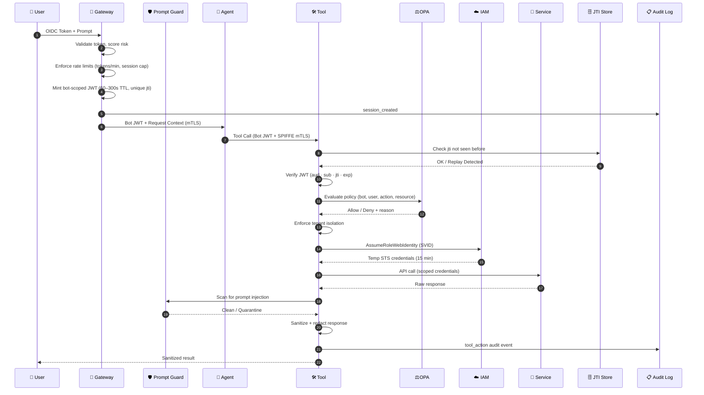

# Zero-Trust AI Mesh: Secure Tool Execution Architecture

*v0.3 — prompt-injection hardened, rate-limited, Rego fixed*

---



---

## 🔐 Security Model: Bot Identity with User Context

### Core Principle: The Bot Acts, Not the User

AI agents operate as **autonomous service principals**. The user's identity is context, not a permission vector. This eliminates an entire class of privilege-escalation and token-replay attacks.

**Token Claims Structure (v3):**

```json
{
  "sub": "bot://ai-agent-prod-v2",
  "aud": "tool://github-connector",
  "iss": "https://protocol-gateway.internal",
  "iat": 1738636500,
  "exp": 1738636800,
  "jti": "tok_7f3a9c2e-unique-per-call",
  "user_context": {
    "user_id": "user-123",
    "team": "engineering",
    "tenant": "acme-corp",
    "session_id": "sess-abc-xyz",
    "risk_score": 0.12,
    "auth_method": "mfa"
  },
  "tool_context": {
    "tool_id": "tool://github-connector",
    "allowed_actions": ["repo:read", "pr:write"],
    "request_id": "req_8b2d1f4a",
    "loop_depth": 2,
    "tokens_used_this_session": 14
  }
}
```

**Changes in v3:**
- `loop_depth` — agent loop depth tracked in token; tools can reject if too deep
- `tokens_used_this_session` — gateway embeds running count for downstream awareness
- `jti` is now backed by a distributed store (Redis) — replay prevention is enforced, not assumed

---

### Traditional vs. Zero-Trust: Side-by-Side

| Dimension | Traditional | Zero-Trust AI Mesh |
|---|---|---|
| Token subject | User | Bot service account |
| User identity role | Permission source | Non-permissioned context |
| Token replay risk | High | Eliminated (aud + jti + store) |
| Cross-tool token use | Possible | Blocked (strict aud matching) |
| Audit attribution | Ambiguous | Bot X on behalf of User Y |
| Credential rotation | Manual / static | Automatic (STS, 15 min TTL) |
| Lateral movement risk | High | Blocked (SPIFFE mTLS mesh) |
| Policy engine | Baked into code | Externalized (OPA) |
| Prompt injection | Unaddressed | Intercepted pre-context-window |
| Agent loop DoS | Unaddressed | Rate-limited + depth-capped |

---

## 🛡️ Six-Layer Defense Model

---

### Layer 0 — Threat-Aware Ingress

Before any token work happens, the gateway evaluates ambient threat signals and enforces hard session limits:

```typescript
interface ThreatSignals {
  ipReputation: "clean" | "vpn" | "tor" | "known-bad";
  geoVelocity: number;       // km/h since last auth — flag if > threshold
  deviceFingerprint: string; // matches known device registry?
  mfaVerified: boolean;
  recentAnomalies: number;   // policy violations in last 24h
}

interface GatewayRateLimits {
  tokensPerSession: number;        // hard cap, e.g. 50
  tokensPerMinute: number;         // burst control, e.g. 10
  maxConcurrentToolCalls: number;  // parallelism cap, e.g. 5
  maxAgentLoopDepth: number;       // prevent infinite recursion, e.g. 10
}

function computeRiskScore(signals: ThreatSignals): number {
  // Returns 0.0 (clean) → 1.0 (block)
  // Embedded in bot JWT as user_context.risk_score
  // Tools gate sensitive actions: risk_score > 0.7 → deny
}
```

**Why rate limits belong here:** The gateway is the only place with full session visibility. Individual tools see only their own call — they cannot detect fan-out abuse or loop conditions without the gateway's coordination.

---

### Layer 1 — Token Isolation

The Protocol Gateway performs **identity translation**, not forwarding:

- **Consumes:** Raw user OIDC token
- **Produces:** Bot-scoped JWT with embedded, read-only user context
- **Key property:** User token is consumed and never forwarded

**Attack mitigations:**
- Stolen session token cannot reach any tool directly
- Each tool's `aud` claim is unique — no cross-tool replay
- `jti` claim + distributed store blocks replay of the bot token itself
- Short TTL (60–300s) limits blast radius of any leak

**JTI Store (Redis):**

```typescript
async function enforceJtiUniqueness(
  jti: string,
  ttlSeconds: number
): Promise<void> {
  const key = `jti:${jti}`;
  const set = await redis.set(key, "1", "NX", "EX", ttlSeconds);
  if (!set) {
    await log.warn({ jti, event: "replay_attempt" });
    throw new AuthzError("Token replay detected");
  }
}
```

The TTL mirrors the token's `exp` — the store entry expires when the token would have anyway, keeping memory bounded.

---

### Layer 2 — Workload Identity

**SPIFFE/SPIRE** provides cryptographic workload attestation, independent of the JWT layer:

```yaml
# SPIRE registration entry
spiffeID: spiffe://cluster.local/ns/ai/sa/agent
parentID: spiffe://cluster.local/ns/spire/sa/spire-agent
selectors:
  - k8s:ns:ai
  - k8s:sa:agent-workload
  - k8s:pod-label:app:ai-agent
```

Even if an attacker forges a valid JWT, they still need a valid X.509-SVID issued by SPIRE to establish the mTLS connection. Two independent cryptographic proof requirements.

**Attack mitigations:**
- Compromised container cannot impersonate another workload
- Eliminates Kubernetes Service Account token weaknesses
- Network policy enforces `agent → tool` topology — no other paths

---

### Layer 3 — Tool Authorization with OPA

```typescript
async function validateRequest(
  jwt: JWT,
  toolId: string,
  action: string,
  resource: string
): Promise<AuthzResult> {
  // Step 1: Replay prevention
  await enforceJtiUniqueness(jwt.jti, jwt.exp - Math.floor(Date.now() / 1000));

  // Step 2: Structural JWT validation
  if (jwt.aud !== `tool://${toolId}`) {
    throw new AuthzError("Audience mismatch");
  }
  if (jwt.sub !== "bot://ai-agent-prod-v2") {
    throw new AuthzError("Invalid subject: must be bot identity");
  }
  if (
    jwt.tool_context.allowed_actions &&
    !jwt.tool_context.allowed_actions.includes(action)
  ) {
    throw new AuthzError("Action not in token allowlist");
  }

  // Step 3: Loop depth guard
  if (jwt.tool_context.loop_depth > MAX_LOOP_DEPTH) {
    throw new AuthzError("Agent loop depth exceeded");
  }

  // Step 4: OPA policy evaluation
  const opaResult = await opa.evaluate("ai_mesh/authz", {
    bot: jwt.sub,
    user: jwt.user_context,
    action,
    resource,
    risk_score: jwt.user_context.risk_score,
    auth_method: jwt.user_context.auth_method,
  });

  if (!opaResult.allow) {
    throw new AuthzError(`OPA denied: ${opaResult.reason}`);
  }

  return opaResult;
}
```

**Fixed OPA policy (Rego) — v3:**

```rego
package ai_mesh.authz

default allow = false

# Standard path — all five conditions must hold
allow {
  valid_bot
  valid_tenant
  action_permitted       # team has this action in their permission set
  risk_acceptable        # risk_score < 0.7
  loop_depth_acceptable  # loop depth within bounds
}

# High-risk destructive actions — stricter risk + MFA required
# action_permitted is still checked — no bypass
allow {
  valid_bot
  valid_tenant
  action_permitted                   # FIXED: was missing in v0.2
  is_destructive_action
  input.auth_method == "mfa"
  input.risk_score < 0.4             # tighter threshold
  loop_depth_acceptable
}

valid_bot {
  input.bot == "bot://ai-agent-prod-v2"
}

valid_tenant {
  input.user.tenant == data.tenants[input.user.tenant].id
}

action_permitted {
  data.tool_permissions[input.user.team][_] == input.action
}

risk_acceptable {
  input.risk_score < 0.7
}

loop_depth_acceptable {
  input.loop_depth <= 10
}

is_destructive_action {
  destructive_actions := {"repo:delete", "user:delete", "data:purge"}
  destructive_actions[input.action]
}
```

**What changed from v0.2:**
- `action_permitted` added to the high-risk `allow` block — it was missing, allowing destructive actions for any team
- `is_destructive_action` is now a set — easier to extend without new rules
- `loop_depth_acceptable` added as a policy-enforced guard (defense in depth over the code-level check)

---

### Layer 4 — Cloud IAM Binding

```json
{
  "Version": "2012-10-17",
  "Statement": [
    {
      "Effect": "Allow",
      "Action": ["s3:GetObject"],
      "Resource": "arn:aws:s3:::company-data/${aws:PrincipalTag/tenant}/*",
      "Condition": {
        "StringEquals": {
          "aws:RequestedRegion": "us-east-1"
        }
      }
    },
    {
      "Effect": "Deny",
      "Action": "*",
      "Resource": "*",
      "Condition": {
        "StringNotEquals": {
          "aws:PrincipalTag/bot-id": "ai-agent-prod-v2"
        }
      }
    }
  ]
}
```

- Tenant scoping via IAM attribute tags
- Explicit deny on wrong bot identity
- Region lock reduces exfiltration surface
- STS TTL: 15 min, non-renewable without re-attestation

---

### Layer 5 — Prompt Injection Interception (NEW)

This layer sits **between tool response and agent context window** — distinct from end-user sanitization. Tool output is untrusted content from an untrusted backend.

```typescript
interface PromptGuardConfig {
  maxTokenContribution: number;         // hard cap on context window pollution
  allowedDirectiveSources: "system-prompt-only" | "any";
  scanPatterns: RegExp[];               // known injection signatures
  quarantineOnDetection: boolean;       // halt or sanitize-and-continue
  contentHashLog: boolean;              // log hash of flagged content for forensics
}

async function inspectToolOutput(
  raw: string,
  config: PromptGuardConfig
): Promise<InspectionResult> {
  // 1. Token budget enforcement
  const tokenCount = countTokens(raw);
  if (tokenCount > config.maxTokenContribution) {
    return { action: "truncate", reason: "token_budget_exceeded" };
  }

  // 2. Pattern matching against known injection signatures
  for (const pattern of config.scanPatterns) {
    if (pattern.test(raw)) {
      await log.warn({
        event: "prompt_injection_detected",
        patternId: pattern.source,
        contentHash: sha256(raw),
      });
      if (config.quarantineOnDetection) {
        return { action: "quarantine", reason: "injection_pattern_matched" };
      }
    }
  }

  // 3. Directive source enforcement
  if (config.allowedDirectiveSources === "system-prompt-only") {
    // Strip or flag any content that contains instruction-like patterns
    // e.g., "Ignore previous instructions", "You are now..."
  }

  return { action: "allow", content: raw };
}
```

**Why this is its own layer and not part of Layer 5 sanitization:**
- End-user sanitization protects the *output path* (what the user sees)
- Prompt guard protects the *agent's reasoning* (what influences future tool calls)
- These are different threat models with different mitigations

---

### Layer 6 — Response Sanitization

```typescript
function sanitizeResponse(raw: unknown, userContext: UserContext): unknown {
  // Strip fields the user_context.team shouldn't see
  // Redact PII outside user's own tenant
  // Truncate oversized payloads
  // Validate response shape matches expected schema
}
```

Enforces least-privilege on the output path even when all upstream controls hold. The backend may return more data than intended — this is the final catch.

---

## 📊 Audit Trail

```json
{
  "timestamp": "2026-02-03T19:15:23.441Z",
  "event_type": "tool_action",
  "request_id": "req_8b2d1f4a",
  "session_id": "sess-abc-xyz",
  "principal": {
    "bot_id": "bot://ai-agent-prod-v2",
    "spiffe_id": "spiffe://cluster.local/ns/ai/sa/agent"
  },
  "user_context": {
    "user_id": "user-123",
    "team": "engineering",
    "tenant": "acme-corp",
    "auth_method": "mfa",
    "risk_score": 0.12
  },
  "tool": "tool://github-connector",
  "action": "DELETE",
  "resource": "/repos/acme/sensitive",
  "opa_decision": "allow",
  "opa_policy_version": "v1.4.2",
  "sts_role": "arn:aws:iam::123456789:role/github-connector-prod",
  "prompt_guard": {
    "result": "allow",
    "token_count": 312,
    "patterns_checked": 47
  },
  "loop_depth": 2,
  "tokens_this_session": 14,
  "outcome": "success",
  "duration_ms": 142
}
```

New in v3: `prompt_guard`, `loop_depth`, and `tokens_this_session` are now first-class audit fields. Alert on `prompt_guard.result == "quarantine"` in your SIEM.

---

## 🚀 Implementation Checklist

### Foundation
- [ ] Deploy SPIFFE/SPIRE — configure workload attestation for all pods
- [ ] Enforce Kubernetes NetworkPolicy — default deny, explicit allow only
- [ ] Configure Protocol Gateway with dedicated bot service account
- [ ] Implement OIDC validation + threat signal aggregation at gateway

### Token Pipeline
- [ ] Mint bot-scoped JWTs — short TTL (60–300s), unique `jti` per call
- [ ] Embed `user_context`, `tool_context`, `risk_score`, `auth_method`, `loop_depth`
- [ ] Deploy Redis JTI store — TTL mirrors token `exp`
- [ ] Validate `aud` + `sub` + `jti` (store-backed) in every tool
- [ ] Enforce `tokensPerSession`, `tokensPerMinute`, `maxAgentLoopDepth` at gateway

### Policy & Authorization
- [ ] Deploy OPA — write and version-control Rego policies
- [ ] Verify `action_permitted` is checked on ALL allow paths including destructive actions
- [ ] Implement `risk_score` gating for sensitive actions
- [ ] Require `auth_method == "mfa"` for destructive operations
- [ ] Enforce tenant isolation in OPA + IAM tag conditions
- [ ] Add `loop_depth_acceptable` as OPA rule (defense in depth)

### Cloud IAM
- [ ] Set up IRSA for every tool workload — no static credentials anywhere
- [ ] Scope IAM policies to tenant via attribute tags
- [ ] Set STS credential TTL to 15 minutes
- [ ] Add explicit Deny conditions as belt-and-suspenders

### Prompt Injection Defense
- [ ] Deploy Prompt Guard between every tool response and agent context
- [ ] Configure token budget per tool response
- [ ] Maintain and version injection pattern library
- [ ] Log content hash of all quarantined outputs
- [ ] Alert SIEM on `prompt_guard.result == "quarantine"`

### Observability
- [ ] Structured JSON audit logs on every tool action
- [ ] Emit `request_id` at gateway — propagate through entire call chain
- [ ] Include `prompt_guard`, `loop_depth`, `tokens_this_session` in every log entry
- [ ] Ship logs to SIEM — alert on: OPA denials, risk_score spikes, replay attempts, prompt injection detections
- [ ] Dashboard: deny rate by tool, risk score distribution, tenant anomalies, injection attempt frequency

### Response Path
- [ ] Implement response sanitization in every tool connector
- [ ] Schema-validate backend responses before forwarding
- [ ] Redact cross-tenant fields even on backend over-share

---

## 🎯 Mental Model

**The question this architecture answers at every hop:**

> *"Can **this bot**, acting for **this user** (risk: low, mfa: yes, loop: shallow), through **this specific tool** (aud-bound), having passed **prompt injection screening**, authorized by **external policy** (OPA), with **temporary scoped credentials** (IRSA, 15 min), perform **this action** on **this resource** within **this tenant**?"*

Security is not a gate — it's a **chain of independent, composable proofs**, each of which must hold simultaneously.

Compromise of any single layer does not grant meaningful access to anything else.

---

*v0.3 changes summary: JTI store implemented, rate limits added, Rego `action_permitted` bug fixed, destructive action set generalized, Prompt Guard added as Layer 5, response sanitization renumbered to Layer 6, loop depth tracked end-to-end, audit log expanded.*
