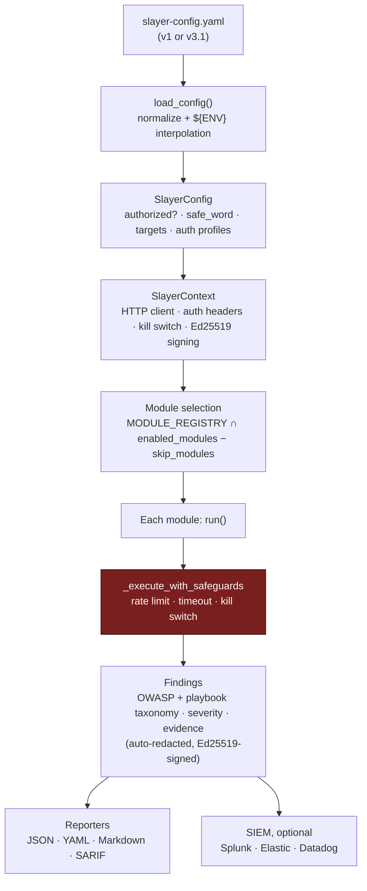

# MCP-SLAYER v3.1

OWASP MCP Top 10 security assessment framework for Model Context Protocol
architectures.

## Install

```bash
uv sync
```

## Usage

```bash
# Run assessment against a configured target
uv run mcp-slayer --config slayer-config.yaml --authorized

# Print taxonomy bridge table
uv run mcp-slayer --taxonomy

# Verbose mode with specific modules
uv run mcp-slayer --config config.yaml --authorized -v \
    --modules confused-deputy,ssrf-metadata

# Generate all report formats
uv run mcp-slayer --config config.yaml --authorized \
    --output-formats json,yaml,markdown,sarif
```

## How it works



Each module only runs against tools that **declare the matching capability** in
their `ToolTarget` config — e.g. `injection_endpoints`, `schema_endpoints`,
`audit_log_endpoint`, `egress_actions`, `retrieval_endpoints`,
`recursion_endpoints`. Tools that don't advertise a capability are skipped, so a
scan only exercises surfaces the operator opted in. See the table below for the
capability each module gates on.

## Modules

| Module | OWASP | Playbook Threats | What it tests |
|---|---|---|---|
| `confused-deputy` | MCP02 | T03, T04, T13 | Token replay, audience bypass, scope inflation |
| `ssrf-metadata` | MCP05 | T06 | SSRF to AWS/GCP/Azure IMDS via IP encoding bypasses |
| `shadow-server` | MCP09 | T14 | Unauthenticated access, default creds, outdated versions |
| `prompt-injection-canary` | MCP06 | T01, T02 | Canary echo detecting injectable tool outputs flowing into agent context |
| `token-validation` | MCP01 | T03, T04 | JWT expiry, audience, `alg:none`, claim tamper, empty-signature acceptance |
| `exfiltration-routing` | MCP10 | T11, T12 | Rate-limit, DLP, and payload caps on egress-capable tools |
| `context-leakage` | MCP10 | T05, T11 | Tenant/session isolation on retrieval tools (cross-context reads) |
| `tool-poisoning` | MCP03 | T08 | Hidden agent instructions in advertised tool descriptions/schemas |
| `audit-evasion` | MCP08 | T13 | Audit attribution, suppression flags, and CRLF log forgery |
| `dos-recursion` | MCP05 | T10 | Missing depth/size/fan-out limits enabling resource exhaustion |

## Configuration

The harness accepts two config formats, both auto-detected by `load_config()`:

- **v3.1 format**: Direct Pydantic model mapping (see `configs/v3-example.yaml`)
- **v1 format**: Payload-focused with nested structure (see `configs/v1-example.yaml`)

Environment variables are interpolated: `${VAR}` and `${VAR:-default}`.

## Development

```bash
make sync      # install deps
make test      # run pytest
make lint      # run ruff
make taxonomy  # print taxonomy table
make verify    # all of the above
```

## Safety

- Assessment will not start unless `authorized: true` is set in config.
- Kill switch: if the safe word appears in any response, all operations halt.
- Rate limiting and timeout enforcement on all attack functions.
- Evidence is automatically redacted before writing to disk.
- Findings are Ed25519-signed for chain-of-custody integrity.
