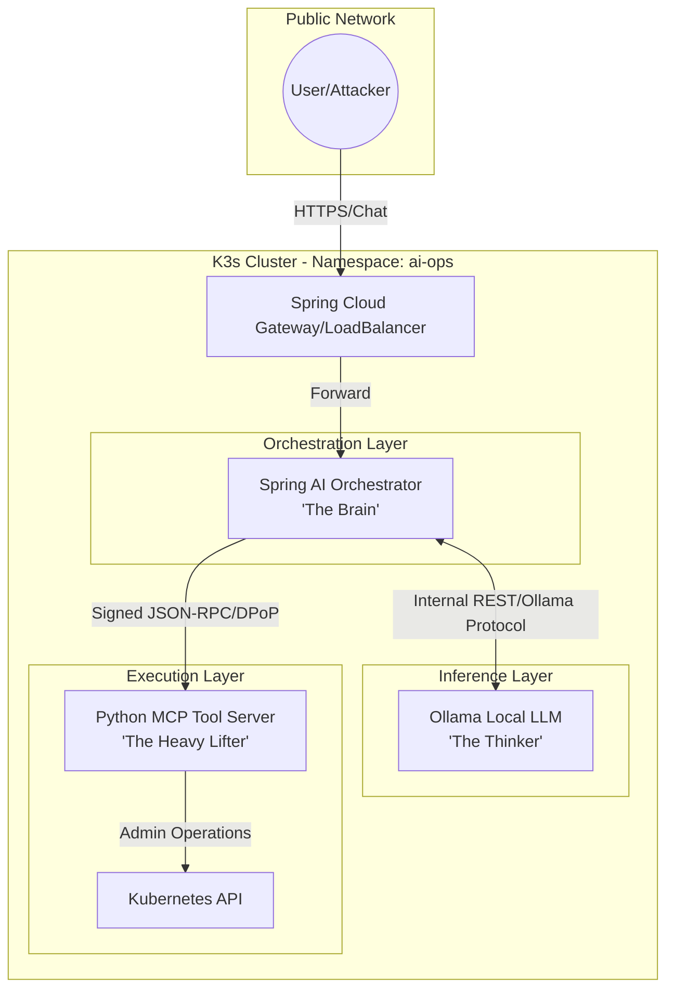

# MCP + Local Model Configurations

Architecture diagrams and config examples for running MCP tool servers backed
by local LLMs (Ollama, vLLM) in a k3s cluster.

## Status

Reference material — these diagrams document the Hammerhand-style architecture
where a Spring AI orchestrator calls an MCP tool server with DPoP-signed
requests, backed by a local Ollama instance.

## Files

| File | Purpose |
|---|---|
| `extended__.yaml` | Extended MCP server config with multi-tool registration |
| `stateful__.yaml` | Stateful session config with context persistence |

## Architecture

```text
[ USER / ATTACKER ]
          |
          | HTTP POST /ai/chat (Prompt Injection Vector)
          v
+-----------------------------+
|    ai-ops-service (LB)      |
+-------------|---------------+
              |
              v
+-----------------------------+      +-----------------------------+
|    Spring AI Orchestrator   | <==> |     Ollama LLM Pod          |
|        (Pod: Brain)         |      |     (Pod: Thinker)          |
| --------------------------- |      | --------------------------- |
| * Spring Boot 3.4           |      | * Llama 3.2 1B (Local)      |
| * Spring AI ChatClient      |      | * Port: 11434               |
| * DPoP Key Management       |      +-----------------------------+
| * Actuator (Health/Env)     |
+-------------|---------------+
              |
              | TOOL CALL: tool: "cluster_diagnostics"
              | AUTH: Authorization: DPoP <token>
              | AUTH: DPoP: <signed_jwt_proof>
              v
+-----------------------------+      +-----------------------------+
|   Python MCP Tool Server    |      |    Kubernetes API Server    |
|     (Pod: Heavy Lifter)     | <==> |    (The Control Plane)      |
| --------------------------- |      +-----------------------------+
| * RFC 9449 Validation       |
| * OS Subprocess Utilities   |
| * K8s ServiceAccount Token  |
+-----------------------------+
```



## Relevance

- Shows the DPoP-based auth flow between orchestrator and tool server
- Documents the attack surface for prompt injection → tool call chains
- Maps directly to the Hammerhand box architecture in kubesec-labs
- The MCP tool server validates RFC 9449 DPoP proofs before executing tools
