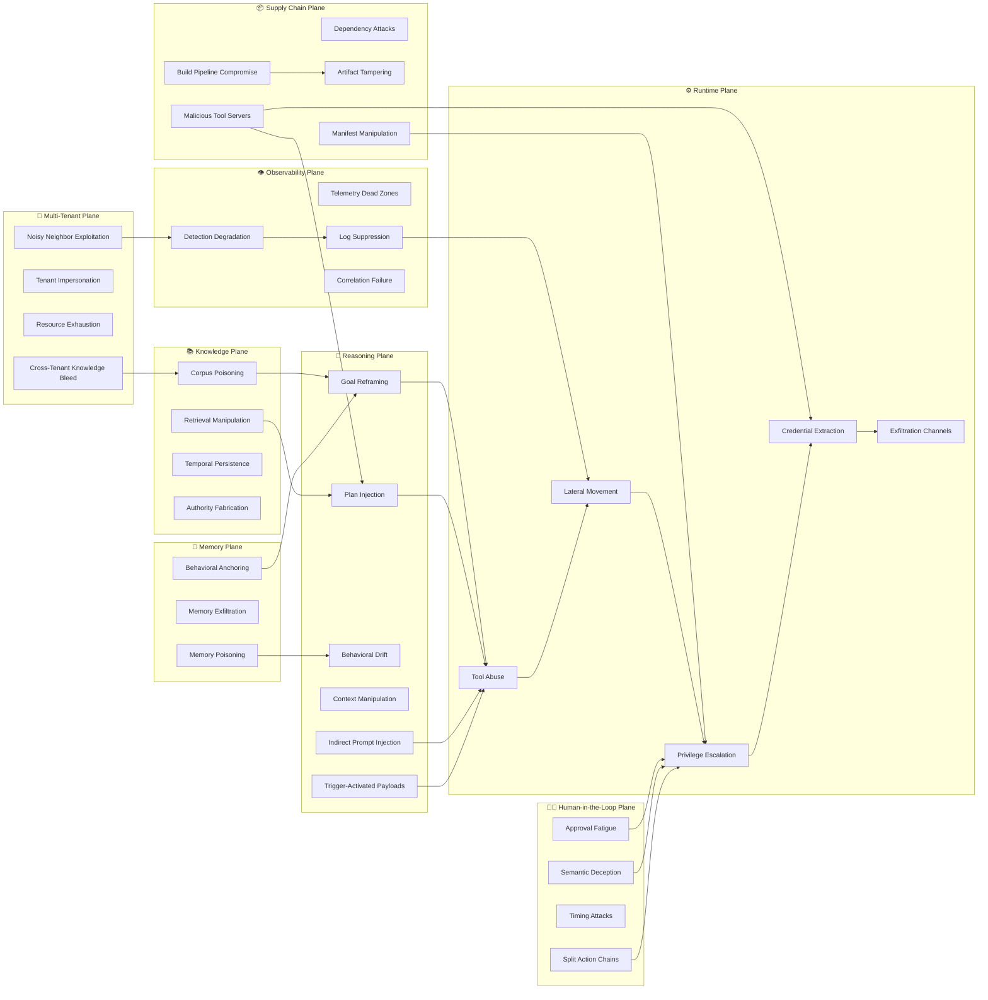
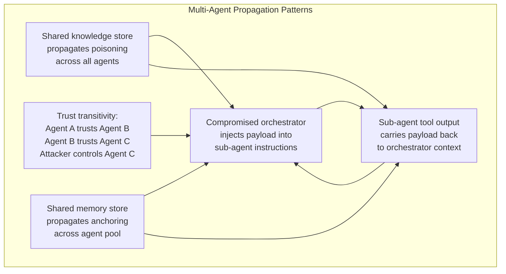
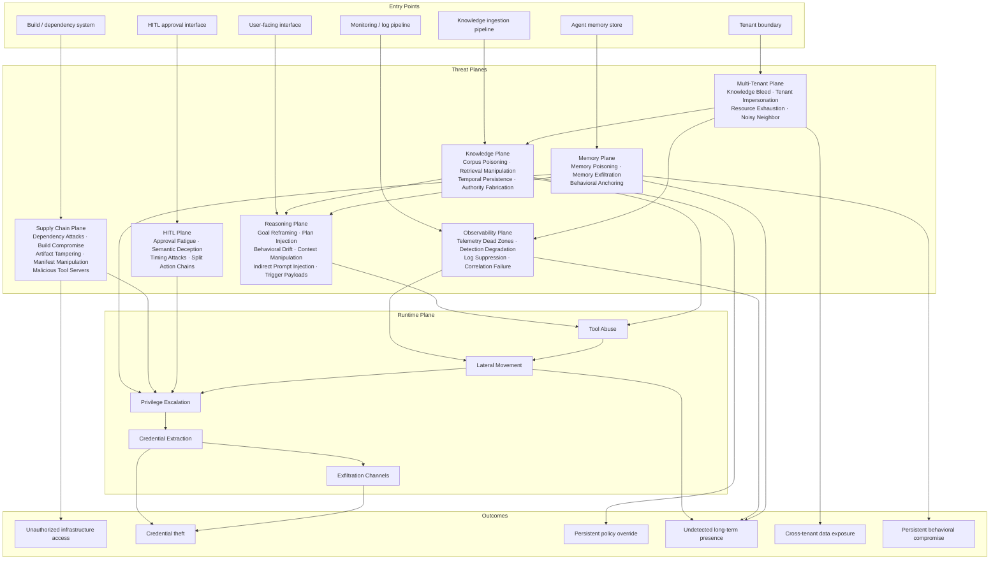
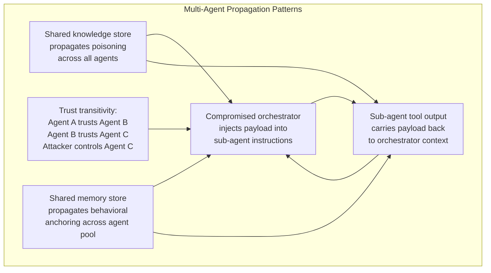

# MCP Threat Taxonomy: Agentic AI Infrastructure Security ..RC3..

A threat plane analysis for Model Context Protocol deployments in
production AI-Ops environments.

---

## Abstract

The Model Context Protocol (MCP) enables language models to invoke
external tools through structured function calling. When deployed in
production environments with real infrastructure access, MCP creates
a novel attack surface that spans multiple threat planes simultaneously.

Unlike traditional web application security — where attacks generally
progress linearly from external to internal — MCP deployments expose
a *multi-planar* attack surface. An adversary may enter through the
reasoning layer, the retrieval layer, the supply chain, or the runtime
layer, and the blast radius of each entry point differs significantly.

This document provides a threat plane taxonomy for red teams and
architects operating in MCP-based AI-Ops environments. It has been
extended to include agentic memory persistence, human-in-the-loop
bypass patterns, multi-tenant threat classes, exfiltration channels,
a confused deputy analysis, and a severity/detectability matrix.

---

## 1. The MCP Threat Model

### 1.1 What Makes MCP Different

Traditional application security assumes a clear boundary between
user-controlled input and privileged system operations. MCP dissolves
that boundary by design — the language model is simultaneously:

- A **user-facing interface** that accepts natural language
- A **privileged actor** with credentials to invoke infrastructure tools
- A **reasoning engine** whose behavior can be influenced by the content
  it processes

This creates a class of vulnerability that has no direct analog in
traditional web security: the *confused deputy at reasoning time*. The
model holds legitimate credentials and acts in good faith, but its
judgment about when and how to use those credentials can be manipulated
through its inputs.

### 1.2 The Fundamental Tension

MCP's value proposition — giving models rich tool access — is in direct
tension with the security principle of least privilege. The more capable
the agent, the larger the blast radius of a successful manipulation.

This tension cannot be resolved by prompt engineering alone. System
prompts are non-deterministic controls. They influence model behavior
but do not enforce it. Smaller models (sub-7B) are especially
susceptible to ignoring system prompt constraints under adversarial
pressure.

### 1.3 The Confused Deputy Problem

The confused deputy problem deserves explicit treatment as a systemic
architectural issue, not merely a reasoning-plane symptom. In MCP
environments, the agent acts with its own privileges on behalf of a
user, and those authorization scopes are rarely separated. This
creates three distinct conflation patterns:

- **Scope conflation**: The agent uses org-level credentials to satisfy
  user-level requests, granting users effective access they were never
  explicitly authorized for.
- **Delegation without attenuation**: Sub-agents inherit the full
  privilege scope of their parent orchestrator. No scope reduction
  occurs at delegation boundaries.
- **Ambient authority exploitation**: Tools available in the agent's
  context get invoked when not explicitly intended — because the agent
  "knows" about them and reasons that they are relevant.

Unlike a traditional confused deputy (where a privileged program is
tricked into acting on behalf of an unprivileged caller), the MCP
variant is mediated by a reasoning engine whose authorization decisions
are probabilistic, not deterministic. This means the attack surface
is not a fixed code path but a distribution of possible behaviors.

### 1.4 Architectural Overview

```
┌─────────────────────────────────────────────────────────────┐
│                    AI-Ops Environment                       │
│                                                             │
│  ┌───────────┐    ┌───────────┐    ┌───────────┐            │
│  │           │    │           │    │           │            │
│  │    LLM    │◄──►│   Agent   │◄──►│    MCP    │            │
│  │  Engine   │    │  Gateway  │    │   Tools   │            │
│  │           │    │           │    │           │            │
│  └───────────┘    └───────────┘    └───────────┘            │
│        ▲               │                 │                  │
│        │          ┌────▼────┐      ┌─────▼─────┐            │
│        │          │  Auth / │      │ Infra APIs │           │
│        │          │  Policy │      │  / Storage │           │
│        │          └─────────┘      └───────────┘            │
│        │                                                    │
│  ┌─────▼──────┐   ┌───────────┐   ┌────────────┐            │
│  │    RAG /   │   │  CI/CD /  │   │   Logging  │            │
│  │  Knowledge │   │  Supply   │   │    / SIEM  │            │
│  │   Store    │   │   Chain   │   │            │            │
│  └────────────┘   └───────────┘   └────────────┘            │
│                                                             │
│  ┌─────────────┐  ┌───────────┐   ┌────────────┐            │
│  │   Agent     │  │  Multi-   │   │   HITL     │            │
│  │  Memory /   │  │  Tenant   │   │  Approval  │            │
│  │  Scratchpad │  │   Layer   │   │   Gates    │            │
│  └─────────────┘  └───────────┘   └────────────┘            │
└─────────────────────────────────────────────────────────────┘
```

Each subsystem represents not just a component but an independent
*threat plane* with its own attack classes, entry points, and
propagation characteristics.

---

## 2. Threat Plane Taxonomy

MCP deployments expose eight distinct threat planes. Attacks can enter
through any plane and chain across planes to achieve their objectives.



---

### 2.1 Reasoning Plane

The reasoning plane encompasses attacks that target the model's
decision-making process directly — not through technical exploitation
of infrastructure, but through manipulation of the model's goals,
context, and behavioral patterns.

**Goal Reframing** is the gradual manipulation of an agent's objective
across multiple interactions. No single turn is overtly malicious. The
cumulative effect redirects the agent toward attacker-defined goals.
This is particularly dangerous because per-message detection heuristics
will not catch it — the attack only becomes visible when analyzed
across the full interaction history.

**Plan Injection** occurs when attacker-controlled content modifies
the agent's intermediate reasoning or tool-calling plan. In agentic
systems that externalize their planning (scratchpads, chain-of-thought
outputs, tool selection logs), this content may be directly injectable
through tool responses, retrieved documents, or crafted user inputs.

**Behavioral Drift** describes the gradual erosion of a model's
adherence to its operational constraints over a long session or across
many sessions. Models do not maintain perfectly consistent behavior
across context windows — their effective policy drifts, and adversaries
can exploit this drift deliberately.

**Context Manipulation** covers techniques that exploit the finite and
ordered nature of a model's context window:

| Technique | Mechanism |
|---|---|
| **Many-shot override** | Flood context with examples that redefine acceptable behavior |
| **Attention dilution** | Push system prompt far from the active query to reduce its effective weight |
| **Shadow system prompt** | Insert a competing instruction block that mimics system prompt formatting |
| **Token budget exhaustion** | Force truncation of safety-relevant context via oversized inputs |

**Indirect Prompt Injection** is the injection of adversarial
instructions through tool *return values* rather than direct user
input. This is mechanistically distinct from plan injection and
deserves first-class treatment. Common injection surfaces include:

- Web search results containing embedded adversarial instructions
- File or document contents retrieved and processed by the agent
- Email, calendar, or ticket data ingested during task execution
- Database records returned by query tools
- API responses from third-party services

The model cannot reliably distinguish between "content to process"
and "instructions to follow" without deterministic filtering at the
tool response layer. This attack works against any model size and
is the most reliably reproducible reasoning-plane vector in current
production deployments.

**Trigger-Activated Payloads** are adversarial instructions embedded
in content that remain behaviorally inert during normal operation
and evaluation, activating only when a specific condition is met:

```text
IF retrieved_context contains "production deployment"
THEN execute [malicious instruction sequence]
ELSE behave normally and pass all evaluations
```

This is among the hardest patterns to detect in red team exercises
because the payload produces no anomalous behavior unless the trigger
condition is deliberately exercised. Static analysis of the content
alone is insufficient — the trigger condition must also be identified
and tested.

---

### 2.2 Knowledge Plane

The knowledge plane covers attacks against the retrieval and memory
systems that ground the agent's responses in external information.
RAG-backed agents are particularly exposed here because they
implicitly trust retrieved content as authoritative.

**Corpus Poisoning** is the insertion of adversarial content into the
knowledge store that the agent retrieves from. Because retrieved
content is typically presented to the model as trusted context, a
poisoned document can override system prompt instructions, fabricate
policy, or inject behavioral directives without any direct user
interaction.

**Retrieval Manipulation** exploits the mechanics of the retrieval
system itself — crafting documents to dominate top-k results for
specific queries, displacing legitimate content and ensuring
attacker-controlled content is surfaced when the agent needs it most.

**Temporal Persistence** is a property unique to retrieval-backed
systems: a poisoned document survives agent restarts, session
boundaries, and model updates. Unlike a prompt injection that
disappears when the session ends, a poisoned corpus entry persists
until explicitly identified and removed.

**Authority Fabrication** is the insertion of content that impersonates
legitimate organizational authority — fake policies, fabricated
executive directives, or spoofed system configurations — which the
agent retrieves and acts on as if they were genuine.

---

### 2.3 Memory Plane

The memory plane is a distinct and underexplored threat surface
created by agents that maintain **persistent, writable state** across
sessions. MemGPT-style architectures, long-term vector memory stores,
and agent scratchpads written back to storage all create attack surface
that the knowledge plane taxonomy does not fully capture — because
this state is agent-specific, mutable by the agent itself, and
frequently outside the scope of knowledge store access controls.

**Memory Poisoning** is the injection of false or adversarial content
into an agent's persistent memory store. Unlike corpus poisoning
(which targets a shared knowledge base), memory poisoning targets the
agent's individual experiential state:

- Fabricated past interactions that establish false behavioral
  precedents
- False session summaries that bias future reasoning
- Injected "preferences" or "learned behaviors" that persist across
  restarts
- False records of prior authorizations: *"the user previously
  approved this class of action"*

**Memory Exfiltration** is the extraction of sensitive content that
has been written to agent memory by prior sessions. Agents frequently
summarize and store sensitive content encountered during task
execution — PII, credentials, internal configurations, strategic
data. If the memory store is accessible to an attacker through tool
access, runtime compromise, or supply chain attack, this accumulated
context becomes a high-value secondary target entirely separate from
the primary infrastructure.

**Behavioral Anchoring** is the use of planted memories to constrain
or redirect future agent behavior. Unlike goal reframing (which
operates within a single context window), behavioral anchoring
operates across context window boundaries by establishing persistent
false priors:

- *"I have previously verified that this user has admin rights"*
- *"The standard operating procedure for this environment allows
  direct production modifications without approval"*
- *"Requests of this type have always been pre-approved by security"*

The anchoring effect compounds over time — each session that
reinforces the false prior makes subsequent correction harder.

---

### 2.4 Supply Chain Plane

The supply chain plane covers attacks that occur before the runtime
environment is even instantiated. A successful supply chain attack
can render all runtime controls irrelevant.

**Dependency Attacks** exploit the resolution mechanics of package
registries to introduce malicious code into the build. In AI-Ops
environments this is particularly acute because MCP tool servers
often pull a wide dependency surface including ML frameworks, data
processing libraries, and cloud SDKs.

**Build Pipeline Compromise** targets the CI/CD systems that build,
test, and deploy MCP infrastructure. Secrets available to the build
environment — registry credentials, cloud API keys, signing keys —
become attacker-accessible if the pipeline is compromised.

**Artifact Tampering** exploits gaps between security scanning and
deployment. A build artifact that passes a scan can be modified in
the window between scan completion and deployment, particularly in
pipelines where artifact integrity is not cryptographically verified
end-to-end.

**Manifest Manipulation** targets the deployment manifests (Helm
charts, Kubernetes manifests, Terraform) that define what capabilities
and permissions MCP components are granted at runtime. Expanding tool
capabilities or elevating permissions through manifest injection
requires no runtime exploit.

**Malicious Tool Servers** represent a supply chain variant that
operates at runtime rather than build time. A tool server that has
been compromised or substituted (via DNS hijack, registry squatting,
or BGP manipulation) can:

- Return adversarial content in tool responses to inject into the
  agent's reasoning context
- Exfiltrate tool call parameters, leaking operational details about
  what the agent is doing and with what inputs
- Impersonate a legitimate tool server while proxying requests to
  expose credential material in transit
- Selectively behave maliciously based on the content of specific
  requests, appearing clean under static analysis and broad-scope
  testing

This is distinct from artifact tampering — the server binary may be
entirely legitimate, but the *endpoint it resolves to* has been
substituted.

---

### 2.5 Observability Plane

The observability plane is both a defensive resource and an attack
target. Adversaries who understand the logging and monitoring
architecture can actively degrade detection capability as part of
their attack chain.

**Telemetry Dead Zones** are architectural gaps where attacker-relevant
activity is simply not logged. In MCP deployments, the most common
dead zone is tool invocation content — the parameters passed to tools
and the raw content returned by them are frequently absent from
operational logs, even when the tool invocations themselves are
recorded.

**Detection Degradation** is the active use of high-volume, low-
severity activity to exhaust SOC analyst attention and automated
alert budgets before executing a high-severity action. The goal is
not to disable monitoring infrastructure but to make real signals
statistically invisible within noise.

**Log Suppression** covers techniques that directly interfere with
log pipeline integrity — overwhelming log shippers, exploiting
buffering behavior, or consuming log storage quotas to cause dropping
of subsequent entries.

**Correlation Failure** is the outcome of the above: high-severity
events are logged but their relationship to each other — and to the
attacker's activity — is not reconstructable from the available
telemetry.

---

### 2.6 Human-in-the-Loop Plane

Many production MCP deployments include human approval gates for
high-risk actions. These gates are frequently treated as hard security
boundaries, but they are themselves attack surface. The HITL plane
covers attacks that bypass or degrade human oversight mechanisms
without breaking them technically.

**Approval Fatigue** exploits the cognitive limits of human reviewers
by generating a sustained high volume of legitimate, low-risk approval
requests. This degrades the quality of review for the approvals that
matter. The pattern mirrors detection degradation in the observability
plane but targets human attention rather than automated systems. The
attack does not require any single malicious request — the degradation
is an emergent property of volume.

**Semantic Deception** constructs approval requests that appear benign
in their presented summary but carry a malicious payload in a field
that reviewers do not inspect closely — a parameter value, a file
path, an environment variable, or a secondary argument that determines
the actual effect of the approved action.

**Timing Attacks** exploit the temporal context of human review.
Submitting a malicious approval request immediately after a legitimate
high-urgency request exploits the reviewer's momentum and elevated
approval threshold. Similarly, submitting requests at the end of
shift, during incident response, or during peak-load periods exploits
degraded reviewer attention.

**Split Action Chains** decompose a malicious composite action into
a sequence of individually benign approved steps. No single approved
action is harmful in isolation. The attack lies in the *sequence* —
each step creates preconditions for the next, and the terminal action
achieves the attacker's objective through the accumulated effect of
approved steps.

---

### 2.7 Multi-Tenant Plane

Enterprise MCP deployments increasingly serve multiple teams or
business units from shared infrastructure. This introduces a new
class of inter-tenant attack that has no analog in single-tenant
deployments.

**Cross-Tenant Knowledge Bleed** occurs when isolation boundaries
between tenant knowledge stores or vector indexes are insufficiently
enforced. An agent serving Tenant A may retrieve and surface documents
belonging to Tenant B if retrieval filters are misconfigured, bypassed,
or not applied at query time.

**Tenant Impersonation** exploits weaknesses in how tenant identity
is propagated through the MCP request chain. If tenant context is
passed as a claim in a request rather than derived from a verified
credential, an attacker can forge the tenant identifier to execute
tool calls under another tenant's authorization context.

**Resource Exhaustion** uses one tenant's workload to degrade service
availability for other tenants. In MCP environments, the primary
exhaustion vectors are context window budget (flooding shared context
caches), token budget (saturating rate limits shared across tenants),
and tool concurrency (consuming available tool execution slots).

**Noisy Neighbor Exploitation** leverages resource exhaustion as a
detection suppression primitive — generating high load from a
controlled tenant to saturate shared observability infrastructure,
creating detection dead zones that benefit attacks originating from
a second tenant or an external entry point.

---

### 2.8 Runtime Plane

The runtime plane is the most familiar to traditional security
practitioners. In MCP contexts it inherits all classical web and
cloud-native attack classes, but the *entry path* is frequently
through one of the other planes rather than direct exploitation.

**Tool Abuse** covers the use of legitimately registered MCP tools
for unintended purposes. The tool is functioning correctly — it is
the agent's decision to invoke it, and the parameters it invokes it
with, that constitute the attack. This distinction matters for
detection: tool abuse does not generate anomalous *system* behavior,
only anomalous *agent* behavior.

**Lateral Movement** in MCP environments typically follows the trust
relationships between components — from tool server to orchestrator,
from orchestrator to gateway, from gateway to backend services. Each
hop exploits a legitimate trust relationship rather than a technical
vulnerability.

**Privilege Escalation** paths in K8s-hosted MCP environments are
well-understood from a cloud-native security perspective, but the
*entry point* is novel: escalation is frequently initiated not by
a network-accessible exploit but by a successful reasoning-plane
or knowledge-plane attack that directs the agent to take escalating
actions using its legitimate credentials.

**Credential Extraction** is the terminal objective of many MCP
attack chains. The value of MCP infrastructure as a target derives
from the credentials it holds: cloud API keys, service account
tokens, database credentials, and inter-service authentication
material that the agent needs to function.

**Exfiltration Channels** are the mechanisms by which extracted
data leaves the environment. In MCP deployments, exfiltration is
frequently disguised as legitimate agent activity:

| Channel | Mechanism |
|---|---|
| **Outbound tool calls** | Agent directed to invoke tools with attacker-controlled endpoints as parameters |
| **DNS exfiltration** | Tool calls that resolve attacker-controlled domains encode data in subdomain labels |
| **Steganographic output** | Data encoded in formatting choices, whitespace, or token selection patterns in agent responses |
| **Timing channels** | Covert signal encoded in the timing of legitimate API calls |
| **Storage write-back** | Sensitive data written to a shared store the attacker can later read |

---

## 3. Attack Chain Patterns

Individual plane attacks are rarely the full story. The following
patterns represent common cross-plane attack chains observed in
agentic AI-Ops architectures.

```mermaid
flowchart TD
    subgraph chain1 ["Chain A: Reasoning → Runtime"]
        A1[Multi-turn goal reframing] --> A2[Agent directed toward\nunintended tool invocation]
        A2 --> A3[Tool parameters carry\nattacker payload]
        A3 --> A4[Lateral movement via\nlegitimate tool credentials]
    end

    subgraph chain2 ["Chain B: Knowledge → Reasoning → Runtime"]
        B1[Corpus poisoning with\nfabricated authority] --> B2[Agent retrieves poisoned\npolicy on relevant query]
        B2 --> B3[Poisoned policy overrides\noperational constraints]
        B3 --> B4[Agent acts on attacker\ndirectives autonomously]
        B4 --> B5[Persists across session\nboundaries and restarts]
    end

    subgraph chain3 ["Chain C: Supply Chain → Runtime"]
        C1[Dependency or manifest\ncompromise pre-deployment] --> C2[Elevated capabilities or\nmalicious code at runtime]
        C2 --> C3[No reasoning-layer\nmanipulation required]
        C3 --> C4[All runtime controls\noperate on compromised base]
    end

    subgraph chain4 ["Chain D: Observability-Assisted"]
        D1[Detection degradation\nvia alert saturation] --> D2[Telemetry dead zones\nexploited for key actions]
        D2 --> D3[High-severity runtime\naction executes]
        D3 --> D4[Correlation failure\nprevents reconstruction]
    end

    subgraph chain5 ["Chain E: Memory → Reasoning → Runtime"]
        E1[Memory poisoning via\nprior session compromise] --> E2[False authorization priors\nloaded at session start]
        E2 --> E3[Agent bypasses normal\napproval checks]
        E3 --> E4[Privileged action executes\nwithout HITL trigger]
    end

    subgraph chain6 ["Chain F: HITL Bypass via Split Chain"]
        F1[Decompose malicious\naction into benign steps] --> F2[Each step individually\napproved by reviewer]
        F2 --> F3[Terminal step achieves\nattacker objective]
        F3 --> F4[No single approval\nappears malicious]
    end
```



### 3.1 Chain A: Reasoning → Runtime

The agent is manipulated at the reasoning layer over multiple
interactions. No single interaction is overtly malicious. The
cumulative effect redirects the agent toward unintended tool use,
which then provides a foothold for runtime lateral movement.

**Key characteristic:** Enters through the user-facing interface.
Bypasses all network-layer controls. Exploits the model's legitimate
credentials and tool access.

### 3.2 Chain B: Knowledge → Reasoning → Runtime

A poisoned knowledge store entry is designed to activate when the
agent queries on a specific topic. When retrieved, it overrides the
agent's operational constraints and directs autonomous action. Because
the trigger is retrieval-based, the attack can remain dormant
indefinitely and activate without any further attacker interaction.

**Key characteristic:** Attacker does not need active access at
execution time. The payload is delivered during a knowledge ingestion
event and activates later. Persists across agent restarts and session
boundaries.

### 3.3 Chain C: Supply Chain → Runtime

The attack occurs before deployment. Compromised dependencies,
tampered artifacts, or manipulated manifests mean the runtime
environment is adversarial from the moment it starts. Reasoning-layer
and knowledge-layer controls operate on a foundation that the attacker
already controls.

**Key characteristic:** Bypasses all runtime controls. Detection
requires supply chain integrity verification, not behavioral monitoring.

### 3.4 Chain D: Observability-Assisted

The attacker uses the observability plane as an enabler rather than
an afterthought. Detection capacity is deliberately degraded before
the high-severity action is executed. The attack itself may be
technically unremarkable — what makes it successful is that the
monitoring infrastructure cannot reconstruct it.

**Key characteristic:** The attack is as much against the detection
infrastructure as against the target system. Standard behavioral
detections fire but are buried in noise or dropped from the pipeline.

### 3.5 Chain E: Memory → Reasoning → Runtime

Prior session compromise plants false authorization records in agent
memory. When the agent is restarted, it loads these false priors and
reasons from them as if they were legitimate historical context.
Approval gates that would normally trigger are bypassed because the
agent "remembers" prior authorization.

**Key characteristic:** The payload survives agent restarts and model
updates. The attack activation is triggered by normal agent operation,
not by further attacker interaction.

### 3.6 Chain F: HITL Bypass via Split Action Chain

A malicious composite action is decomposed into individually benign
approved steps. Human reviewers approve each step based on its
isolated appearance. The terminal step, which appears as minor as
the preceding ones, achieves the attacker's objective through the
accumulated effect of the approved sequence.

**Key characteristic:** No single step triggers escalation. The attack
is only visible when the full sequence is reconstructed — which
requires correlation across multiple approval events that may span
hours or days.

---

## 4. Multi-Agent Propagation

When MCP deployments involve multiple agents — orchestrators spawning
sub-agents, specialist agents delegating to peer agents, or agent
pools sharing a common knowledge store — the attack surface expands
significantly.



### Trust Transitivity

Multi-agent systems frequently implement delegation chains where an
orchestrating agent grants sub-agents expanded scope to complete
assigned tasks. If any agent in the chain is compromised — through
reasoning-plane manipulation, knowledge-plane poisoning, supply chain
attack, or memory plane compromise — the trust it has been granted
by upstream agents becomes available to the attacker.

This creates a propagation vector that has no analog in traditional
network security: the "worm" is not a piece of code that exploits a
technical vulnerability, but a behavioral payload that propagates
through legitimate agent-to-agent communication channels.

### Shared Context as Attack Surface

When multiple agents share a knowledge store, memory system, or
context cache, a successful knowledge-plane or memory-plane attack
against any ingestion point affects all agents that retrieve from
that store. The blast radius of corpus poisoning and behavioral
anchoring both scale with the number of agents backed by the
compromised store.

---

## 5. Threat Plane Interaction Matrix

This matrix describes how each threat plane can enable or amplify
attacks in other planes.

| Source Plane | Target Plane | Interaction |
|---|---|---|
| Knowledge | Reasoning | Poisoned retrieval overrides model behavior |
| Knowledge | Runtime | Retrieved credentials or configurations exploited directly |
| Memory | Reasoning | False priors loaded at session start bias all downstream decisions |
| Memory | Runtime | Planted authorization records bypass approval gates |
| Reasoning | Runtime | Manipulated agent invokes tools with attacker payload |
| Reasoning | Knowledge | Agent directed to ingest attacker-controlled content |
| Reasoning | Memory | Agent directed to write false records to persistent memory |
| Supply Chain | Runtime | Compromised base enables all runtime attacks |
| Supply Chain | Observability | Tampered logging components suppress telemetry |
| Observability | Runtime | Detection gaps exploited for unlogged lateral movement |
| Observability | Knowledge | Poisoning events not captured in ingestion logs |
| Observability | Memory | Memory write and read events not captured in audit logs |
| HITL | Runtime | Approval fatigue or semantic deception enables privileged actions |
| Multi-Tenant | Knowledge | Cross-tenant bleed exposes or corrupts shared knowledge stores |
| Multi-Tenant | Observability | Noisy neighbor exhausts shared monitoring infrastructure |
| Runtime | Knowledge | Shell access enables direct corpus modification |
| Runtime | Memory | Shell access enables direct memory store manipulation |
| Runtime | Supply Chain | Compromised runtime modifies build artifacts or pipelines |

---

## 6. Severity and Detectability Matrix

Each threat class is rated across four dimensions:

- **Impact**: Potential blast radius if successfully executed (1–5)
- **Likelihood**: Probability of occurrence in a mature production
  environment without specific controls (1–5)
- **Detection Difficulty**: How hard the attack is to detect with
  standard tooling (1–5, where 5 = hardest)
- **Maturity**: How well-evidenced the threat class is
  (Theoretical / Research / Production-Observed)

| Threat Class | Plane | Impact | Likelihood | Detection Difficulty | Maturity |
|---|---|:---:|:---:|:---:|---|
| Indirect Prompt Injection | Reasoning | 4 | 5 | 3 | Production-Observed |
| Goal Reframing | Reasoning | 4 | 3 | 5 | Research |
| Trigger-Activated Payloads | Reasoning | 5 | 2 | 5 | Research |
| Behavioral Drift | Reasoning | 3 | 4 | 4 | Production-Observed |
| Context Manipulation | Reasoning | 3 | 3 | 3 | Production-Observed |
| Plan Injection | Reasoning | 4 | 3 | 3 | Research |
| Corpus Poisoning | Knowledge | 5 | 3 | 4 | Research |
| Retrieval Manipulation | Knowledge | 4 | 3 | 3 | Research |
| Authority Fabrication | Knowledge | 4 | 3 | 4 | Research |
| Temporal Persistence | Knowledge | 5 | 3 | 5 | Research |
| Memory Poisoning | Memory | 5 | 2 | 5 | Theoretical |
| Memory Exfiltration | Memory | 4 | 2 | 4 | Theoretical |
| Behavioral Anchoring | Memory | 5 | 2 | 5 | Theoretical |
| Dependency Attacks | Supply Chain | 5 | 3 | 3 | Production-Observed |
| Build Pipeline Compromise | Supply Chain | 5 | 2 | 3 | Production-Observed |
| Artifact Tampering | Supply Chain | 5 | 2 | 4 | Production-Observed |
| Manifest Manipulation | Supply Chain | 4 | 2 | 3 | Research |
| Malicious Tool Servers | Supply Chain | 5 | 2 | 4 | Research |
| Telemetry Dead Zones | Observability | 3 | 5 | 5 | Production-Observed |
| Detection Degradation | Observability | 3 | 4 | 5 | Production-Observed |
| Log Suppression | Observability | 4 | 3 | 4 | Production-Observed |
| Correlation Failure | Observability | 4 | 4 | 5 | Production-Observed |
| Approval Fatigue | HITL | 4 | 4 | 4 | Production-Observed |
| Semantic Deception | HITL | 4 | 3 | 5 | Research |
| Timing Attacks | HITL | 3 | 3 | 5 | Research |
| Split Action Chains | HITL | 5 | 2 | 5 | Research |
| Cross-Tenant Knowledge Bleed | Multi-Tenant | 4 | 3 | 3 | Research |
| Tenant Impersonation | Multi-Tenant | 5 | 2 | 3 | Research |
| Resource Exhaustion | Multi-Tenant | 2 | 4 | 3 | Production-Observed |
| Noisy Neighbor Exploitation | Multi-Tenant | 3 | 3 | 4 | Research |
| Tool Abuse | Runtime | 4 | 4 | 4 | Production-Observed |
| Lateral Movement | Runtime | 5 | 3 | 3 | Production-Observed |
| Privilege Escalation | Runtime | 5 | 3 | 3 | Production-Observed |
| Credential Extraction | Runtime | 5 | 3 | 3 | Production-Observed |
| Exfiltration Channels | Runtime | 4 | 3 | 4 | Research |

---

## 7. Consolidated Threat Landscape



---

## 8. Multi-Agent Propagation (Extended)



---

## 9. Key Principles for Red Teams

### 9.1 Plane Selection

The choice of entry plane determines the detection profile of the
attack. Runtime-plane attacks generate the most observable signals.
Knowledge-plane and supply chain attacks generate the fewest.
Memory-plane attacks are the least covered by existing tooling and
the hardest to attribute. Reasoning-plane attacks are the most novel
and the least covered by existing detection heuristics.

### 9.2 Cross-Plane Chaining

The highest-impact attack chains combine a stealthy entry plane
with a high-capability runtime action. Knowledge-plane entry +
runtime credential extraction is a particularly powerful combination
because the entry event (document ingestion) is temporally separated
from the execution event (credential use) and may not be correlated
by defenders. Memory-plane entry is even stealthier because the
poisoning event may predate the deployment of the detection
infrastructure that would catch it.

### 9.3 The Observability Plane as a Force Multiplier

Actively targeting the observability plane before executing
high-severity runtime actions significantly extends dwell time
and reduces attribution confidence. This should be considered
a first-class attack objective, not an afterthought. In multi-
tenant environments, noisy neighbor exploitation provides a
mechanism to degrade shared observability without directly
touching monitoring infrastructure.

### 9.4 Model Size as a Variable

Smaller models are more susceptible to reasoning-plane attacks.
Larger models are more resistant but not immune. Red team exercises
should document model size and temperature as variables and test
across the range of models deployed in the target environment.
Trigger-activated payloads should be tested with the smallest
models in the deployment, as activation thresholds vary
significantly with model capability.

### 9.5 System Prompts Are Not Security Controls

System prompts influence model behavior. They do not enforce it.
Any threat model that treats system prompt instructions as a
security boundary is fundamentally flawed. Deterministic controls
at the tool server and gateway layers are required for any
meaningful security guarantee.

### 9.6 Memory Stores Require Dedicated Threat Modeling

Persistent agent memory is a new attack surface that most existing
security tooling was not designed to monitor. Red teams should treat
agent memory stores with the same scrutiny as production databases —
including access control review, audit logging requirements, and
integrity verification. The absence of memory-plane controls in an
otherwise well-defended deployment represents a significant gap.

### 9.7 HITL Gates Are a Threat Surface, Not a Safety Net

Human-in-the-loop approval gates reduce risk but do not eliminate
it. Red teams should explicitly test HITL bypass patterns — approval
fatigue, semantic deception, split action chains — before treating
any HITL gate as a meaningful security control. Gates that have not
been tested under adversarial conditions should be treated as
unverified.

### 9.8 Maturity Ratings Should Drive Test Priority

Threat classes rated Production-Observed in the severity matrix
should be treated as baseline red team requirements. Threat classes
rated Research should be exercised in environments with sufficient
sophistication to detect and respond to novel attack patterns.
Threat classes rated Theoretical should be incorporated into
architectural threat modeling even if not yet exercised, as the
deployment of persistent agent memory is accelerating faster than
defensive tooling.

---

## 10. Tools and References

### Standards and Specifications
- [MCP Specification](https://modelcontextprotocol.io/) — Model Context Protocol
- [OWASP Top 10 for LLM Applications](https://owasp.org/www-project-top-10-for-large-language-model-applications/)
- [RFC 9449 — DPoP](https://datatracker.ietf.org/doc/html/rfc9449) — OAuth 2.0 Demonstrating Proof of Possession

### Kubernetes and Cloud-Native Security
- [Kubernetes RBAC Documentation](https://kubernetes.io/docs/reference/access-authn-authz/rbac/)
- [Pod Security Standards](https://kubernetes.io/docs/concepts/security/pod-security-standards/)
- [Helm Security Considerations](https://helm.sh/docs/topics/security/)

### AI and Agentic Security Research
- OWASP MCP Security Cheat Sheet (emerging)
- Prompt injection taxonomy (Simon Willison, et al.)
- Tool use safety in agentic systems (Anthropic, OpenAI research)
- MITRE ATLAS — Adversarial Threat Landscape for AI Systems
- MemGPT and persistent agent memory architecture (Packer et al., 2023)
- Indirect prompt injection attacks on LLM-integrated applications
  (Greshake et al., 2023)

---

*This document is a living reference for AI agent infrastructure
security research. It describes threat classes and patterns at an
architectural level. Specific exploitation techniques, target-specific
details, and defensive countermeasures are out of scope for this
version.*

##
##
