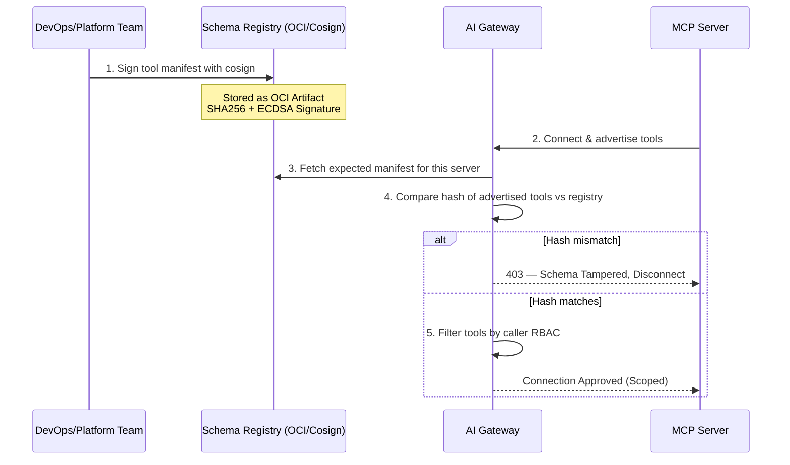
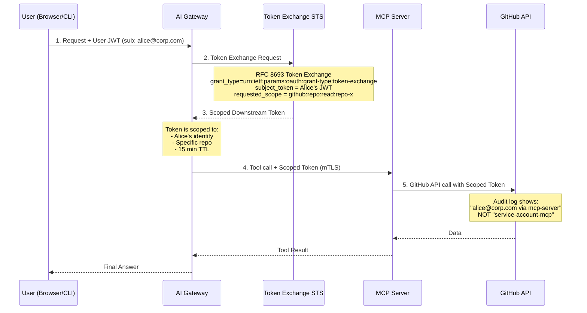
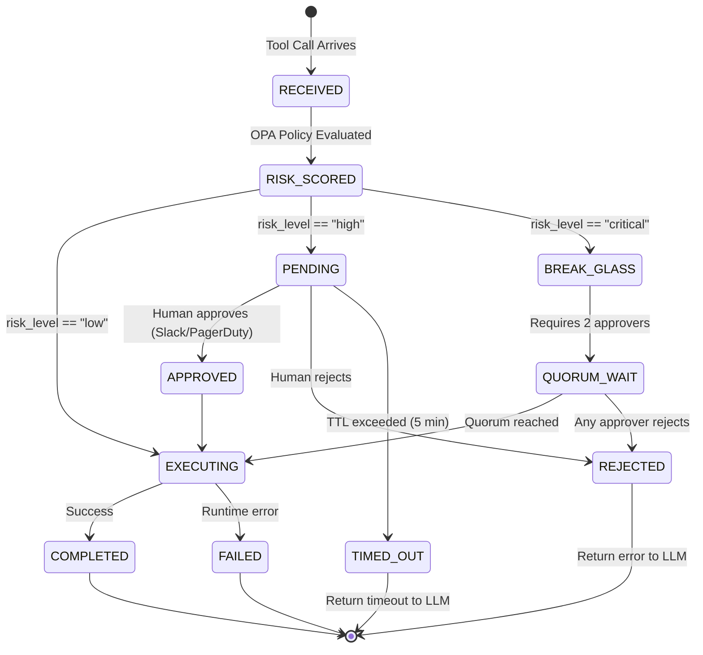
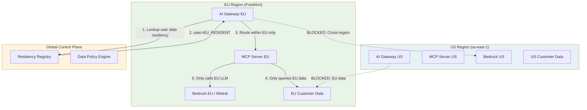
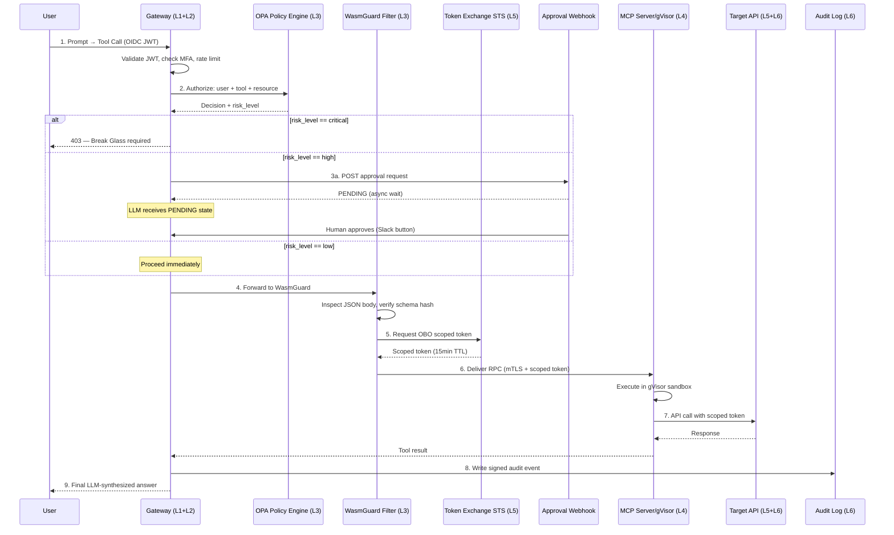

# MCP Security Architecture: Extended Research & Fine-Tuning

This extends the original framework with deeper technical specificity, threat modeling, and implementation-ready patterns.. (beta)..

---

## Part 1: Threat Model Expansion (STRIDE Applied to MCP)

| STRIDE Category | MCP-Specific Threat | Attack Vector | Severity |
| :--- | :--- | :--- | :--- |
| **Spoofing** | Rogue MCP server impersonates a trusted one | DNS poisoning, BGP hijack, or compromised service registry | Critical |
| **Tampering** | Tool schema modified in transit | MITM on unencrypted JSON-RPC | Critical |
| **Repudiation** | Agent denies tool call; no audit trail | No signed request chain in base RFC | High |
| **Information Disclosure** | Sampling request leaks system prompt | Malicious `sampling/createMessage` call | High |
| **Denial of Service** | Infinite tool-call loop via LLM confusion | Prompt injection → recursive tool calls | Medium |
| **Elevation of Privilege** | Agent escalates via chained tool calls | `get_user` → `modify_role` → `delete_db` in one conversation | Critical |

---

## Part 2: Refined Architecture — The 7-Layer MCP Defense Stack

```
┌─────────────────────────────────────────────────────────────────────┐
│                     7-LAYER MCP DEFENSE STACK                       │
├─────┬───────────────────────┬────────────────────────────────────── ┤
│  L7 │ DATA GOVERNANCE       │ GDPR/CCPA Tagging, Regional Affinity  │
│  L6 │ AUDIT & OBSERVABILITY │ Signed Audit Log, SIEM, eBPF Tracing  │
│  L5 │ IDENTITY PROPAGATION  │ OBO Token Exchange, IRSA, SPIFFE      │
│  L4 │ RUNTIME ISOLATION     │ Wasm/gVisor, Seccomp, AppArmor        │
│  L3 │ TOOL AUTHORIZATION    │ ABAC Policy Engine, Schema Signing    │
│  L2 │ TRANSPORT SECURITY    │ mTLS, SPIFFE SVID, Istio AuthPolicy   │
│  L1 │ IDENTITY & ACCESS     │ OIDC, JWT, MFA, Headless tsh/tbot     │
└─────┴───────────────────────┴───────────────────────────────────────┘
```

Each layer is independent — a bypass at L3 is contained by L4.

---

## Part 3: Tool Authorization Deep Dive — ABAC Policy Engine

### 3.1 Tool Schema Signing Flow



### 3.2 ABAC Policy Schema (OPA/Rego)

```rego
package mcp.authz

import future.keywords.if
import future.keywords.in

# Default deny
default allow := false

# Allow tool call if:
# 1. User role is in the allowed roles for this tool
# 2. Tool is in the signed manifest
# 3. Resource scope matches user's permitted scope
allow if {
    tool := input.tool_name
    user_role := input.jwt.claims.role
    resource := input.tool_args.resource_id

    # Check role → tool mapping
    allowed_roles := data.tool_policies[tool].allowed_roles
    user_role in allowed_roles

    # Check tool is in signed manifest
    data.signed_manifest.tools[tool].hash == input.tool_hash

    # Check resource scope
    permitted_resources := data.user_scopes[input.jwt.claims.sub]
    resource in permitted_resources
}

# Deny with reason for audit
deny[reason] if {
    not allow
    reason := sprintf(
        "User %v with role %v denied access to tool %v on resource %v",
        [input.jwt.claims.sub, input.jwt.claims.role,
         input.tool_name, input.tool_args.resource_id]
    )
}
```

### 3.3 Tool Policy Data Structure

```json
{
  "tool_policies": {
    "search_code": {
      "allowed_roles": ["engineer", "sre", "support"],
      "max_result_rows": 100,
      "allowed_repos": ["@user_permitted_repos"],
      "risk_level": "low",
      "requires_approval": false
    },
    "restart_ec2_instance": {
      "allowed_roles": ["sre"],
      "allowed_instance_tags": { "env": ["staging", "prod"] },
      "risk_level": "high",
      "requires_approval": true,
      "approval_timeout_seconds": 300
    },
    "delete_production_db": {
      "allowed_roles": [],
      "risk_level": "critical",
      "requires_approval": true,
      "approval_quorum": 2,
      "break_glass_only": true
    }
  }
}
```

---

## Part 4: Identity Propagation — On-Behalf-Of (OBO) Token Exchange

The most critical gap in vanilla MCP: the server acts as itself, not the user.



### STS Token Exchange Implementation (Go)

```go
type TokenExchangeRequest struct {
    GrantType          string `json:"grant_type"`
    SubjectToken       string `json:"subject_token"`
    SubjectTokenType   string `json:"subject_token_type"`
    RequestedTokenType string `json:"requested_token_type"`
    Scope              string `json:"scope"`
    Resource           string `json:"resource"` // target API URL
    Audience           string `json:"audience"`
}

func ExchangeForScopedToken(
    ctx context.Context,
    userJWT string,
    tool string,
    resourceID string,
) (string, error) {
    // Derive minimal scope from tool name + resource
    scope := deriveMinimalScope(tool, resourceID)

    req := TokenExchangeRequest{
        GrantType: "urn:ietf:params:oauth:grant-type:token-exchange",
        SubjectToken:       userJWT,
        SubjectTokenType:   "urn:ietf:params:oauth:token-type:jwt",
        RequestedTokenType: "urn:ietf:params:oauth:token-type:access_token",
        Scope:    scope,
        Resource: resourceID,
        Audience: "github.com",
    }

    // Exchange at internal STS (e.g., SPIRE, Vault, Dex)
    token, err := stsClient.Exchange(ctx, req)
    if err != nil {
        return "", fmt.Errorf("OBO exchange failed for user %s: %w",
            extractSub(userJWT), err)
    }

    auditlog.Record(AuditEvent{
        Type:       "token_exchange",
        UserSub:    extractSub(userJWT),
        Tool:       tool,
        Resource:   resourceID,
        ScopedToken: maskToken(token),
    })

    return token, nil
}

func deriveMinimalScope(tool, resourceID string) string {
    scopeMap := map[string]string{
        "search_code":       "repo:read",
        "create_pr":         "repo:write:pulls",
        "restart_ec2":       "ec2:StartInstances ec2:StopInstances",
        "read_cloudwatch":   "logs:GetLogEvents logs:FilterLogEvents",
    }
    base := scopeMap[tool]
    return fmt.Sprintf("%s resource:%s", base, resourceID)
}
```

---

## Part 5: Runtime Isolation — Wasm vs. gVisor Decision Matrix

```
┌─────────────────────┬──────────────────────┬──────────────────────┐
│ Property            │ WebAssembly (Wasm)   │ gVisor (runsc)       │
├─────────────────────┼──────────────────────┼──────────────────────┤
│ Syscall Surface     │ Near-zero (WASI only) │ ~200 intercepted     │
│ Language Support    │ Rust, Go, C, Python*  │ Any Linux binary     │
│ Startup Time        │ <5ms                  │ ~100ms               │
│ Memory Overhead     │ ~2MB per instance     │ ~15MB per sandbox    │
│ Network Isolation   │ Manual (WASI-sockets) │ Kernel-level netns   │
│ Filesystem Access   │ Explicit WASI caps    │ Overlay FS + policy  │
│ Existing Code Compat│ Requires recompile    │ Drop-in replacement  │
│ Best For            │ New tools, filters    │ Legacy MCP servers   │
└─────────────────────┴────────────────────-──┴──────────────────────┘
```

### Recommended Hybrid Approach

```yaml
# For the Istio WasmGuard filter (L3 - Tool Inspection)
# → Use Wasm: tiny, fast, zero syscall surface
apiVersion: extensions.istio.io/v1alpha1
kind: WasmPlugin
metadata:
  name: mcp-tool-guard
  namespace: mcp-jailed
spec:
  selector:
    matchLabels:
      app: mcp-server
  url: oci://registry.internal/mcp-wasm-guard:v1.2.3
  imagePullPolicy: IfNotPresent
  pluginConfig:
    allowlist_path: /etc/mcp/tool-allowlist.json
    max_args_size_bytes: 4096
    block_on_parse_error: true

---
# For the MCP server process itself (L4 - Runtime Jail)
# → Use gVisor: drop-in, handles existing Python/Node servers
apiVersion: node.k8s.io/v1
kind: RuntimeClass
metadata:
  name: gvisor-mcp
handler: runsc
---
apiVersion: v1
kind: Pod
metadata:
  name: mcp-server
  namespace: mcp-jailed
spec:
  runtimeClassName: gvisor-mcp
  securityContext:
    runAsNonRoot: true
    runAsUser: 65534
    seccompProfile:
      type: RuntimeDefault
  containers:
    - name: mcp-app
      image: registry.internal/mcp-github-server:v2.1.0
      securityContext:
        allowPrivilegeEscalation: false
        readOnlyRootFilesystem: true
        capabilities:
          drop: ["ALL"]
      volumeMounts:
        - name: workspace
          mountPath: /workspace
          readOnly: true
        - name: tmp
          mountPath: /tmp
  volumes:
    - name: workspace
      projected:
        sources:
          - serviceAccountToken:
              path: token
              expirationSeconds: 900
    - name: tmp
      emptyDir:
        medium: Memory
        sizeLimit: 64Mi
```

---

## Part 6: Human-in-the-Loop — Async Approval Gate

### State Machine for High-Risk Tool Calls



### Approval Webhook Payload

```json
{
  "approval_request_id": "apr_01J8X3K...",
  "ttl_seconds": 300,
  "risk_level": "high",
  "requested_by": {
    "user_sub": "alice@corp.com",
    "session_id": "sess_abc123",
    "ip": "10.0.1.45"
  },
  "tool": {
    "name": "restart_ec2_instance",
    "server": "mcp-aws-sre-v2",
    "schema_hash": "sha256:a1b2c3...",
    "args": {
      "instance_id": "i-0abc123def456",
      "reason": "OOM killer loop detected in CloudWatch"
    }
  },
  "context": {
    "parent_request_id": "req_xyz789",
    "llm_reasoning": "Instance i-0abc123 shows 47 OOM events in 10 min",
    "conversation_turn": 3
  },
  "approve_url": "https://gateway.internal/approve/apr_01J8X3K...",
  "reject_url": "https://gateway.internal/reject/apr_01J8X3K..."
}
```

---

## Part 7: Observability — Signed Audit Log Schema

Every tool call must produce a tamper-evident audit record.

```json
{
  "audit_id": "aud_01J8X...",
  "timestamp": "2026-04-22T03:00:00.000Z",
  "schema_version": "2.1",
  "chain": {
    "parent_request_id": "req_xyz789",
    "conversation_id": "conv_abc123",
    "turn": 3,
    "previous_audit_hash": "sha256:prev_event_hash"
  },
  "identity": {
    "user_sub": "alice@corp.com",
    "user_roles": ["engineer"],
    "mcp_server_spiffe_id": "spiffe://corp.com/mcp/github-server",
    "gateway_spiffe_id": "spiffe://corp.com/gateway/ai-gw-01"
  },
  "tool_call": {
    "tool_name": "search_code",
    "server_name": "mcp-github-server",
    "schema_hash": "sha256:a1b2c3...",
    "args_hash": "sha256:d4e5f6...",
    "scoped_token_jti": "jti_tok_789"
  },
  "policy": {
    "opa_decision": "allow",
    "matched_rule": "mcp.authz.allow",
    "risk_level": "low",
    "approval_id": null
  },
  "result": {
    "status": "success",
    "duration_ms": 234,
    "rows_returned": 12,
    "data_classification": "internal"
  },
  "signature": {
    "algorithm": "ECDSA-P256-SHA256",
    "key_id": "audit-signing-key-v3",
    "value": "base64_encoded_signature_over_all_above_fields"
  }
}
```

---

## Part 8: Data Residency — Regional Affinity Routing



---

## Part 9: The Complete Hardened MCP Request Lifecycle



---

## Part 10: Gap Analysis — What's Still Missing

##
##

| Gap | Description | Proposed Direction |
| :--- | :--- | :--- |
| **Multi-Agent Trust** | Agent A calling Agent B via MCP — who is the "user"? | Delegation chains with JWT `act` claim (RFC 8693 §4.1) |
| **Prompt Injection in Args** | Tool args themselves can contain injected instructions | Input sanitization layer before OPA evaluation |
| **LLM Fingerprinting** | Attacker probes tool list to identify the LLM/agent version | Randomize tool description text; strip version metadata |
| **Side-Channel via Timing** | Tool response time leaks data about backend state | Add randomized response delay jitter (±50ms) |
| **Tool Result Poisoning** | Malicious API returns crafted JSON to manipulate LLM | Validate & sanitize tool results before passing to LLM |
| **Streaming Tool Calls** | Long-running tools stream partial results; audit is incomplete | Checkpoint-based audit records for streaming calls |
| **MCP Server Supply Chain** | Compromised base image in MCP server container | SBOM + Sigstore/cosign image signing enforced at admission |

---

## Summary: The Golden Rules Extended

> **Rule 1:** Never trust the Server to define the tools — *verify against a signed registry.*
>
> **Rule 2:** Never trust the LLM to call them safely — *enforce ABAC at the gateway.*
>
> **Rule 3:** Never let the server act as itself — *always propagate user identity via OBO.*
>
> **Rule 4:** Never assume the container is safe — *isolate with gVisor + Wasm.*
>
> **Rule 5:** Never let high-risk actions execute autonomously — *gate with async human approval.*
>
> **Rule 6:** Never trust your own audit log — *sign every event and chain them.*
