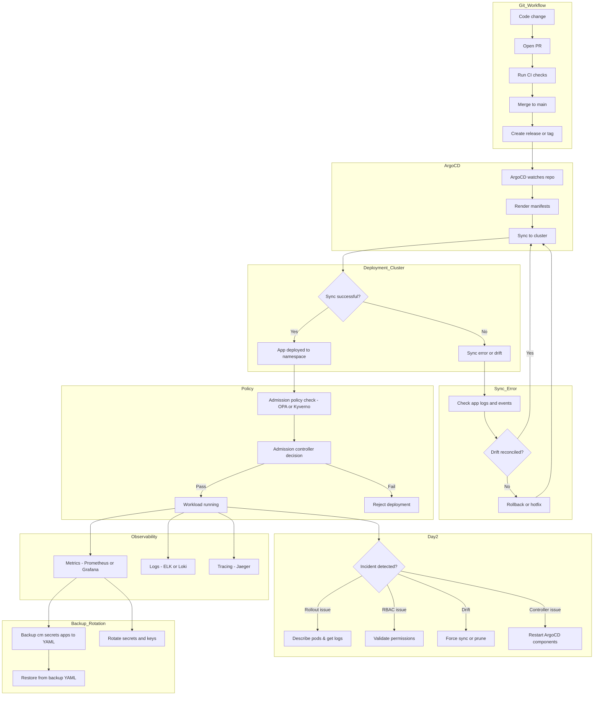

## 📊 ArgoCD + Kubernetes Playbook (All-in-One Diagram) .. beta ..




##
##


```
```
```mermaid
flowchart LR
  %% ===== STYLES =====
  classDef argo fill:#e3f2fd,stroke:#1e88e5,color:#0d47a1,stroke-width:1.5px;
  classDef k8s fill:#e8f5e9,stroke:#43a047,color:#1b5e20,stroke-width:1.5px;
  classDef sec fill:#ffebee,stroke:#e53935,color:#b71c1c,stroke-width:1.5px;
  classDef infra fill:#ede7f6,stroke:#5e35b1,color:#311b92,stroke-width:1.5px;
  classDef svc fill:#fff3e0,stroke:#ef6c00,color:#e65100,stroke-width:1.5px;
  classDef obs fill:#e0f7fa,stroke:#00838f,color:#004d40,stroke-width:1.5px;
  classDef store fill:#f1f8e9,stroke:#33691e,color:#1b5e20,stroke-width:1.5px;
  classDef decision fill:#fff,stroke:#616161,color:#212121,stroke-dasharray:4 2;

  %% ===== DEV -> GIT =====
  subgraph DEV[Developer Workflow]
    C[Code change] --> PR[Open PR]
    PR --> CI[CI checks]
    CI --> M[Merge or Tag]
  end

  subgraph GIT[Git Repository]
    M --> REV[Release or Revision]
  end

  %% ===== ARGOCD CONTROL PLANE =====
  subgraph ARGO[ArgoCD Control Plane]
    S[ArgoCD API / Server]:::argo
    R[Repo Server]:::argo
    AC[Application Controller]:::argo
  end

  %% ===== INGRESS / SSO =====
  subgraph NET[Ingress and SSO]
    ING[Ingress Controller]:::infra
    IdP[(OIDC or SAML IdP)]:::sec
  end
  user[User]:::infra -->|/argocd TLS| ING --> S
  S -->|SSO AuthN| IdP

  %% ===== FLOW TO CLUSTER =====
  REV --> R -->|Render Helm or Kustomize or Plain| AC
  S --> AC
  AC -->|Diff desired vs live| L1([Diff Result]):::decision

  %% ===== CLUSTER / TENANCY =====
  subgraph K8S[Kubernetes Cluster]
    API[apiserver]:::k8s
    subgraph TEN[Multi-Tenancy - AppProjects]
      P[AppProject team-a]:::svc
      A1[App service-x]:::k8s --> P
      A2[App service-y]:::k8s --> P
    end
  end

  L1 -->|OutOfSync| APPLY[Apply or Prune manifests]:::k8s
  L1 -->|InSync| NOOP[No-op]:::k8s

  %% ===== POLICY GATES =====
  subgraph POLICY[Admission and Supply Chain]
    OPA[Gatekeeper or OPA\nPolicies]:::sec
    SIG[Image or Commit Signing\nCosign and GPG]:::sec
  end
  APPLY --> API --> OPA
  SIG -. verify .- OPA
  OPA -->|deny non-compliant| DENY((DENY)):::sec
  OPA -->|admit compliant| OK((ADMIT)):::k8s
  OK --> RUN[Workloads running]:::k8s
  RUN --> AC
  AC --> S

  %% ===== DAY-2 OPS =====
  subgraph DAY2[Day-2 Ops and Incident Response]
    D0[Detect Degraded or OutOfSync]:::obs
    D1{Render OK?\nhelm or kustomize}:::decision
    D2{CRD or Dependency missing?}:::decision
    D3{RBAC forbidden?}:::decision
    D4{Rollout failing?}:::decision
    D5{Manual drift?}:::decision
    FIX_RENDER[Fix values or templates\nUpdate Git and retry]:::svc
    FIX_ORDER[Use sync waves\nInstall CRDs]:::svc
    FIX_RBAC[Adjust Roles or Projects\nkubectl auth can-i ...]:::svc
    FIX_ROLLOUT[Describe or logs or undo\nUpdate image or config]:::svc
    FORCE[Force sync or prune]:::svc
    RESTART[Restart components\nserver repo controller]:::svc
  end
  AC --> D0
  D0 --> D1
  D1 -- No --> FIX_RENDER --> AC
  D1 -- Yes --> D2
  D2 -- Yes --> FIX_ORDER --> AC
  D2 -- No --> D3
  D3 -- Yes --> FIX_RBAC --> AC
  D3 -- No --> D4
  D4 -- Yes --> FIX_ROLLOUT --> AC
  D4 -- No --> D5
  D5 -- Yes --> FORCE --> AC
  D5 -- No --> RESTART --> AC

  %% ===== OBSERVABILITY / AUDIT =====
  subgraph OBS[Observability and Audit]
    H[App history\nargocd app history]:::obs
    E[Events and logs\nkubectl logs or get events]:::obs
    SIEM[(SIEM or Audit sink)]:::obs
  end
  S --> H
  K8S --> E
  H --> SIEM
  E --> SIEM

  %% ===== BACKUP / RESTORE =====
  subgraph BDR[Backup and Disaster Recovery]
    BK[Backup cm secrets apps\nkubectl get ... > backup.yaml]:::store
    RS[Restore apply -f backup.yaml]:::store
  end
  S --> BK
  BK --> RS
  RS --> AC

  %% ===== ROTATION =====
  subgraph ROT[Secret and Credential Rotation]
    R0[Choose rotation window]:::svc
    R1{Type?\nGit or Cluster or App Secret}:::decision
    RG[New deploy key or token\nargocd repo add or replace]:::svc
    RK[New kubeconfig or SA\nargocd cluster add]:::svc
    RA[Update Vault or SealedSecret\ncommit encrypted]:::svc
    RV[Validate access and sync]:::svc
    RAUD[Audit and close]:::obs
  end
  R0 --> R1
  R1 -- Git --> RG --> RV --> RAUD
  R1 -- Cluster --> RK --> RV --> RAUD
  R1 -- App Secret --> RA --> RV --> RAUD
  RV --> AC
