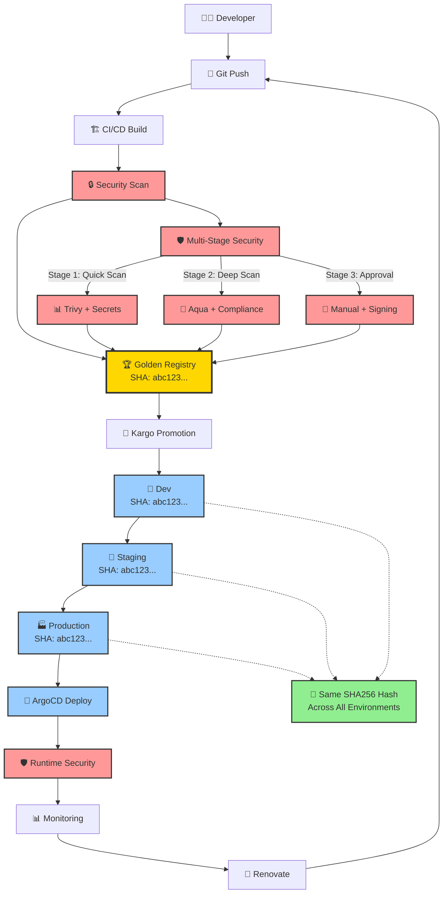
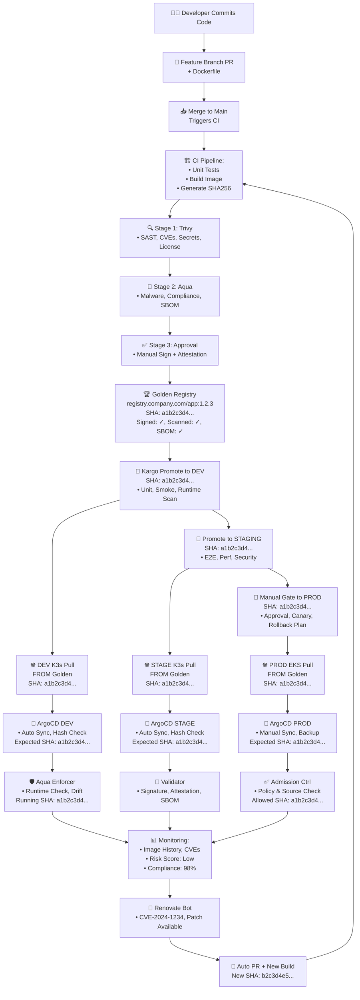

```

┌─────────────────────────────────────────────────────────────────────────────────┐
│                         SECURE IMAGE PROMOTION PIPELINE                         │
│                        (Immutable Images + Hash Consistency)                    │
└─────────────────────────────────────────────────────────────────────────────────┘

┌─────────────────┐    ┌──────────────────┐    ┌─────────────────┐
│  Developer      │    │   Feature        │    │  Main Branch    │
│  Commits Code   │───▶│   Branch PR      │───▶│  Merge Trigger  │
│                 │    │  + Dockerfile    │    │                 │
└─────────────────┘    └──────────────────┘    └─────────────────┘
                                                        │
                                                        ▼
                                               ┌─────────────────┐
                                               │  BUILD ONCE     │
                                               │  CI Pipeline    │
                                               │  • Unit Tests   │
                                               │  • Build Image  │
                                               │  • Generate     │
                                               │    SHA256 Hash  │
                                               └─────────────────┘
                                                        │
                       ┌────────────────────────────────┼────────────────────────────────┐
                       │                 GOLDEN IMAGE CREATION                           │
                       │                                │                                │
                       ▼                                ▼                                ▼
            ┌─────────────────┐              ┌─────────────────┐              ┌─────────────────┐
            │  STAGE 1        │              │  STAGE 2        │              │  STAGE 3        │
            │  Initial Scan   │              │  Deep Security  │              │  Final Approval │
            │  • Trivy SAST   │─────────────▶│  • Aqua Full    │─────────────▶│  • Compliance   │
            │  • Basic CVE    │              │  • Malware      │              │  • Sign Image   │
            │  • Secrets      │              │  • Compliance   │              │  • Attestation  │
            │  • License      │              │  • SBOM Gen     │              │  • Provenance   │
            └─────────────────┘              └─────────────────┘              └─────────────────┘
                     │                                │                                │
                     ▼                                ▼                                ▼
               [SCAN PASSED]                   [DEEP SCAN PASSED]                [APPROVED]
                     │                                │                                │
                     └────────────────────────────────┼────────────────────────────────┘
                                                      │
                                                      ▼
┌────────────────────────────────────────────────────────────────────────────────┐
│                            GOLDEN REGISTRY                                     │
│                     (Single Source of Truth)                                   │
├────────────────────────────────────────────────────────────────────────────────┤
│  🏆 GOLDEN ECR/ARTIFACTORY                                                    │
│  registry.company.com/app-name:1.2.3                                          │
│  └─ SHA256: a1b2c3d4e5f6...                                                   │
│  └─ Signed: ✓ (Cosign)                                                        │
│  └─ Scanned: ✓ (Aqua + Trivy)                                                 │
│  └─ SBOM: ✓ (Attached)                                                        │
│  └─ Attestation: ✓ (SLSA Level 3)                                             │
│  └─ Compliance: ✓ (CIS, NIST, PCI)                                            │
│                                                                               │
│  📋 IMMUTABLE TAGS:                                                           │
│  • registry.company.com/app-name:1.2.3                                        │
│  • registry.company.com/app-name:sha256-a1b2c3d4e5f6...                       │
│  • registry.company.com/app-name:latest-secure                                │
└───────────────────────────────────────────────────────────────────────────────┘
                                      │
                                      ▼
┌────────────────────────────────────────────────────────────────────────────────┐
│                          KARGO PROMOTION PIPELINE                              │
│                     (Same Hash Across All Environments)                        │
├────────────────────────────────────────────────────────────────────────────────┤
│                                                                               │
│  DEV ENVIRONMENT          STAGING ENVIRONMENT         PRODUCTION ENVIRONMENT  │
│  ┌─────────────────┐      ┌─────────────────┐         ┌─────────────────┐     │
│  │ Auto Promotion  │─────▶│ Auto Promotion  │────────▶│ Manual Gate     │     │
│  │                 │      │                 │         │                 │     │
│  │ Image:          │      │ Image:          │         │ Image:          │     │
│  │ SHA: a1b2c3d4   │      │ SHA: a1b2c3d4   │         │ SHA: a1b2c3d4   │     │
│  │ ✓ Same Hash     │      │ ✓ Same Hash     │         │ ✓ Same Hash     │     │
│  │                 │      │                 │         │                 │     │
│  │ Tests:          │      │ Tests:          │         │ Validations:    │     │
│  │ • Unit Tests    │      │ • E2E Tests     │         │ • Approval      │     │
│  │ • Smoke Tests   │      │ • Perf Tests    │         │ • Canary Ready  │     │
│  │ • Runtime Scan  │      │ • Security Test │         │ • Rollback Plan │     │
│  └─────────────────┘      └─────────────────┘         └─────────────────┘     │
│         │                          │                          │               │
└───────────────────────────────────────────────────────────────────────────────┘
          │                          │                          │
          ▼                          ▼                          ▼
┌─────────────────┐        ┌─────────────────┐        ┌─────────────────┐
│   K3S/K8S       │        │   K3S/K8S       │        │   EKS/K8S       │
│   DEV CLUSTER   │        │  STAGE CLUSTER  │        │  PROD CLUSTER   │
│                 │        │                 │        │                 │
│ Pulls Image:    │        │ Pulls Image:    │        │ Pulls Image:    │
│ SHA: a1b2c3d4   │        │ SHA: a1b2c3d4   │        │ SHA: a1b2c3d4   │
│ FROM: Golden    │        │ FROM: Golden    │        │ FROM: Golden    │
│ Registry        │        │ Registry        │        │ Registry        │
└─────────────────┘        └─────────────────┘        └─────────────────┘
          │                          │                          │
          ▼                          ▼                          ▼
┌─────────────────────────────────────────────────────────────────────────────────┐
│                         ARGOCD DEPLOYMENT                                       │
│                    (Hash Verification & Drift Detection)                        │
├─────────────────────────────────────────────────────────────────────────────────┤
│                                                                               │
│  ┌─────────────────┐    ┌─────────────────┐    ┌─────────────────┐            │
│  │ DEV ArgoCD      │    │ STAGING ArgoCD  │    │ PROD ArgoCD     │            │
│  │ • Sync Policy   │    │ • Sync Policy   │    │ • Sync Policy   │            │
│  │ • Hash Check    │    │ • Hash Check    │    │ • Hash Check    │            │
│  │ • Auto Heal     │    │ • Auto Heal     │    │ • Manual Sync   │            │
│  │ • Prune         │    │ • Prune         │    │ • Backup Before │            │
│  │                 │    │                 │    │ • Blue/Green    │            │
│  │ Expected SHA:   │    │ Expected SHA:   │    │ Expected SHA:   │            │
│  │ a1b2c3d4e5f6    │    │ a1b2c3d4e5f6    │    │ a1b2c3d4e5f6    │            │
│  │                 │    │                 │    │                 │            │
│  │ Actual SHA:     │    │ Actual SHA:     │    │ Actual SHA:     │            │
│  │ a1b2c3d4e5f6 ✓  │    │ a1b2c3d4e5f6 ✓  │    │ a1b2c3d4e5f6 ✓  │            │
│  └─────────────────┘    └─────────────────┘    └─────────────────┘            │
└───────────────────────────────────────────────────────────────────────────────┘
                                      │
                                      ▼
┌─────────────────────────────────────────────────────────────────────────────────┐
│                        RUNTIME SECURITY LAYER                                   │
│                      (Continuous Image Validation)                              │
├─────────────────────────────────────────────────────────────────────────────────┤
│                                                                              │
│  ┌─────────────────┐  ┌─────────────────┐  ┌─────────────────┐               │
│  │ Aqua Enforcer   │  │ Image Validator │  │ Admission Ctrl  │               │
│  │ • Runtime Check │  │ • SHA256 Verify │  │ • Policy Check  │               │
│  │ • Drift Monitor │  │ • Signature Val │  │ • Image Source  │               │
│  │ • Compliance    │  │ • Registry Auth │  │ • Hash Match    │               │
│  │ • Behavior      │  │ • SBOM Verify   │  │ • Attestation   │               │
│  │                 │  │                 │  │                 │               │
│  │ Running SHA:    │  │ Expected SHA:   │  │ Allowed SHA:    │               │
│  │ a1b2c3d4e5f6 ✓  │  │ a1b2c3d4e5f6 ✓  │  │ a1b2c3d4e5f6 ✓  │               │
│  └─────────────────┘  └─────────────────┘  └─────────────────┘               │
└──────────────────────────────────────────────────────────────────────────────┘
                                      │
                                      ▼
┌────────────────────────────────────────────────────────────────────────────────┐
│                    CONTINUOUS MONITORING & VALIDATION                          │
├────────────────────────────────────────────────────────────────────────────────┤
│                                                                              │
│  ┌─────────────────┐  ┌─────────────────┐  ┌─────────────────┐               │
│  │ Image Tracking  │  │ Vulnerability   │  │ Compliance      │               │
│  │ • Hash History  │  │ • New CVEs      │  │ • Policy Drift  │               │
│  │ • Deployment    │  │ • CVSS Scores   │  │ • Benchmark     │               │
│  │ • Rollback      │  │ • Patch Avail   │  │ • Attestation   │               │
│  │ • Audit Trail   │  │ • Risk Score    │  │ • Cert Expiry   │               │
│  │                 │  │                 │  │                 │               │
│  │ All Envs SHA:   │  │ Current Risk:   │  │ Compliance:     │               │
│  │ a1b2c3d4e5f6 ✓  │  │ Low (Score: 2)  │  │ 98% (Passing)   │               │
│  └─────────────────┘  └─────────────────┘  └─────────────────┘               │
└──────────────────────────────────────────────────────────────────────────────┘

┌────────────────────────────────────────────────────────────────────────────────┐
│                           RENOVATION CYCLE                                     │
│                    (Automated Security Updates)                                │
├────────────────────────────────────────────────────────────────────────────────┤
│                                                                               │
│  ┌─────────────────┐                    ┌─────────────────┐                   │
│  │ Renovate Bot    │───── Triggers ────▶│ New Build       │                   │
│  │ • Base Image    │                    │ • New SHA       │                   │
│  │ • Dependencies  │                    │ • Security Scan │                   │
│  │ • CVE Patches   │                    │ • New Golden    │                   │
│  │ • Auto PR       │                    │ • Replaces Old  │                   │
│  │                 │                    │                 │                   │
│  │ Detected:       │                    │ New SHA:        │                   │
│  │ • CVE-2024-1234 │                    │ b2c3d4e5f6a1    │                   │
│  │ • High Severity │                    │ • Secure        │                   │
│  │ • Patch Avail   │                    │ • Tested        │                   │
│  └─────────────────┘                    └─────────────────┘                   │
│                                                  │                            │
│                                                  ▼                            │
│                                         ┌─────────────────┐                   │
│                                         │ Automatic       │                   │
│                                         │ Propagation     │                   │
│                                         │ • Dev First     │                   │
│                                         │ • Staging Test  │                   │
│                                         │ • Prod Approval │                   │
│                                         │ • Same SHA      │                   │
│                                         │ • Zero Downtime │                   │
│                                         └─────────────────┘                   │
└───────────────────────────────────────────────────────────────────────────────┘

```





