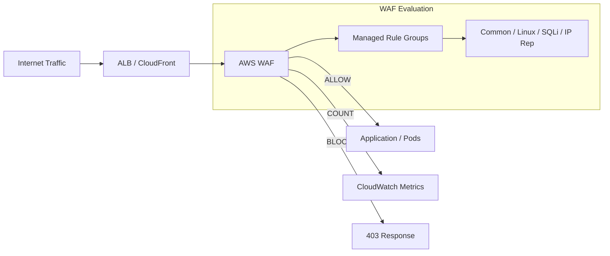
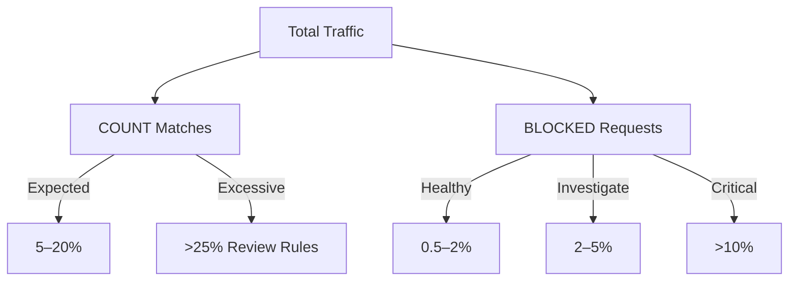
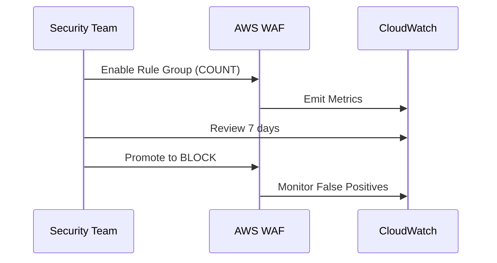

# AWS WAF Managed Rules — Observability, Enforcement & Expected Outcomes  ..beta..

> **Research Notes & Operational Guidance**
> Focus: AWS WAF (ALB / CloudFront), Managed Rule Groups, COUNT vs BLOCK behavior
> Audience: Security Engineering, SRE, Platform, ProdSec

---

## Executive Summary

In mature production environments, **AWS WAF should block only a small fraction of total traffic**.
High block rates do **not** indicate better security — they often indicate mis-tuned rules or business impact.

**Observed industry norms:**

* **BLOCK:** typically **< 2%** of total requests
* **COUNT:** often **5–20%**, depending on bot pressure
* **>5% sustained BLOCK:** requires investigation
* **>10% BLOCK:** usually indicates misconfiguration or active attack

This document summarizes **expected behavior**, **rule-group characteristics**, and **operational thresholds** based on real-world SaaS deployments.

---

## Traffic Flow & Enforcement Model

---

## COUNT vs BLOCK: Conceptual Model

| Mode      | Purpose                            | Expected Volume    |
| --------- | ---------------------------------- | ------------------ |
| **COUNT** | Observe, tune, learn               | **Higher (5–20%)** |
| **BLOCK** | Enforce high-confidence detections | **Low (<2%)**      |

**COUNT is signal. BLOCK is precision.**

---

## Expected Behavior by Managed Rule Group

| Managed Rule Group                        | Typical COUNT % | Typical BLOCK % | Operational Notes            |
| ----------------------------------------- | --------------- | --------------- | ---------------------------- |
| **AWSManagedRulesCommonRuleSet**          | 3–10%           | **0.3–2%**      | OWASP Top-10, noisy in COUNT |
| **AWSManagedRulesLinuxRuleSet**           | 0.5–3%          | **0.1–1%**      | Strong RCE signal            |
| **AWSManagedRulesKnownBadInputsRuleSet**  | 0.2–2%          | **<0.5%**       | Mostly scanner garbage       |
| **AWSManagedRulesSQLiRuleSet**            | 0.1–1%          | **<0.3%**       | App-pattern sensitive        |
| **AWSManagedRulesAmazonIpReputationList** | 0.5–5%          | **0.3–2%**      | Bot density dependent        |
| **AWSManagedRulesAnonymousIpList**        | 1–8%            | **0.5–4%**      | High false-positive risk     |

---

## What “Healthy” Looks Like

---

## Interpreting Elevated BLOCK Rates

| Scenario                       | Likely Cause         | Action           |
| ------------------------------ | -------------------- | ---------------- |
| BLOCK spikes during off-hours  | Bot scans            | Observe only     |
| Sustained >5% BLOCK            | Rule tuning issue    | Review logs      |
| SQLi BLOCK hits real users     | App syntax collision | Exclude path     |
| IP reputation blocks customers | NAT / VPN overlap    | Scope or disable |
| Anonymous IP blocks login      | Legit VPN users      | Keep optional    |

---

## Recommended Enforcement Strategy

---

## Enforcement Playbook

1. **Enable HIGH priority rules in COUNT**
2. Observe metrics for **7–14 days**
3. Promote to BLOCK if:

   * BLOCK < 2%
   * No customer impact
4. Roll out MEDIUM priority rules incrementally
5. Treat OPTIONAL rules as **business decisions**

---

## Operational Thresholds (Codifiable)

| Metric      | Threshold | Action           |
| ----------- | --------- | ---------------- |
| BLOCK > 5%  | 15 min    | Page security    |
| BLOCK > 10% | Immediate | Roll back        |
| COUNT > 25% | Sustained | Tune rules       |
| SQLi spike  | Any       | Inspect payloads |

---

## Key Observations from Industry & AWS Research

* **80–90%** of malicious traffic is automated
* Effective WAFs block **very little total traffic**
* Value comes from **early filtering**, not aggressive blocking
* COUNT metrics are more useful than BLOCK counts alone

> High block rates do **not** equal stronger security.

---

## Alignment With Observability Tooling

Your WAF observability approach reflects mature practice:

* Read-only auditing
* Rule-group awareness
* COUNT-first enforcement
* Priority-based recommendations
* Metrics-driven decisions

This is consistent with how large SaaS providers operate WAF at scale.

---

## Key Takeaway

> **A well-run WAF is quiet.**

If only **1–2% of traffic** is blocked and attackers are frustrated while users remain unaffected — the system is working as designed.

---

## Future Extensions

* Golden-state WAF posture definitions
* Metric-to-rule correlation
* Auto-rollback based on BLOCK thresholds
* CI-validated WAF posture checks

##
##
