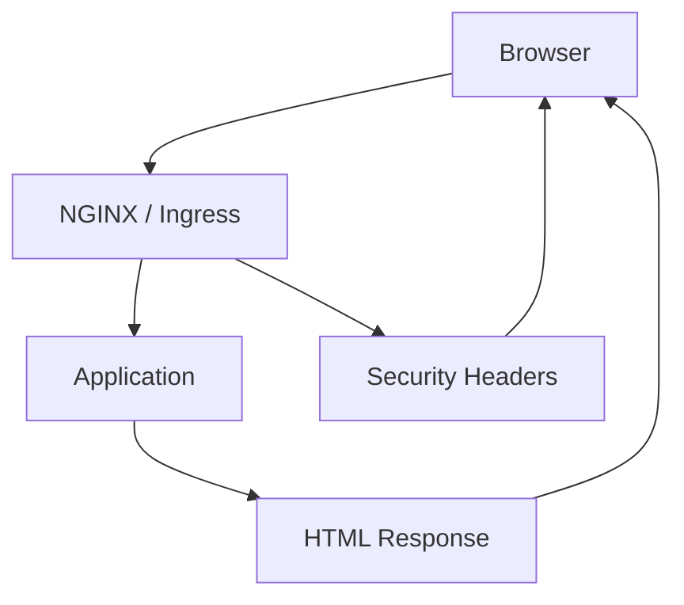
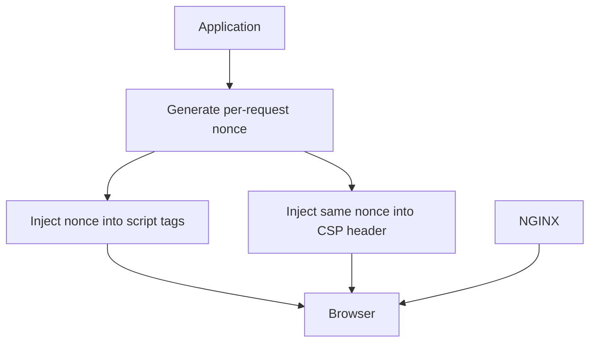

```text
nginx/
  nginx.conf
  conf.d/
    app.conf
  snippets/
    security-headers.conf
    csp-report-only.conf
    proxy-common.conf
```

---

# 1. `nginx/nginx.conf`

```nginx
user nginx;
worker_processes auto;

events {
    worker_connections 1024;
}

http {
    include       /etc/nginx/mime.types;
    default_type  application/octet-stream;

    sendfile on;
    tcp_nopush on;
    tcp_nodelay on;
    keepalive_timeout 65;
    server_tokens off;

    client_max_body_size 10m;

    # Logs
    log_format main
        '$remote_addr - $remote_user [$time_local] '
        '"$request" $status $body_bytes_sent '
        '"$http_referer" "$http_user_agent" '
        'rt=$request_time ua="$upstream_addr" us="$upstream_status" urt="$upstream_response_time"';

    access_log /var/log/nginx/access.log main;
    error_log  /var/log/nginx/error.log warn;

    # Compression
    gzip on;
    gzip_types
        text/plain
        text/css
        application/json
        application/javascript
        application/xml
        image/svg+xml;
    gzip_min_length 1024;

    include /etc/nginx/conf.d/*.conf;
}
```

---

# 2. `nginx/snippets/security-headers.conf`

This is the baseline enforced CSP plus modern security headers.

```nginx
# Content Security Policy
# Good for static/bundled apps that do not require inline JS.
add_header Content-Security-Policy "
    default-src 'none';
    script-src 'self';
    style-src 'self';
    img-src 'self' data:;
    font-src 'self';
    connect-src 'self';
    object-src 'none';
    base-uri 'none';
    frame-ancestors 'none';
    form-action 'self';
    upgrade-insecure-requests
" always;

# Additional headers
add_header X-Content-Type-Options "nosniff" always;
add_header Referrer-Policy "strict-origin-when-cross-origin" always;
add_header X-Frame-Options "DENY" always;
add_header Permissions-Policy "geolocation=(), microphone=(), camera=(), payment=()" always;

# Cross-origin isolation headers
# Keep these only if your app is compatible with them.
add_header Cross-Origin-Opener-Policy "same-origin" always;
add_header Cross-Origin-Resource-Policy "same-origin" always;
```

Notes:
- `always` is important so headers appear on error responses too.
- `X-Frame-Options` is legacy but still acceptable as defense-in-depth.
- If your app legitimately needs external APIs, fonts, or images, expand those directives carefully.

---

# 3. `nginx/snippets/csp-report-only.conf`

Use this during rollout if you want visibility before enforcing.

```nginx
add_header Content-Security-Policy-Report-Only "
    default-src 'none';
    script-src 'self';
    style-src 'self' 'unsafe-inline';
    img-src 'self' data: https:;
    font-src 'self' https:;
    connect-src 'self' https://api.example.com;
    object-src 'none';
    base-uri 'none';
    frame-ancestors 'none';
    form-action 'self';
    report-uri https://csp-report.example.com/report
" always;
```

Use this only during transition. Do not leave permissive `Report-Only` policies around forever and assume you are protected.

---

# 4. `nginx/snippets/proxy-common.conf`

Useful if you are reverse proxying an app.

```nginx
proxy_set_header Host $host;
proxy_set_header X-Real-IP $remote_addr;
proxy_set_header X-Forwarded-For $proxy_add_x_forwarded_for;
proxy_set_header X-Forwarded-Proto $scheme;
proxy_http_version 1.1;
proxy_set_header Connection "";
```

---

# 5. `nginx/conf.d/app.conf`

Here are two common patterns.

## Option A: static site / SPA

```nginx
server {
    listen 80;
    server_name app.example.com;
    return 301 https://$host$request_uri;
}

server {
    listen 443 ssl http2;
    server_name app.example.com;

    ssl_certificate     /etc/nginx/certs/fullchain.pem;
    ssl_certificate_key /etc/nginx/certs/privkey.pem;

    root /usr/share/nginx/html;
    index index.html;

    include /etc/nginx/snippets/security-headers.conf;

    # Cache immutable static assets aggressively
    location ~* \.(js|css|png|jpg|jpeg|gif|svg|ico|woff2?)$ {
        expires 30d;
        add_header Cache-Control "public, immutable";
        try_files $uri =404;
    }

    # SPA fallback
    location / {
        try_files $uri $uri/ /index.html;
    }

    # Optional CSP reporting endpoint stub
    location = /csp-report {
        access_log off;
        return 204;
    }
}
```

## Option B: reverse proxy to an app

```nginx
upstream app_backend {
    server 127.0.0.1:3000;
    keepalive 32;
}

server {
    listen 80;
    server_name app.example.com;
    return 301 https://$host$request_uri;
}

server {
    listen 443 ssl http2;
    server_name app.example.com;

    ssl_certificate     /etc/nginx/certs/fullchain.pem;
    ssl_certificate_key /etc/nginx/certs/privkey.pem;

    include /etc/nginx/snippets/security-headers.conf;

    location / {
        include /etc/nginx/snippets/proxy-common.conf;
        proxy_pass http://app_backend;
    }

    location = /csp-report {
        access_log off;
        return 204;
    }
}
```

---

# 6. If your app needs external APIs, fonts, or images

You will need to modify the CSP.

Example:

```nginx
add_header Content-Security-Policy "
    default-src 'none';
    script-src 'self';
    style-src 'self' https://fonts.googleapis.com;
    img-src 'self' data: https://images.examplecdn.com;
    font-src 'self' https://fonts.gstatic.com;
    connect-src 'self' https://api.example.com https://telemetry.example.com;
    object-src 'none';
    base-uri 'none';
    frame-ancestors 'none';
    form-action 'self';
    upgrade-insecure-requests
" always;
```

Be deliberate. Every extra origin is a trust expansion.

---

# 7. If you need nonce-based CSP

NGINX-only is not the right place to invent the nonce in most real apps.

Instead:

- application generates nonce per request
- application injects:
  - `Content-Security-Policy: script-src 'nonce-...' 'strict-dynamic'; ...`
  - matching `<script nonce="...">`

NGINX should then avoid overwriting the app’s CSP.

Example reverse-proxy pattern:

```nginx
server {
    listen 443 ssl http2;
    server_name app.example.com;

    ssl_certificate     /etc/nginx/certs/fullchain.pem;
    ssl_certificate_key /etc/nginx/certs/privkey.pem;

    # Keep generic headers here
    add_header X-Content-Type-Options "nosniff" always;
    add_header Referrer-Policy "strict-origin-when-cross-origin" always;
    add_header Permissions-Policy "geolocation=(), microphone=(), camera=(), payment=()" always;

    location / {
        include /etc/nginx/snippets/proxy-common.conf;
        proxy_pass http://app_backend;
    }
}
```

Then let the app emit something like:

```http
Content-Security-Policy:
  default-src 'none';
  script-src 'nonce-{RANDOM}' 'strict-dynamic';
  object-src 'none';
  base-uri 'none';
  frame-ancestors 'none';
  require-trusted-types-for 'script';
```

---

# 8. Kubernetes ingress-nginx equivalent

If you want the same thing in Kubernetes, here is the equivalent for a static-style CSP.

```yaml
apiVersion: networking.k8s.io/v1
kind: Ingress
metadata:
  name: app
  namespace: web
  annotations:
    nginx.ingress.kubernetes.io/configuration-snippet: |
      add_header Content-Security-Policy "default-src 'none'; script-src 'self'; style-src 'self'; img-src 'self' data:; font-src 'self'; connect-src 'self'; object-src 'none'; base-uri 'none'; frame-ancestors 'none'; form-action 'self'; upgrade-insecure-requests" always;
      add_header X-Content-Type-Options "nosniff" always;
      add_header Referrer-Policy "strict-origin-when-cross-origin" always;
      add_header Permissions-Policy "geolocation=(), microphone=(), camera=(), payment=()" always;
spec:
  ingressClassName: nginx
  rules:
    - host: app.example.com
      http:
        paths:
          - path: /
            pathType: Prefix
            backend:
              service:
                name: app
                port:
                  number: 8080
```

---

# 9. Mermaid deployment model



Nonce-aware model:



---

# 10. Practical notes for your repo README

You may want to include this guidance:

## Good for this config
- static apps
- bundled SPAs
- no inline scripts
- no third-party script dependency

## Not sufficient alone for
- apps requiring inline bootstrap scripts
- SSR frameworks needing per-request nonce
- large legacy apps with inline handlers
- apps depending on unsafe eval patterns

## If you need nonce CSP
- generate nonce in the app
- do not hardcode or reuse it
- do not generate it once at startup
- do not let caching replay it across users

---

# 11. A simple “good / bad” comparison

## Bad

```nginx
add_header Content-Security-Policy "script-src 'self' https: 'unsafe-inline' 'unsafe-eval'" always;
```

Problems:
- broad trust
- unsafe inline
- unsafe eval
- looks secure, is not

## Better

```nginx
add_header Content-Security-Policy "
    default-src 'none';
    script-src 'self';
    style-src 'self';
    img-src 'self' data:;
    object-src 'none';
    base-uri 'none';
    frame-ancestors 'none'
" always;
```

## Best for dynamic apps

App-generated nonce policy with:

```http
script-src 'nonce-{RANDOM}' 'strict-dynamic';
require-trusted-types-for 'script';
```

##
##
