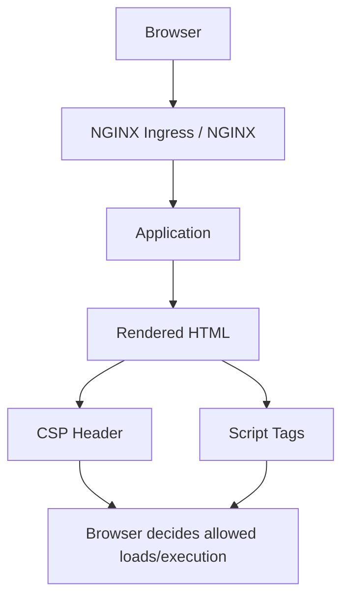
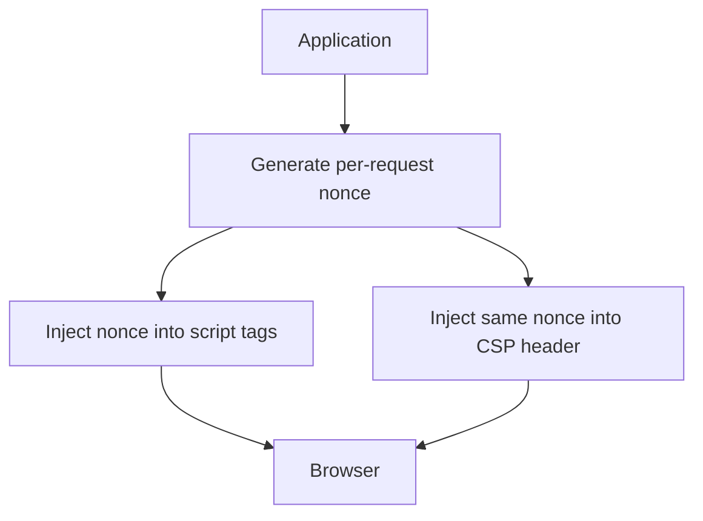

# The most important operational point up front:

```text
NGINX can set CSP headers easily.
NGINX cannot cleanly do strong per-request nonce CSP by itself unless you add app logic,
njs, Lua/OpenResty, or another dynamic templating layer.
```

So in practice, there are two major deployment models:

1. Static/header-only CSP at the edge
   - best when all scripts are external
   - often uses `'self'`, hashes, SRI, strict directives
   - good for static sites and SPAs with bundled assets

2. App-generated nonce CSP
   - best for modern SSR apps or apps with inline bootstrap scripts
   - the application generates a random nonce per request
   - NGINX forwards, preserves, or appends around it, but does not invent it

---

# 1. 2026 Recommended CSP Profiles

## 1.1 Strict static edge policy

Best for:
- static sites
- bundled SPAs
- no inline JS
- no need for nonce

```http
Content-Security-Policy:
  default-src 'none';
  script-src 'self';
  style-src 'self';
  img-src 'self' data:;
  font-src 'self';
  connect-src 'self';
  object-src 'none';
  base-uri 'none';
  frame-ancestors 'none';
  form-action 'self';
  upgrade-insecure-requests;
```

## 1.2 Modern nonce-based app policy

Best for:
- SSR apps
- React/Next/Nuxt with inline bootstraps
- server-controlled templating

```http
Content-Security-Policy:
  default-src 'none';
  script-src 'nonce-{RANDOM}' 'strict-dynamic';
  style-src 'self' 'unsafe-inline';
  img-src 'self' data: https:;
  font-src 'self' https:;
  connect-src 'self' https://api.example.com;
  object-src 'none';
  base-uri 'none';
  frame-ancestors 'none';
  form-action 'self';
  require-trusted-types-for 'script';
  report-to csp-endpoint;
```

Important:

- If you use `strict-dynamic`, host allowlists become much less central in modern browsers
- If you cannot generate a nonce in the app, don’t pretend you have a strong nonce deployment

---

# 2. NGINX Example: Static Modern CSP

This is the easiest real-world NGINX example.

```nginx
server {
    listen 443 ssl http2;
    server_name app.example.com;

    root /var/www/html;
    index index.html;

    add_header Content-Security-Policy "
        default-src 'none';
        script-src 'self';
        style-src 'self';
        img-src 'self' data:;
        font-src 'self';
        connect-src 'self';
        object-src 'none';
        base-uri 'none';
        frame-ancestors 'none';
        form-action 'self';
        upgrade-insecure-requests
    " always;

    add_header X-Content-Type-Options "nosniff" always;
    add_header Referrer-Policy "strict-origin-when-cross-origin" always;
    add_header X-Frame-Options "DENY" always;
    add_header Permissions-Policy "geolocation=(), microphone=(), camera=()" always;

    location / {
        try_files $uri $uri/ /index.html;
    }
}
```

Notes:
- `always` matters so headers are added on error responses too
- `X-Frame-Options` is legacy but still okay for defense-in-depth
- `frame-ancestors` is the modern control

---

# 3. NGINX Example: CSP Report-Only Rollout

In real deployments, this is often how you start.

```nginx
server {
    listen 443 ssl http2;
    server_name app.example.com;

    add_header Content-Security-Policy-Report-Only "
        default-src 'none';
        script-src 'self';
        style-src 'self' 'unsafe-inline';
        img-src 'self' data: https:;
        font-src 'self' https:;
        connect-src 'self' https://api.example.com;
        object-src 'none';
        base-uri 'none';
        frame-ancestors 'none';
        form-action 'self';
        report-uri https://csp-report.example.com/report
    " always;
}
```

Use this when:
- migrating legacy apps
- discovering script/style breakage
- building an allowlist before enforcing

In 2026, `report-to` is preferred where supported, but `report-uri` is still often used for compatibility.

---

# 4. NGINX Example: Reverse Proxy Fronting an App That Generates Nonces

If your app sets a nonce, let the app own the CSP.

NGINX should avoid overwriting it.

```nginx
server {
    listen 443 ssl http2;
    server_name app.example.com;

    location / {
        proxy_pass http://app_backend;
        proxy_set_header Host $host;
        proxy_set_header X-Forwarded-Proto $scheme;
        proxy_set_header X-Forwarded-For $proxy_add_x_forwarded_for;

        # Do NOT stomp the app-generated CSP unless intentional
        proxy_hide_header X-Powered-By;
    }

    add_header X-Content-Type-Options "nosniff" always;
    add_header Referrer-Policy "strict-origin-when-cross-origin" always;
    add_header Permissions-Policy "geolocation=(), microphone=(), camera=()" always;
}
```

If your application emits:

```http
Content-Security-Policy: script-src 'nonce-abc123' 'strict-dynamic'; ...
```

then NGINX should not replace it with a weaker static header.

---

# 5. Can NGINX Generate a Nonce?

Technically yes, but operationally:

- plain NGINX: awkward
- OpenResty/Lua: possible
- njs: possible
- app-generated nonce: usually better

A lot of teams get this wrong by trying to force nonce generation into the edge layer without ensuring:
- the same nonce is injected into the HTML
- the app templating uses it consistently
- caching doesn’t break it

So the 2026 guidance is:

```text
If you need nonce-based CSP, generate the nonce in the app layer that renders the document.
```

---

# 6. Kubernetes: NGINX Ingress Annotation Example

For ingress-nginx, you can inject headers using configuration snippets or custom headers.

## 6.1 Basic Ingress with CSP

```yaml
apiVersion: networking.k8s.io/v1
kind: Ingress
metadata:
  name: webapp
  namespace: app
  annotations:
    nginx.ingress.kubernetes.io/configuration-snippet: |
      add_header Content-Security-Policy "default-src 'none'; script-src 'self'; style-src 'self'; img-src 'self' data:; font-src 'self'; connect-src 'self'; object-src 'none'; base-uri 'none'; frame-ancestors 'none'; form-action 'self'; upgrade-insecure-requests" always;
      add_header X-Content-Type-Options "nosniff" always;
      add_header Referrer-Policy "strict-origin-when-cross-origin" always;
      add_header Permissions-Policy "geolocation=(), microphone=(), camera=()" always;
spec:
  ingressClassName: nginx
  rules:
    - host: app.example.com
      http:
        paths:
          - path: /
            pathType: Prefix
            backend:
              service:
                name: webapp
                port:
                  number: 8080
```

---

## 6.2 Report-Only Ingress

```yaml
apiVersion: networking.k8s.io/v1
kind: Ingress
metadata:
  name: webapp-reportonly
  namespace: app
  annotations:
    nginx.ingress.kubernetes.io/configuration-snippet: |
      add_header Content-Security-Policy-Report-Only "default-src 'none'; script-src 'self'; style-src 'self' 'unsafe-inline'; img-src 'self' data: https:; connect-src 'self' https://api.example.com; object-src 'none'; base-uri 'none'; frame-ancestors 'none'; form-action 'self'; report-uri https://csp-report.example.com/report" always;
spec:
  ingressClassName: nginx
  rules:
    - host: app.example.com
      http:
        paths:
          - path: /
            pathType: Prefix
            backend:
              service:
                name: webapp
                port:
                  number: 8080
```

---

# 7. Kubernetes: ConfigMap-Based Global Headers

If you want to centralize headers for ingress-nginx, use a ConfigMap with `add-headers`.

## 7.1 Header ConfigMap

```yaml
apiVersion: v1
kind: ConfigMap
metadata:
  name: security-headers
  namespace: ingress-nginx
data:
  Content-Security-Policy: >-
    default-src 'none';
    script-src 'self';
    style-src 'self';
    img-src 'self' data:;
    font-src 'self';
    connect-src 'self';
    object-src 'none';
    base-uri 'none';
    frame-ancestors 'none';
    form-action 'self';
    upgrade-insecure-requests
  X-Content-Type-Options: "nosniff"
  Referrer-Policy: "strict-origin-when-cross-origin"
  Permissions-Policy: "geolocation=(), microphone=(), camera=()"
```

## 7.2 Reference It from ingress-nginx controller config

```yaml
apiVersion: v1
kind: ConfigMap
metadata:
  name: ingress-nginx-controller
  namespace: ingress-nginx
data:
  add-headers: "ingress-nginx/security-headers"
```

This is useful when:
- many apps share a baseline
- you want centrally managed header policy

But be careful:
- not every app can tolerate the same CSP
- one CSP does not fit all

---

# 8. Helm Values Example for ingress-nginx

A lot of people want this directly in Helm.

```yaml
controller:
  config:
    add-headers: "ingress-nginx/security-headers"
```

And deploy the `security-headers` ConfigMap separately.

---

# 9. Gateway API Example

If you’re using Gateway API with an implementation that supports header filters, you can do something like this.

```yaml
apiVersion: gateway.networking.k8s.io/v1
kind: HTTPRoute
metadata:
  name: webapp
  namespace: app
spec:
  parentRefs:
    - name: shared-gateway
      namespace: infra
  hostnames:
    - app.example.com
  rules:
    - filters:
        - type: ResponseHeaderModifier
          responseHeaderModifier:
            add:
              - name: Content-Security-Policy
                value: "default-src 'none'; script-src 'self'; style-src 'self'; img-src 'self' data:; object-src 'none'; base-uri 'none'; frame-ancestors 'none'; form-action 'self'"
              - name: X-Content-Type-Options
                value: "nosniff"
              - name: Referrer-Policy
                value: "strict-origin-when-cross-origin"
      backendRefs:
        - name: webapp
          port: 8080
```

Support depends on your Gateway implementation.

---

# 10. Example for an App with CDN + SRI

If you must use a CDN, combine CSP and SRI.

```nginx
add_header Content-Security-Policy "
    default-src 'none';
    script-src 'self' https://cdn.example.com;
    style-src 'self' https://cdn.example.com;
    img-src 'self' data:;
    font-src 'self' https://cdn.example.com;
    connect-src 'self';
    object-src 'none';
    base-uri 'none';
    frame-ancestors 'none'
" always;
```

HTML:

```html
<script
  src="https://cdn.example.com/app-vendor.js"
  integrity="sha384-BASE64HASH"
  crossorigin="anonymous">
</script>
```

This is still weaker than nonce + `strict-dynamic`, but better than broad CDN trust with no integrity pinning.

---

# 11. Spring / Java Behind NGINX or Ingress

If your app is Spring-based, the best 2026 pattern is often:

- application generates CSP nonce
- application injects nonce into templates
- reverse proxy adds generic headers only
- reverse proxy does not replace CSP

In other words:

```text
App owns dynamic CSP
Proxy owns transport/security defaults
```

This avoids edge-layer nonce mismatches.

---

# 12. Modern Header Bundle Example

A practical 2026 edge security header bundle might be:

```nginx
add_header Content-Security-Policy "default-src 'none'; script-src 'self'; style-src 'self'; img-src 'self' data:; font-src 'self'; connect-src 'self'; object-src 'none'; base-uri 'none'; frame-ancestors 'none'; form-action 'self'; upgrade-insecure-requests" always;
add_header X-Content-Type-Options "nosniff" always;
add_header Referrer-Policy "strict-origin-when-cross-origin" always;
add_header Permissions-Policy "geolocation=(), microphone=(), camera=(), payment=()" always;
add_header Cross-Origin-Opener-Policy "same-origin" always;
add_header Cross-Origin-Resource-Policy "same-origin" always;
```

Use COEP only if you actually need cross-origin isolation and have validated resource compatibility.

---

# 13. What to Avoid in NGINX/Kube CSP Deployments

Avoid this:

```http
script-src 'self' https: 'unsafe-inline' 'unsafe-eval'
```

That is not a serious modern policy.

Avoid this:

```http
script-src https://cdnjs.cloudflare.com https://ajax.googleapis.com https://cdn.jsdelivr.net
```

unless you really understand every gadget and supply-chain risk you are accepting.

Avoid this:

- forcing one global CSP on all apps
- doing nonce CSP at the proxy without document-level control
- mixing weak legacy directives with the appearance of strong CSP

---

# 14. Rollout Strategy in Production

A realistic rollout sequence in 2026:

## Phase 1
- deploy `Content-Security-Policy-Report-Only`
- collect violations
- inventory script/style/image/connect usage

## Phase 2
- remove obvious unsafe sources
- eliminate inline script where possible
- add SRI for required third-party resources

## Phase 3
- move to nonce-based scripts if app supports it
- add Trusted Types

## Phase 4
- switch to enforced CSP
- monitor report endpoint continuously

---

# 15. Simple Mermaid for Deployment Model



For nonce apps:



---

# 16. Best-Practice Summary

If you want the shortest practical guidance:

## Static site / bundled SPA
Use:
- NGINX CSP with `script-src 'self'`
- no inline JS
- no broad CDN trust

## Dynamic app with inline bootstraps
Use:
- app-generated nonce
- `strict-dynamic`
- Trusted Types
- reverse proxy should not overwrite CSP

## Kubernetes ingress
Use:
- per-app annotation or route-level headers where possible
- avoid one-size-fits-all global CSP unless apps are standardized

---

##
##
