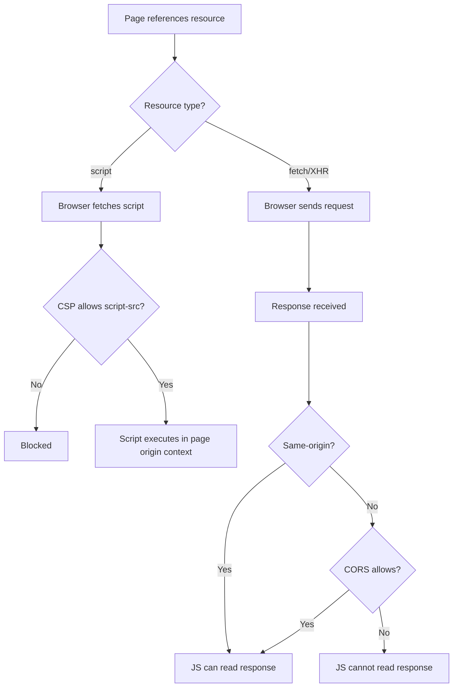
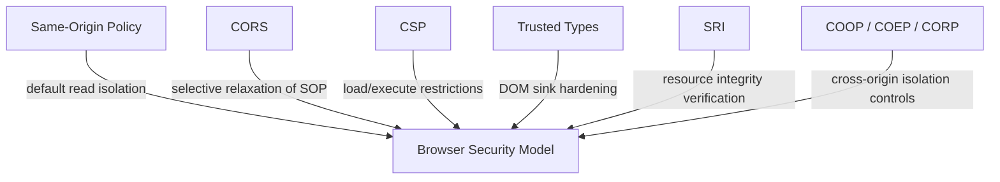
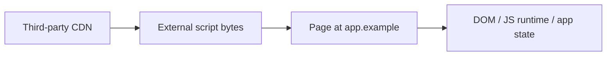

# Modern Web Security Model: SOP, CORS, CSP, Trusted Types (2026)

## Executive Summary

The most common source of confusion is this:

People assume “cross-origin” means “browser should block it.”

That is not how the web platform evolved.

The browser security model distinguishes between:

1. fetching a resource
2. executing a resource
3. reading a response
4. embedding a resource
5. authorizing a trust boundary

Those are different security decisions.

That is why:

- a script can often be loaded cross-origin
- but an XHR/fetch response may still be unreadable
- and a CSP may still block execution even if the network fetch succeeded

The clean mental model is:

```text
SOP
  controls cross-origin read / DOM access

CORS
  selectively relaxes SOP for response access

CSP
  controls what may be loaded / executed / embedded

Trusted Types
  controls dangerous DOM-to-script injection sinks

SRI
  verifies that a fetched resource matches an expected hash

COOP / COEP / CORP
  control cross-origin isolation / embedding / process boundaries
```

---

# 1. The Core Mistake People Make

Question:

“Why doesn’t Same-Origin Policy block loading external JS files from CDNs?”

Wrong assumption:

```text
cross-origin == forbidden
```

Correct model:

```text
cross-origin loadability != cross-origin readability
```

The web historically allows many cross-origin resource loads.

The main thing SOP blocks is not “load”.

It blocks “untrusted cross-origin access to protected data/state”.

---

# 2. The Browser Decision Tree

Use this as the primary mental model:

```text
A page references an external resource

Step 1: Can the browser fetch it?
  - usually yes for many resource types
  - network request goes out

Step 2: Can the page execute or embed it?
  - CSP may allow or block
  - MIME checks may apply
  - resource type matters

Step 3: Can page JavaScript read the response/body/data?
  - SOP decides by default
  - CORS may relax
```

That alone resolves a lot of confusion.

---

# 3. The Four Questions You Should Always Ask

For any browser security discussion, ask these four questions:

```text
1. Can the browser request it?
2. Can the browser render/embed/execute it?
3. Can JavaScript read the response?
4. In whose security context does it run?
```

Example: external script

```text
1. Can browser request it?          Yes
2. Can browser execute it?          Usually yes, unless CSP blocks it
3. Can JS read raw response text?   Not the relevant question here
4. In whose context does it run?    The embedding page's origin context
```

That last point is the important one.

---

# 4. Why Third-Party Scripts Are So Dangerous

When you do this:

```html
<script src="https://cdn.example.net/lib.js"></script>
```

the browser does not treat it as “remote untrusted code in a little sandbox”.

It becomes code executing inside your page’s trust boundary.

That means it inherits access to:

- your DOM
- your JS heap
- your runtime state
- your anti-CSRF tokens if exposed in DOM/JS
- your authenticated same-origin requests
- your client-side secrets
- your form flows
- your navigation logic

So the real model is:

```text
Third-party script inclusion
  =
delegated execution inside your origin trust boundary
```

This is why “we only load it from a CDN” is not a security argument.

It is a trust decision.

---

# 5. Same-Origin Policy (SOP)

## What SOP Actually Protects

SOP protects access across origins in browser context.

Two URLs are same-origin only if they match on:

- scheme
- host
- port

Example:

```text
https://app.example.com:443
```

Same-origin with:

```text
https://app.example.com
```

Not same-origin with:

```text
http://app.example.com
https://cdn.example.com
https://app.example.com:8443
```

## SOP Mainly Restricts

- cross-origin XHR/fetch response reading
- cross-origin iframe DOM access
- cross-origin localStorage/sessionStorage access
- many JS object interactions between windows/frames

## SOP Does Not Primarily Block

- `<script src=...>`
- ``
- `<link href=...>`
- many embedding/fetching behaviors

---

# 6. CORS

CORS is not a replacement for SOP.

It is not a browser hardening system in the general sense.

It is a server opt-in mechanism that says:

```text
"I allow this other origin's JS to read my response."
```

## CORS Answers This Question

```text
Can JS from origin A read the response from origin B?
```

If a server returns:

```http
Access-Control-Allow-Origin: https://app.example.com
```

then browser JavaScript from `app.example.com` may read that response.

Without that:

- the browser may still send the request
- but the page JS cannot read the body/headers as normal

## Important Distinction

```text
CORS controls response readability
CSP controls load/execute policy
SOP provides the default isolation
```

---

# 7. CSP

CSP is the browser-side allow/deny policy for what a page may load or execute.

If you want to block external JavaScript, SOP is not your control.

CSP is.

Example:

```http
Content-Security-Policy: script-src 'self'
```

This means:

- only same-origin scripts may execute
- external CDN scripts should be blocked

If you instead allow:

```http
Content-Security-Policy: script-src 'self' https://cdn.example.com
```

then you are saying:

```text
I trust this external origin to provide executable code for my page
```

That is a significant trust boundary expansion.

---

# 8. Why CSP Host Allowlists Failed

This is one of the most important lessons in CSP history.

The old pattern was:

```http
script-src 'self' https://trusted-cdn.example https://apis.example
```

This looked strict.

In practice, it often wasn’t.

Because trusted origins may expose:

- JSONP endpoints
- legacy AngularJS gadgets
- Prototype gadgets
- user-controlled script files
- path confusion
- redirects
- parser quirks
- old libraries with expression injection primitives

So the real problem with host allowlists is:

```text
You are not trusting a single script.
You are trusting an origin-sized ecosystem.
```

That is too broad.

---

# 9. Modern CSP Mental Model (2026)

The better model is:

```text
Do not broadly trust domains.
Trust specific script instances blessed by the server.
```

That is why modern CSP prefers:

- nonces
- hashes
- `strict-dynamic`

Example:

```http
Content-Security-Policy:
  script-src 'nonce-rAnd0m123' 'strict-dynamic';
  object-src 'none';
  base-uri 'none';
```

Example document:

```html
<script nonce="rAnd0m123" src="/app.js"></script>
```

Only this explicitly blessed script instance is trusted.

That is much stronger than trusting an entire CDN host.

---

# 10. `strict-dynamic`

Without `strict-dynamic`:

```text
Policy trusts source locations
```

With `strict-dynamic`:

```text
Policy trusts nonce/hash-approved scripts
and the scripts they intentionally load
```

This moves CSP toward explicit trust inheritance rather than broad source trust.

That is one of the most important shifts in modern web security.

---

# 11. Trusted Types

Trusted Types is the modern defense against DOM-based XSS in large front-end applications.

It protects dangerous sinks like:

- `innerHTML`
- `outerHTML`
- `insertAdjacentHTML`
- script URL flows
- string-to-code-adjacent DOM operations

Policy:

```http
Content-Security-Policy: require-trusted-types-for 'script'
```

This means raw strings cannot simply be passed into dangerous script-relevant DOM sinks unless they come from an approved Trusted Types policy.

## Mental Model

```text
CSP
  decides what external code may load/execute

Trusted Types
  decides whether dangerous DOM string injection paths can produce executable script behavior
```

They are complementary.

---

# 12. SRI

Subresource Integrity verifies that a fetched resource matches an expected cryptographic hash.

Example:

```html
<script
  src="https://cdn.example.com/lib.js"
  integrity="sha384-abc..."
  crossorigin="anonymous">
</script>
```

## SRI Helps Against

- CDN compromise
- modified third-party asset
- tampered mirror content

## SRI Does Not Solve

- trusting the wrong third-party script in the first place
- DOM XSS on your page
- allowing dangerous sources in CSP
- business-logic misuse of third-party JS

So:

```text
SRI = integrity control
CSP = load/execute policy control
```

---

# 13. COOP / COEP / CORP

These are not “CSP replacements”.
They solve a different class of problems.

## They Govern

- cross-origin document relationships
- embedding isolation
- process isolation
- access to high-risk browser features (e.g. SharedArrayBuffer-era isolation requirements)

Quick view:

```text
COOP
  Cross-Origin-Opener-Policy
  isolates top-level browsing context relationships

COEP
  Cross-Origin-Embedder-Policy
  requires embeddable resources to opt in appropriately

CORP
  Cross-Origin-Resource-Policy
  tells other origins whether they may embed/read this resource class
```

These matter for isolation, not basic script allowlisting.

---

# 14. Consolidated Browser Security Flow

```text
User visits page
  |
  v
HTML parsed
  |
  +--> Script tag found
  |      |
  |      +--> Browser fetches resource
  |      |
  |      +--> CSP checks whether execution is allowed
  |      |
  |      +--> If allowed, code executes in page origin context
  |
  +--> fetch()/XHR request made by JS
         |
         +--> Browser sends request
         |
         +--> Response comes back
         |
         +--> SOP decides whether page JS may read it
         |
         +--> CORS may relax SOP if server opted in
```

This is the simplest accurate model to teach.

---

# 15. Mermaid: Browser Security Control Flow



---

# 16. Mermaid: Relationship Between Controls



---

# 17. Mermaid: Why Third-Party Scripts Are Different



Interpretation:

The code originates elsewhere, but the authority boundary is your page.

---

# 18. A Better Testing Matrix

Use this when reviewing a site.

| Question | Control |
|----------|---------|
| Can the browser request it? | Browser/resource model |
| Can the browser execute/embed it? | CSP + MIME + context |
| Can JS read the response? | SOP/CORS |
| Can DOM injection become code execution? | Trusted Types + CSP |
| Can I verify the resource content is what I expected? | SRI |
| Can the page be framed/isolated/embedded safely? | frame-ancestors + COOP/COEP/CORP |

---

# 19. Strong 2026 CSP Baseline

A strong baseline often looks like:

```http
Content-Security-Policy:
  default-src 'none';
  script-src 'nonce-{RANDOM}' 'strict-dynamic';
  object-src 'none';
  base-uri 'none';
  frame-ancestors 'none';
  require-trusted-types-for 'script';
  img-src 'self' data:;
  style-src 'self' 'unsafe-inline';
  font-src 'self';
  connect-src 'self';
  report-to csp-endpoint;
```

Notes:

- `default-src 'none'` establishes deny-by-default
- `script-src` uses nonce + `strict-dynamic`
- `frame-ancestors 'none'` is the modern anti-clickjacking baseline if framing is not needed
- Trusted Types protects DOM sinks
- reporting enables operational tuning

---

# 20. Key Anti-Patterns

## Avoid These

### `unsafe-inline`
```http
script-src 'self' 'unsafe-inline'
```

### `unsafe-eval`
```http
script-src 'self' 'unsafe-eval'
```

### broad host trust
```http
script-src https://*.cdnvendor.example
```

### allowing `data:` in `script-src`
```http
script-src data:
```

### missing `base-uri`
This can enable base-tag-related abuse in some application patterns.

### missing `object-src 'none'`
Legacy plugin/object surfaces should generally be shut off.

---

# 21. Better Mental Model for Engineers

If you only remember one thing, remember this:

```text
SOP protects data access boundaries.
CORS selectively relaxes data access boundaries.
CSP controls what code/resources may load or execute.
Trusted Types controls whether dangerous DOM injection sinks can turn strings into script-relevant behavior.
```

And:

```text
Loading is not reading.
Executing is not reading.
Embedding is not reading.
```

That is the foundation.

---

# 22. Practical Attacker Questions

When attacking or reviewing CSP in 2026, ask:

1. Is trust source-based or nonce/hash-based?
2. Does the app still depend on host allowlists?
3. Are there trusted third-party gadget sources?
4. Is Trusted Types enforced?
5. Is there any inline execution path left?
6. Is `base-uri` absent?
7. Is `object-src` absent?
8. Is SRI present for third-party critical scripts?
9. Can attacker-controlled markup create script-relevant behavior?
10. Are reports monitored, or just configured?

---

# 23. Practical Defender Questions

When designing a CSP, ask:

1. Can I eliminate broad third-party script trust?
2. Can I move to nonce-based script trust?
3. Can I deploy `strict-dynamic`?
4. Can I enable Trusted Types without breaking the app?
5. Can I eliminate `unsafe-inline`?
6. Can I remove `unsafe-eval`?
7. Can I self-host critical scripts?
8. Can I enforce `frame-ancestors`?
9. Am I using reporting in report-only mode first?
10. Have I tested this in actual target browsers?

---

# 24. Consolidated Summary

The cleanest explanation is:

- SOP does not block third-party scripts from loading
- SOP blocks unauthorized cross-origin read/access behavior
- External JavaScript works because cross-origin script inclusion is part of the web platform
- Once loaded, that script executes with the including page’s privileges
- CSP is the correct control for deciding what scripts may load/execute
- Modern CSP should prefer nonces/hashes plus `strict-dynamic`
- Trusted Types is now a critical complement for DOM XSS defense
- SRI is useful for integrity, but not a substitute for good trust boundaries
- COOP/COEP/CORP handle a different isolation layer

---

# 25. Recommended Canonical Mental Model

Use this as the final short version:

```text
SOP
  protects who can read what

CORS
  allows carefully-scoped exceptions to SOP

CSP
  protects what may load or execute

Trusted Types
  protects how strings reach dangerous DOM script sinks

SRI
  protects whether the fetched bytes are the expected bytes

COOP / COEP / CORP
  protect cross-origin isolation and embedding behavior
```

##
##
