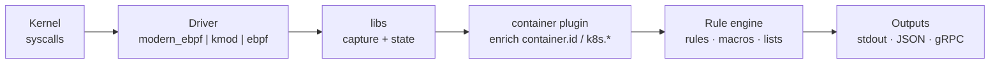

# Falco — Runtime Security Research & Reference

A consolidated home for our Falco (CNCF runtime security) notes, original research,
and reusable rule examples. Falco instruments the Linux kernel (via an eBPF or
kernel-module driver) and evaluates syscall/event streams against a rule engine to
flag anomalous behavior at runtime.

This directory pulls the topic together in one place. Older, scattered Falco notes
elsewhere in the repo are **left as-is** and cross-linked below.

## Mental model (30 seconds)



The driver taps the **whole host kernel** (any runtime, plus bare host processes);
rules scope down using enriched fields. More diagrams:
[`research/architecture-and-flows.md`](research/architecture-and-flows.md).

## Layout

```
falco/
├── research/        # our own field notes, gotchas, and reusable examples
│   ├── custom-rules-field-reliability.md   # choosing proc.name vs cmdline vs exepath (+ evasion)
│   ├── detecting-docker-socket-abuse.md     # tripwires vs behavioral detection of docker.sock abuse
│   ├── rule-testing-methodology.md          # how to PROVE a rule actually fires (not just loads)
│   ├── baseline-noise-and-tuning.md         # separating expected noise from real signal
│   ├── container-plugin-and-k8s-fields.md   # Falco 0.41+ container plugin & k8s.* enrichment deps
│   └── examples/                            # copy-pasteable, generic rule snippets
└── references/      # curated third-party/background material (organized copies)
    ├── architecture/   ebpf-internals.md
    ├── deployment/     eks.md
    ├── detection/      monitoring-new-syscalls.md, atomic-red-team.md
    ├── integrations/   github-actions-plugin.md
    ├── platforms/      podman-container-id.md
    └── tooling/        falco-json-test-runner.py, falco-rule-loader.py, README.md
```

## Start here

- **Writing rules that actually work:** [`research/custom-rules-field-reliability.md`](research/custom-rules-field-reliability.md)
  — the single most useful lesson: *field choice determines both whether your rule
  fires and how easily it's evaded.*
- **Testing rules:** [`research/rule-testing-methodology.md`](research/rule-testing-methodology.md)
  — a rule that passes schema validation is **not** proven to fire.
- **Reducing false positives:** [`research/baseline-noise-and-tuning.md`](research/baseline-noise-and-tuning.md).

## Related material elsewhere in this repo (kept in place)

- `ebpf/falco/` — eBPF-driver internals background.
- `k8/falco/` — GitHub Actions plugin rules.
- `containers/docker/falco/` — blog notes, EKS, red-team detection.
- `containers/podman/falco/` — Podman container-id caveats.

## Upstream

- Docs: <https://falco.org/docs/>
- Rules explorer: <https://thomas.labarussias.fr/falco-rules-explorer/>
- Supported fields: <https://falco.org/docs/reference/rules/supported-fields/>
