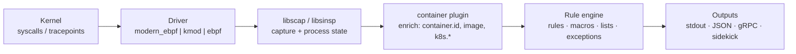
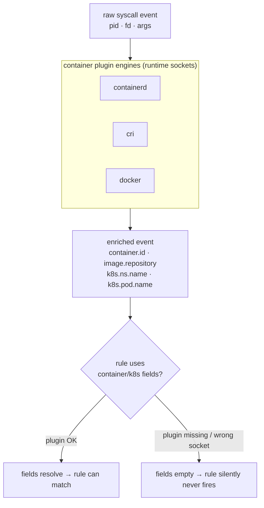
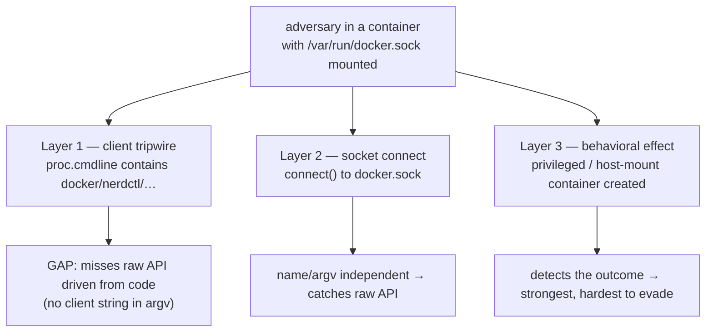
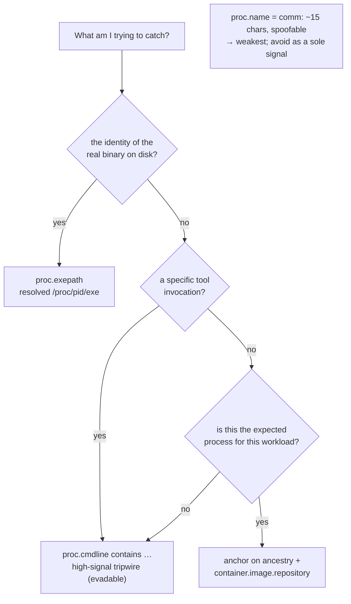
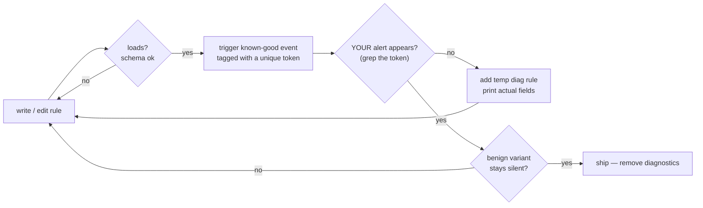
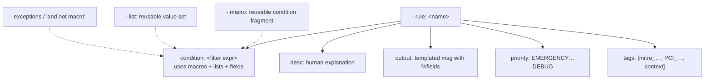

# Falco: architecture & flows (visual)

Mermaid diagrams for the mental models behind the notes in this directory. They
render on GitHub and stay diff-friendly (no binary assets).

## 1. The event pipeline (kernel → alert)

How a syscall becomes an alert. The **driver** taps the kernel; **libs** capture
and hold state; the **container plugin** enriches events with container/k8s
metadata; the **rule engine** evaluates; **outputs** ship the alert.

Key point: the driver sees the **whole host kernel**, not one runtime — so events
from any container runtime (and bare host processes) all flow through the same
probe. Scoping to a workload happens later, in the rules, using enriched fields.

## 2. Why `k8s.*` / `container.*` fields work (or silently don't)

Container/K8s fields exist only because the **container plugin** attaches them
(Falco 0.41+). Misconfigure the plugin's engine sockets and those fields go empty —
and every rule that filters on them quietly stops matching. See
[`container-plugin-and-k8s-fields.md`](container-plugin-and-k8s-fields.md).

## 3. Detecting docker.sock abuse: three layers

Each layer catches what the one before it misses. Client-name tripwires are cheap
but evadable; socket-connect is name-independent; behavioral/effect detection is
strongest. See [`detecting-docker-socket-abuse.md`](detecting-docker-socket-abuse.md).

## 4. Which process field should I match on?

Field choice decides both whether the rule fires and how easily it's evaded. See
[`custom-rules-field-reliability.md`](custom-rules-field-reliability.md).

## 5. Prove the rule fires (loading ≠ firing)

A rule can load with `schema validation: ok` and never match. Close the loop. See
[`rule-testing-methodology.md`](rule-testing-methodology.md).

## 6. Rule anatomy (quick reference)

