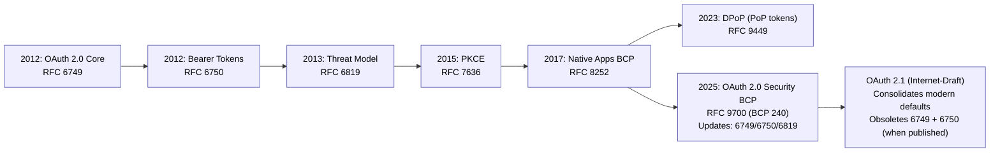
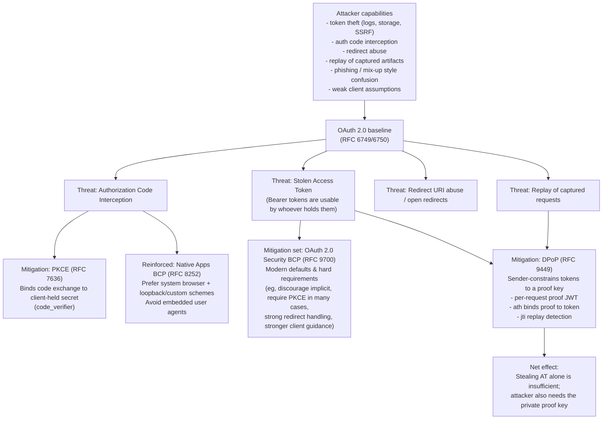

## Diagram 1: OAuth evolution timeline (RFC 6749 → BCP 9700 → OAuth 2.1 + DPoP)



Key points this timeline communicates:

* OAuth 2.0 began as **core framework + bearer token usage** (RFC 6749/6750). ([RFC Editor][1])
* The original attacker model was formalized (RFC 6819). ([IETF Datatracker][2])
* **PKCE** (RFC 7636) and **Native Apps BCP** (RFC 8252) shifted the ecosystem to safer defaults. ([RFC Editor][3])
* **DPoP** (RFC 9449) adds *sender-constraining* + replay detection for tokens at the application layer. ([IETF Datatracker][4])
* **RFC 9700** (BCP 240) is the modern “secure OAuth 2.0” playbook and explicitly **updates** older OAuth RFC guidance. ([IETF Datatracker][5])
* **OAuth 2.1** is (as of Oct 19, 2025) still an **Internet-Draft** that says it will obsolete 6749/6750 by consolidating the “modern set.” ([IETF Datatracker][6])

---

## Diagram 2: Threat model for OAuth + where DPoP mitigates

This is a “threats → controls over time” map. Paste this as-is:



DPoP’s promise in one line:

* **Bearer token theft becomes harder to exploit** because the attacker would need the *private key* to create valid proofs, and replay gets blocked by `jti` uniqueness. ([IETF Datatracker][4])

---

## Compact threat model table (evolution of mitigations)

| Threat                                   | “Classic OAuth 2.0” baseline                                                                         | Modern hardening (BCP / later RFCs)                                                                                     | What DPoP adds                                                                                                                                     |
| ---------------------------------------- | ---------------------------------------------------------------------------------------------------- | ----------------------------------------------------------------------------------------------------------------------- | -------------------------------------------------------------------------------------------------------------------------------------------------- |
| **Stolen access token (bearer replay)**  | Bearer tokens are usable by whoever possesses them (risk accepted in model). ([IETF Datatracker][7]) | RFC 9700 consolidates best-practice guidance to reduce common exposures and risky patterns. ([IETF Datatracker][5])     | **Sender-constraining**: proof must be signed by bound key; **replay detection** via `jti`; proof-token binding via `ath`. ([IETF Datatracker][4]) |
| **Authorization code interception**      | Mitigations vary by deployment; threat model described in RFC 6819. ([IETF Datatracker][2])          | **PKCE (7636)** is the standard mitigation; **Native Apps BCP (8252)** pushes safer browser patterns. ([RFC Editor][3]) | (DPoP is mainly about *token* sender-constraining; it’s complementary to PKCE rather than a replacement.) ([IETF Datatracker][4])                  |
| **Redirect URI abuse / mix-ups**         | Addressed conceptually in OAuth 2.0 + threat model literature. ([IETF Datatracker][2])               | RFC 9700 gives updated defensive guidance and requirements around common failure modes. ([IETF Datatracker][5])         | DPoP doesn’t “fix” redirect validation, but reduces blast radius if tokens leak. ([IETF Datatracker][4])                                           |
| **Replay of captured request artifacts** | Typically “don’t leak tokens,” rely on TLS; replay not strongly constrained for bearer.              | RFC 9700 strengthens operational guidance. ([IETF Datatracker][5])                                                      | **First-class replay detection** for proofs via `jti` cache + `iat` freshness window. ([IETF Datatracker][4])                                      |

---

[1]: https://www.rfc-editor.org/rfc/rfc6749.html?utm_source=chatgpt.com "RFC 6749: The OAuth 2.0 Authorization Framework"
[2]: https://datatracker.ietf.org/doc/html/rfc6819?utm_source=chatgpt.com "RFC 6819 - OAuth 2.0 Threat Model and Security ..."
[3]: https://www.rfc-editor.org/rfc/rfc7636.html?utm_source=chatgpt.com "Proof Key for Code Exchange by OAuth Public Clients"
[4]: https://datatracker.ietf.org/doc/html/rfc9449?utm_source=chatgpt.com "OAuth 2.0 Demonstrating Proof of Possession (DPoP)"
[5]: https://datatracker.ietf.org/doc/rfc9700/?utm_source=chatgpt.com "RFC 9700 - Best Current Practice for OAuth 2.0 Security"
[6]: https://datatracker.ietf.org/doc/draft-ietf-oauth-v2-1/?utm_source=chatgpt.com "The OAuth 2.1 Authorization Framework"
[7]: https://datatracker.ietf.org/doc/rfc6749/?utm_source=chatgpt.com "RFC 6749 - The OAuth 2.0 Authorization Framework"

##
##

```
Legend:
  AT   = Access Token (JWT)
  PJWT = DPoP Proof JWT (signed w/ client's private key)
  jkt  = JWK thumbprint (hash of client's public key)
  ath  = hash of the access token (binds proof to token)
  RS   = Resource Server (your Spring API)
  AS   = Authorization Server (optional in your demo; real OAuth flow)

──────────────────────────────────────────────────────────────────────────────
1) CLIENT CREATES A KEYPAIR (Proof-of-possession key)
──────────────────────────────────────────────────────────────────────────────
      ┌───────────────────────┐
      │ Client / Workload     │
      │ (pod / app / script)  │
      └───────────┬───────────┘
                  │
                  │  Generate asymmetric keypair (EC/RSA)
                  │  Keep private key secret
                  │
                  v
      ┌────────────────────────────────────────────────────────---───┐
      │ Public key is shared via JWK (goes into DPoP proof header)   │
      │ Private key never leaves the client                          │
      └──────────────────────────────────────────────────────────---─┘

──────────────────────────────────────────────────────────────────────────────
2) (OPTIONAL) CLIENT GETS AN ACCESS TOKEN THAT IS "BOUND" TO THAT KEY
   (This is where OAuth AS typically binds token -> key via cnf.jkt)
──────────────────────────────────────────────────────────────────────────────
      Client                                 AS (OAuth)
      ┌───────────────┐                      ┌──────────────────────────┐
      │ Private Key   │                      │ Authorization Server     │
      │ + Public JWK  │                      │ (issues access tokens)   │
      └───────┬───────┘                      └───────────┬──────────────┘
              │                                         │
              │  POST /token                            │
              │  DPoP: PJWT (htm=POST, htu=/token, ...)  │
              ├────────────────────────────────────────►│
              │                                         │
              │                            Validate PJWT signature
              │                            Extract public JWK
              │                            Compute jkt (thumbprint)
              │                                         │
              │  <- AT (JWT) includes: cnf: { jkt: ... } │
              │  token_type may be "DPoP"                │
              ◄──────────────────────────────────────────┤

      NOTE: In your demo, you minted AT locally with cnf.jkt to show binding.

──────────────────────────────────────────────────────────────────────────────
3) CLIENT CALLS RESOURCE SERVER WITH *BOTH* AT + DPoP PROOF
   (AT proves authorization, PJWT proves possession of the key)
──────────────────────────────────────────────────────────────────────────────
      Client (has AT + private key)                      RS (API)
      ┌──────────────────────────┐                      ┌─────────────────────┐
      │ Authorization: DPoP AT   │                      │ Resource Server     │
      │ DPoP: PJWT               │                      │ (Spring API)        │
      └───────────┬──────────────┘                      └───────────┬─────────┘
                  │                                         (1) Validate AT
                  │                                         - signature
                  │                                         - exp/iat
                  │                                         - scopes, etc.
                  │                                         - read cnf.jkt
                  │
                  │  GET /api/hello                          (2) Validate PJWT
                  │  Authorization: DPoP <AT>                - typ=dpop+jwt
                  │  DPoP: <PJWT>                            - jwk present
                  ├────────────────────────────────────────► - signature verifies
                  │                                           with jwk public key
                  │                                           - claims:
                  │                                             htm == GET
                  │                                             htu == URL
                  │                                             iat fresh
                  │                                             jti unique
                  │                                           - ath matches AT
                  │
                  │                                        (3) Bind checks
                  │                                           jkt(from PJWT jwk)
                  │                                           == cnf.jkt(in AT)
                  │
                  │                                        (4) Replay protection
                  │                                           reject reused jti
                  │
                  │  200 OK (authorized + proven) / 401       │
                  ◄───────────────────────────────────────────┘

──────────────────────────────────────────────────────────────────────────────
WHY THIS STOPS TOKEN THEFT
──────────────────────────────────────────────────────────────────────────────
Attacker steals AT only:

      Attacker                               RS
      ┌──────────────────────────┐          ┌───────────────────────────┐
      │ Authorization: DPoP AT   │          │ Needs DPoP proof signed by │
      │ (no private key!)        │          │ the key bound to cnf.jkt   │
      └───────────┬──────────────┘          └───────────┬───────────────┘
                  ├────────────────────────►            │
                  │                                     │  FAIL:
                  │                                     │  - can't sign PJWT
                  │                                     │  - ath/jkt checks fail
                  │                                     │
                  ◄────────────────────────            401 Unauthorized

Replay attacker reuses old proof (same jti):

      RS rejects because jti already seen (anti-replay cache).

──────────────────────────────────────────────────────────────────────────────
WHAT YOUR DEMO IMPLEMENTS (Spring API)
──────────────────────────────────────────────────────────────────────────────
  ✔ Accepts Authorization: DPoP <AT>
  ✔ Validates AT (HS256 in your demo)
  ✔ Validates DPoP proof:
      - typ / jwk / signature
      - htm / htu / iat / jti
      - ath == hash(AT)
  ✔ Enforces cnf.jkt == proof key jkt
  ✔ Rejects replay (jti cache)
```

Below is a **drop-in README.md extension** you can paste into your repo. It’s written to be “HTB-lab ready”: deep background, concrete examples, and lots of spec references.

---

# DPoP Demo for k3s (Spring Boot)

This project demonstrates **DPoP (Demonstrating Proof-of-Possession)**: a way to “sender-constrain” OAuth access tokens so that **a stolen token alone is not enough** to call your APIs.

DPoP is standardized in RFC 9449. ([RFC Editor][1])

## What this repo demonstrates

**Goal:** show how a Resource Server (Spring API) can require a caller to present:

1. an **Access Token (AT)** and
2. a **DPoP Proof JWT (PJWT)** that proves possession of a private key bound to that token.

In this demo:

* The **Access Token** is a JWT (HS256 for simplicity) ([IETF Datatracker][2])
* The **DPoP Proof** is a JWS signed with an ephemeral **P-256 key** (ES256) ([IETF Datatracker][3])
* The binding is performed via **`cnf.jkt`** (JWK thumbprint) ([RFC Editor][4])
* Replay is blocked via **`jti`** uniqueness (anti-replay cache) ([RFC Editor][1])

> This is intentionally “small and local” so you can lift it into an HTB kube box easily. It is not a full OAuth Authorization Server implementation.

---

## Why DPoP exists (the problem)

OAuth bearer tokens are powerful but fragile: **any party who possesses the token can use it**. That’s the essence of “bearer” semantics. ([IETF Datatracker][5])

DPoP reduces damage from token theft (logs, browser storage, env leakage, SSRF, etc.) by requiring the client to **prove possession of a private key** each time it uses the token. ([RFC Editor][1])

---

## DPoP in one screen

**Legend**

* `AT` = Access Token (JWT)
* `PJWT` = DPoP Proof JWT (signed with client private key)
* `jkt` = JWK thumbprint
* `ath` = hash of the access token (binds proof to token)
* `RS` = Resource Server (this Spring API)

```
1) Client generates keypair (private key never leaves client)
   - public key appears in DPoP proof header as a JWK

2) Access token is "bound" to the public key (cnf.jkt)
   - In real OAuth: AS issues AT containing cnf.jkt
   - In this demo: client mints AT locally for clarity

3) Request to RS includes BOTH:
   Authorization: DPoP <AT>
   DPoP: <PJWT>

4) RS validates:
   - AT is valid (signature, exp, etc.)                     [JWT/JWS]  RFC 7519/7515
   - PJWT signature matches its embedded public JWK          [JWK]      RFC 7517
   - PJWT claims: htm, htu, iat, jti, ath                    [DPoP]     RFC 9449
   - jkt(proof key) == AT.cnf.jkt                            [thumbprint] RFC 7638
   - jti is not replayed                                     [DPoP]     RFC 9449
```

DPoP spec: ([RFC Editor][1])
JWT/JWS/JWK specs: ([IETF Datatracker][2])
JWK thumbprint (RFC 7638): ([RFC Editor][4])

---

## How this demo maps to the RFC concepts

### Access Token (`AT`)

* Standard JWT format (header.payload.signature) ([IETF Datatracker][2])
* Includes a confirmation claim containing the key thumbprint:

  ```json
  {
    "sub": "htb-user",
    "exp": ...,
    "cnf": { "jkt": "<thumbprint-of-client-public-jwk>" }
  }
  ```

DPoP’s sender-constrained binding uses `cnf.jkt`. ([RFC Editor][1])

### DPoP Proof (`PJWT`)

A signed JWT (JWS) with:

* Header includes public `jwk` and `typ: dpop+jwt` ([RFC Editor][1])
* Payload includes:

  * `htm` (HTTP method)
  * `htu` (HTTP URI)
  * `iat` (issued-at)
  * `jti` (unique ID)
  * `ath` (hash of access token)
    These are core DPoP proof concepts. ([RFC Editor][1])

**URI correctness matters.** The `htu` field is a URI; exact string matching is a common “gotcha” when moving between localhost, service DNS, and ingress. ([IETF Datatracker][6])

---

## Spring Security integration notes

Spring Security Resource Server supports “bearer token” processing out of the box, but DPoP typically uses the **`Authorization: DPoP ...`** scheme for sender-constrained tokens. The demo adapts Spring by using a custom token resolver that accepts both `Bearer` and `DPoP`. (See Spring’s `BearerTokenResolver` abstraction.) ([Home][7])

---

## Repository layout

Typical files you’ll see:

* `HelloController.java` — sample protected endpoint (`/api/hello`)
* `DpopValidationFilter.java` — validates DPoP proof (and replay cache)
* `DpopCache.java` — in-memory `jti` replay cache (TTL-based)
* `SecurityConfig.java` — Spring Resource Server config + custom token resolver
* `client.py` — reference client that generates:

  * EC P-256 keypair
  * `AT` (HS256 JWT) with `cnf.jkt`
  * `PJWT` (ES256) with `ath`, `htu`, `htm`, `iat`, `jti`
* `Dockerfile` — builds the app

---

## What the Resource Server validates (checklist)

On each request to `/api/hello`, the server enforces:

### 1) Access Token validation

* signature is valid
* token is not expired (`exp`)
* subject and claims are readable

JWT fundamentals are in RFC 7519. ([IETF Datatracker][2])

### 2) Proof validation (DPoP JWT)

* `DPoP` header exists
* `typ` is correct (`dpop+jwt`)
* `jwk` exists and signature verifies
* `htm` matches request method
* `htu` matches request URL (string match)
* `iat` is recent enough (skew window)
* `ath` matches hash of the access token
* `jti` has not been seen before (replay protection)

These are DPoP proof properties and replay detection goals. ([RFC Editor][1])

### 3) Binding validation (`cnf.jkt`)

Compute thumbprint of proof’s public key JWK → compare to `AT.cnf.jkt`.
Thumbprint computation is standardized in RFC 7638. ([RFC Editor][4])

---

## Local run (Docker)

Build and run:

```bash
docker build -t dpop-demo:latest .
docker run --rm -p 8080:8080 dpop-demo:latest
```

Health:

```bash
curl -s http://127.0.0.1:8080/actuator/health
```

Run the reference client:

```bash
python3 client.py
```

Expected output:

* First call succeeds: `HTTP 200`
* Second call replays the same proof (`jti` reuse) and fails: `HTTP 401`

---

## Example HTTP request (shape)

A successful request has both headers:

```bash
curl -i http://127.0.0.1:8080/api/hello \
  -H "Authorization: DPoP <ACCESS_TOKEN>" \
  -H "DPoP: <DPOP_PROOF_JWT>"
```

---

## k3s cluster view: DPoP `htu` correctness

When you test inside the cluster, the DPoP proof must use the same `htu` you actually call.

### In-cluster Service call

If the client calls:

* `http://dpop-demo:8080/api/hello`

then `PJWT` must contain:

* `"htu": "http://dpop-demo:8080/api/hello"`

If you port-forward and call localhost, then `htu` must be localhost. This is a frequent source of “works locally / fails in k8s” confusion. URIs are defined by RFC 3986 and DPoP depends on correct URI binding. ([IETF Datatracker][6])

---

## Demo k8s manifest

A minimal Deployment + Service + Client Job is provided in `k8s-dpop-demo.yaml` (or similar), which:

* runs the API as a single replica
* runs a Job that calls `http://dpop-demo:8080/api/hello` from inside the cluster

> If you scale replicas > 1, replay caches must become **shared** (Redis, etc.) or a replay can succeed if it lands on a different pod.

---

## Security notes and limitations (important for HTB realism)

### This demo is intentionally simplified

* **HS256 access tokens** are used for clarity (real systems often validate JWTs via issuer JWKs or opaque introspection). Spring supports both JWT and opaque bearer tokens. ([Home][8])
* The DPoP key is generated per client run (ephemeral) unless you persist it.
* The anti-replay cache is in-memory. For multi-replica deployments, you’ll want a shared store.

### Threats DPoP helps with

* stolen access token from logs / cache / browser storage
* passive network capture where TLS is broken/misconfigured
* token exfil via SSRF or error reporting leakage

DPoP’s goal is sender-constraining and replay detection. ([RFC Editor][1])

### Threats DPoP does *not* automatically solve

* attacker steals BOTH token and private key (e.g., pod compromise)
* malicious client with legitimate keys (authorization still matters)
* server-side request forgery that can trigger requests *from* the legitimate client environment

---

## Troubleshooting

### “401 Malformed token”

Your `Authorization` header token isn’t a real JWT (or the server secret/issuer config doesn’t match).

### “DPoP htu mismatch”

Your client minted the proof for a different URL than you called (localhost vs service DNS vs ingress). Double-check `URL` in `client.py`.

### “Replay detected”

You reused the same proof JWT (`jti` re-used). Generate a fresh proof per request.

---

## Further reading

* **RFC 9449** — OAuth 2.0 DPoP ([RFC Editor][1])
* **RFC 6750** — OAuth 2.0 Bearer Token Usage ([IETF Datatracker][5])
* **RFC 7638** — JWK Thumbprint ([RFC Editor][4])
* **RFC 7519** — JWT ([IETF Datatracker][2])
* **RFC 7515** — JWS ([IETF Datatracker][3])
* **RFC 7517** — JWK ([IETF Datatracker][9])
* Spring Security: OAuth 2.0 Resource Server ([Home][8])
* Spring `BearerTokenResolver` API ([Home][7])
* oauth.net overview of DPoP ([oauth.net][10])

---

##
##
