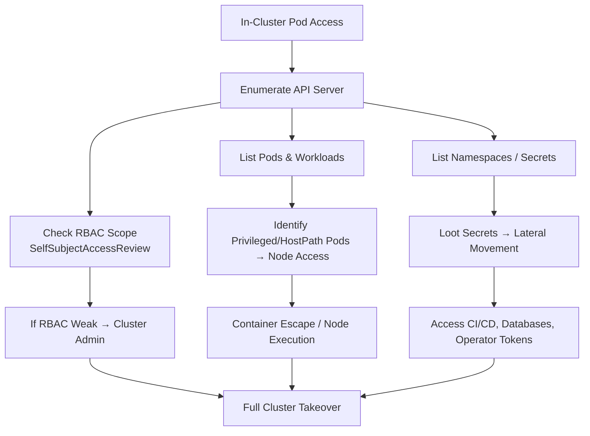
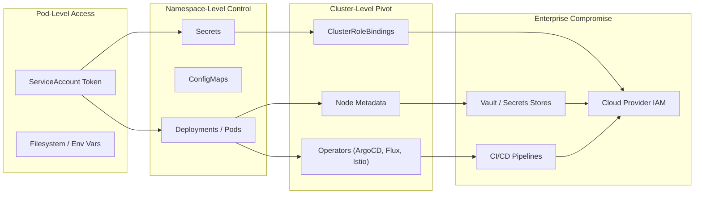

# 📄 **10_discovery.md**

### *Phase 1 — Discovery & Enumeration*

**Mi Familia Edition — Kubernetes / k3s Pentest Diary**

---

````markdown
# 10 — Discovery & Enumeration  
### Phase 1: Establish Cluster Awareness & Attack Surface  
**This phase answers the question:**  
➡️ *"What cluster am I in, what does it expose, and how much power does my token have?"*

Discovery is the **foundation of the entire pentest**, influencing:
- Secret-hunting strategy  
- RBAC abuse paths  
- Pod escape vectors  
- Operator exploitation  
- Cloud IAM pivots  
- Lateral movement routes  

This module is intentionally **exhaustive**.

---

# 🧭 1. Identify Cluster Version & Distribution

The version tells you:
- Patch level → maps to known CVEs  
- Legacy/prod-hardened distinction  
- Whether it’s K8s, k3s, EKS, GKE, AKS, etc.  
- Expected API groups and deprecations  

### API server version:
```bash
kcurl "$APISERVER/version" | jq .
````

**Things to note in output:**

* `gitVersion` → e.g., v1.23.6 (old), v1.29.x (new)
* `buildDate` → supply chain indicators
* For k3s: version includes *k3s* suffix
* For EKS: includes *eks* build tag

---

# 🔍 2. Enumerate API Groups (Critical for Mapping Attack Surface)

Every API group reveals:

* Operators installed
* Workload and RBAC structure
* Extensions (CRDs)
* Potential misconfigurations
* Vulnerable admission controllers

### List all API groups:

```bash
kcurl "$APISERVER/apis" \
  | jq -r '.groups[].name'
```

### List groups with versions:

```bash
kcurl "$APISERVER/apis" \
  | jq -r '.groups[] | "\(.name) → versions: \(.versions[].version)"'
```

### Typical groups to look for:

| API Group                   | Why It Matters                     |
| --------------------------- | ---------------------------------- |
| `rbac.authorization.k8s.io` | Role/RoleBinding/ClusterRole abuse |
| `apps`                      | Deployments, DaemonSets (privEsc)  |
| `batch`                     | CronJob exploitation               |
| `networking.k8s.io`         | NetworkPolicy bypass points        |
| `apiextensions.k8s.io`      | CRDs → operator abuse              |
| `cert-manager.io`           | PKI-driven privilege escalation    |
| `argoproj.io`               | ArgoCD takeover vectors            |
| `security.openshift.io`     | SCC privilege misconfigs           |
| `traefik.containo.us` (k3s) | Exposed ingress service            |

---

# 📁 3. Core API Surface Mapping (Namespace, Secrets, Pods, Services)

### Full core API list:

```bash
kcurl "$APISERVER/api/v1"
```

This reveals:

* `pods`
* `services`
* `secrets`
* `configmaps`
* `persistentvolumes`
* etc.

---

# 🗺️ 4. Namespace Enumeration — Primary Attack Surface Discovery

Namespaces define **logical segmentation** — but segmentation failures are common.

### List namespaces:

```bash
kcurl "$APISERVER/api/v1/namespaces" \
  | jq -r '.items[].metadata.name'
```

**High-value namespaces:**

* `kube-system`
* `default`
* `dev / staging / prod`
* `argocd`
* `istio-system`
* `cert-manager`
* `vault`
* `jenkins`

### Extract labels & annotations:

```bash
kcurl "$APISERVER/api/v1/namespaces" \
  | jq '.items[] | {name: .metadata.name, labels: .metadata.labels, annotations: .metadata.annotations}'
```

Annotations frequently leak:

* webhook URLs
* deployment pipelines
* internal identities

---

# 🔎 5. Pod Inventory Mapping

Pods reveal:

* Application architecture
* CI/CD details
* Sidecars & operators
* Privilege boundaries
* Network topology

### List pods in current namespace:

```bash
kcurl "$APISERVER/api/v1/namespaces/$NAMESPACE/pods"
```

### List pods in all namespaces:

```bash
kcurl "$APISERVER/api/v1/pods"
```

### Clean pod names only:

```bash
kcurl "$APISERVER/api/v1/pods" | jq -r '.items[].metadata.name'
```

### Detailed pod report:

```bash
kcurl "$APISERVER/api/v1/pods" \
  | jq '.items[] | {name:.metadata.name, ns:.metadata.namespace, sa:.spec.serviceAccountName, node:.spec.nodeName}'
```

These reveal **lateral movement** and **pivot points**.

---

# 🚰 6. Service Enumeration — Internal Network Reconnaissance

Services expose:

* Load balancers
* NodePorts (cluster perimeter risks)
* ClusterIP-only internal admin surfaces

### List all services:

```bash
kcurl "$APISERVER/api/v1/services"
```

### Extract service → port mappings:

```bash
kcurl "$APISERVER/api/v1/services" \
 | jq '.items[] | {svc: .metadata.name, ns: .metadata.namespace, type: .spec.type, ports: .spec.ports}'
```

### Identify NodePorts:

```bash
jq '.items[] | select(.spec.type=="NodePort")'
```

### Identify LoadBalancer services:

```bash
jq '.items[] | select(.spec.type=="LoadBalancer")'
```

LoadBalancer IPs may expose:

* dashboards
* APIs
* admin consoles

---

# 🧬 7. Deployment, StatefulSet, DaemonSet Enumeration

Workload controllers reveal:

* Privilege scope
* Deployment patterns
* Security posture
* Lateral movement opportunities

### Deployments:

```bash
kcurl "$APISERVER/apis/apps/v1/deployments"
```

### StatefulSets (databases):

```bash
kcurl "$APISERVER/apis/apps/v1/statefulsets"
```

### DaemonSets (node-wide execution):

```bash
kcurl "$APISERVER/apis/apps/v1/daemonsets"
```

DaemonSets are **critical**:

* If you can create or modify them → full node compromise across cluster.

---

# 🧩 8. CRDs (Custom Resource Definitions) — Operator Attack Surface

CRDs indicate:

* ArgoCD
* Istio
* cert-manager
* Flux
* Traefik
* Gatekeeper
* Rancher

### List CRDs:

```bash
kcurl "$APISERVER/apis/apiextensions.k8s.io/v1/customresourcedefinitions" \
  | jq -r '.items[].metadata.name'
```

### Check CRD groups by operator:

* `argoproj.io` → ArgoCD takeover
* `cert-manager.io` → PKI attacks
* `networking.istio.io` → mTLS bypass
* `projectcalico.org` → BPF-based network pivot
* `traefik.containo.us` (k3s default) → ingress abuse

Operators are some of the **highest-value targets** in modern attacks.

---

# 🛠️ 9. Nodes — Cluster Infrastructure Mapping (Low & High Signal)

Even if your token shouldn't see nodes, many clusters misconfigure RBAC.

### List nodes:

```bash
kcurl "$APISERVER/api/v1/nodes"
```

### Extract critical node info:

```bash
kcurl "$APISERVER/api/v1/nodes" \
  | jq '.items[] | {name:.metadata.name, os:.status.nodeInfo.osImage, kernel:.status.nodeInfo.kernelVersion, kubelet:.status.nodeInfo.kubeletVersion}'
```

### Why node info matters:

* Cloud provider detection
* Kernel exploit compatibility
* Access to host runtime state
* Node pool segmentation

---

# 💥 10. Events — Detection & Troubleshooting Intelligence

Events leak:

* Failed mounts
* Image pull secrets
* Node pressure conditions
* Identity propagation failures

### List recent events:

```bash
kcurl "$APISERVER/api/v1/events"
```

### Sort events by timestamp:

```bash
kcurl "$APISERVER/api/v1/events" | jq '.items | sort_by(.metadata.creationTimestamp)'
```

---

# 📜 11. Top-Level API Introspection Cheat Sheet

| What You're Checking   | Command                                                   |
| ---------------------- | --------------------------------------------------------- |
| Cluster version        | `/version`                                                |
| Namespaces             | `/api/v1/namespaces`                                      |
| Pods                   | `/api/v1/pods`                                            |
| Services               | `/api/v1/services`                                        |
| Nodes                  | `/api/v1/nodes`                                           |
| RBAC (roles, bindings) | `/apis/rbac.authorization.k8s.io/v1/...`                  |
| Operators via CRDs     | `/apis/apiextensions.k8s.io/v1/customresourcedefinitions` |
| Network policy         | `/apis/networking.k8s.io/v1/networkpolicies`              |
| Deployments            | `/apis/apps/v1/deployments`                               |
| DaemonSets             | `/apis/apps/v1/daemonsets`                                |
| Jobs / CronJobs        | `/apis/batch/v1/...`                                      |

---

# 🧩 12. Mermaid Diagram — API Surface Overview

```mermaid
flowchart TD

  %% Critical Attack Zone
  subgraph Z1["🔥 Critical Attack Surface"]
    RBAC["RBAC APIs<br/>(ClusterRole, ClusterRoleBinding)<br/>apis/rbac.authorization.k8s.io"]
    SECRETS["Secrets / Config<br/>api/v1/secrets & configmaps"]
    NODES["Node Metadata<br/>api/v1/nodes"]
    CRDS["Custom Resource Definitions<br/>apis/apiextensions.k8s.io/v1"]
  end

  %% High Value Zone
  subgraph Z2["⚡ High-Value Workloads"]
    WORKLOADS["Workloads<br/>(Deployments, DS, SS)<br/>apis/apps/v1"]
    JOBS["Jobs & CronJobs<br/>apis/batch/v1"]
    NETWORKING["Networking & Ingress<br/>apis/networking.k8s.io/v1"]
    PKI["PKI / Cert Manager<br/>apis/cert-manager.io"]
    ARGO["ArgoCD Operators<br/>apis/argoproj.io"]
  end

  %% Lower Value / Peripheral
  subgraph Z3["🧊 Operational / Peripheral APIs"]
    CORE["Core Resources<br/>api/v1"]
    EVENTS["Cluster Events<br/>api/v1/events"]
    STORAGE["Storage Classes<br/>apis/storage.k8s.io/v1"]
  end

  API["API Server"]

  API --> CORE
  API --> WORKLOADS
  API --> RBAC
  API --> NETWORKING
  API --> SECRETS
  API --> CRDS
  API --> NODES
  API --> JOBS
  API --> PKI
  API --> ARGO
  API --> EVENTS
  API --> STORAGE
```







##
##

---

# 🎯 13. Indicators That the Cluster Is Highly Exploitable

You are likely dealing with a high-risk cluster if:

* Your token can list nodes
* Secrets in non-default namespaces are readable
* Deployments list sensitive env variables
* CRDs include ArgoCD or cert-manager
* NetworkPolicies are **empty**
* HostPath pods exist
* Privileged pods exist
* Multiple NodePort services are exposed

---

# 🧡 14. Summary

This phase reveals **cluster architecture, boundaries, and immediate attack surface**.
Once discovery is complete, the next phases (RBAC, Secrets, Pods/PrivEsc) build directly on this map.

Proceed to:
➡️ **11_rbac.md** (RBAC Assessment)

```
