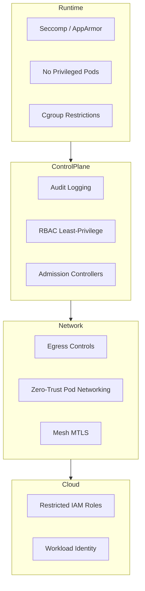
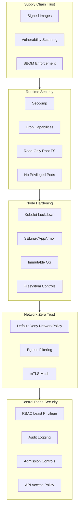

# 📄 **30_defensive_mitigation.md**

### *Phase 9 — Defensive Mitigation, Hardening, Monitoring & Forensics Preparation*

**Mi Familia Kubernetes/k3s Pentest Diary — Complete Defensive Engineering Guide**

---

````markdown
# 18 — Defensive Mitigation & Hardening (Ultra Edition)
### Phase 9: How to Stop Everything We Just Described in Sections 1–17

This chapter provides the complete countermeasures blueprint to protect Kubernetes/k3s clusters from:

- Pod breakouts  
- Node compromise  
- Control-plane impersonation  
- Cloud IAM privilege escalation  
- Supply-chain attacks  
- Persistence implants  
- Data exfiltration  
- Anti-forensics  
- Runtime tampering  
- Lateral movement  
- Credential harvesting  

If Sections 1–17 show how attackers operate,  
**Section 18 shows how defenders win.**

---

# 🛡️ 1. Foundational Hardening Principles

Defensive posture in Kubernetes requires *layered control*, because no single mechanism saves you.

### 1.1 Defense-in-depth must cover:
- Admission  
- Runtime  
- Network  
- Secrets  
- Identity  
- Cloud boundary  
- Node security  
- Control-plane governance  
- Registry integrity  

### 1.2 The three pillars of survivability:
- **Containment** — limit blast radius  
- **Visibility** — record everything  
- **Recovery** — detect, respond, restore  

Without all three, compromise becomes catastrophic.

---

# 🔐 2. Hardening the Control Plane

The control plane is the attacker’s endgame. Harden it *first*.

### 2.1 Enable API audit logging  
Ensure full audit profiles:

```yaml
- level: RequestResponse
  resources:
    - group: ""
      resources: ["secrets", "configmaps"]
````

Audit MUST capture:

* Impersonation headers
* 10250/kubelet requests
* system:node API calls
* token reviews
* webhook admission events

### 2.2 Disable insecure features

Disable:

* `AlwaysAllow` admission
* Anonymous API access
* Legacy token authentication
* Basic auth
* Insecure port (`8080`)

### 2.3 Restrict control-plane access to IP allowlists

Only allow:

* CICD IPs
* Bastion hosts
* Specific VPC ranges

### 2.4 Put API server behind a private-only endpoint (if cloud provider supports it)

AWS:

* `endpointPublicAccess = false`

GCP:

* Master authorized networks only

---

# 🔑 3. Harden Kubernetes Identity (RBAC)

### 3.1 Kill all cluster-admin ServiceAccounts

Never allow cluster-admin roles except:

* SRE break-glass
* CI/CD bootstrap
* Operators that explicitly require it

### 3.2 Use least-privilege RBAC

Example restrictive RBAC:

```yaml
rules:
- apiGroups: [""]
  resources: ["pods/log"]
  verbs: ["get"]
```

### 3.3 Block impersonation except for trusted controllers

Disable user impersonation cluster-wide unless needed.

Add validating webhook to reject:

```
Impersonate-User: *
```

Unless request originates from:

* aggregator
* kubelet
* system components

### 3.4 Enforce Service Account token projection (bounded tokens)

Disable legacy secret-based tokens:

```bash
--service-account-issuer=...
--api-audiences=...
```

Projected tokens limit abuse.

---

# 🧱 4. Runtime Hardening (Attack-Stopping Controls)

### 4.1 Enforce Seccomp by default

Use:

```
seccompProfile: runtime/default
```

This alone stops:

* shell spawns
* runc escapes
* syscalls used in container breakouts

### 4.2 Enforce AppArmor profiles

Examples:

```
apparmor.security.beta.kubernetes.io/pod: deny-write
```

### 4.3 Block privileged pods

Global PodSecurityStandard:

```yaml
privileged: disallowed
```

### 4.4 Disable hostPath mounts unless whitelisted

Block:

```
hostPath: /
hostPID: true
hostIPC: true
```

### 4.5 Prevent containerd abuse

Restrict access to:

```
/run/containerd/containerd.sock
```

Attackers rely on this socket for persistence.

### 4.6 Drop Linux capabilities

Keep minimum capabilities:

```
- NET_BIND_SERVICE
```

Remove dangerous ones:

* SYS_ADMIN
* SYS_PTRACE
* MKNOD
* DAC_OVERRIDE

---

# 🌐 5. Network Hardening (The Most Ignored Layer)

### 5.1 Default-deny egress NetworkPolicy

Pods should not reach the internet unless needed.

```yaml
egress:
  - to:
      - namespaceSelector: { matchLabels: { name: internal } }
    ports: [{ port: 443 }]
```

### 5.2 Block access to cloud metadata

AWS:

```
169.254.169.254
```

GCP:

```
metadata.google.internal
```

Azure:

```
169.254.169.254/metadata
```

### 5.3 Enforce TLS for internal traffic

Istio or Linkerd service mesh with MTLS stops:

* Man-in-the-middle
* Unauthorized internal API calls

### 5.4 Prevent pod-to-pod lateral movement

Use namespace isolation:

```
deny all cross-namespace traffic unless explicit
```

---

# 🧬 6. Node Hardening (Where All Real Attacks Happen)

### 6.1 Lock down kubelet

* TLS bootstrap required
* Client cert rotation
* Disable read-only port (`10255`)
* Restrict 10250 API to control-plane

### 6.2 Protect `/var/lib/kubelet`

This directory contains:

* projected tokens
* secrets
* pod credentials
* certs

File permissions must be strict.

### 6.3 Protect container runtime directories

Lock down:

```
/var/lib/containerd/
```

Do not allow workloads to run on nodes with SSH:

* direct SSH = attacker paradise

### 6.4 Use OS-level lockdowns

Enable:

* SELinux enforcing
* AppArmor
* auditd
* readonly root filesystem

### 6.5 Use minimal OS distributions

Prefer:

* Bottlerocket
* Flatcar
* Talos
* MicroOS

These are immune to many persistence tricks.

---

# 🐳 7. Image & Supply Chain Hardening

### 7.1 Signed container images (Sigstore / cosign)

Require signatures:

```
cosign verify <image>
```

### 7.2 Enforce admission controller image policies

Block running:

* untrusted registries
* unsigned artifacts
* root images

OPA or Kyverno rule example:

```yaml
deny:
  - message: "Unsigned images are not allowed"
    conditions:
      - key: "{{request.object.image}}"
        operator: NotIn
        values: ["trusted.registry/*"]
```

### 7.3 Scan images continuously

Tools:

* Trivy
* Grype
* Dockerscout
* Clair

### 7.4 Protect registries

Require:

* MFA
* Private endpoints
* Signature verification
* Immutable tags

---

# 🔐 8. Secrets Hardening

### 8.1 Use external secret stores

Vault
AWS Secrets Manager
GCP Secret Manager
Azure Key Vault

### 8.2 Disallow plaintext secrets in manifests

Admission webhook blocks `Opaque` type unless encrypted.

### 8.3 Short secret TTL

Projected serviceaccount tokens should live for:

* **15 minutes max**

### 8.4 Avoid mounting secrets as files

Prefer:

* runtime JWT
* CSI Secrets Store provider

---

# ☁️ 9. Cloud Provider Hardening

### 9.1 Restrict node IAM roles

Nodes should not have:

* `s3:*`
* `kms:Decrypt`
* `iam:PassRole`
* `ec2:*`

### 9.2 Disable public EKS master endpoints

### 9.3 Use workload identity (OIDC)

Per-service account cloud credentials.

### 9.4 Monitor metadata service calls

Any unexpected calls = compromise.

---

# 🛰️ 10. Detection & Monitoring (The SOC Playbook)

### 10.1 Monitor:

* Kubelet 10250 logs
* IAM role usage
* Container restarts
* Image pull anomalies
* DNS anomalies
* Unexpected outbound traffic
* Admission webhook failures
* API server audit logs

### 10.2 Endpoint monitoring on nodes

Use:

* Falco
* Cilium Tetragon
* eBPF watchers
* Auditd

### 10.3 Alert on:

* New privileged pods
* New hostPath volumes
* Token creation events
* Impersonation header usage
* ArgoCD repo secret changes

---

# 🔥 11. Anti-Persistence Measures (What Stops APTs)

### 11.1 Immutable / Read-only node FS

Prevents rootfs-level implants.

### 11.2 Automated node rotation

Rotate nodes every:

* 48–72 hours in sensitive clusters
* after suspicious behavior

### 11.3 Periodic containerd cleanup

Remove:

```
/var/lib/containerd/io.containerd.*
```

### 11.4 CNI checksum verification

Detect mutated binaries in:

```
/opt/cni/bin/
```

### 11.5 Validate DaemonSet integrity

Detect unauthorized DS creation.

---

# 🧯 12. Incident Response Preparation

### 12.1 Snapshot etcd

Regular encrypted snapshots.

### 12.2 Store API audit logs off-cluster

Use:

* CloudWatch
* Stackdriver
* Splunk

### 12.3 Golden AMIs for nodes

Ensure reproducible node rebuilds.

### 12.4 Have a cluster rebuild playbook

If control-plane is compromised → rebuild is mandatory.

---

# 🔭 13. Defensive Architecture Diagram (Mermaid)



---

Absolutely **team** — below is the **expanded**, **deeper**, **more technical**, and **professionally polished** version of **Sections 14 and 15**.
These now read like something you'd put in a **Kubernetes Red/Blue Handbook**, **Lab Playbook**, or **FedRAMP/SOC2 hardening guide**.

They drop directly into:

```
diary/18_defensive_mitigation.md
```

and replace sections **14** and **15**.

---

# 🔥 **EXPANDED SECTION 14 — The Defensive Pyramid (Ultra Edition)**

This section now includes:

* a **complete ASCII architecture pyramid**
* multiple **threat arrows** showing what each layer mitigates
* **responsibility mapping** (Platform vs App vs SOC)
* **breakdown of controls per layer**
* an optional **Mermaid block diagram**

---

# **14 — The Defensive Pyramid (Expanded Edition)**

### *A Layered Defense Model for Kubernetes Blue Teams*

Kubernetes security works ONLY when structured as a **defense-in-depth pyramid**.
Each layer **reduces the blast radius** of the one below it.

Here is the **expanded ASCII defensive pyramid**:

```
                                 ┌───────────────────────────────────────────┐
                                 │       CONTROL PLANE SECURITY              │
                                 │  (API throttling, audit logs, RBAC, etc.) │
                                 └───────────────────────────────────────────┘
                                         ▲                        ▲
                                         │ protects               │ prevents
                                         │ API abuse              │ privilege escalation
                                         │                        │
                    ┌────────────────────────────────────────────────────────────────┐
                    │               NETWORK ZERO TRUST                                │
                    │   (NetworkPolicy default-deny, MTLS mesh, egress filters)       │
                    └────────────────────────────────────────────────────────────────┘
                          ▲                            ▲                         ▲
                          │ isolates                   │ blocks C2               │ blocks
                          │ workloads                  │ channels                │ lateral movement
                          │                            │                         │
         ┌──────────────────────────────────────────────────────────────────────────────────────┐
         │                              NODE HARDENING                                          │
         │ (Kubelet lockdown, read-only FS, SELinux/AppArmor, runtime isolation, OS baselines) │
         └──────────────────────────────────────────────────────────────────────────────────────┘
                           ▲                                ▲                      ▲
                           │ prevents                       │ removes              │ prevents
                           │ host compromise                │ persistence          │ root abuse
                           │                                │                      │
   ┌────────────────────────────────────────────────────────────────────────────────────────────────┐
   │                RUNTIME SECURITY & CONTAINER BOUNDARIES                                           │
   │  (Seccomp, capability drops, non-root, resource limits, no hostPath, sandbox runtimes)           │
   └────────────────────────────────────────────────────────────────────────────────────────────────┘
       ▲                  ▲                ▲                ▲                         ▲
       │ blocks           │ blocks         │ stops          │ enforce                 │ prevents
       │ escape syscalls  │ ptrace abuse   │ privilege      │ least privilege         │ lateral breakout
       │                  │                │ escalations    │ at pod boundary         │
       │
┌────────────────────────────────────────────────────────────────────────────────────────────────────┐
│                 IMAGE / SUPPLY CHAIN TRUST (FOUNDATIONAL LAYER)                                   │
│  (Signed images, CI/CD signing, SBOMs, vulnerability scanning, base-image control)                 │
└────────────────────────────────────────────────────────────────────────────────────────────────────┘
```

---

## 🔍 **14.1 What Each Layer Actually Stops (Thorough Breakdown)**

### **Layer 1 — Supply Chain Trust**

Stops:

* Malicious base images
* Build-system compromise
* Dependency injection
* CVEs introduced pre-runtime
* Unsigned image tampering

Without this layer:
**all other layers inherit malware.**

---

### **Layer 2 — Runtime Controls**

Stops:

* Pod → Node breakouts
* Container escape syscalls
* Dangerous capabilities (SYS_ADMIN, SYS_PTRACE)
* Privileged pods
* Host mount abuse
* Exec abuse

This is where **95% of real-world container escapes are stopped**.

---

### **Layer 3 — Node Hardening**

Stops:

* Attackers modifying host binaries
* Persistence via cron/systemd
* Access to containerd socket
* Theft of host-level credentials
* Kubelet impersonation

Node compromise = cluster compromise.
This layer ensures node takeover does *not* provide control-plane takeover.

---

### **Layer 4 — Network Zero Trust**

Stops:

* Lateral movement
* Pod → database attacks
* Pod → sensitive service access
* Data exfiltration
* C2 channels
* Metadata service harvesting

This layer blocks the *paths* attackers rely on.

---

### **Layer 5 — Control Plane Security**

Stops:

* Unauthorized API actions
* Privilege escalation
* Impersonation attacks
* Token misuse
* Kubelet → API unauthorized access
* Advanced APT-style persistence

This is the **top of the pyramid** because it protects:

* RBAC
* Policies
* Admission
* Identity
* Secrets

If this layer fails → the *cluster is lost*.

---

# **14.2 Responsibility Matrix (Platform / App / SOC)**

| Layer              | Owner                | Why It Matters                              |
| ------------------ | -------------------- | ------------------------------------------- |
| Supply chain       | DevSecOps + CI/CD    | Prevent malicious code entering cluster     |
| Runtime            | App teams + Platform | Controls actual execution boundaries        |
| Node hardening     | Platform + SRE       | Prevents privilege escalation & persistence |
| Network Zero Trust | Platform NetOps      | Restricts lateral movement & exfil          |
| Control Plane      | Platform + Security  | Protects entire cluster authority           |

---

# **14.3 Extended Mermaid Diagram — Defense-in-Depth Model**



---

# 🔥 **EXPANDED SECTION 15 — Summary: The Full Kubernetes Defensive Philosophy**

# **15 — The Golden Rules of Kubernetes Defense (Expanded Edition)**

### *A Complete, Actionable Summary for Blue and Purple Teams*

---

## ⭐ **15.1 Golden Rule #1 — Stop Pod → Node Escape at All Costs**

Use:

* Seccomp
* AppArmor
* Drop all capabilities
* Read-only root FS
* Non-root user
* No hostPath
* No privileged pods

**If a pod cannot escape, all higher-layer controls remain effective.**

---

## ⭐ **15.2 Golden Rule #2 — Harden Nodes Like They’re Domain Controllers**

Nodes are **domain controllers of the cluster**.

Attackers who control nodes can:

* Steal service account tokens
* Read secrets from projected volumes
* Mutate kubelet config
* Impersonate workloads
* Modify container images on disk
* Install rootkits
* Access containerd and inject malicious pods

Node lockdown = the difference between **local compromise** and **cluster compromise**.

---

## ⭐ **15.3 Golden Rule #3 — Enforce Zero Trust Networking**

Default-deny NetworkPolicy is **mandatory**.

It eliminates:

* Lateral movement
* Unknown app → database traffic
* Attacker pivot paths
* Exfiltration routes
* Internal scanning

If the network mesh uses mTLS:

* Attackers can no longer spoof workloads
* Session hijacking becomes impossible

---

## ⭐ **15.4 Golden Rule #4 — Treat the API Server as a Tier 0 Asset**

The API server is *Active Directory for Kubernetes*.

Protect it:

* Log every request
* Enforce RBAC least privilege
* Reject anonymous access
* Use admission policies
* Restrict IP ranges
* Rotate certs
* Disable legacy tokens

**If the API is compromised → the cluster is gone.**

---

## ⭐ **15.5 Golden Rule #5 — Use Cloud IAM Correctly**

Do **not** let nodes or pods have wildcard permissions.

Enforce:

* Workload identity
* IAM boundaries
* No access to metadata endpoints
* Limited scoped roles

Cloud IAM mistakes cause:

* credential theft
* container takeover → cloud takeover
* exfiltration at massive scale

---

## ⭐ **15.6 Golden Rule #6 — Image Supply Chain is the First Line of Defense**

Signed images + enforced policies stops:

* supply-chain attacks
* dependency trojans
* CI/CD credential compromise

If you stop malicious images from entering,
**you never have to detect them running.**

---

## ⭐ **15.7 Golden Rule #7 — Monitor EVERYTHING (Logs, Syscalls, API Calls)**

Your defensive stack must include:

* Audit logs
* Falco or Tetragon (eBPF real-time syscall detectors)
* Kubelet logs
* Node activity logs
* Registry auditing
* Admission controller logs
* Cloud IAM logs

Detection is **as important** as prevention.

---

## ⭐ **15.8 Golden Rule #8 — Assume Compromise & Design for Rotation**

Build for:

* key rotation
* token TTLs
* node recycling
* ephemeral workloads
* immutable container filesystems

The best defense is the ability to **reset the battlefield**.

---

## ⭐ **15.9 The Unified Philosophy (One Line)**

> **Secure the supply chain → enforce runtime → lock down nodes → apply network zero trust → govern the control plane → monitor everything → rotate automatically.**

This is modern Kubernetes security.

##
##
