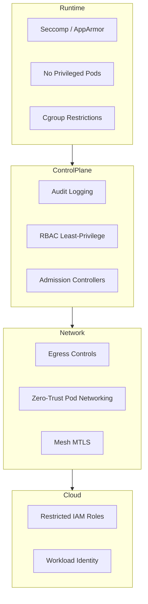

# 📄 **30_defensive_mitigation.md**

### *Phase 9 — Defensive Mitigation, Hardening, Monitoring & Forensics Preparation*

**Mi Familia Kubernetes/k3s Pentest Diary — Complete Defensive Engineering Guide**

---

````markdown
# 18 — Defensive Mitigation & Hardening (Ultra Edition)
### Phase 9: How to Stop Everything We Just Described in Sections 1–17

This chapter provides the complete countermeasures blueprint to protect Kubernetes/k3s clusters from:

- Pod breakouts  
- Node compromise  
- Control-plane impersonation  
- Cloud IAM privilege escalation  
- Supply-chain attacks  
- Persistence implants  
- Data exfiltration  
- Anti-forensics  
- Runtime tampering  
- Lateral movement  
- Credential harvesting  

If Sections 1–17 show how attackers operate,  
**Section 18 shows how defenders win.**

---

# 🛡️ 1. Foundational Hardening Principles

Defensive posture in Kubernetes requires *layered control*, because no single mechanism saves you.

### 1.1 Defense-in-depth must cover:
- Admission  
- Runtime  
- Network  
- Secrets  
- Identity  
- Cloud boundary  
- Node security  
- Control-plane governance  
- Registry integrity  

### 1.2 The three pillars of survivability:
- **Containment** — limit blast radius  
- **Visibility** — record everything  
- **Recovery** — detect, respond, restore  

Without all three, compromise becomes catastrophic.

---

# 🔐 2. Hardening the Control Plane

The control plane is the attacker’s endgame. Harden it *first*.

### 2.1 Enable API audit logging  
Ensure full audit profiles:

```yaml
- level: RequestResponse
  resources:
    - group: ""
      resources: ["secrets", "configmaps"]
````

Audit MUST capture:

* Impersonation headers
* 10250/kubelet requests
* system:node API calls
* token reviews
* webhook admission events

### 2.2 Disable insecure features

Disable:

* `AlwaysAllow` admission
* Anonymous API access
* Legacy token authentication
* Basic auth
* Insecure port (`8080`)

### 2.3 Restrict control-plane access to IP allowlists

Only allow:

* CICD IPs
* Bastion hosts
* Specific VPC ranges

### 2.4 Put API server behind a private-only endpoint (if cloud provider supports it)

AWS:

* `endpointPublicAccess = false`

GCP:

* Master authorized networks only

---

# 🔑 3. Harden Kubernetes Identity (RBAC)

### 3.1 Kill all cluster-admin ServiceAccounts

Never allow cluster-admin roles except:

* SRE break-glass
* CI/CD bootstrap
* Operators that explicitly require it

### 3.2 Use least-privilege RBAC

Example restrictive RBAC:

```yaml
rules:
- apiGroups: [""]
  resources: ["pods/log"]
  verbs: ["get"]
```

### 3.3 Block impersonation except for trusted controllers

Disable user impersonation cluster-wide unless needed.

Add validating webhook to reject:

```
Impersonate-User: *
```

Unless request originates from:

* aggregator
* kubelet
* system components

### 3.4 Enforce Service Account token projection (bounded tokens)

Disable legacy secret-based tokens:

```bash
--service-account-issuer=...
--api-audiences=...
```

Projected tokens limit abuse.

---

# 🧱 4. Runtime Hardening (Attack-Stopping Controls)

### 4.1 Enforce Seccomp by default

Use:

```
seccompProfile: runtime/default
```

This alone stops:

* shell spawns
* runc escapes
* syscalls used in container breakouts

### 4.2 Enforce AppArmor profiles

Examples:

```
apparmor.security.beta.kubernetes.io/pod: deny-write
```

### 4.3 Block privileged pods

Global PodSecurityStandard:

```yaml
privileged: disallowed
```

### 4.4 Disable hostPath mounts unless whitelisted

Block:

```
hostPath: /
hostPID: true
hostIPC: true
```

### 4.5 Prevent containerd abuse

Restrict access to:

```
/run/containerd/containerd.sock
```

Attackers rely on this socket for persistence.

### 4.6 Drop Linux capabilities

Keep minimum capabilities:

```
- NET_BIND_SERVICE
```

Remove dangerous ones:

* SYS_ADMIN
* SYS_PTRACE
* MKNOD
* DAC_OVERRIDE

---

# 🌐 5. Network Hardening (The Most Ignored Layer)

### 5.1 Default-deny egress NetworkPolicy

Pods should not reach the internet unless needed.

```yaml
egress:
  - to:
      - namespaceSelector: { matchLabels: { name: internal } }
    ports: [{ port: 443 }]
```

### 5.2 Block access to cloud metadata

AWS:

```
169.254.169.254
```

GCP:

```
metadata.google.internal
```

Azure:

```
169.254.169.254/metadata
```

### 5.3 Enforce TLS for internal traffic

Istio or Linkerd service mesh with MTLS stops:

* Man-in-the-middle
* Unauthorized internal API calls

### 5.4 Prevent pod-to-pod lateral movement

Use namespace isolation:

```
deny all cross-namespace traffic unless explicit
```

---

# 🧬 6. Node Hardening (Where All Real Attacks Happen)

### 6.1 Lock down kubelet

* TLS bootstrap required
* Client cert rotation
* Disable read-only port (`10255`)
* Restrict 10250 API to control-plane

### 6.2 Protect `/var/lib/kubelet`

This directory contains:

* projected tokens
* secrets
* pod credentials
* certs

File permissions must be strict.

### 6.3 Protect container runtime directories

Lock down:

```
/var/lib/containerd/
```

Do not allow workloads to run on nodes with SSH:

* direct SSH = attacker paradise

### 6.4 Use OS-level lockdowns

Enable:

* SELinux enforcing
* AppArmor
* auditd
* readonly root filesystem

### 6.5 Use minimal OS distributions

Prefer:

* Bottlerocket
* Flatcar
* Talos
* MicroOS

These are immune to many persistence tricks.

---

# 🐳 7. Image & Supply Chain Hardening

### 7.1 Signed container images (Sigstore / cosign)

Require signatures:

```
cosign verify <image>
```

### 7.2 Enforce admission controller image policies

Block running:

* untrusted registries
* unsigned artifacts
* root images

OPA or Kyverno rule example:

```yaml
deny:
  - message: "Unsigned images are not allowed"
    conditions:
      - key: "{{request.object.image}}"
        operator: NotIn
        values: ["trusted.registry/*"]
```

### 7.3 Scan images continuously

Tools:

* Trivy
* Grype
* Dockerscout
* Clair

### 7.4 Protect registries

Require:

* MFA
* Private endpoints
* Signature verification
* Immutable tags

---

# 🔐 8. Secrets Hardening

### 8.1 Use external secret stores

Vault
AWS Secrets Manager
GCP Secret Manager
Azure Key Vault

### 8.2 Disallow plaintext secrets in manifests

Admission webhook blocks `Opaque` type unless encrypted.

### 8.3 Short secret TTL

Projected serviceaccount tokens should live for:

* **15 minutes max**

### 8.4 Avoid mounting secrets as files

Prefer:

* runtime JWT
* CSI Secrets Store provider

---

# ☁️ 9. Cloud Provider Hardening

### 9.1 Restrict node IAM roles

Nodes should not have:

* `s3:*`
* `kms:Decrypt`
* `iam:PassRole`
* `ec2:*`

### 9.2 Disable public EKS master endpoints

### 9.3 Use workload identity (OIDC)

Per-service account cloud credentials.

### 9.4 Monitor metadata service calls

Any unexpected calls = compromise.

---

# 🛰️ 10. Detection & Monitoring (The SOC Playbook)

### 10.1 Monitor:

* Kubelet 10250 logs
* IAM role usage
* Container restarts
* Image pull anomalies
* DNS anomalies
* Unexpected outbound traffic
* Admission webhook failures
* API server audit logs

### 10.2 Endpoint monitoring on nodes

Use:

* Falco
* Cilium Tetragon
* eBPF watchers
* Auditd

### 10.3 Alert on:

* New privileged pods
* New hostPath volumes
* Token creation events
* Impersonation header usage
* ArgoCD repo secret changes

---

# 🔥 11. Anti-Persistence Measures (What Stops APTs)

### 11.1 Immutable / Read-only node FS

Prevents rootfs-level implants.

### 11.2 Automated node rotation

Rotate nodes every:

* 48–72 hours in sensitive clusters
* after suspicious behavior

### 11.3 Periodic containerd cleanup

Remove:

```
/var/lib/containerd/io.containerd.*
```

### 11.4 CNI checksum verification

Detect mutated binaries in:

```
/opt/cni/bin/
```

### 11.5 Validate DaemonSet integrity

Detect unauthorized DS creation.

---

# 🧯 12. Incident Response Preparation

### 12.1 Snapshot etcd

Regular encrypted snapshots.

### 12.2 Store API audit logs off-cluster

Use:

* CloudWatch
* Stackdriver
* Splunk

### 12.3 Golden AMIs for nodes

Ensure reproducible node rebuilds.

### 12.4 Have a cluster rebuild playbook

If control-plane is compromised → rebuild is mandatory.

---

# 🔭 13. Defensive Architecture Diagram (Mermaid)



---

# 🧱 14. The Defensive Pyramid (ASCII)

```
               [Full Control Plane Security]
                     /               \
                [Network Zero Trust]  [Node Hardening]
                  /          \             /      \
       [RBAC Least Priv]   [Egress]   [Seccomp]  [Runtime Isolation]
                  \          |           |         /
                   \         |           |        /
                    +------[Monitoring & IR]-----+
```

---

# 🎯 15. Summary — How to Actually Secure Kubernetes

To defeat the attack chains in Sections 1–17:

✔ Deny pod → node escape with seccomp & AppArmor
✔ Deny node → control-plane with kubelet lockdown
✔ Deny pod → cloud IAM with metadata protection
✔ Deny node → persistence with immutable OS
✔ Deny lateral movement with zero-trust networking
✔ Deny supply-chain attacks with signed images
✔ Deny exfiltration with egress restrictions
✔ Detect everything with audit logs + eBPF

##
##
