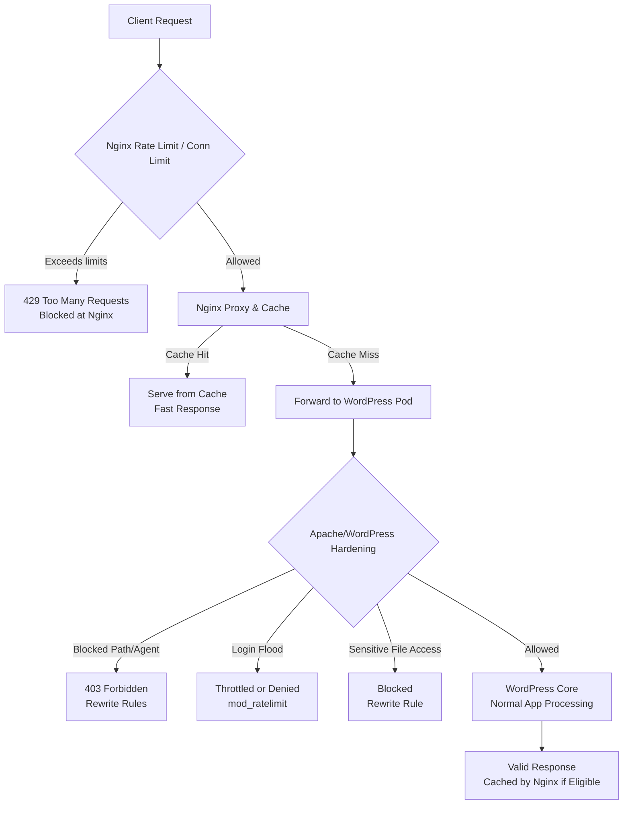

# 🛡️ WordPress Reverse Proxy Defense with Nginx + Apache Hardening  ..beta..

This document explains the layered defense system we deployed for WordPress in Kubernetes. It combines **Nginx reverse proxy protections** (rate-limiting, caching, connection caps) with **Apache hardening rules** inside the WordPress pod. Together, they form a two-stage firewall that stops attackers early and protects the application under load.

---

## 1. Nginx Reverse Proxy (Kubernetes Deployment)

We run Nginx as a **sidecar reverse proxy** in front of WordPress. It enforces **per-client request limits** and adds caching to reduce load on WordPress.

```yaml
---
apiVersion: v1
kind: ConfigMap
metadata:
  name: wp-nginx-config
  namespace: default
data:
  nginx.conf: |
    worker_processes auto;
    worker_rlimit_nofile 65535;

    events {
      worker_connections 16384;
      multi_accept on;
    }

    http {
      # Logging to stdout/stderr for kubectl logs
      log_format main '$remote_addr - $status "$request" rt=$request_time upstream=$upstream_status';
      access_log /dev/stdout main;
      error_log /dev/stderr warn;

      # Preserve client IPs
      real_ip_header X-Forwarded-For;
      set_real_ip_from 0.0.0.0/0;
      real_ip_recursive on;

      # Per-IP rate & connection limits
      limit_req_zone $binary_remote_addr zone=perip:20m rate=10r/s;
      limit_conn_zone $binary_remote_addr zone=connlimit:20m;

      # Cache
      proxy_cache_path /var/cache/nginx levels=1:2 keys_zone=wp_cache:20m inactive=30m max_size=200m;

      upstream wordpress_upstream {
        server beta-vino-wp-wordpress.default.svc.cluster.local:80;
        keepalive 32;
      }

      server {
        listen 80;

        location / {
          # Limits
          limit_req zone=perip burst=7 delay=3;
          limit_req_status 429;
          limit_conn connlimit 20;
          limit_conn_status 429;

          proxy_pass http://wordpress_upstream;
          proxy_set_header Host $host;
          proxy_set_header X-Real-IP $remote_addr;
          proxy_set_header X-Forwarded-For $proxy_add_x_forwarded_for;

          proxy_http_version 1.1;
          proxy_set_header Connection "";

          proxy_buffering on;
          proxy_buffers 16 16k;
          proxy_busy_buffers_size 64k;
          proxy_max_temp_file_size 0;

          proxy_cache wp_cache;
          proxy_cache_valid 200 10s;
          proxy_cache_use_stale error timeout updating http_500 http_502 http_503 http_504;
        }

        # Static assets cached longer
        location ~* \.(jpg|jpeg|png|gif|css|js|ico|webp|woff2?)$ {
          proxy_pass http://wordpress_upstream;
          proxy_cache wp_cache;
          proxy_cache_valid 200 1h;
          proxy_ignore_headers Cache-Control Expires;
        }
      }
    }
---
apiVersion: apps/v1
kind: Deployment
metadata:
  name: wp-nginx
  namespace: default
spec:
  replicas: 1
  selector:
    matchLabels:
      app: wp-nginx
  template:
    metadata:
      labels:
        app: wp-nginx
    spec:
      containers:
      - name: nginx
        image: nginx:stable
        ports:
        - containerPort: 80
        volumeMounts:
        - name: nginx-config
          mountPath: /etc/nginx/nginx.conf
          subPath: nginx.conf
        - name: nginx-cache
          mountPath: /var/cache/nginx
      volumes:
      - name: nginx-config
        configMap:
          name: wp-nginx-config
      - name: nginx-cache
        emptyDir: {}
---
apiVersion: v1
kind: Service
metadata:
  name: wp-nginx-service
  namespace: default
spec:
  type: LoadBalancer
  externalTrafficPolicy: Local   # preserve client IPs
  selector:
    app: wp-nginx
  ports:
  - name: http
    port: 80
    targetPort: 80
```

---

## 2. Apache + WordPress Hardening (Helm `values.yaml`)

Inside the WordPress pod, Apache is hardened to reject fuzzers, block dangerous endpoints, and throttle brute force attempts.

```yaml
apacheConfiguration: |
  ServerRoot "/opt/bitnami/apache"
  Listen 8080

  # Load Core + Proxy + PHP modules
  LoadModule mpm_prefork_module modules/mod_mpm_prefork.so
  LoadModule proxy_module modules/mod_proxy.so
  LoadModule proxy_http_module modules/mod_proxy_http.so
  LoadModule php_module modules/libphp.so
  LoadModule ratelimit_module modules/mod_ratelimit.so
  LoadModule reqtimeout_module modules/mod_reqtimeout.so
  LoadModule rewrite_module modules/mod_rewrite.so

  DocumentRoot "/opt/bitnami/apache/htdocs"
  <Directory "/opt/bitnami/apache/htdocs">
    Options Indexes FollowSymLinks
    AllowOverride None
    Require all granted
  </Directory>

  # Logging
  ErrorLog "/proc/self/fd/2"
  CustomLog "/proc/self/fd/1" common

  ######################################################################
  # Protections
  ######################################################################

  # Slowloris protection
  <IfModule reqtimeout_module>
    RequestReadTimeout header=5-10,MinRate=1500 body=10,MinRate=1500
  </IfModule>

  # Block scanners/fuzzers
  <IfModule rewrite_module>
    RewriteEngine On
    RewriteCond %{HTTP_USER_AGENT} (ffuf|gobuster|sqlmap|wpscan|nmap) [NC]
    RewriteRule .* - [F,L]
    RewriteRule ^(wp-config\.php|\.git|\.env) - [F,L]
  </IfModule>

  # Throttle login
  <IfModule ratelimit_module>
    <Location "/wp-login.php">
      SetOutputFilter RATE_LIMIT
      SetEnv rate-limit 50
    </Location>
    <Location "/xmlrpc.php">
      Require all denied
    </Location>
  </IfModule>

  # Block plugin/theme enumeration
  <IfModule rewrite_module>
    RewriteCond %{REQUEST_URI} ^/wp-content/plugins/ [NC]
    RewriteRule .* - [F,L]
    RewriteCond %{REQUEST_URI} ^/wp-content/themes/ [NC]
    RewriteRule .* - [F,L]
    RewriteRule ^wp-content/.*/readme\.txt$ - [F,L]
  </IfModule>

  # Block cron, installer, feeds
  <Location "/wp-cron.php">Require all denied</Location>
  <Location "/wp-admin/install.php">Require all denied</Location>
  <Location "/feed/">Require all denied</Location>
```

---

## 3. Traffic Flow

Here’s how requests are processed through **two layers of defense**:



---

## 4. Monitoring & Logs

* **Nginx logs**:

  ```bash
  kubectl logs -n default deploy/wp-nginx -f
  ```

  Shows per-request logs, rate-limiting rejections (`429`), and upstream timing.

* **Apache logs** (inside WordPress pod):

  ```bash
  kubectl logs -n default deploy/beta-vino-wp-wordpress -f
  ```

  Shows blocked fuzzers, denied endpoints, and normal traffic.

---

## 5. Operational Notes

* **Apply changes**:

  ```bash
  kubectl apply -f patched.yaml
  kubectl rollout restart deployment/wp-nginx -n default
  kubectl rollout status deployment/wp-nginx -n default
  ```

* **CTF attack simulation**:

  * Run `ab` or `feroxbuster` → attacker IP will hit 429s.
  * Other clients remain responsive (cache + limits).

* **Defense layers**:

  * **Edge (Nginx)** stops floods early.
  * **Inner (Apache)** rejects clever scans.
  * **WordPress** is only reached by sanitized traffic.

---

✅ With this design, **attackers are throttled/blocked without degrading the experience for other users**.
⚡ Nginx absorbs bursts and caches responses; Apache provides deep app-level filtering.


##
##


