# MCP Security Architecture v2

> **Owner:** Platform Security · **Updated:** 2026-05-30 · **Status:** Living Doc

---

## Full Request Flow

```mermaid
flowchart TD
    Internet(["🌐 Public Internet"])

    subgraph L0["L0 · Edge"]
        Okta["Okta OIDC Auth"]
        WAF["WAF + DDoS"]
        RL["Rate Limiting"]
    end

    subgraph L1["L1 · Gateway COP"]
        SC["MCP-18 Session Control\nChatID ↔ User binding"]
        OPA["MCP-01 OPA Policy Engine\n+ LLM Intent Classifier"]
        TX["MCP-02 Token Exchange\nUser JWT → Scoped Agent Token"]
        DC["MCP-NEW Delegation Chain\nRFC 8693 · max depth 4\nscope narrows per hop"]
        TR["MCP-03 Tool Registry\nVerification"]
    end

    subgraph L2["L2 · Identity COP · SPIFFE/SPIRE"]
        mTLS["MCP-10 mTLS Tunnel"]
        SVID["MCP-05 SVID Validation\nNo SVID = hard reject"]
        CTB["MCP-07 Cross-Team Block\nSRE cert ≠ Security cert"]
    end

    subgraph L3["L3 · Network COP · Istio"]
        S2S["MCP-07 Gateway → MCP only\nNo lateral movement"]
        NS["Namespace Isolation"]
        EB["Egress Block\nMCP pods cannot call back to agents"]
    end

    subgraph L4["L4 · Workload COP · K8s"]
        PSA["MCP-09 Pod Security Admission\nnon-root · read-only FS"]
        IMG["MCP-06 Signed Images\nCosign / Notary"]
        SLSA["MCP-NEW SLSA L3 Provenance\n+ SBOM CVE scan at admission"]
        RQ["MCP-14 Resource Quotas\nCPU/mem hard limits"]
    end

    subgraph L5["L5 · Cloud IAM · IRSA"]
        IRSA["OIDC Role Assumption\nK8s SA Token → short-lived IAM Token"]
        IAM["Least-Privilege IAM\nmcp-github-role · no wildcard"]
        VAULT["MCP-NEW Vault Secretless\nno env vars · ephemeral · rotated"]
    end

    subgraph L6["L6 · Tool COP · MCP Connector"]
        AUD["MCP-02 Audience Check\nToken for Tool A rejected by Tool B"]
        IS["MCP-15 Identity Scope\nIRSA acts as user not app SA"]
        PII["MCP-04 PII/Secret Masking\nLogs scrubbed before write"]
        SSRF["MCP-08 SSRF Block\n169.254.169.254 + internal FQDN"]
        SC2["MCP-NEW JSON Schema Contracts\nTool response validated · mismatch = reject"]
    end

    subgraph L65["L6.5 · Behavioral COP · NEW ⭐"]
        UEBA["UEBA Baseline per agent_id\nUnusual sequences · off-hours · volume spikes"]
        SIEM["OpenTelemetry → SIEM\nSplunk / Panther"]
        AQ["Auto-Quarantine\nAnomaly → suspend agent_id + revoke SVID"]
    end

    subgraph L7["L7 · Data & Memory COP"]
        CT["MCP-11 Cross-Tenant Isolation\nfilter: { team, session_id }"]
        ABE["MCP-NEW Attribute-Based Encryption\nVectors encrypted · team-scoped keys\ncross-tenant = cryptographically impossible"]
        EPD["MCP-NEW Embedding Poisoning Detection"]
        TTL["MCP-NEW Context TTL · 7-day auto-purge"]
        EAR["AES-256 Encryption at Rest"]
        WORM["Immutable Audit Trail\nWORM / CloudTrail"]
    end

    subgraph L8["L8 · Egress COP"]
        FQDN["MCP-08 FQDN Allow-list\n*.github.com · *.slack.com only"]
        MIB["MCP-08 Metadata IP Block\n169.254.169.254 hard-blocked"]
        DLP["DLP Inspection\nPII · secrets · credential patterns"]
    end

    Backends(["✅ GitHub · Slack · AWS Bedrock"])

    %% Happy path flow
    Internet --> L0
    L0 --> |"① User JWT"| L1
    L1 --> |"② Scoped Agent Token\n+ SPIFFE SVID"| L2
    L2 --> |"③ Verified Identity\n+ Scoped Token"| L3
    L3 --> |"④ Authorized Exec Command"| L4
    L4 --> |"⑤ IRSA Handshake"| L5
    L5 --> |"⑥ Tool Execution"| L6
    L6 --> |"⑦ Telemetry"| L65
    L65 --> |"⑧ Verified Output"| L7
    L7 --> |"⑨ Approved Egress"| L8
    L8 --> Backends

    %% Rejection paths
    OPA -->|"Low confidence\nIntent unclear"| HITL(["🛑 HITL Approval\nSlack / Email\n15 min timeout"])
    L6 -->|"Write or Admin action"| HITL
    AQ -->|"Anomaly confirmed"| REVOKE(["🚫 SVID Revoked\nAgent Suspended"])

    %% Multi-agent delegation
    DC -->|"Sub-agent call\nnarrower token minted"| DC

    %% Styling
    classDef newControl fill:#1a472a,stroke:#2d6a4f,color:#fff
    classDef rejectNode fill:#7f1d1d,stroke:#991b1b,color:#fff
    classDef backend fill:#1e3a5f,stroke:#2563eb,color:#fff
    classDef internet fill:#3b1f00,stroke:#92400e,color:#fff

    class VAULT,DC,SLSA,SC2,UEBA,SIEM,AQ,ABE,EPD,TTL newControl
    class HITL,REVOKE rejectNode
    class Backends backend
    class Internet internet
```



---

## Layer Reference

### L0 · Edge
| Control | Detail |
|---|---|
| Okta OIDC | All requests require valid Okta JWT |
| WAF + DDoS | L7 rule filtering + volumetric absorption |
| Rate Limiting | Edge-level request throttle |

---

### L1 · Gateway COP
| Control | Tag | Detail |
|---|---|---|
| Session Control | MCP-18 | ChatID ↔ User binding |
| Guardrails | MCP-01 | OPA policy engine + LLM intent classifier; low confidence → HITL |
| Token Exchange | MCP-02 | User JWT → short-lived scoped Agent Token |
| Delegation Chain | MCP-NEW | RFC 8693; `delegation_chain` claim; scope narrows per hop; max depth = 4 |
| Tool Registry | MCP-03 | Tool must exist and be trusted before dispatch |

> **Delegation model:** `User → Orchestrator → Sub-Agent → Tool`
> Each hop calls RFC 8693 exchange. Resulting token has equal or lesser scope. Depth > 4 = hard reject.

---

### L2 · Identity COP — SPIFFE/SPIRE
| Control | Tag | Detail |
|---|---|---|
| mTLS | MCP-10 | All peer comms encrypted |
| SVID Validation | MCP-05 | No valid SPIFFE SVID = rejected |
| Cross-Team Block | MCP-07 | Certs are namespace-exclusive; SRE ≠ Security |

---

### L3 · Network COP — Istio
| Control | Detail |
|---|---|
| Service Topology | `Gateway → MCP Server` only; no lateral movement |
| Namespace Isolation | SRE namespace cannot reach Security namespace |
| Egress Block | MCP pods cannot initiate connections back to agent pods |

---

### L4 · Workload COP — Kubernetes
| Control | Tag | Detail |
|---|---|---|
| Pod Security | MCP-09 | Non-root, restricted, read-only FS |
| Image Signing | MCP-06 | Cosign / Notary; unsigned = rejected at admission |
| SLSA L3 + SBOM | MCP-NEW | Provenance attestation required; SBOM scanned against CVE feeds at admission |
| Resource Quotas | MCP-14 | Hard CPU/mem limits per pod |

---

### L5 · Cloud IAM — IRSA
| Control | Detail |
|---|---|
| OIDC Role Assumption | K8s SA Token → short-lived AWS IAM Token |
| Least-Privilege IAM | `mcp-github-role`; no S3, no admin, no wildcard; scoped to `org-thousandeyes/*` |
| Vault Secretless | Secrets injected ephemerally via Vault Agent / CSI driver; never in env vars; rotated each pod restart |

---

### L6 · Tool COP — MCP Connector
| Control | Tag | Detail |
|---|---|---|
| Audience Check | MCP-02 | Tool B rejects tokens minted for Tool A |
| Identity Scope | MCP-15 | IRSA acts as user, not app service account |
| PII Masking | MCP-04 | Secrets, tokens, PII scrubbed from logs before write |
| SSRF Block | MCP-08 | `169.254.169.254` + unresolvable internal FQDNs blocked |
| Output Contracts | MCP-NEW | JSON Schema per tool; non-conforming response = hard reject; kills secondary prompt injection via unexpected fields |

---

### L6.5 · Behavioral COP ⭐ NEW
| Control | Detail |
|---|---|
| UEBA Baseline | Per `agent_id` normal pattern profiling |
| Anomaly Triggers | Unusual tool sequences · off-hours · READ spike before DELETE · delegation depth approaching max |
| SIEM Stream | OpenTelemetry → Splunk / Panther in real time |
| Auto-Quarantine | Anomaly confirmed → `agent_id` suspended + SVID revoked |

---

### L7 · Data & Memory COP
| Control | Tag | Detail |
|---|---|---|
| Cross-Tenant Isolation | MCP-11 | Hard filter `{ team, session_id }` on all vector queries |
| ABE on Vectors | MCP-NEW | Embeddings encrypted with team-scoped keys; cross-tenant access cryptographically impossible regardless of query |
| Poisoning Detection | MCP-NEW | Anomalous vector injection patterns flagged |
| Context TTL | MCP-NEW | Session memory auto-purged at 7 days |
| Encryption at Rest | — | AES-256 on all vectors and context blobs |
| Audit Trail | — | Append-only WORM / CloudTrail |

> **Why ABE over filter-only:** A query-time filter on plaintext embeddings fails if the DB is breached or the filter is bypassed. ABE makes the ciphertext itself unreadable without the correct team key. The encryption *is* the access control.

---

### L8 · Egress COP
| Control | Tag | Detail |
|---|---|---|
| FQDN Allow-list | MCP-08 | `*.github.com`, `*.slack.com` only; all else denied |
| Metadata IP Block | MCP-08 | `169.254.169.254` hard-blocked at network policy |
| DLP Inspection | — | Egress scanned for PII, secrets, credential patterns |

---

## Triple-Lock Model

```
┌─────────────────────────────────────────────────────────────┐
│  To impersonate an agent, an attacker must simultaneously:  │
│                                                             │
│  🔒 LOCK 1 · TOKEN    Steal active Okta session             │
│                    +  Compromise Gateway signing key        │
│                    +  Forge valid RFC 8693 delegation chain │
│                                                             │
│  🔒 LOCK 2 · POD      Obtain valid SPIFFE SVID              │
│                    +  Breach EKS node cert storage          │
│                                                             │
│  🔒 LOCK 3 · NETWORK  Bypass Istio AuthorizationPolicy      │
│                    +  Evade UEBA anomaly detection          │
└─────────────────────────────────────────────────────────────┘
```

---

## Advanced Controls

### 🛑 Human-in-the-Loop (HITL)
- **Triggers:** Any `Write` or `Admin` tool action (e.g. `github.delete_repo`)
- **Flow:** Gateway pauses → Slack/email approval sent → no click in 15 min = auto-reject
- **Value:** Stops prompt injection and token replay at the last mile

### ⏱ Impact-Based Rate Limiting
| Class | Limit |
|---|---|
| `READ` | 100 ops / min |
| `WRITE` | 10 ops / min |
| `DELETE` | 1 op / 10 min |
| `ADMIN` | HITL required regardless |

### 🧠 RAG Memory Isolation
Every vector query: `{ "team": "sre", "session_id": "chat-abc-123" }` + ABE team-key required to decrypt.
Prevents cross-team memory bleed even via indirect similarity queries.

---

## Implementation Roadmap

### 🔴 P0 — Sprint 1–2
- [ ] RFC 8693 Token Exchange at Gateway; `delegation_chain` claim; max depth = 4
- [ ] OpenTelemetry collector + SIEM baseline anomaly rules
- [ ] Auto-quarantine webhook on SVID revocation

### 🟡 P1 — Sprint 3–4
- [ ] Replace MCP-01 regex with OPA policy bundle + LLM intent classifier
- [ ] JSON Schema contracts for all registered tools
- [ ] 7-day TTL on session memory; ABE POC design doc

### 🟢 P2 — Sprint 5–6
- [ ] Vault Agent Injector across all MCP connector pods; zero standing secrets audit
- [ ] SLSA L3 provenance in image build pipeline; SBOM admission webhook
- [ ] ABE rollout on vector store

---

## Threat Coverage

| Threat | Mitigating Layers |
|---|---|
| Prompt injection | L1 OPA + LLM classifier, L6 output contracts |
| Secondary prompt injection | L6 JSON Schema contracts |
| Agent impersonation | L1 token binding, L2 SPIFFE, L3 Istio |
| Multi-hop scope escalation | L1 RFC 8693 delegation chain |
| Cross-tenant memory access | L7 ABE + filter + differential privacy |
| SSRF | L6 SSRF block, L8 metadata IP block |
| Supply chain compromise | L4 SLSA L3 + SBOM |
| Credential exposure | L5 Vault secretless |
| Undetected compromise | L6.5 UEBA + auto-quarantine |
| Mass exfiltration | Impact-based rate limiting |
| Unauthorized write/delete | HITL |

---

## References

- [RFC 8693 — OAuth 2.0 Token Exchange](https://datatracker.ietf.org/doc/html/rfc8693)
- [SPIFFE / SPIRE](https://spiffe.io/docs/)
- [SLSA Framework](https://slsa.dev/)
- [OPA](https://www.openpolicyagent.org/docs/)
- [NIST SP 800-207 — Zero Trust](https://csrc.nist.gov/publications/detail/sp/800-207/final)
- [OWASP LLM Top 10](https://owasp.org/www-project-top-10-for-large-language-model-applications/)

---

*Maintained by Platform Security · PRs require `@security-reviewers` approval · Urgent issues → PagerDuty `mcp-security`*
