# MCP Threat Taxonomy: Agentic AI Infrastructure Security

A threat plane analysis for Model Context Protocol deployments in
production AI-Ops environments.

---

## Abstract

The Model Context Protocol (MCP) enables language models to invoke
external tools through structured function calling. When deployed in
production environments with real infrastructure access, MCP creates
a novel attack surface that spans multiple threat planes simultaneously.

Unlike traditional web application security — where attacks generally
progress linearly from external to internal — MCP deployments expose
a *multi-planar* attack surface. An adversary may enter through the
reasoning layer, the retrieval layer, the supply chain, or the runtime
layer, and the blast radius of each entry point differs significantly.

This document provides a threat plane taxonomy for red teams and
architects operating in MCP-based AI-Ops environments. Defensive
guidance is out of scope for this version.

---

## 1. The MCP Threat Model

### 1.1 What Makes MCP Different

Traditional application security assumes a clear boundary between
user-controlled input and privileged system operations. MCP dissolves
that boundary by design — the language model is simultaneously:

- A **user-facing interface** that accepts natural language
- A **privileged actor** with credentials to invoke infrastructure tools
- A **reasoning engine** whose behavior can be influenced by the content
  it processes

This creates a class of vulnerability that has no direct analog in
traditional web security: the *confused deputy at reasoning time*. The
model holds legitimate credentials and acts in good faith, but its
judgment about when and how to use those credentials can be manipulated
through its inputs.

### 1.2 The Fundamental Tension

MCP's value proposition — giving models rich tool access — is in direct
tension with the security principle of least privilege. The more capable
the agent, the larger the blast radius of a successful manipulation.

This tension cannot be resolved by prompt engineering alone. System
prompts are non-deterministic controls. They influence model behavior
but do not enforce it. Smaller models (sub-7B) are especially
susceptible to ignoring system prompt constraints under adversarial
pressure.

### 1.3 Architectural Overview

```
┌─────────────────────────────────────────────────────────────┐
│                    AI-Ops Environment                       │
│                                                             │
│  ┌───────────┐    ┌───────────┐    ┌───────────┐            │
│  │           │    │           │    │           │            │
│  │    LLM    │◄──►│   Agent   │◄──►│    MCP    │            │
│  │  Engine   │    │  Gateway  │    │   Tools   │            │
│  │           │    │           │    │           │            │
│  └───────────┘    └───────────┘    └───────────┘            │
│        ▲               │                 │                  │
│        │          ┌────▼────┐      ┌─────▼─────┐            │
│        │          │  Auth / │      │ Infra APIs │           │
│        │          │  Policy │      │  / Storage │           │
│        │          └─────────┘      └───────────┘            │
│        │                                                    │
│  ┌─────▼──────┐   ┌───────────┐   ┌────────────┐            │
│  │    RAG /   │   │  CI/CD /  │   │   Logging  │            │
│  │  Knowledge │   │  Supply   │   │    / SIEM  │            │
│  │   Store    │   │   Chain   │   │            │            │
│  └────────────┘   └───────────┘   └────────────┘            │
└─────────────────────────────────────────────────────────────┘
```

Each subsystem represents not just a component but an independent
*threat plane* with its own attack classes, entry points, and
propagation characteristics.

---

## 2. Threat Plane Taxonomy

MCP deployments expose five distinct threat planes. Attacks can enter
through any plane and chain across planes to achieve their objectives.


### 2.1 Reasoning Plane

The reasoning plane encompasses attacks that target the model's
decision-making process directly — not through technical exploitation
of infrastructure, but through manipulation of the model's goals,
context, and behavioral patterns.

**Goal Reframing** is the gradual manipulation of an agent's objective
across multiple interactions. No single turn is overtly malicious. The
cumulative effect, however, redirects the agent toward attacker-defined
goals. This is particularly dangerous because per-message detection
heuristics will not catch it — the attack only becomes visible when
analyzed across the full interaction history.

**Plan Injection** occurs when attacker-controlled content modifies
the agent's intermediate reasoning or tool-calling plan. In agentic
systems that externalize their planning (scratchpads, chain-of-thought
outputs, tool selection logs), this content may be directly injectable
through tool responses, retrieved documents, or crafted user inputs.

**Behavioral Drift** describes the gradual erosion of a model's
adherence to its operational constraints over a long session or
across many sessions. Models do not maintain perfectly consistent
behavior across context windows — their effective policy drifts, and
adversaries can exploit this drift.

**Context Manipulation** covers techniques that exploit the finite
and ordered nature of a model's context window — pushing safety-relevant
content out of the active window, or flooding the context to reduce
the effective weight of system instructions.

### 2.2 Knowledge Plane

The knowledge plane covers attacks against the retrieval and memory
systems that ground the agent's responses in external information.
RAG-backed agents are particularly exposed here because they
implicitly trust retrieved content as authoritative.

**Corpus Poisoning** is the insertion of adversarial content into the
knowledge store that the agent retrieves from. Because retrieved
content is typically presented to the model as trusted context, a
poisoned document can override system prompt instructions, fabricate
policy, or inject behavioral directives without any direct user
interaction.

**Retrieval Manipulation** exploits the mechanics of the retrieval
system itself — crafting documents to dominate top-k results for
specific queries, displacing legitimate content and ensuring attacker-
controlled content is surfaced when the agent needs it most.

**Temporal Persistence** is a property unique to retrieval-backed
systems: a poisoned document survives agent restarts, session
boundaries, and model updates. Unlike a prompt injection that
disappears when the session ends, a poisoned corpus entry persists
until explicitly identified and removed.

**Authority Fabrication** is the insertion of content that impersonates
legitimate organizational authority — fake policies, fabricated
executive directives, or spoofed system configurations — which the
agent retrieves and acts on as if they were genuine.

### 2.3 Supply Chain Plane

The supply chain plane covers attacks that occur before the runtime
environment is even instantiated. A successful supply chain attack
can render all runtime controls irrelevant.

**Dependency Attacks** exploit the resolution mechanics of package
registries to introduce malicious code into the build. In AI-Ops
environments this is particularly acute because MCP tool servers
often pull a wide dependency surface including ML frameworks, data
processing libraries, and cloud SDKs.

**Build Pipeline Compromise** targets the CI/CD systems that build,
test, and deploy MCP infrastructure. Secrets available to the build
environment — registry credentials, cloud API keys, signing keys —
become attacker-accessible if the pipeline is compromised.

**Artifact Tampering** exploits gaps between security scanning and
deployment. A build artifact that passes a scan can be modified in
the window between scan completion and deployment, particularly in
pipelines where artifact integrity is not cryptographically verified
end-to-end.

**Manifest Manipulation** targets the deployment manifests (Helm
charts, Kubernetes manifests, Terraform) that define what capabilities
and permissions MCP components are granted at runtime. Expanding
tool capabilities or elevating permissions through manifest injection
requires no runtime exploit.

### 2.4 Observability Plane

The observability plane is both a defensive resource and an attack
target. Adversaries who understand the logging and monitoring
architecture can actively degrade detection capability as part of
their attack chain.

**Telemetry Dead Zones** are architectural gaps where attacker-relevant
activity is simply not logged. In MCP deployments, the most common
dead zone is tool invocation content — the parameters passed to tools
and the raw content returned by them are frequently absent from
operational logs, even when the tool invocations themselves are
recorded.

**Detection Degradation** is the active use of high-volume, low-
severity activity to exhaust SOC analyst attention and automated
alert budgets before executing a high-severity action. The goal is
not to disable monitoring infrastructure but to make real signals
statistically invisible within noise.

**Log Suppression** covers techniques that directly interfere with
log pipeline integrity — overwhelming log shippers, exploiting
buffering behavior, or consuming log storage quotas to cause dropping
of subsequent entries.

**Correlation Failure** is the outcome of the above: high-severity
events are logged but their relationship to each other — and to the
attacker's activity — is not reconstructable from the available
telemetry.

### 2.5 Runtime Plane

The runtime plane is the most familiar to traditional security
practitioners. In MCP contexts it inherits all classical web and
cloud-native attack classes, but the *entry path* is frequently
through one of the other planes rather than direct exploitation.

**Tool Abuse** covers the use of legitimately registered MCP tools
for unintended purposes. The tool is functioning correctly — it is
the agent's decision to invoke it, and the parameters it invokes it
with, that constitute the attack. This distinction matters for
detection: tool abuse does not generate anomalous *system* behavior,
only anomalous *agent* behavior.

**Lateral Movement** in MCP environments typically follows the trust
relationships between components — from tool server to orchestrator,
from orchestrator to gateway, from gateway to backend services. Each
hop exploits a legitimate trust relationship rather than a technical
vulnerability.

**Privilege Escalation** paths in K8s-hosted MCP environments are
well-understood from a cloud-native security perspective, but the
*entry point* is novel: escalation is frequently initiated not by
a network-accessible exploit but by a successful reasoning-plane
or knowledge-plane attack that directs the agent to take escalating
actions using its legitimate credentials.

**Credential Extraction** is the terminal objective of many MCP
attack chains. The value of MCP infrastructure as a target derives
from the credentials it holds: cloud API keys, service account
tokens, database credentials, and inter-service authentication
material that the agent needs to function.

---

## 3. Attack Chain Patterns

Individual plane attacks are rarely the full story. The following
patterns represent common cross-plane attack chains observed in
agentic AI-Ops architectures.

```mermaid
flowchart TD
    subgraph chain1 ["Chain A: Reasoning → Runtime"]
        A1[Multi-turn goal reframing] --> A2[Agent directed toward\nunintended tool invocation]
        A2 --> A3[Tool parameters carry\nattacker payload]
        A3 --> A4[Lateral movement via\nlegitimate tool credentials]
    end

    subgraph chain2 ["Chain B: Knowledge → Reasoning → Runtime"]
        B1[Corpus poisoning with\nfabricated authority] --> B2[Agent retrieves poisoned\npolicy on relevant query]
        B2 --> B3[Poisoned policy overrides\noperational constraints]
        B3 --> B4[Agent acts on attacker\ndirectives autonomously]
        B4 --> B5[Persists across session\nboundaries and restarts]
    end

    subgraph chain3 ["Chain C: Supply Chain → Runtime"]
        C1[Dependency or manifest\ncompromise pre-deployment] --> C2[Elevated capabilities or\nmalicious code at runtime]
        C2 --> C3[No reasoning-layer\nmanipulation required]
        C3 --> C4[All runtime controls\noperate on compromised base]
    end

    subgraph chain4 ["Chain D: Observability-Assisted"]
        D1[Detection degradation\nvia alert saturation] --> D2[Telemetry dead zones\nexploited for key actions]
        D2 --> D3[High-severity runtime\naction executes]
        D3 --> D4[Correlation failure\nprevents reconstruction]
    end
```



### 3.1 Chain A: Reasoning → Runtime

The agent is manipulated at the reasoning layer over multiple
interactions. No single interaction is overtly malicious. The
cumulative effect redirects the agent toward unintended tool use,
which then provides a foothold for runtime lateral movement.

**Key characteristic:** Enters through the user-facing interface.
Bypasses all network-layer controls. Exploits the model's legitimate
credentials and tool access.

### 3.2 Chain B: Knowledge → Reasoning → Runtime

A poisoned knowledge store entry is designed to activate when the
agent queries on a specific topic. When retrieved, it overrides the
agent's operational constraints and directs autonomous action. Because
the trigger is retrieval-based, the attack can remain dormant
indefinitely and activate without any further attacker interaction.

**Key characteristic:** Attacker does not need active access at
execution time. The payload is delivered during a knowledge ingestion
event and activates later. Persists across agent restarts and session
boundaries.

### 3.3 Chain C: Supply Chain → Runtime

The attack occurs before deployment. Compromised dependencies,
tampered artifacts, or manipulated manifests mean the runtime
environment is adversarial from the moment it starts. Reasoning-layer
and knowledge-layer controls operate on a foundation that the attacker
already controls.

**Key characteristic:** Bypasses all runtime controls. Detection
requires supply chain integrity verification, not behavioral
monitoring.

### 3.4 Chain D: Observability-Assisted

The attacker uses the observability plane as an enabler rather than
an afterthought. Detection capacity is deliberately degraded before
the high-severity action is executed. The attack itself may be
technically unremarkable — what makes it successful is that the
monitoring infrastructure cannot reconstruct it.

**Key characteristic:** The attack is as much against the detection
infrastructure as against the target system. Standard behavioral
detections fire but are buried in noise or dropped from the pipeline.

---

## 4. Multi-Agent Propagation

When MCP deployments involve multiple agents — orchestrators spawning
sub-agents, specialist agents delegating to peer agents, or agent
pools sharing a common knowledge store — the attack surface expands
significantly.


### Trust Transitivity

Multi-agent systems frequently implement delegation chains where an
orchestrating agent grants sub-agents expanded scope to complete
assigned tasks. If any agent in the chain is compromised — through
reasoning-plane manipulation, knowledge-plane poisoning, or supply
chain attack — the trust it has been granted by upstream agents
becomes available to the attacker.

This creates a propagation vector that has no analog in traditional
network security: the "worm" is not a piece of code that exploits a
technical vulnerability, but a behavioral payload that propagates
through legitimate agent-to-agent communication channels.

### Shared Context as Attack Surface

When multiple agents share a knowledge store, memory system, or
context cache, a successful knowledge-plane attack against any
ingestion point affects all agents that retrieve from that store.
The blast radius of corpus poisoning scales with the number of
agents backed by the poisoned store.

---

## 5. Threat Plane Interaction Matrix

This matrix describes how each threat plane can enable or amplify
attacks in other planes.

| Source Plane | Target Plane | Interaction |
|---|---|---|
| Knowledge | Reasoning | Poisoned retrieval overrides model behavior |
| Knowledge | Runtime | Retrieved credentials or configurations exploited |
| Reasoning | Runtime | Manipulated agent invokes tools with attacker payload |
| Reasoning | Knowledge | Agent directed to ingest attacker-controlled content |
| Supply Chain | Runtime | Compromised base enables all runtime attacks |
| Supply Chain | Observability | Tampered logging components suppress telemetry |
| Observability | Runtime | Detection gaps exploited for unlogged lateral movement |
| Observability | Knowledge | Poisoning events not captured in ingestion logs |
| Runtime | Knowledge | Shell access enables direct corpus modification |
| Runtime | Supply Chain | Compromised runtime modifies build artifacts or pipelines |

---

## 6. Consolidated Threat Landscape

```mermaid
flowchart TD
    subgraph entry ["Entry Points"]
        E1[User-facing interface]
        E2[Knowledge ingestion pipeline]
        E3[Build / dependency system]
        E4[Monitoring / log pipeline]
    end

    subgraph planes ["Threat Planes"]
        RP[Reasoning Plane\nGoal Reframing · Plan Injection\nBehavioral Drift · Context Manipulation]
        KP[Knowledge Plane\nCorpus Poisoning · Retrieval Manipulation\nTemporal Persistence · Authority Fabrication]
        SP[Supply Chain Plane\nDependency Attacks · Build Compromise\nArtifact Tampering · Manifest Manipulation]
        OP[Observability Plane\nTelemetry Dead Zones · Detection Degradation\nLog Suppression · Correlation Failure]
    end

    subgraph runtime ["Runtime Plane"]
        RT1[Tool Abuse]
        RT2[Lateral Movement]
        RT3[Privilege Escalation]
        RT4[Credential Extraction]
    end

    subgraph outcomes ["Outcomes"]
        OUT1[Unauthorized infrastructure access]
        OUT2[Credential theft]
        OUT3[Persistent policy override]
        OUT4[Undetected long-term presence]
    end

    E1 --> RP
    E2 --> KP
    E3 --> SP
    E4 --> OP

    RP --> RT1
    KP --> RP
    KP --> RT1
    SP --> RT3
    OP --> RT2

    RT1 --> RT2
    RT2 --> RT3
    RT3 --> RT4

    RT4 --> OUT2
    RT2 --> OUT4
    KP --> OUT3
    SP --> OUT1
    OP --> OUT4
```



---

## 7. Key Principles for Red Teams

### 7.1 Plane Selection

The choice of entry plane determines the detection profile of the
attack. Runtime-plane attacks generate the most observable signals.
Knowledge-plane and supply chain attacks generate the fewest.
Reasoning-plane attacks are the most novel and the least covered
by existing detection tooling.

### 7.2 Cross-Plane Chaining

The highest-impact attack chains combine a stealthy entry plane
with a high-capability runtime action. Knowledge-plane entry +
runtime credential extraction is a particularly powerful combination
because the entry event (document ingestion) is temporally separated
from the execution event (credential use) and may not be correlated
by defenders.

### 7.3 The Observability Plane as a Force Multiplier

Actively targeting the observability plane before executing
high-severity runtime actions significantly extends dwell time
and reduces attribution confidence. This should be considered
a first-class attack objective, not an afterthought.

### 7.4 Model Size as a Variable

Smaller models are more susceptible to reasoning-plane attacks.
Larger models are more resistant but not immune. Red team exercises
should document model size and temperature as variables and test
across the range of models deployed in the target environment.

### 7.5 System Prompts Are Not Security Controls

System prompts influence model behavior. They do not enforce it.
Any threat model that treats system prompt instructions as a
security boundary is fundamentally flawed. Deterministic controls
at the tool server and gateway layers are required for any
meaningful security guarantee.

---

## 8. Tools and References

### Standards and Specifications
- [MCP Specification](https://modelcontextprotocol.io/) — Model Context Protocol
- [OWASP Top 10 for LLM Applications](https://owasp.org/www-project-top-10-for-large-language-model-applications/)
- [RFC 9449 — DPoP](https://datatracker.ietf.org/doc/html/rfc9449) — OAuth 2.0 Demonstrating Proof of Possession

### Kubernetes and Cloud-Native Security
- [Kubernetes RBAC Documentation](https://kubernetes.io/docs/reference/access-authn-authz/rbac/)
- [Pod Security Standards](https://kubernetes.io/docs/concepts/security/pod-security-standards/)
- [Helm Security Considerations](https://helm.sh/docs/topics/security/)

### AI and Agentic Security Research
- OWASP MCP Security Cheat Sheet (emerging)
- Prompt injection taxonomy (Simon Willison, et al.)
- Tool use safety in agentic systems (Anthropic, OpenAI research)
- MITRE ATLAS — Adversarial Threat Landscape for AI Systems

---

*This document is a living reference for AI agent infrastructure security
research. It describes threat classes and patterns at an architectural
level. Specific exploitation techniques, target-specific details, and
defensive countermeasures are out of scope for this version.*
```

##
##
