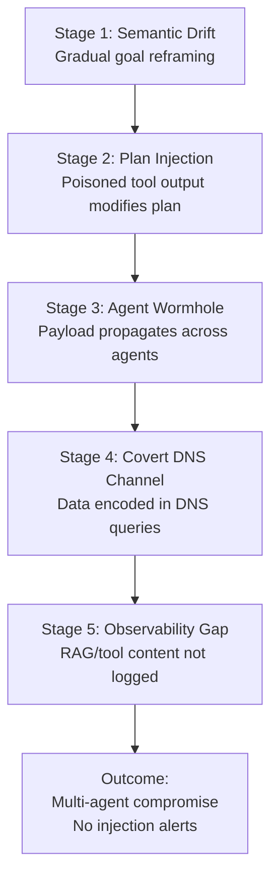
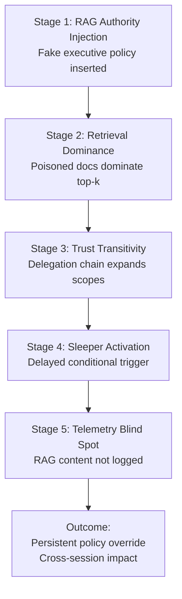
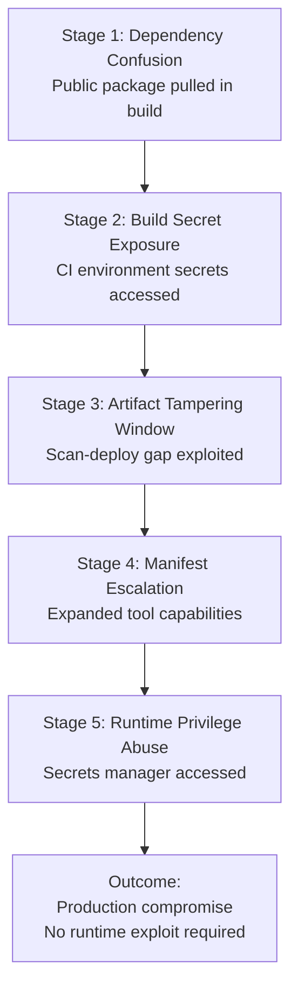
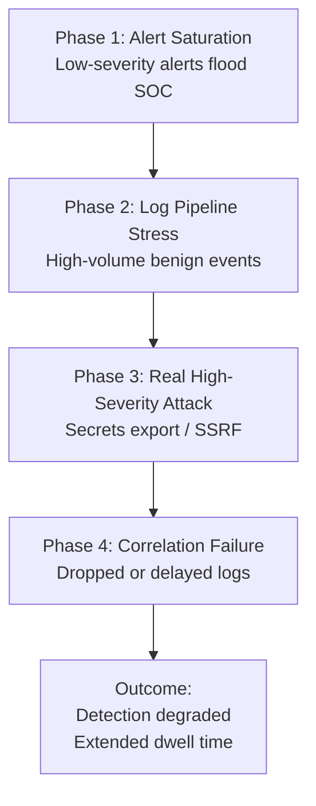
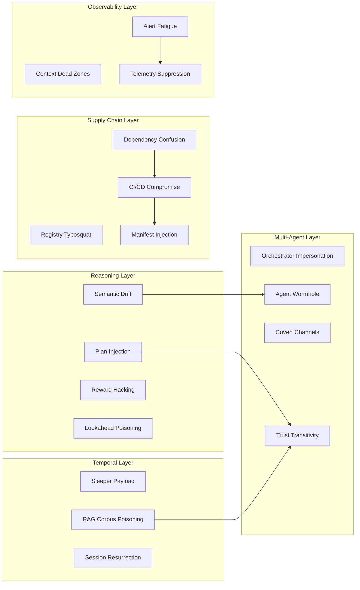

..beta..

# 1️⃣ Chain 1 — Semantic Drift → Plan Injection → Cross-Agent Worm

---

# 2️⃣ Chain 2 — RAG Poisoning → Trust Escalation → Persistent Override

---

# 3️⃣ Chain 3 — Dependency Confusion → CI/CD → Manifest Escalation

---

# 4️⃣ Chain 4 — Alert Fatigue → Log Suppression → High-Value Exfiltration

---

# 5️⃣ Full v3.0 Advanced Attack Landscape (Consolidated View)

This one is useful for architecture reviews.

---

# 🔎 Optional: Kill Chain Styled Version ..(next)..
