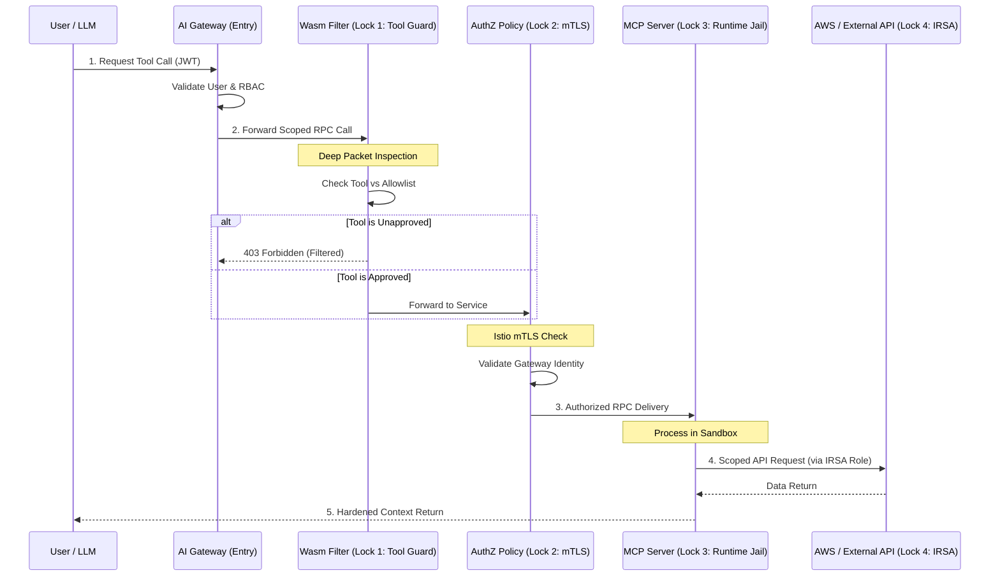
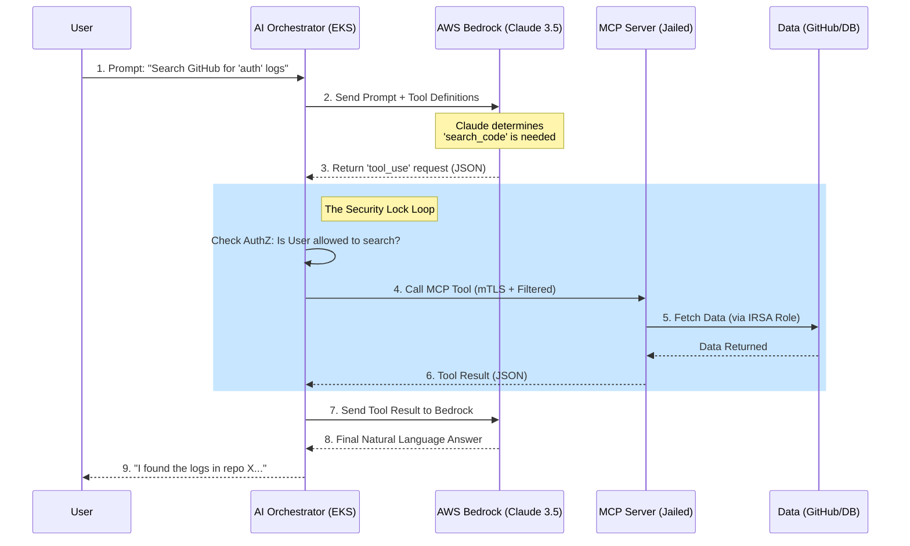

..beta..

##
##


This table breaks down the fundamental architectural weaknesses of the Model Context Protocol (MCP) specification and provides the "Hardened Requirements" necessary for enterprise-grade, modern use cases.

### MCP RFC Dissection: Weaknesses & Improvements

| Feature / Area | RFC Weakness (The "Gap") | Security Risk | Modern Use Case Improvement |
| :--- | :--- | :--- | :--- |
| **Authentication** | The RFC is transport-agnostic; it does not define how to authenticate a client to a server. | **Unauthorized Tool Access:** Anyone on the network can call a tool if the port is open. | **Mandatory mTLS & JWT:** Require SPIFFE-based mTLS for service-to-service and OIDC-backed JWTs for user-to-service calls. |
| **Authorization** | No concept of "Who" can call "What." All discovered tools are usually available to the client. | **Privilege Escalation:** A junior dev could use an MCP agent to call a `delete_production_db` tool. | **Attribute-Based Access Control (ABAC):** Map user roles to specific tool schemas. Filter the `list_tools` output based on the caller's identity. |
| **Tool Execution** | Servers usually run with the permissions of the user starting them (Local) or a broad Service Account (Cloud). | **Identity Confusion:** The server acts as a "System" rather than the "User," bypassing target system audits. | **Token Exchange (OBO):** Use "On-Behalf-Of" flows. The MCP server should exchange a user's JWT for a scoped token in the target API (Slack/GitHub). |
| **Context Sampling** | Allows a server to ask the LLM for data. The LLM might blindly provide it. | **Exfiltration via Prompt:** A malicious MCP server can trick the LLM into leaking its system prompt or other users' data. | **Sampling Guardrails:** Intercept sampling requests. Use a secondary "Security LLM" or Regex filter to ensure no secrets/PII are in the sampled context. |
| **Tool Discovery** | Discovery is dynamic and unverified. The client accepts whatever tools the server lists. | **Shadow Tools:** An attacker-controlled MCP server can "inject" tools like `upload_ssh_key` into the agent's brain. | **Static Schema Signing:** MCP servers must provide a signed manifest of tools. The client rejects any tool whose schema/hash isn't pre-approved. |
| **Data Locality** | The RFC doesn't care where data lives; it just moves JSON blobs. | **Data Residency Violation:** An agent in the EU might pull data via MCP from a server in the US, violating GDPR. | **Regional Affinity Routing:** The Protocol Gateway must enforce that MCP servers only talk to LLM providers in the same regulatory jurisdiction. |
| **Execution Sandbox** | No mention of runtime isolation for the MCP server process. | **Host Takeover:** A vulnerability in an MCP server (e.g., Python `eval()` bug) leads to full container/host escape. | **Wasm/gVisor Isolation:** Run every MCP server in a high-density, low-privilege sandbox (WebAssembly or gVisor) with blocked network egress. |
| **Human-in-the-Loop** | Execution is assumed to be synchronous and automatic. | **Autonomous Destruction:** An agent could delete a repository before a human can stop it. | **Asynchronous Approval Hooks:** High-risk tools must return a `PENDING` state, triggering a Webhook to a human for manual approval. |

---

### Modern Use Case Scenarios & Hardened Solutions

#### 1. The "Software Engineer" Agent (IDE Integration)
*   **The Use Case:** Agent writes code, runs tests, and checks logs.
*   **RFC Weakness:** Agent has access to the developer's entire `$HOME` directory and all environment variables.
*   **Hardened Solution:** Use **Namespace Jailing**. The MCP server runs in a container that only mounts the specific project directory (`/workspace`) and uses an ephemeral `tmpfs` for environment variables.

#### 2. The "Customer Support" Agent (SaaS Data)
*   **The Use Case:** Agent looks up customer history in Zendesk and issues refunds in Stripe.
*   **RFC Weakness:** One "Support" token for all agents; no audit of which specific agent or user triggered a refund.
*   **Hardened Solution:** **Request-Linked Traceability**. Every MCP tool call must include a signed `Parent-Request-ID`. Stripe logs must show both the Service Account *and* the end-user email as metadata.

#### 3. The "Cloud SRE" Agent (Infrastructure Management)
*   **The Use Case:** Agent analyzes AWS CloudWatch logs and restarts EC2 instances.
*   **RFC Weakness:** MCP server requires broad AWS IAM permissions to handle various potential issues.
*   **Hardened Solution:** **Dynamic Role Assumption**. The MCP server starts with *zero* AWS permissions. When a tool is called, it uses the **AWS IRSA** flow to assume a role valid *only* for that specific resource (e.g., one specific EC2 Instance ID) for a 5-minute window.

---

### Summary for Security Architecture
To properly defend MCP, we must treat it as an **untrusted RPC**. We cannot assume the MCP server is "good" or that the LLM is "smart enough" to avoid mistakes. 

**The Golden Rule of MCP Security:**
> *Never trust the Server to define the tools, and never trust the LLM to call them safely. The security must live in the **Interceptor (The Protocol Gateway)**.*

##
##

```
[ INTERNET / USER ]
        │
        ▼
┌─────────────────────────────────────────────────────────────┐
│ K8S CLUSTER BOUNDARY                                        │
│                                                             │
│  ┌──────────────────┐          ┌────────────────────────┐   │
│  │  AI GATEWAY      │          │  SIEM / AUDIT LOGS     │   │
│  │ (AuthN / RBAC)   │───Logs──▶│ (Audit MCP Tool Calls) │   │
│  └────────┬─────────┘          └────────────────────────┘   │
│           │                                                 │
│           │ [ mTLS Tunnel + Scoped JWT ]                    │
│           ▼                                                 │
│  ┌───────────────────────────────────────────────────────┐  │
│  │ MCP STAGING NAMESPACE (JAILED)                        │  │
│  │                                                       │  │
│  │  ┌─────────────────────────────────────────────────┐  │  │
│  │  │ MCP SERVER POD                                  │  │  │
│  │  │                                                 │  │  │
│  │  │ ┌──────────────┐      ┌───────────────────────┐ │  │  │
│  │  │ │ Istio Sidecar│      │  MCP Process Container│ │  │  │
│  │  │ │              │      │                       │ │  │  │
│  │  │ │ 1. WasmGuard ├─────▶│  - ReadOnly FS        │ │  │  │
│  │  │ │ 2. AuthZ     │      │  - Non-Root           │ │  │  │
│  │  │ │ 3. EgressLock│      │  - IRSA Role Identity │ │  │  │
│  │  │ └──────┬───────┘      └───────────┬───────────┘ │  │  │
│  │  └────────┼──────────────────────────┼─────────────┘  │  │
│  └───────────┼──────────────────────────┼────────────────┘  │
│              │                          │                   │
└──────────────┼──────────────────────────┼───────────────────┘
               │                          │
               ▼                          ▼
     [ Blocked Egress ]         [ Scoped AWS IRSA ]
      - Attacker.com ❌           - CodeCommit:Read ✅
      - S3 (unauthorized) ❌      - GitHub API ✅
```

- The Ingress (Gateway): Handles the "Who." It identifies the user and determines if they are allowed to talk to a specific MCP server at all.

- The Sidecar (WasmGuard): Handles the "What." It inspects the JSON body to ensure the LLM isn't being tricked into calling a dangerous tool that wasn't approved for this specific agent.

- The Runtime (Deployment): Handles the "Where." It ensures the code cannot escape to the host node or write to the filesystem, neutralizing path-traversal attacks.

- The Cloud (IRSA): Handles the "How Much." It ensures the agent only sees the specific bucket or repository it needs, rather than the entire AWS account.


##
##


##
##
```
[ USER ] ──(AuthN)──┐
                    ▼
┌─────────────────────────────────────────────────────────────┐
│ EKS CLUSTER (VPC)                                           │
│                                                             │
│  ┌──────────────────────┐          ┌────────────────────┐   │
│  │ AI ORCHESTRATOR POD  │◀──(TLS)──│ AWS BEDROCK        │   │
│  │ (Node/Python/Go)     │───(IAM)─▶│ (Claude 3.5)       │   │
│  └──────────┬───────────┘          └────────────────────┘   │
│             │                                 ▲             │
│      [ LOCK 1: mTLS ]                         │             │
│             │                          [ LOCK 4: EGRESS ]   │
│             ▼                                 │             │
│  ┌─────────────────────────────────────┐      │             │
│  │ MCP JAILED NAMESPACE                │      │             │
│  │                                     │      │             │
│  │  ┌───────────────────────────────┐  │      │             │
│  │  │ MCP SERVER POD                │  │      │             │
│  │  │                               │  │      │             │
│  │  │ ┌────────────┐  ┌───────────┐ │  │      │             │
│  │  │ │ Middleware │  │ MCP App   │ │  │      │             │
│  │  │ │ (Lock 2)   │─▶│ (Lock 3)  │─┼──┘      │             │
│  │  │ └────────────┘  └─────┬─────┘ │         │             │
│  │  └───────────────────────┼───────┘         │             │
│  └──────────────────────────┼─────────────────┘             │
└─────────────────────────────┼───────────────────────────────┘
                              │
                    [ LOCK 5: DATA ACCESS ]
                              │
                    ┌─────────▼─────────┐
                    │ GitHub / AWS / DB │
                    └───────────────────┘
    
