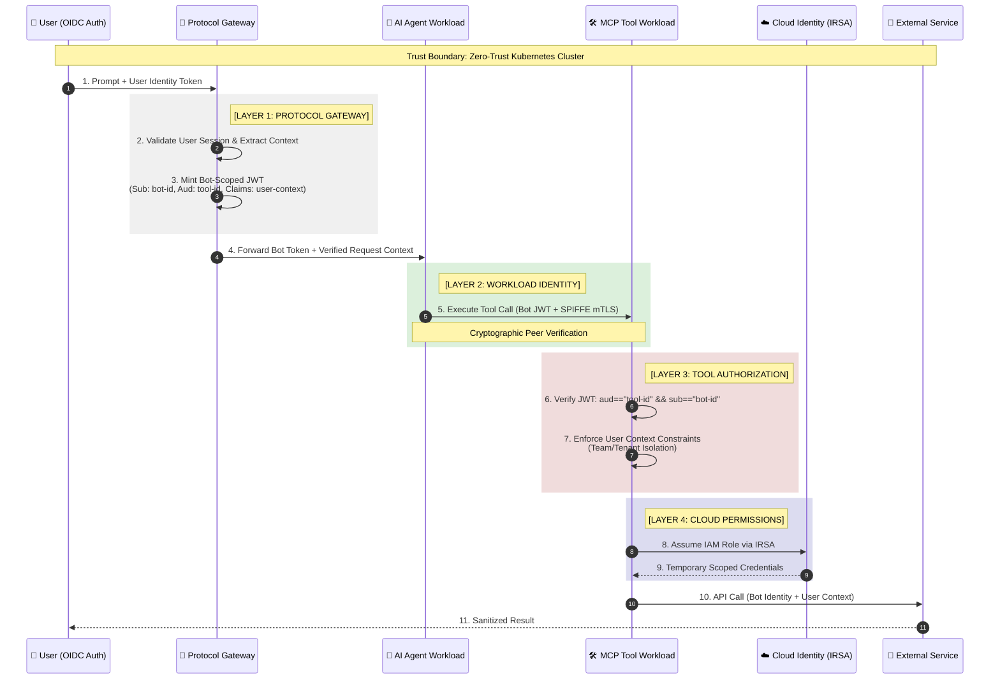

# Zero-Trust AI Mesh: Secure Tool Execution Architecture ..beta..



## 🔐 Security Model: Bot Identity with User Context

### Core Principle: **The Bot Acts, Not the User**

This architecture recognizes that **AI agents operate as autonomous service principals**, not impersonated users. The token structure reflects this reality:

**Token Claims Structure:**
```json
{
  "sub": "bot://ai-agent-prod-v2",
  "aud": "tool://github-connector",
  "iss": "https://protocol-gateway.internal",
  "exp": 1738636800,
  "user_context": {
    "user_id": "user-123",
    "team": "engineering",
    "tenant": "acme-corp",
    "session_id": "sess-abc-xyz"
  }
}
```

### Why This Matters

**Traditional Approach (Vulnerable):**
- Token subject (`sub`) is the user
- Tools execute with user's full permissions
- Impossible to distinguish bot actions from user actions
- Audit logs misleadingly attribute actions to humans

**Zero-Trust Approach (Secure):**
- Token subject (`sub`) is the bot service account
- User identity carried as **non-permissioned context claims**
- Tools make authorization decisions using **both** identities
- Clear audit trail: "Bot X acted on behalf of User Y"

## 🛡️ Four-Layer Defense Model

### 1. **Token Isolation (Steps 2-3)**
The Protocol Gateway performs **identity translation**:
- **Consumes**: User authentication token (OIDC/OAuth)
- **Produces**: Bot-scoped JWT with embedded user context
- **Result**: Tools cannot be tricked by replayed user tokens

**Attack Mitigation:**
- If an attacker steals a user's session token, they **cannot** use it to call tools directly
- Each tool connector only accepts tokens with `aud` matching its unique identifier
- Token lifetime is short-lived (typically 60-300 seconds)

### 2. **Workload Identity (Step 5)**
**SPIFFE/SPIRE** provides cryptographic workload attestation:
- Each pod receives a unique X.509-SVID at runtime
- mTLS enforces that only verified workloads can communicate
- Network policy: `agent-workload` → `tool-connector` only

**Attack Mitigation:**
- Compromised container cannot impersonate other services
- Prevents lateral movement within cluster
- Eliminates reliance on Kubernetes Service Account tokens

### 3. **Audience Binding (Steps 6-7)**
Tool connectors implement **strict JWT validation**:

```typescript
// Pseudocode: Tool Connector Authorization
function validateRequest(jwt: JWT, toolId: string): boolean {
  if (jwt.aud !== `tool://${toolId}`) {
    throw new Error('Audience mismatch: token not intended for this tool');
  }
  
  if (jwt.sub !== 'bot://ai-agent-prod-v2') {
    throw new Error('Invalid subject: must be bot identity');
  }
  
  // Enforce user context constraints
  if (!canAccessTenant(jwt.user_context.tenant)) {
    throw new Error('Tenant isolation violation');
  }
  
  return true;
}
```

**Attack Mitigation:**
- GitHub tool token cannot access PayrollAPI tool
- Prevents token reuse across service boundaries
- User context enforcement prevents cross-tenant data leaks

### 4. **Cloud IAM Binding (Steps 8-9)**
**IRSA (IAM Roles for Service Accounts)** eliminates static credentials:
- Each tool workload has a dedicated IAM role
- Kubernetes ServiceAccount → AWS IAM mapping
- Temporary credentials issued via STS AssumeRoleWebIdentity

**Example IAM Policy:**
```json
{
  "Version": "2012-10-17",
  "Statement": [
    {
      "Effect": "Allow",
      "Action": ["s3:GetObject"],
      "Resource": "arn:aws:s3:::company-data/${user_context.tenant}/*"
    }
  ]
}
```

**Attack Mitigation:**
- No API keys stored in environment variables or secrets
- Compromised pod cannot access other tenants' resources
- Credentials auto-rotate every 15 minutes

## 📊 Audit Trail Example

Traditional logging (ambiguous):
```
2026-02-03 19:15:23 | user-123 | DELETE /repos/acme/sensitive
```

Zero-Trust logging (precise):
```
2026-02-03 19:15:23 | bot://ai-agent-prod-v2 | 
  on_behalf_of: user-123 (team: engineering, session: sess-abc-xyz) |
  tool: tool://github-connector |
  action: DELETE /repos/acme/sensitive |
  spiffe_id: spiffe://cluster.local/ns/ai/sa/agent
```

## 🚀 Implementation Checklist

- [ ] Deploy SPIFFE/SPIRE for workload identity
- [ ] Configure Protocol Gateway with bot service account
- [ ] Implement JWT audience validation in all tool connectors
- [ ] Set up IRSA for each tool workload
- [ ] Enforce network policies (deny-by-default)
- [ ] Configure short-lived token TTLs (60-300s)
- [ ] Implement user context claim validation
- [ ] Set up structured audit logging with both identities

## 🎯 Key Takeaway

**Traditional AI systems ask: "Can this user do X?"**  
**Zero-Trust AI Mesh asks: "Can this bot, acting for this user, through this specific tool, with these temporary credentials, do X?"**

Security is not a single gate—it's a **defense-in-depth chain** where compromise of any single layer does not grant system-wide access.
