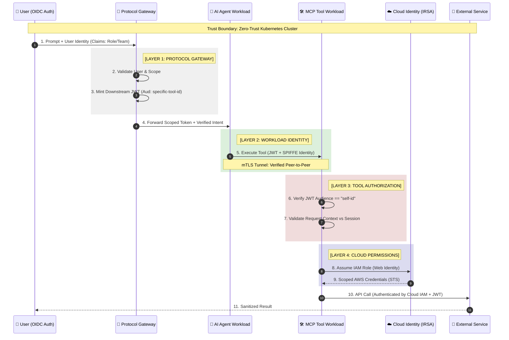

### 🔐 Why the Tool Connector is No Longer Vulnerable

By implementing this flow, you mitigate the primary risks associated with AI tool-calling:

1.  **Impersonation Prevention (Steps 3 & 6)**: The **Protocol Gateway** performs a "Token Exchange." It swaps the broad user login for a highly specific **Audience-Bound JWT**. If an attacker attempts to use a token meant for the "GitHub Tool" to access a "Payroll Tool," the Payroll workload will reject the token because the `aud` (Audience) claim does not match its unique ID.

2.  **Infrastructure Hardening (Step 5)**: We use **SPIFFE/mTLS** to ensure that network communication only occurs between verified peers. This prevents "lateral movement" within the cluster; even if a workload is compromised, it cannot spoof its identity to talk to other restricted tool connectors.

3.  **Credential Elimination (Steps 8 & 9)**: No static API keys or AWS secrets are stored in the Tool workloads. We utilize **Identity Roles for Service Accounts (IRSA)** to dynamically fetch temporary credentials. This ensures that if a tool workload is breached, the "blast radius" is limited to the specific, least-privilege permissions assigned to that pod's IAM role.

4.  **Team Isolation (Step 7)**: The original user’s team/department context is passed through as a signed claim in the downstream JWT. The Tool workload enforces this context, preventing an agent from accidentally accessing data belonging to a different department or tenant.

### 🚀 Summary for Public Documentation

This architecture represents a **Zero-Trust AI Mesh**. It moves security away from "Trusting the Prompt" and places it into the **Identity and Network layers**. Security is enforced through four distinct locks:
*   **The Token**: Verified Scope and Audience.
*   **The Workload**: Verified cryptographic identity (SPIFFE).
*   **The Network**: Verified encrypted path (mTLS).
*   **The Cloud**: Verified Least-Privilege IAM role (IRSA).
