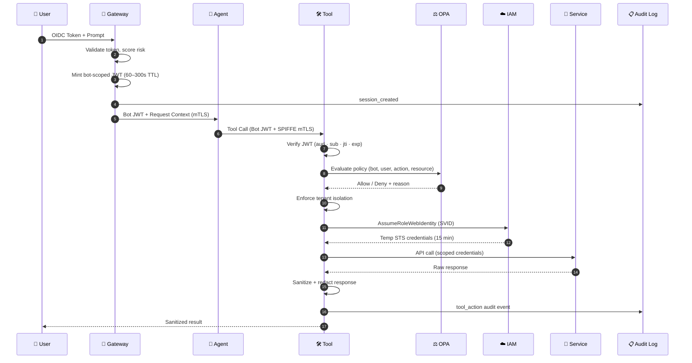

# Zero-Trust AI Mesh: Secure Tool Execution Architecture

*v0.2 — hardened, annotated, expanded*

---


```mermaid
sequenceDiagram
    autonumber
    participant U as 👤 User
    participant GW as 👮 Gateway
    participant AG as 🤖 Agent
    participant TL as 🛠️ Tool
    participant OPA as ⚖️ OPA
    participant IAM as ☁️ IAM
    participant SVC as 📂 Service
    participant LOG as 📋 Audit Log

    U->>GW: OIDC Token + Prompt
    GW->>GW: Validate token, score risk
    GW->>GW: Mint bot-scoped JWT (60–300s TTL)
    GW->>LOG: session_created
    GW->>AG: Bot JWT + Request Context (mTLS)

    AG->>TL: Tool Call (Bot JWT + SPIFFE mTLS)

    TL->>TL: Verify JWT (aud · sub · jti · exp)
    TL->>OPA: Evaluate policy (bot, user, action, resource)
    OPA-->>TL: Allow / Deny + reason
    TL->>TL: Enforce tenant isolation

    TL->>IAM: AssumeRoleWebIdentity (SVID)
    IAM-->>TL: Temp STS credentials (15 min)

    TL->>SVC: API call (scoped credentials)
    SVC-->>TL: Raw response
    TL->>TL: Sanitize + redact response
    TL->>LOG: tool_action audit event
    TL-->>U: Sanitized result
```

---

## 🔐 Security Model: Bot Identity with User Context

### Core Principle: The Bot Acts, Not the User

AI agents operate as **autonomous service principals**. The user's identity is context, not a permission vector. This single design decision eliminates an entire class of privilege-escalation and token-replay attacks.

**Token Claims Structure (v2 — hardened):**

```json
{
  "sub": "bot://ai-agent-prod-v2",
  "aud": "tool://github-connector",
  "iss": "https://protocol-gateway.internal",
  "iat": 1738636500,
  "exp": 1738636800,
  "jti": "tok_7f3a9c2e-unique-per-call",
  "user_context": {
    "user_id": "user-123",
    "team": "engineering",
    "tenant": "acme-corp",
    "session_id": "sess-abc-xyz",
    "risk_score": 0.12,
    "auth_method": "mfa"
  },
  "tool_context": {
    "tool_id": "tool://github-connector",
    "allowed_actions": ["repo:read", "pr:write"],
    "request_id": "req_8b2d1f4a"
  }
}
```

**Notable additions over v1:**
- `jti` — unique token ID prevents replay attacks
- `risk_score` — adaptive auth signal from the gateway (step 3)
- `auth_method` — tools can require MFA for sensitive actions
- `allowed_actions` — pre-scoped action allowlist baked into the token
- `request_id` — end-to-end traceability across all log systems

---

### Traditional vs. Zero-Trust: Side-by-Side

| Dimension | Traditional | Zero-Trust AI Mesh |
|---|---|---|
| Token subject | User | Bot service account |
| User identity role | Permission source | Non-permissioned context |
| Token replay risk | High | Eliminated (aud + jti binding) |
| Cross-tool token use | Possible | Blocked (strict aud matching) |
| Audit attribution | Ambiguous | Bot X on behalf of User Y |
| Credential rotation | Manual / static | Automatic (STS, 15 min TTL) |
| Lateral movement risk | High | Blocked (SPIFFE mTLS mesh) |
| Policy engine | Baked into code | Externalized (OPA) |

---

## 🛡️ Five-Layer Defense Model

> v1 had four layers. We've added **Layer 0: Threat-Aware Ingress** and formalized OPA as its own layer.

---

### Layer 0 — Threat-Aware Ingress (NEW)

Before any token work happens, the gateway evaluates ambient threat signals:

```typescript
interface ThreatSignals {
  ipReputation: "clean" | "vpn" | "tor" | "known-bad";
  geoVelocity: number;       // km/h since last auth — flag if > threshold
  deviceFingerprint: string; // matches known device registry?
  mfaVerified: boolean;
  recentAnomalies: number;   // count of policy violations in last 24h
}

function computeRiskScore(signals: ThreatSignals): number {
  // Returns 0.0 (clean) → 1.0 (block)
  // Score embedded in bot JWT as user_context.risk_score
  // Tools can gate sensitive actions: if risk_score > 0.7 → deny
}
```

**Why it matters:** Downstream tools don't re-implement risk logic — they consume the pre-computed score from the authoritative gateway. Single source of truth.

---

### Layer 1 — Token Isolation (Steps 2–5)

The Protocol Gateway performs **identity translation**, not forwarding:

- **Consumes:** Raw user OIDC token
- **Produces:** Bot-scoped JWT with embedded, read-only user context
- **Key property:** User token is consumed and never forwarded

**Attack mitigations:**
- Stolen session token cannot reach any tool directly
- Each tool's `aud` claim is unique — no cross-tool replay
- `jti` claim blocks replay of the bot token itself
- Short TTL (60–300s) limits blast radius of any leak

---

### Layer 2 — Workload Identity (Step 7)

**SPIFFE/SPIRE** provides cryptographic workload attestation, independent of the JWT layer:

```yaml
# SPIRE registration entry
spiffeID: spiffe://cluster.local/ns/ai/sa/agent
parentID: spiffe://cluster.local/ns/spire/sa/spire-agent
selectors:
  - k8s:ns:ai
  - k8s:sa:agent-workload
  - k8s:pod-label:app:ai-agent
```

**Why this matters beyond JWTs:** Even if an attacker forges a valid JWT, they still need a valid X.509-SVID issued by SPIRE to establish the mTLS connection. Two independent cryptographic proof requirements.

**Attack mitigations:**
- Compromised container cannot impersonate another workload
- Eliminates Kubernetes Service Account token weaknesses
- Network policy enforces `agent → tool` topology — no other paths

---

### Layer 3 — Tool Authorization with OPA (Steps 8–11)

Tool connectors implement strict JWT validation **and** delegate policy decisions to an external OPA instance. This keeps policy logic auditable, version-controlled, and hot-reloadable.

```typescript
async function validateRequest(
  jwt: JWT,
  toolId: string,
  action: string,
  resource: string
): Promise<AuthzResult> {
  // Step 1: Structural JWT validation
  if (jwt.aud !== `tool://${toolId}`) {
    throw new AuthzError("Audience mismatch");
  }
  if (jwt.sub !== "bot://ai-agent-prod-v2") {
    throw new AuthzError("Invalid subject: must be bot identity");
  }
  if (jwt.tool_context.allowed_actions &&
      !jwt.tool_context.allowed_actions.includes(action)) {
    throw new AuthzError("Action not in token allowlist");
  }

  // Step 2: OPA policy evaluation
  const opaResult = await opa.evaluate("ai_mesh/authz", {
    bot: jwt.sub,
    user: jwt.user_context,
    action,
    resource,
    risk_score: jwt.user_context.risk_score,
    auth_method: jwt.user_context.auth_method,
  });

  if (!opaResult.allow) {
    throw new AuthzError(`OPA denied: ${opaResult.reason}`);
  }

  return opaResult;
}
```

**Example OPA policy (Rego):**

```rego
package ai_mesh.authz

default allow = false

allow {
  valid_bot
  valid_tenant
  action_permitted
  risk_acceptable
}

valid_bot {
  input.bot == "bot://ai-agent-prod-v2"
}

valid_tenant {
  input.user.tenant == data.tenants[input.user.tenant].id
}

action_permitted {
  data.tool_permissions[input.user.team][_] == input.action
}

risk_acceptable {
  input.risk_score < 0.7
}

# High-risk actions require MFA regardless of risk score
allow {
  valid_bot
  valid_tenant
  input.action == "repo:delete"
  input.auth_method == "mfa"
  input.risk_score < 0.4
}
```

**Attack mitigations:**
- GitHub token cannot reach PayrollAPI (aud mismatch)
- High risk_score blocks sensitive actions automatically
- Policy changes ship as code — reviewed, tested, versioned
- Cross-tenant data access blocked at policy layer

---

### Layer 4 — Cloud IAM Binding (Steps 12–13)

**IRSA** eliminates static credentials entirely:

```json
{
  "Version": "2012-10-17",
  "Statement": [
    {
      "Effect": "Allow",
      "Action": ["s3:GetObject"],
      "Resource": "arn:aws:s3:::company-data/${aws:PrincipalTag/tenant}/*",
      "Condition": {
        "StringEquals": {
          "aws:RequestedRegion": "us-east-1"
        }
      }
    },
    {
      "Effect": "Deny",
      "Action": "*",
      "Resource": "*",
      "Condition": {
        "StringNotEquals": {
          "aws:PrincipalTag/bot-id": "ai-agent-prod-v2"
        }
      }
    }
  ]
}
```

**Notable hardening over v1:**
- Tenant scoping via IAM attribute tags, not just path prefix
- Explicit deny on wrong bot identity (belt-and-suspenders)
- Region lock reduces exfiltration surface
- Credentials TTL: 15 min, non-renewable without re-attestation

---

### Layer 5 — Response Sanitization (Steps 16–18)

Often overlooked. The tool is the last line of defense before data reaches the user:

```typescript
function sanitizeResponse(raw: unknown, userContext: UserContext): unknown {
  // Strip fields the user_context.team shouldn't see
  // Redact PII outside user's own tenant
  // Truncate oversized payloads (prompt injection via large context)
  // Validate response shape matches expected schema
}
```

**Why this layer matters:** Even if all upstream controls work perfectly, the backend may return more data than intended. Sanitization enforces least-privilege on the *output* path.

---

## 📊 Audit Trail

**v1 (basic):**
```text
2026-02-03 19:15:23 | bot://ai-agent-prod-v2 | on_behalf_of: user-123 | DELETE /repos/acme/sensitive
```

**v2 (SIEM-ready structured log):**
```json
{
  "timestamp": "2026-02-03T19:15:23.441Z",
  "event_type": "tool_action",
  "request_id": "req_8b2d1f4a",
  "session_id": "sess-abc-xyz",
  "principal": {
    "bot_id": "bot://ai-agent-prod-v2",
    "spiffe_id": "spiffe://cluster.local/ns/ai/sa/agent"
  },
  "user_context": {
    "user_id": "user-123",
    "team": "engineering",
    "tenant": "acme-corp",
    "auth_method": "mfa",
    "risk_score": 0.12
  },
  "tool": "tool://github-connector",
  "action": "DELETE",
  "resource": "/repos/acme/sensitive",
  "opa_decision": "allow",
  "opa_policy_version": "v1.4.2",
  "sts_role": "arn:aws:iam::123456789:role/github-connector-prod",
  "outcome": "success",
  "duration_ms": 142
}
```

Every field is queryable in your SIEM. Correlate by `request_id` across gateway, agent, tool, and IAM logs for full end-to-end trace.

---

## 🚀 Implementation Checklist

### Foundation
- [ ] Deploy SPIFFE/SPIRE — configure workload attestation for all pods
- [ ] Enforce Kubernetes NetworkPolicy — default deny, explicit allow only
- [ ] Configure Protocol Gateway with dedicated bot service account
- [ ] Implement OIDC validation + threat signal aggregation at gateway

### Token Pipeline
- [ ] Mint bot-scoped JWTs — short TTL (60–300s), unique `jti` per call
- [ ] Embed `user_context`, `tool_context`, `risk_score`, `auth_method`
- [ ] Validate `aud` + `sub` + `jti` (replay prevention) in every tool

### Policy & Authorization
- [ ] Deploy OPA — write and version-control Rego policies
- [ ] Implement `risk_score` gating for sensitive actions
- [ ] Require `auth_method == "mfa"` for destructive operations
- [ ] Enforce tenant isolation in OPA + IAM tag conditions

### Cloud IAM
- [ ] Set up IRSA for every tool workload — no static credentials anywhere
- [ ] Scope IAM policies to tenant via attribute tags
- [ ] Set STS credential TTL to 15 minutes
- [ ] Add explicit Deny conditions as belt-and-suspenders

### Observability
- [ ] Structured JSON audit logs on every tool action
- [ ] Emit `request_id` at gateway — propagate through entire call chain
- [ ] Ship logs to SIEM — alert on OPA denials, risk_score spikes, replay attempts
- [ ] Dashboard: deny rate by tool, risk score distribution, tenant anomalies

### Response Path
- [ ] Implement response sanitization in every tool connector
- [ ] Schema-validate backend responses before forwarding
- [ ] Redact cross-tenant fields even on backend over-share

---

## 🎯 Mental Model

**The question this architecture answers at every hop:**

> *"Can **this bot**, acting for **this user** (risk: low, mfa: yes), through **this specific tool** (aud-bound), authorized by **external policy** (OPA), with **temporary scoped credentials** (IRSA, 15 min), perform **this action** on **this resource** within **this tenant**?"*

Security is not a gate — it's a **chain of independent, composable proofs**, each of which must hold simultaneously. 

Compromise of any single layer does not grant meaningful access to anything else.

##
##
