# Service Launch & Security Readiness: Process Overview

## Visual Flow

```mermaid
flowchart TD
    %% Main phases
    A[🎯 Plan & Design]
    B[⚙️ Develop & Test]
    C[🔍 Readiness Assessment]
    D[🤖 Automated Validation]
    E[🚀 Approval & Launch]
    F[📊 Ongoing Review]

    %% Phase A tasks
    A1[Define requirements & architecture]
    A2[Identify security & compliance needs]
    
    %% Phase B tasks
    B1[Develop in staging environment]
    B2[Apply secure coding practices]
    B3[Test functionality & security]
    
    %% Phase C tasks
    C1[Review security controls]
    C2[Assess reliability & availability]
    C3[Check observability & monitoring]
    C4[Confirm compliance requirements]
    
    %% Phase D tasks
    D1[Run automated security checks]
    D2[Run CIS benchmarks]
    D3[Document findings & remediation]
    
    %% Phase E tasks
    E1[🔴 Resolve critical issues]
    E2[✅ Obtain stakeholder sign-off]
    E3[🎯 Deploy to production]
    
    %% Phase F tasks
    F1[Monitor service health]
    F2[Reassess after changes]
    F3[Maintain audit trail]

    %% Flow connections
    A --> A1
    A --> A2
    A1 --> B
    A2 --> B
    
    B --> B1
    B --> B2
    B --> B3
    B1 --> C
    B2 --> C
    B3 --> C
    
    C --> C1
    C --> C2
    C --> C3
    C --> C4
    C1 --> D
    C2 --> D
    C3 --> D
    C4 --> D
    
    D --> D1
    D --> D2
    D --> D3
    D1 --> E
    D2 --> E
    D3 --> E
    
    E --> E1
    E --> E2
    E --> E3
    E1 --> F
    E2 --> F
    E3 --> F
    
    F --> F1
    F --> F2
    F --> F3
    
    %% Feedback loops
    F2 -.-> C
    F3 -.-> A

    %% Styling
    classDef phase fill:#e3f2fd,stroke:#1976d2,stroke-width:3px,color:#000,font-weight:bold
    classDef task fill:#f9fbe7,stroke:#689f38,stroke-width:1px,color:#000
    classDef critical fill:#ffebee,stroke:#d32f2f,stroke-width:2px,color:#000,font-weight:bold
    classDef feedback fill:#fff3e0,stroke:#f57c00,stroke-width:1px,stroke-dasharray: 5 5

    class A,B,C,D,E,F phase
    class A1,A2,B1,B2,B3,C1,C2,C3,C4,D1,D2,D3,F1,F2,F3 task
    class E1,E2,E3 critical
```

---

## Enhanced Checklist

- [ ] **Plan & Design**
  - [ ] Define service requirements and architecture
  - [ ] Identify security, privacy, and compliance needs

- [ ] **Develop & Test**
  - [ ] Develop in a staging environment
  - [ ] Apply secure coding and supply chain best practices
  - [ ] Test for functionality, security, and reliability

- [ ] **Readiness Assessment**
  - [ ] Review security controls (IAM, secrets, network)
  - [ ] Assess reliability and availability (SLOs, failover)
  - [ ] Check observability and monitoring (logs, metrics, alerts)
  - [ ] Confirm compliance requirements are met

- [ ] **Automated Validation**
  - [ ] Run automated security and configuration checks
  - [ ] (Optional) Run CIS/kube-bench or other benchmarks
  - [ ] Document findings and remediation actions

- [ ] **Approval & Launch**
  - [ ] Resolve all critical issues
  - [ ] Obtain sign-off from Security, SRE, and Product stakeholders
  - [ ] Deploy to production

- [ ] **Ongoing Review**
  - [ ] Monitor and review service health and security
  - [ ] Reassess after major changes or periodically
  - [ ] Maintain audit trail and update processes as needed

---

