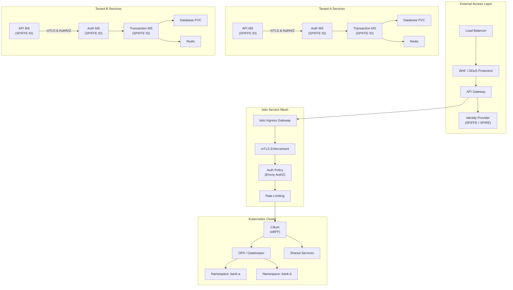

                           ┌────────────────────────────┐
                           │  External Access Layer     │
                           │  ┌─────────┐  ┌──────────┐ │
                           │  │   LB    │→ │   WAF    │ │
                           │  └─────────┘  └──────────┘ │
                           │       ↓             ↓      │
                           │  ┌─────────────────────┐   │
                           │  │     API Gateway     │   │
                           │  └─────────────────────┘   │
                           │       ↓             ↓      │
                           │  ┌─────────────────────┐   │
                           │  │ Identity Provider   │   │
                           │  │ (SPIFFE / SPIRE)    │   │
                           │  └─────────────────────┘   │
                           └─────────────┬─────────────-┘
                                         ↓
                           ┌────────────────────────────┐
                           │   Istio Service Mesh       │
                           │  ┌─────────┐  ┌──────────┐ │
                           │  │Ingress  │→ │   mTLS   │ │
                           │  │Gateway  │  │Enforce   │ │
                           │  └─────────┘  └──────────┘ │
                           │       ↓             ↓      │
                           │  ┌───────────┐ ┌──────────┐│
                           │  │  AuthZ    │→│  Rate    ││
                           │  │  Policy   │  │ Limiter ││
                           │  └───────────┘ └──────────┘│
                           └─────────────┬──────────────┘
                                         ↓
                           ┌────────────────────────────┐
                           │   Cilium + OPA Layer       │
                           │  ┌─────────┐  ┌──────────┐ │
                           │  │ Cilium  │  │   OPA    │ │
                           │  │ eBPF    │  │Policies  │ │
                           │  └─────────┘  └──────────┘ │
                           │         ↓   ↓              │
                           │  ┌───────────┐ ┌──────────┐│
                           │  │ Runtime   │ │   Vault  ││
                           │  │ Security  │ │ Secrets  ││
                           │  │ (Falco)   │ │ Manager  ││
                           │  └───────────┘ └──────────┘│
                           └─────────────┬──────────────┘
                                         ↓
                ┌─────────────────────────────────────────────────┐
                │          Kubernetes Namespaces                  │
                │                                                 │
                │  ┌───────────┐   ┌───────────┐   ┌───────────┐  │
                │  │ bank-a    │   │ bank-b    │   │ shared    │  │
                │  │ Services  │   │ Services  │   │ Services  │  │
                │  └───────────┘   └───────────┘   └───────────┘  │
                │     │  i ▲  │       │  i ▲  │       │  i ▲  │   │
                │     ▼  t │  ▼       ▼  t │  ▼       ▼  t │  │
                │  ┌───────────┐   ┌───────────┐   ┌───────────┐  │
                │  │ API MS    │   │ API MS    │   │ Logging   │  │
                │  │ (SPIFFE)  │   │ (SPIFFE)  │   │ & Metrics │  │
                │  └───────────┘   └───────────┘   └───────────┘  │
                │  ┌───────────┐   ┌───────────┐   ┌───────────┐  │
                │  │ Trans MS  │   │ Trans MS  │   │ Vault     │  │
                │  │ (SPIFFE)  │   │ (SPIFFE)  │   │ (Secrets) │  │
                │  └───────────┘   └───────────┘   └───────────┘  │
                │  ┌───────────┐   ┌───────────┐                  │
                │  │ Frontend  │   │ Worker    │                  │
                │  │ (SPIFFE)  │   │ (SPIFFE)  │                  │
                │  └───────────┘   └───────────┘                  │
                └─────────────────────────────────────────────────┘
                                         ↓
                           ┌────────────────────────────┐
                           │   CI/CD Pipeline           │
                           │ (GitHub Actions, ArgoCD)   │
                           │   - Trivy/Grype Scans      │
                           │   - Cosign Image Signing   │
                           │   - OPA Conftest Checks    │
                           └────────────────────────────┘
                                         ↓
                           ┌────────────────────────────┐
                           │   Observability Layer      │
                           │ (Prometheus / Grafana /    │
                           │  Loki / OpenTelemetry)     │
                           │   + Auditing (Cilium,      │
                           │     Istio, Vault, Falco)   │
                           └────────────────────────────┘
                           

# Legend:

LB: Load Balancer

WAF: Web Application Firewall

SPIFFE/SPIRE: Service identity & cert rotation

mTLS: Mutual TLS for service-to-service encryption

OPA: Open Policy Agent (compliance, policies)

Cilium: eBPF network enforcement (L3–L7)

Falco: Runtime threat detection

Vault: Secrets & dynamic credentials

Namespaces: Tenant isolation (bank-a, bank-b, shared)

CI/CD: Secure supply chain with signing & scans

Observability: Logs, metrics, traces, audits

##
##

## 🔐 Identity & Trust (SPIFFE / SPIRE)

* **Workload Identity:** Every pod or service receives a **SPIFFE ID** (`spiffe://bank-a/api-ms`) instead of relying on static Kubernetes ServiceAccounts.
* **mTLS Certificates:** SPIRE automatically issues and rotates short-lived certificates for mutual TLS between services.
* **Federation:** SPIRE supports multi-cluster or multi-cloud by federating trust domains, enabling secure service communication across EKS clusters.

---

## 🌐 Service Mesh (Istio + Envoy)

* **Ingress Gateway:** Front-door entry point into the mesh. Terminates TLS, authenticates identities, and enforces routing.
* **mTLS Enforcement:** All east-west traffic between workloads is encrypted and authenticated with SPIFFE-issued certificates.
* **Authorization Policies:** Envoy filters + OPA integration allow context-aware RBAC (who can call what, under which conditions).
* **Rate Limiting & WAF Integration:** Protects against DDoS and brute-force attempts at the ingress level.

---

## 🧬 Network Security (Cilium eBPF)

* **L3–L7 Enforcement:** Default-deny policies between namespaces. Only explicitly allowed service-to-service flows are permitted.
* **DNS Filtering:** Blocks data exfiltration attempts by restricting egress DNS queries.
* **Hubble Observability:** Provides visibility into allowed/denied flows for forensics and auditing.

---

## 🛡️ Policy & Compliance (OPA / Gatekeeper)

* **Pod Security Controls:** Prevent privileged containers, hostPath mounts, or unscanned images from running.
* **Resource Quotas:** Enforce per-tenant limits on CPU/memory.
* **Admission Control:** Reject deployments that don’t meet compliance requirements (e.g., unsigned images, missing probes).

---

## 🐍 Runtime Security (Falco)

* **Syscall Detection:** Watches containers at runtime for abnormal behavior (unexpected binaries, sensitive file access, crypto-miners).
* **Alerting:** Violations are forwarded to SIEM, Slack, or PagerDuty via Falcosidekick.
* **Defense-in-Depth:** Adds runtime protection even if policies or network controls are bypassed.

---

## 🔑 Secrets Management (Vault)

* **SPIFFE Auth:** Workloads use their SPIFFE ID to authenticate to Vault without static credentials.
* **Dynamic Secrets:** Issues ephemeral database credentials, API keys, and cloud tokens on demand.
* **Encryption:** Kubernetes secrets are encrypted at rest using Vault KMS plugin.

---

## 📦 Supply Chain Security (CI/CD)

* **GitHub Actions + ArgoCD:** GitOps-driven deployments ensure declarative, auditable state.
* **Image Scanning:** Trivy/Grype scans block promotion of images with high/critical CVEs.
* **Image Signing:** Cosign/Sigstore ensures only signed artifacts are admitted.
* **Policy-as-Code:** OPA Conftest validates Kubernetes YAMLs and Helm charts before merge.

---

## 📊 Observability & Auditing

* **Metrics:** Prometheus + Grafana provide performance and reliability dashboards.
* **Logging:** FluentBit/OpenTelemetry forward logs with PII/secret redaction.
* **Tracing:** OpenTelemetry instrumentation enables distributed tracing across services.
* **Audit Trails:** Istio, Cilium, Vault, and Falco generate security-relevant logs for forensics.

---

## 🗂️ Namespace & Tenant Isolation

* **Dedicated Namespaces:** Each tenant (`bank-a`, `bank-b`) is strictly isolated.
* **Shared Services Namespace:** Logging, monitoring, and Vault run here, accessible only via authenticated SPIFFE identities.
* **Security Namespace:** All enforcement components (OPA, Cilium, Falco, SPIRE) are deployed in their own management namespace.

---

## ⚙️ Operational Hardening

* **Resilience:** Multi-region EKS clusters with SPIRE federation for failover.
* **Chaos Testing:** Regular game-day exercises with ChaosMesh/LitmusChaos.
* **Compliance Mapping:** Controls aligned with SOC2, FedRAMP, and internal TE security baselines.
* **Audit & Backup:** Regular Vault/etcd backups and audit log retention for incident response.

---

👉 Together, these layers provide **zero-trust microsegmentation, strong workload identity, runtime defense, supply chain integrity, and auditable observability** 

— the core of a secure EKS microservices environment.

