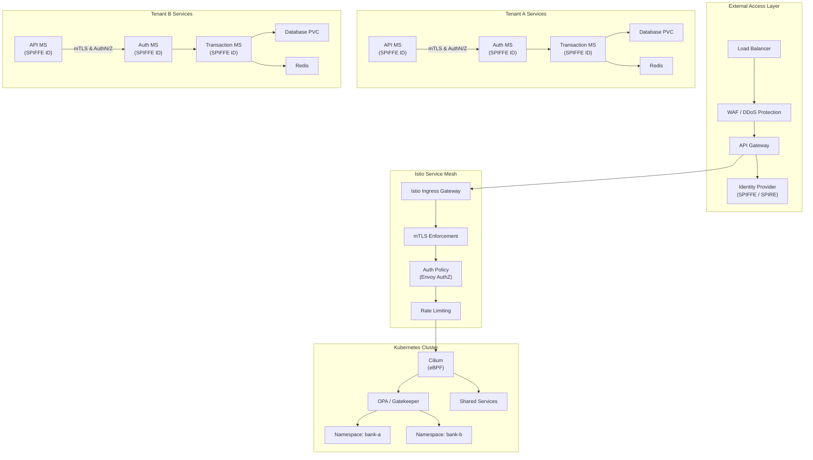

                           ┌────────────────────────────┐
                           │  External Access Layer     │
                           │  ┌─────────┐  ┌──────────┐ │
                           │  │   LB    │→ │   WAF    │ │
                           │  └─────────┘  └──────────┘ │
                           │       ↓             ↓      │
                           │  ┌─────────────────────┐   │
                           │  │     API Gateway     │   │
                           │  └─────────────────────┘   │
                           │       ↓             ↓      │
                           │  ┌─────────────────────┐   │
                           │  │ Identity Provider   │   │
                           │  │ (SPIFFE / SPIRE)    │   │
                           │  └─────────────────────┘   │
                           └─────────────┬─────────────-┘
                                         ↓
                           ┌────────────────────────────┐
                           │   Istio Service Mesh       │
                           │  ┌─────────┐  ┌──────────┐ │
                           │  │Ingress  │→ │   mTLS   │ │
                           │  │Gateway  │  │Enforce   │ │
                           │  └─────────┘  └──────────┘ │
                           │       ↓             ↓      │
                           │  ┌───────────┐ ┌──────────┐│
                           │  │  AuthZ    │→│  Rate    ││
                           │  │  Policy   │  │ Limiter ││
                           │  └───────────┘ └──────────┘│
                           └─────────────┬──────────────┘
                                         ↓
                           ┌────────────────────────────┐
                           │   Cilium + OPA Layer       │
                           │  ┌─────────┐  ┌──────────┐ │
                           │  │ Cilium  │  │   OPA    │ │
                           │  │ eBPF    │  │Policies  │ │
                           │  └─────────┘  └──────────┘ │
                           │         ↓   ↓              │
                           │  ┌───────────┐ ┌──────────┐│
                           │  │ Runtime   │ │   Vault  ││
                           │  │ Security  │ │ Secrets  ││
                           │  │ (Falco)   │ │ Manager  ││
                           │  └───────────┘ └──────────┘│
                           └─────────────┬──────────────┘
                                         ↓
                ┌─────────────────────────────────────────────────┐
                │          Kubernetes Namespaces                  │
                │                                                 │
                │  ┌───────────┐   ┌───────────┐   ┌───────────┐  │
                │  │ bank-a    │   │ bank-b    │   │ shared    │  │
                │  │ Services  │   │ Services  │   │ Services  │  │
                │  └───────────┘   └───────────┘   └───────────┘  │
                │     │  i ▲  │       │  i ▲  │       │  i ▲  │   │
                │     ▼  t │  ▼       ▼  t │  ▼       ▼  t │  │
                │  ┌───────────┐   ┌───────────┐   ┌───────────┐  │
                │  │ API MS    │   │ API MS    │   │ Logging   │  │
                │  │ (SPIFFE)  │   │ (SPIFFE)  │   │ & Metrics │  │
                │  └───────────┘   └───────────┘   └───────────┘  │
                │  ┌───────────┐   ┌───────────┐   ┌───────────┐  │
                │  │ Trans MS  │   │ Trans MS  │   │ Vault     │  │
                │  │ (SPIFFE)  │   │ (SPIFFE)  │   │ (Secrets) │  │
                │  └───────────┘   └───────────┘   └───────────┘  │
                │  ┌───────────┐   ┌───────────┐                  │
                │  │ Frontend  │   │ Worker    │                  │
                │  │ (SPIFFE)  │   │ (SPIFFE)  │                  │
                │  └───────────┘   └───────────┘                  │
                └─────────────────────────────────────────────────┘
                                         ↓
                           ┌────────────────────────────┐
                           │   CI/CD Pipeline           │
                           │ (GitHub Actions, ArgoCD)   │
                           │   - Trivy/Grype Scans      │
                           │   - Cosign Image Signing   │
                           │   - OPA Conftest Checks    │
                           └────────────────────────────┘
                                         ↓
                           ┌────────────────────────────┐
                           │   Observability Layer      │
                           │ (Prometheus / Grafana /    │
                           │  Loki / OpenTelemetry)     │
                           │   + Auditing (Cilium,      │
                           │     Istio, Vault, Falco)   │
                           └────────────────────────────┘
                           

# Legend:

LB: Load Balancer

WAF: Web Application Firewall

SPIFFE/SPIRE: Service identity & cert rotation

mTLS: Mutual TLS for service-to-service encryption

OPA: Open Policy Agent (compliance, policies)

Cilium: eBPF network enforcement (L3–L7)

Falco: Runtime threat detection

Vault: Secrets & dynamic credentials

Namespaces: Tenant isolation (bank-a, bank-b, shared)

CI/CD: Secure supply chain with signing & scans

Observability: Logs, metrics, traces, audits
