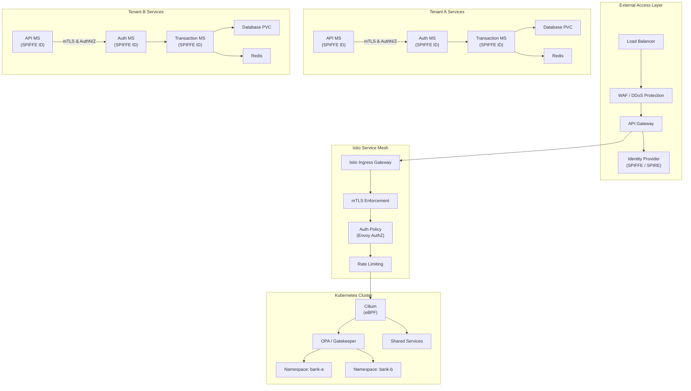

                           ┌────────────────────────────┐
                           │  External Access Layer     │
                           │  ┌─────────┐  ┌──────────┐ │
                           │  │   LB    │→ │   WAF    │ │
                           │  └─────────┘  └──────────┘ │
                           │       ↓             ↓      │
                           │  ┌─────────────────────┐   │
                           │  │     API Gateway     │   │
                           │  └─────────────────────┘   │
                           │       ↓             ↓      │
                           │  ┌─────────────────────┐   │
                           │  │ Identity Provider   │   │
                           │  │ (SPIFFE / SPIRE)    │   │
                           │  └─────────────────────┘   │
                           └─────────────┬─────────────-┘
                                         ↓
                           ┌────────────────────────────┐
                           │   Istio Service Mesh       │
                           │  ┌─────────┐  ┌──────────┐ │
                           │  │Ingress  │→ │   mTLS   │ │
                           │  │Gateway  │  │Enforce   │ │
                           │  └─────────┘  └──────────┘ │
                           │       ↓             ↓      │
                           │  ┌───────────┐ ┌──────────┐│
                           │  │  AuthZ    │→│  Rate    ││
                           │  │  Policy   │  │ Limiter ││
                           │  └───────────┘ └──────────┘│
                           └─────────────┬──────────────┘
                                         ↓
                           ┌────────────────────────────┐
                           │   Cilium + OPA Layer       │
                           │  ┌─────────┐  ┌──────────┐ │
                           │  │ Cilium  │  │   OPA    │ │
                           │  │ eBPF    │  │Policies  │ │
                           │  └─────────┘  └──────────┘ │
                           │         ↓   ↓              │
                           │  ┌───────────┐ ┌──────────┐│
                           │  │ Runtime   │ │   Vault  ││
                           │  │ Security  │ │ Secrets  ││
                           │  │ (Falco)   │ │ Manager  ││
                           │  └───────────┘ └──────────┘│
                           └─────────────┬──────────────┘
                                         ↓
                ┌─────────────────────────────────────────────────┐
                │          Kubernetes Namespaces                  │
                │                                                 │
                │  ┌───────────┐   ┌───────────┐   ┌───────────┐  │
                │  │ bank-a    │   │ bank-b    │   │ shared    │  │
                │  │ Services  │   │ Services  │   │ Services  │  │
                │  └───────────┘   └───────────┘   └───────────┘  │
                │     │  i ▲  │       │  i ▲  │       │  i ▲  │   │
                │     ▼  t │  ▼       ▼  t │  ▼       ▼  t │  │
                │  ┌───────────┐   ┌───────────┐   ┌───────────┐  │
                │  │ API MS    │   │ API MS    │   │ Logging   │  │
                │  │ (SPIFFE)  │   │ (SPIFFE)  │   │ & Metrics │  │
                │  └───────────┘   └───────────┘   └───────────┘  │
                │  ┌───────────┐   ┌───────────┐   ┌───────────┐  │
                │  │ Trans MS  │   │ Trans MS  │   │ Vault     │  │
                │  │ (SPIFFE)  │   │ (SPIFFE)  │   │ (Secrets) │  │
                │  └───────────┘   └───────────┘   └───────────┘  │
                │  ┌───────────┐   ┌───────────┐                  │
                │  │ Frontend  │   │ Worker    │                  │
                │  │ (SPIFFE)  │   │ (SPIFFE)  │                  │
                │  └───────────┘   └───────────┘                  │
                └─────────────────────────────────────────────────┘
                                         ↓
                           ┌────────────────────────────┐
                           │   CI/CD Pipeline           │
                           │ (GitHub Actions, ArgoCD)   │
                           │   - Trivy/Grype Scans      │
                           │   - Cosign Image Signing   │
                           │   - OPA Conftest Checks    │
                           └────────────────────────────┘
                                         ↓
                           ┌────────────────────────────┐
                           │   Observability Layer      │
                           │ (Prometheus / Grafana /    │
                           │  Loki / OpenTelemetry)     │
                           │   + Auditing (Cilium,      │
                           │     Istio, Vault, Falco)   │
                           └────────────────────────────┘
                           


# Legend:

LB: Load Balancer

WAF: Web Application Firewall

SPIFFE/SPIRE: Service identity & cert rotation

mTLS: Mutual TLS for service-to-service encryption

OPA: Open Policy Agent (compliance, policies)

Cilium: eBPF network enforcement (L3–L7)

Falco: Runtime threat detection

Vault: Secrets & dynamic credentials

Namespaces: Tenant isolation (bank-a, bank-b, shared)

CI/CD: Secure supply chain with signing & scans

Observability: Logs, metrics, traces, audits


##
##


## 🔐 Identity & Trust (SPIFFE / SPIRE)

* **Workload Identity:** Every pod or service receives a **SPIFFE ID** (`spiffe://bank-a/api-ms`) instead of relying on static Kubernetes ServiceAccounts.
* **mTLS Certificates:** SPIRE automatically issues and rotates short-lived certificates for mutual TLS between services.
* **Federation:** SPIRE supports multi-cluster or multi-cloud by federating trust domains, enabling secure service communication across EKS clusters.

---

## 🌐 Service Mesh (Istio + Envoy)

* **Ingress Gateway:** Front-door entry point into the mesh. Terminates TLS, authenticates identities, and enforces routing.
* **mTLS Enforcement:** All east-west traffic between workloads is encrypted and authenticated with SPIFFE-issued certificates.
* **Authorization Policies:** Envoy filters + OPA integration allow context-aware RBAC (who can call what, under which conditions).
* **Rate Limiting & WAF Integration:** Protects against DDoS and brute-force attempts at the ingress level.

---

## 🧬 Network Security (Cilium eBPF)

* **L3–L7 Enforcement:** Default-deny policies between namespaces. Only explicitly allowed service-to-service flows are permitted.
* **DNS Filtering:** Blocks data exfiltration attempts by restricting egress DNS queries.
* **Hubble Observability:** Provides visibility into allowed/denied flows for forensics and auditing.

---

## 🛡️ Policy & Compliance (OPA / Gatekeeper)

* **Pod Security Controls:** Prevent privileged containers, hostPath mounts, or unscanned images from running.
* **Resource Quotas:** Enforce per-tenant limits on CPU/memory.
* **Admission Control:** Reject deployments that don’t meet compliance requirements (e.g., unsigned images, missing probes).

---

## 🐍 Runtime Security (Falco)

* **Syscall Detection:** Watches containers at runtime for abnormal behavior (unexpected binaries, sensitive file access, crypto-miners).
* **Alerting:** Violations are forwarded to SIEM, Slack, or PagerDuty via Falcosidekick.
* **Defense-in-Depth:** Adds runtime protection even if policies or network controls are bypassed.

---

## 🔑 Secrets Management (Vault)

* **SPIFFE Auth:** Workloads use their SPIFFE ID to authenticate to Vault without static credentials.
* **Dynamic Secrets:** Issues ephemeral database credentials, API keys, and cloud tokens on demand.
* **Encryption:** Kubernetes secrets are encrypted at rest using Vault KMS plugin.

---

## 📦 Supply Chain Security (CI/CD)

* **GitHub Actions + ArgoCD:** GitOps-driven deployments ensure declarative, auditable state.
* **Image Scanning:** Trivy/Grype scans block promotion of images with high/critical CVEs.
* **Image Signing:** Cosign/Sigstore ensures only signed artifacts are admitted.
* **Policy-as-Code:** OPA Conftest validates Kubernetes YAMLs and Helm charts before merge.

---

## 📊 Observability & Auditing

* **Metrics:** Prometheus + Grafana provide performance and reliability dashboards.
* **Logging:** FluentBit/OpenTelemetry forward logs with PII/secret redaction.
* **Tracing:** OpenTelemetry instrumentation enables distributed tracing across services.
* **Audit Trails:** Istio, Cilium, Vault, and Falco generate security-relevant logs for forensics.

---

## 🗂️ Namespace & Tenant Isolation

* **Dedicated Namespaces:** Each tenant (`bank-a`, `bank-b`) is strictly isolated.
* **Shared Services Namespace:** Logging, monitoring, and Vault run here, accessible only via authenticated SPIFFE identities.
* **Security Namespace:** All enforcement components (OPA, Cilium, Falco, SPIRE) are deployed in their own management namespace.

---

## ⚙️ Operational Hardening

* **Resilience:** Multi-region EKS clusters with SPIRE federation for failover.
* **Chaos Testing:** Regular game-day exercises with ChaosMesh/LitmusChaos.
* **Compliance Mapping:** Controls aligned with SOC2, FedRAMP, and internal TE security baselines.
* **Audit & Backup:** Regular Vault/etcd backups and audit log retention for incident response.

---

👉 Together, these layers provide **zero-trust microsegmentation, strong workload identity, runtime defense, supply chain integrity, and auditable observability** 

— the core of a secure EKS microservices environment.


##
##


## 🔐 SPIRE: End-to-End Workload Identity

### 1. **Trust Anchor**

* At the root is the **SPIFFE Trust Domain**, e.g.:

  ```
  spiffe://mycompany.internal
  ```
* This trust domain is backed by a root CA (self-signed, managed by SPIRE Server).
* All workloads, whether `bank-a` services, Istio sidecars, or shared services like Vault, derive their credentials from this root of trust.

---

### 2. **SPIRE Server**

* The **SPIRE Server** is the central authority that **mints workload identities**.
* It holds the signing keypair (root CA or intermediate CA).
* When a workload starts, SPIRE Server:

  1. Verifies its **attestation** (e.g., Kubernetes node selectors, ServiceAccount, pod labels).
  2. Issues a short-lived **SVID** (SPIFFE Verifiable Identity Document).
  3. That SVID is basically an **X.509 certificate** containing the workload’s SPIFFE ID (`spiffe://bank-a/api-ms`).

👉 **This is what you meant by “minting tokens.”**
The tokens are **mTLS certificates (X.509 SVIDs)**, minted by the SPIRE Server and handed to workloads by SPIRE Agents.

---

### 3. **SPIRE Agent**

* Runs as a **DaemonSet** on every EKS node.
* Each workload pod talks to its local SPIRE Agent via a Unix domain socket (not directly to SPIRE Server).
* The agent:

  * Attests the workload locally (using K8s metadata or selectors).
  * Requests an SVID from SPIRE Server on its behalf.
  * Returns that short-lived cert + key to the workload (or the Istio sidecar proxy).

---

### 4. **Istio Integration**

* Istio’s Citadel (or Istiod in newer versions) **plugs into SPIRE**:

  * Instead of self-issuing certs, Istio proxies fetch their identity from SPIRE Agents.
  * That means *all mTLS inside the mesh is anchored to SPIFFE IDs*.
    Example:
  * API-MS in bank-a: `spiffe://bank-a/api-ms`
  * Trans-MS in bank-b: `spiffe://bank-b/trans-ms`
* When service A calls service B:

  * Istio sidecars perform mTLS handshake.
  * The SPIFFE IDs in their certs are validated against the trust domain root.
  * Envoy authorization policy can then say:

    > Allow only if source identity = `spiffe://bank-a/api-ms` and destination = `spiffe://bank-b/trans-ms`.

---

### 5. **Vault Integration**

* Vault trusts SPIRE identities as authenticators.
* A pod presents its SVID (`spiffe://bank-a/trans-ms`) to Vault.
* Vault maps that SPIFFE ID to a Vault policy:

  * `spiffe://bank-a/trans-ms` → DB role with dynamic Postgres creds.
* No Kubernetes ServiceAccount secrets, no static tokens.
  **All secrets are short-lived and cryptographically bound to SPIRE-issued identities.**

---

### 6. **CI/CD Integration**

* GitHub Actions or ArgoCD runners can also be SPIFFE workloads.
* Example:

  * `spiffe://cicd/github-actions-runner`
* This lets CI/CD pipelines authenticate to Kubernetes, Vault, or registries **without long-lived API tokens**.

---

### 7. **Observability & Forensics**

* Because **all traffic is signed with SPIFFE IDs**, logs and metrics gain strong identity context:

  * “This request came from `spiffe://bank-a/api-ms` at 12:01 UTC.”
* Hubble (Cilium), Istio, and Vault all enrich logs with SPIFFE IDs → making forensic attribution precise.

---

### 🔑 Lifecycle of a Call (Example: bank-a API-MS → bank-b Trans-MS)

1. **Startup**

   * API-MS pod starts in namespace `bank-a`.
   * SPIRE Agent attests the pod and fetches `spiffe://bank-a/api-ms` SVID from SPIRE Server.
   * Istio sidecar fetches the SVID from the SPIRE Agent.

2. **Outbound Call**

   * API-MS calls Trans-MS in `bank-b`.
   * Istio sidecar initiates mTLS using its SPIFFE SVID.

3. **Handshake**

   * Trans-MS sidecar validates caller’s SPIFFE ID against trust domain.
   * Istio + OPA policy:
     “Only allow `spiffe://bank-a/api-ms` to call `/transfer` on `spiffe://bank-b/trans-ms`.”

4. **Secrets / DB Access**

   * If Trans-MS needs a DB credential, it presents its SPIFFE ID to Vault.
   * Vault issues a **dynamic DB credential** valid for a few minutes.

5. **Logging**

   * Cilium + Istio + Falco record traffic and activity with **SPIFFE IDs** as the identity backbone.

---

✅ So: **SPIRE Server is minting the “tokens”** — in practice, those are **short-lived mTLS certificates (SVIDs)**.
These identities bind together **network trust (Istio), policy enforcement (OPA), secrets management (Vault), and observability (Hubble, Falco)**.

##
##

                    ┌───────────────────────────────┐
                    │          SPIRE Server         │
                    │ - Root / Intermediate CA      │
                    │ - Mints short-lived SVIDs     │
                    │ - Defines identity mappings   │
                    └───────────────┬───────────────┘
                                    │
                           (Attestation Request)
                                    │
                    ┌───────────────▼───────────────┐
                    │          SPIRE Agent          │
                    │ - Runs on each node           │
                    │ - Talks to Server             │
                    │ - Exposes Unix socket         │
                    └───────────────┬───────────────┘
                                    │
                        (Workload / Pipeline Attest)
               ┌────────────────────┴─────────────────────┐
               │                                          │
               ▼                                          ▼
    ┌───────────────────────────────┐        ┌───────────────────────────────┐
    │        Workload Pod           │        │        CI/CD Runner Pod       │
    │ (API-MS, Trans-MS, etc.)      │        │ (GitHub Actions / ArgoCD)     │
    │ - Requests SVID from Agent    │        │ - Requests SVID from Agent    │
    │ - Gets spiffe://bank-a/...    │        │ - Gets spiffe://cicd/...      │
    └───────────────┬───────────────┘        └───────────────┬───────────────┘
                    │                                        │
            (mTLS Handshake)                   (Deploy / Push Images)
                    │                                        │
                    ▼                                        ▼
    ┌───────────────────────────────┐        ┌───────────────────────────────┐
    │   Destination Workload Pod    │        │     Secure Supply Chain       │
    │ - Validates peer SPIFFE ID    │        │ - Only signed images allowed  │
    │ - Enforces AuthZ via OPA      │        │ - CI/CD ID bound to trust     │
    └───────────────┬───────────────┘        └───────────────┬───────────────┘
                    │                                        │
          (Secret Request to Vault)               (ArgoCD GitOps Deployment)
                    │                                        │
                    ▼                                        ▼
    ┌───────────────────────────────┐        ┌───────────────────────────────┐
    │             Vault             │        │          Kubernetes           │
    │ - Maps SPIFFE ID → Role       │        │ - Only admits workloads       │
    │ - Issues dynamic secrets      │        │   with valid SVIDs            │
    │   (DB creds, API tokens)      │        │ - GitOps driven by identity   │
    └───────────────────────────────┘        └───────────────────────────────┘


# 🔑 Key Flow Explained

Workload startup → SPIRE Agent attests the pod and requests an SVID from the Server.

SPIRE Server mints an SVID (X.509 cert containing SPIFFE ID).

Istio sidecar retrieves the SVID from the Agent, uses it for mTLS.

Destination service validates peer SPIFFE ID in the handshake.

OPA/Istio enforce policies (allow/deny based on caller identity).

Vault issues secrets bound to SPIFFE IDs (dynamic, short-lived).


# 🔑 Extended Flow with CI/CD

CI/CD Runner as a Workload

GitHub Actions runner pod or ArgoCD controller pod gets its own SPIFFE ID:
spiffe://cicd/github-actions or spiffe://argocd/controller.

Identity is short-lived and tied to the trust domain.

Build & Push

Runner authenticates to container registry with its SPIFFE ID (no static creds).

Only signed, scanned images are pushed.

Deploy

Runner deploys manifests to EKS.

Kubernetes admission control + OPA require workloads to present valid SPIFFE SVIDs.

Runtime

Services authenticate each other via Istio mTLS using their SPIFFE IDs.

Vault issues secrets dynamically, bound to service identity.

Auditability

Every action (build, push, deploy, runtime call, secret request) is traceable by SPIFFE ID.

CI/CD actions are cryptographically linked to runtime identities.

✅ This makes SPIRE the single root of trust from pipeline → runtime:

CI/CD agents get an identity.

Images are signed and tied to that identity.

Deployments only admit workloads with valid SVIDs.

Services and secrets flow only between trusted SPIFFE identities.


##
##
