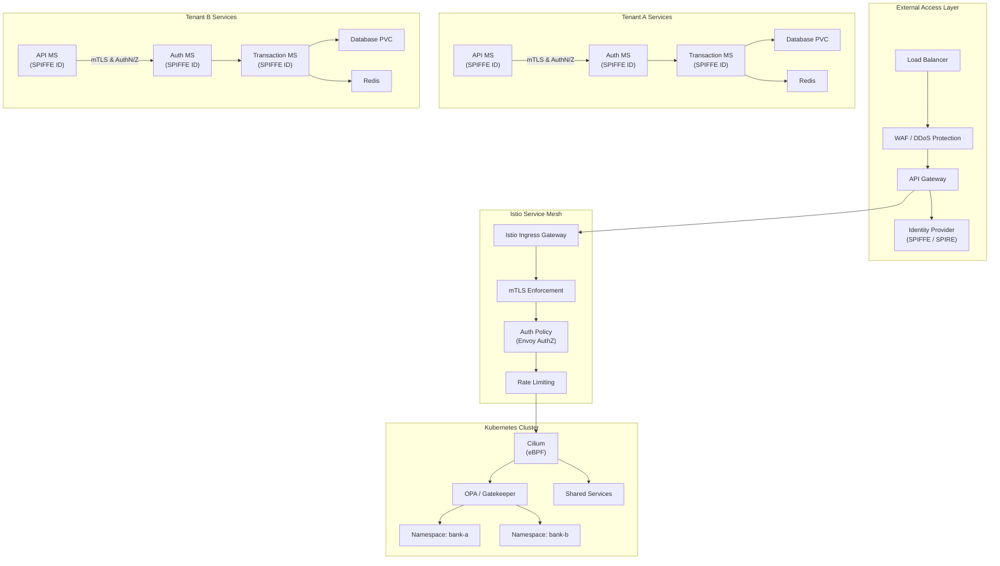

# 
Key enhancements:

SPIFFE / SPIRE for issuing workload identities (SPIFFE IDs) and rotating mTLS certs.

Istio Ingress Gateway integrates with SPIFFE mTLS and Envoy authorization policies.

Cilium provides network-layer eBPF enforcement (L3–L7), blocking any cross-namespace traffic not explicitly permitted.

OPA/Gatekeeper enforces pod-security, resource compliance, and tenant-isolation policies.

Shared Services (logging, monitoring, Vault) run in a central namespace, reachable only via authenticated SPIFFE identities.


##
##
```
                           ┌────────────────────────────┐
                           │  External Access Layer     │
                           │  ┌─────────┐  ┌──────────┐│
                           │  │  LB     │→ │   WAF    ││
                           │  └─────────┘  └──────────┘│
                           │       ↓             ↓     │
                           │  ┌─────────────────────┐ │
                           │  │     API Gateway     │ │
                           │  └─────────────────────┘ │
                           │       ↓             ↓     │
                           │  ┌─────────────────────┐ │
                           │  │ Identity Provider   │ │
                           │  │ (SPIFFE / SPIRE)    │ │
                           │  └─────────────────────┘ │
                           └─────────────┬───────────┘
                                         ↓
                           ┌────────────────────────────┐
                           │   Istio Service Mesh       │
                           │  ┌─────────┐  ┌──────────┐ │
                           │  │Ingress  │→ │  mTLS    │ │
                           │  │Gateway  │  │Enforcement│ │
                           │  └─────────┘  └──────────┘ │
                           │       ↓             ↓     │
                           │  ┌───────────┐ ┌──────────┐│
                           │  │  AuthZ    │→│ Rate     ││
                           │  │  Policy   │  │ Limiting ││
                           │  └───────────┘ └──────────┘│
                           └─────────────┬──────────────┘
                                         ↓
                           ┌────────────────────────────┐
                           │   Cilium + OPA Layer       │
                           │  ┌─────────┐  ┌──────────┐ │
                           │  │Cilium   │  │  OPA     │ │
                           │  │Network  │  │Policies  │ │
                           │  └─────────┘  └──────────┘ │
                           └─────────────┬──────────────┘
                                         ↓
                ┌─────────────────────────────────────────────────┐
                │          Kubernetes Namespaces                  │
                │                                                 │
                │  ┌───────────┐   ┌───────────┐   ┌───────────┐ │
                │  │ bank-a    │   │ bank-b    │   │ shared    │ │
                │  │ Services  │   │ Services  │   │ Services  │ │
                │  └───────────┘   └───────────┘   └───────────┘ │
                │     │  i ▲  │       │  i ▲  │       │  i ▲  │ │
                │     ▼  t │  ▼       ▼  t │  ▼       ▼  t │  │
                │  ┌───────────┐   ┌───────────┐   ┌───────────┐ │
                │  │API MS     │   │API MS     │   │Logging    │ │
                │  │(SPIFFE)   │   │(SPIFFE)   │   │& Metrics  │ │
                │  └───────────┘   └───────────┘   └───────────┘ │
                │  ┌───────────┐   ┌───────────┐   ┌───────────┐ │
                │  │Trans MS    │  │Trans MS    │  │ Vault     │ │
                │  │(SPIFFE)    │  │(SPIFFE)    │  │(Secrets)  │ │
                │  └───────────┘   └───────────┘   └───────────┘ │
                └─────────────────────────────────────────────────┘
                                         ↓
                           ┌────────────────────────────┐
                           │   CI/CD Pipeline           │
                           │ (GitHub Actions, ArgoCD)   │
                           └────────────────────────────┘

```

# Legend:

LB: Load Balancer

WAF: Web Application Firewall

SPIFFE/SPIRE: Service identity and secret distribution

mTLS: Mutual TLS for service-to-service encryption

OPA: Open Policy Agent for policy enforcement

Cilium: eBPF network layer

Namespaces: Tenant isolation (bank-a, bank-b, shared)

SPIFFE IDs: Each service carries a unique identity

CI/CD: Automated build, security scans, and deployments


