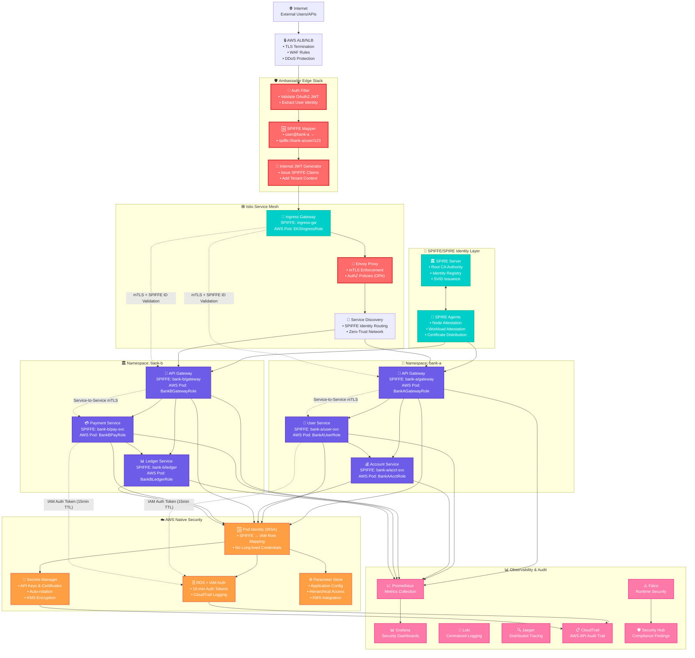

##
##
```

sequenceDiagram
    participant User as 👤 External User
    participant ALB as 🔒 AWS ALB
    participant Ambassador as 🛡️ Ambassador
    participant Istio as 🕸️ Istio Gateway
    participant Gateway as 🚪 API Gateway
    participant UserSvc as 👤 User Service
    participant AWS as ☁️ AWS Services
    participant RDS as 🗄️ RDS Database
    
    Note over User,RDS: 🔐 Zero Trust Authentication Flow
    
    User->>ALB: 1. HTTPS + OAuth2 JWT
    ALB->>Ambassador: 2. Forward request
    
    Ambassador->>Ambassador: 3. Validate JWT
    Ambassador->>Ambassador: 4. Extract user identity
    Ambassador->>Ambassador: 5. Map to SPIFFE ID<br/>user@bank-a → spiffe://bank-a/user/123
    Ambassador->>Ambassador: 6. Issue Internal JWT<br/>with SPIFFE claims
    
    Ambassador->>Istio: 7. Forward + Internal JWT<br/>+ X-Spiffe-ID header
    
    Istio->>Istio: 8. Validate Internal JWT
    Istio->>Istio: 9. Request SPIFFE SVID
    Istio->>Gateway: 10. Establish mTLS connection<br/>Gateway SVID ↔ Istio SVID
    
    Note over Istio,Gateway: 🔒 Mutual TLS with SPIFFE Identity
    
    Gateway->>Gateway: 11. Verify peer SPIFFE ID
    Gateway->>Gateway: 12. Check authorization<br/>@PreAuthorize validation
    Gateway->>UserSvc: 13. Service-to-Service mTLS call<br/>with SPIFFE context
    
    UserSvc->>UserSvc: 14. Verify caller SPIFFE ID<br/>Only bank-a/api-gateway allowed
    UserSvc->>UserSvc: 15. Validate user context<br/>User can only access own data
    
    UserSvc->>AWS: 16. Request database credentials<br/>using AWS Pod Identity
    AWS->>AWS: 17. Map SPIFFE ID → IAM Role
    AWS->>RDS: 18. Generate 15-min auth token
    RDS->>AWS: 19. Return IAM auth token
    AWS->>UserSvc: 20. Return credentials
    
    UserSvc->>RDS: 21. Connect with IAM auth token
    RDS->>UserSvc: 22. Return user data
    
    Note over UserSvc,RDS: 🔍 Full audit trail in CloudTrail
    
    UserSvc->>Gateway: 23. Return response
    Gateway->>Istio: 24. Return response
    Istio->>Ambassador: 25. Return response  
    Ambassador->>ALB: 26. Return response
    ALB->>User: 27. HTTPS Response<br/>Signed, Encrypted, Audited
```

##
##

```
mindmap
  root((🔐 Zero Trust))
    🆔 Identity Everywhere
      External OAuth2 JWT
      Internal SPIFFE IDs
      AWS Pod Identity
      Service Certificates
    🔍 Always Verify
      Ambassador JWT validation
      Istio mTLS enforcement
      Spring Security authorization
      AWS IAM authentication
    🎯 Least Privilege
      Tenant namespace isolation
      Method-level authorization
      Scoped database credentials
      Time-limited tokens (15min)
    📊 Continuous Monitoring
      SPIFFE identity in all logs
      CloudTrail API audit
      Falco runtime security
      Real-time policy violations
    🚫 Never Trust Network
      mTLS between all services
      No network-based assumptions
      Encrypted data in transit
      Cryptographic identity proof
    ⏰ Short-lived Everything
      15-min database tokens
      Rotated certificates
      Dynamic secrets
      Session-based context
