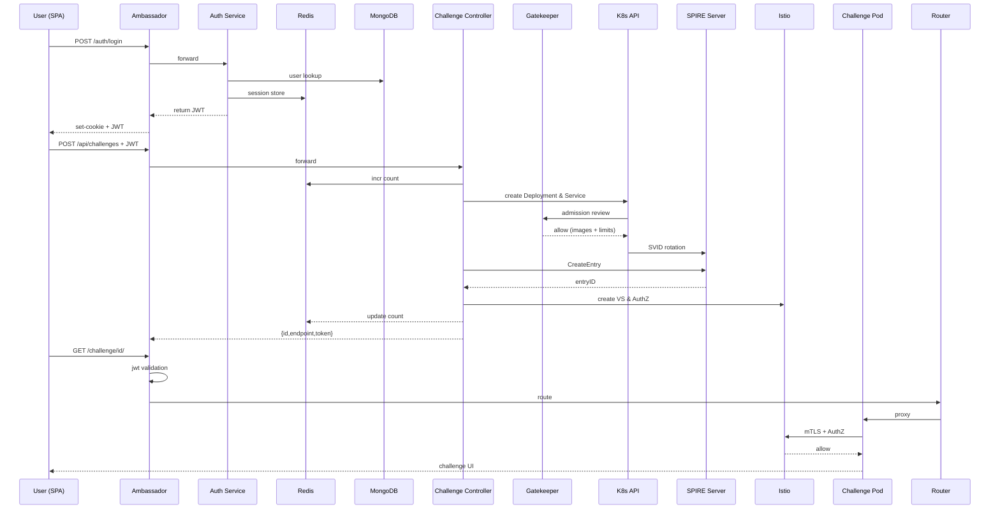

# Challenge Controller: Configuration Reference ( Proposed )

The Challenge Controller (namespace: `project-x-infra`) loads its settings, credentials, and permissions from the following Kubernetes objects. 

Each section shows the file, where it’s mounted in the pod, and which workloads or namespaces it affects.

---

## 1) ConfigMap: project-x-controller-config

File: `config/controller/project-x-controller-config.yaml`

Mount: `/etc/project-x/config.yaml` in `challenge-controller` pods

Applies To:  
- `Deployment: challenge-controller` (namespace `project-x-infra`)

Contents (excerpt):

```yaml
trustDomain: project-x.local
projectDomain: project-x.example.com

# Per-tier container registry prefixes
imageRegistryPerTier:
  tier-1: registry-tier1.project-x.local/ctf/tier1
  tier-2: registry-tier2.project-x.local/ctf/tier2
  tier-3: registry-tier3.project-x.local/ctf/tier3

defaultChallengeTTL: 2h

tierLimits:
  tier-1:
    maxChallenges: 3
    maxCPU: "500m"
    maxMemory: "1Gi"
  ...
spireServerAddr: spire-server.spire-system.svc.cluster.local:8081
spireParentID: "spiffe://project-x.local/spire/agent/k8s_sat/ns:project-x-challenges"

redisAddr: redis.project-x-infra.svc.cluster.local:6379
redisPassword: ""

jwtPrivateKeyPath: /etc/project-x/keys/private.key
jwtPublicKeyPath:  /etc/project-x/keys/public.key

challengeNamespace: project-x-challenges
istioNamespace: istio-system
```

---

## 2) Secret: jwt-keys

File: `config/controller/jwt-keys.yaml`

Mount: `/etc/project-x/keys/` in:
- `challenge-controller` pods
- `auth-service` pods

Contains:
- `private.key` (RSA-PKCS1 PEM)
- `public.key` (PKIX PEM)

Used By:
- Controller: signing scoped challenge JWTs  
- Auth Service: minting user JWTs

---

## 3) ServiceAccount & RBAC

### ServiceAccount

```yaml
apiVersion: v1
kind: ServiceAccount
metadata:
  name: challenge-controller
  namespace: project-x-infra
```

### ClusterRole

```yaml
apiVersion: rbac.authorization.k8s.io/v1
kind: ClusterRole
metadata:
  name: challenge-controller-role
rules:
  # Deployments & Services in project-x-challenges
- apiGroups: ["apps"]       resources: ["deployments"]        verbs: ["create","get","list","watch","delete","patch"]
- apiGroups: [""]           resources: ["services"]           verbs: ["create","get","list","watch","delete"]
  # Istio CRDs
- apiGroups: ["networking.istio.io"] resources: ["virtualservices"] verbs: ["create","get","list","watch","delete","patch"]
- apiGroups: ["security.istio.io"]    resources: ["authorizationpolicies"] verbs: ["create","get","list","watch","delete","patch"]
  # Events
- apiGroups: [""] resources: ["events"] verbs: ["create","patch"]
```

### ClusterRoleBinding

```yaml
apiVersion: rbac.authorization.k8s.io/v1
kind: ClusterRoleBinding
metadata:
  name: challenge-controller-binding
subjects:
- kind: ServiceAccount
  name: challenge-controller
  namespace: project-x-infra
roleRef:
  kind: ClusterRole
  name: challenge-controller-role
  apiGroup: rbac.authorization.k8s.io
```

These grant the controller pod exactly the rights to manage Deployments, Services, Istio CRDs, and Events in the `project-x-challenges` namespace.

---

## 4) OPA/Gatekeeper Policies

### Templates (`gatekeeper-system`)

- `signed-images-template.yaml`  
  Validates container images against `allowedRegistries` and Cosign signatures.

- `resource-limits-template.yaml`  
  Enforces `maxChallenges`, `maxCPU`, `maxMemory` per user & tier.

### Constraints (`gatekeeper-system`)

- `signed-images.yaml`  
  ```yaml
  kind: SignedImagesOnly
  spec:
    allowedRegistries:
      - registry-tier1.project-x.local/ctf/tier1
      - registry-tier2.project-x.local/ctf/tier2
      - registry-tier3.project-x.local/ctf/tier3
    cosignPublicKey: |
      -----BEGIN PUBLIC KEY-----
      MFkwEwYHKoZIzj0CAQYIKoZIzj0DAQcDQgAE...
      -----END PUBLIC KEY-----
  ```

- `resource-limits.yaml`  
  ```yaml
  kind: ProjectXResourceLimits
  spec:
    tierLimits:
      tier-1: { maxChallenges:3, maxCPU:"500m", maxMemory:"1Gi" }
      tier-2: { maxChallenges:5, maxCPU:"1000m", maxMemory:"2Gi" }
      tier-3: { maxChallenges:10,maxCPU:"2000m", maxMemory:"4Gi" }
  ```

These apply cluster-wide to *all* new Pods—including challenge pods—ensuring only signed images from the correct registry and that per-user concurrency/resource quotas are enforced.

---

## 5) Istio VirtualService & AuthorizationPolicy

The controller dynamically creates these in namespace `project-x-challenges` for each new challenge:

- **VirtualService**  
  Routes `https://{challengeID}.{projectDomain}` to the in-cluster `Service/{challengeID}` on port 8080.

- **AuthorizationPolicy**  
  Allows only:
  - Requests authenticated by Istio ingress (Ambassador) principal
  - JWT claim `challenge_id` matches the Pod’s label
  - JWT claim `user_id` matches the Pod’s label

This enforces zero-trust, mTLS, and claim-based access control at the Envoy proxy level.

---

## 6) SPIRE Server & Agent

### Server Config (`spire-system`)

File: `config/spire/server-config.hcl`  
- `trust_domain = "project-x.local"`
- Node/workload attestors (k8s_sat, k8s)
- Datastore plugin (Postgres)

### Agent Config (`spire-system`)

File: `config/spire/agent-config.hcl`  
- `server_address = "spire-server.spire-system.svc.cluster.local"`
- Workload attestor: k8s with required annotations
- Optional Docker attestor for image SIG verification

SPIRE issues per-Pod SVIDs, which Istio sidecars use for mTLS.  Pods without valid SVID cannot communicate in-mesh.

---

## 7) NetworkPolicies

Example per-challenge policy in `project-x-challenges` ns:

```yaml
kind: NetworkPolicy
apiVersion: networking.k8s.io/v1
metadata:
  name: challenge-isolation-allow-istio
  namespace: project-x-challenges
spec:
  podSelector: { matchLabels: { app: challenge } }
  policyTypes: ["Ingress","Egress"]
  ingress:
  - from:
    - podSelector: { matchLabels: { app: istio-proxy } }
  egress:
  - to:
    - podSelector: { matchLabels: { app: spire-agent } }
  - to:
    - namespaceSelector: { matchLabels: { name: istio-system } }
```

- **Ingress**: only accept from Istio sidecar proxy  
- **Egress**: only allow calls to SPIRE agent and Istio control-plane  

Prevents raw container–to–container or container–to–internet traffic.

---

## 8) PodSecurity (PSP/PSA)

Cluster-wide PodSecurityPolicy or PodSecurityAdmission:

```yaml
apiVersion: policy/v1beta1
kind: PodSecurityPolicy
metadata: { name: restricted }
spec:
  privileged: false
  hostNetwork: false
  runAsUser:
    rule: MustRunAsNonRoot
  seLinux: { rule: RunAsAny }
  volumes: ["configMap","secret","emptyDir","hostPath"]
  readOnlyRootFilesystem: true
  allowPrivilegeEscalation: false
```

Ensures containers cannot escalate privileges or access host networking/volumes.

---

## 9) ServiceAccount for Challenge Pods

```yaml
apiVersion: v1
kind: ServiceAccount
metadata:
  name: challenge-runner
  namespace: project-x-challenges
```

No additional RBAC bindings -- pods cannot call the Kubernetes API.  
Combined with PSP/PSA, they run non-root, with minimal capabilities.

---

### Summary

1. **All** config for controller (YAML, keys) lives in `project-x-infra` ns.  
2. **Controller** uses In-Cluster config + its SA to talk to K8s, Istio, SPIRE, and Redis.  
3. **Gatekeeper** blocks any Pod with unsigned/unknown-image or too many concurrent pods.  
4. **Istio** enforces mTLS and claim-based routing as soon as the Pod is admitted.  
5. **NetworkPolicies + PSP** lock down raw network and privilege surfaces.  

##
#
##


# Challenge Access Architecture ( Zero-Trust, No VPN, Extended Proposal )

This document describes how players authenticate, spawn, and access challenges in Project-X without any VPN overlay.  All isolation, authentication, and authorization are enforced by:

- Ambassador Edge Stack (Ingress, JWT mint/validate, path routing)  
- Istio Service Mesh (mTLS, VirtualService, AuthorizationPolicy)  
- SPIRE/SPIFFE (workload identity)  
- OPA/Gatekeeper (admission policies)  
- Kubernetes NetworkPolicies & PodSecurity admission  

---

## 1. Authentication & JWT Flow

1. **User Login**  
   - Frontend → `POST /auth/login`  
   - Ambassador → Auth Service → MongoDB & Redis  
   - Auth Service issues an RS-256 JWT with claims:  
     ```json
     {
       "iss":"project-x.auth",
       "sub":"<user_id>",
       "aud":["project-x"],
       "iat":..., "exp":...,
       "user_id":"<user_id>",
       "subscriptions":[...],
       "tier_limits":{...},
       "session_id":"<uuid>"
     }
     ```
   - JWT returned in JSON and/or `Set-Cookie: jwt=<token>; HttpOnly; Secure`

2. **JWT Validation**  
   - Ambassador `AuthService` CRD → `/auth/validate`  
   - Ambassador `jwt` filter → fetches JWKS from `/.well-known/jwks.json`

---

## 2. Challenge Spawn Flow

1. **Frontend** calls:
   ```
   POST /api/challenges
   Authorization: Bearer <JWT>
   Content-Type: application/json

   {
     "challengeType":"web",
     "tier":"tier-1"
   }
   ```

2. **Ambassador Mapping** routes to Challenge API:
   ```yaml
   kind: Mapping
   metadata: { name: challenge-api }
   spec:
     hostname: project-x.example.com
     prefix: /api/challenges/
     service: project-x-challenge-api.project-x-infra.svc.cluster.local:8080
     auth_service: projectx-authservice
     filters:
     - name: jwt
       jwt:
         issuer: "project-x.auth"
         jwksURI: "https://project-x.example.com/.well-known/jwks.json"
         audiences: ["project-x"]
         authHeader: "authorization"
         cookie: "jwt"
     - name: rate-limiting
       rateLimit:
         domain: project-x
         service: projectx-rate-limit
         descriptors:
         - key: "user_id"
           value: "%JWT_claim_user_id%"
     cors:
       origins: ["https://project-x.example.com"]
       methods: ["GET","POST","DELETE","OPTIONS"]
       headers: ["Authorization","Content-Type"]
       credentials: true
   ```

3. **Controller**:
   - Validates JWT, extracts `user_id`, `tier`  
   - Checks Redis counter: `user:<user_id>:tier:<tier>:count`  
   - Generates `challengeID` & SPIFFE ID  
   - Selects `imageRef` via `imageRegistryPerTier[tier]`  
   - Creates `Deployment` + `Service` in namespace `project-x-challenges`  
   - Calls SPIRE gRPC to register workload entry  
   - Creates Istio `VirtualService` & `AuthorizationPolicy`  
   - Increments Redis counter  
   - Mints scoped JWT:
     ```json
     {
       "iss":"project-x.auth",
       "sub":"<user_id>",
       "aud":["challenge:<challengeID>"],
       "iat":..., "exp":...,
       "user_id":"<user_id>",
       "challenge_id":"<challengeID>",
       "scope":"challenge_access"
     }
     ```
   - Returns:
     ```json
     {
       "id":"<challengeID>",
       "endpoint":"https://project-x.example.com/challenge/<challengeID>/",
       "expiresAt":"2025-06-01T12:34:56Z",
       "token":"<scopedJWT>"
     }
     ```

---

## 3. Challenge UI Access Flow

Players navigate within the SPA to:

```
https://project-x.example.com/challenge/<challengeID>/
```

Ambassador Mapping:

```yaml
kind: Mapping
metadata: { name: challenge-router }
spec:
  hostname: project-x.example.com
  prefix: /challenge/
  service: challenge-router.project-x-infra.svc.cluster.local:3000
  rewrite: "/"
  filters:
  - name: jwt
    jwt:
      issuer: "project-x.auth"
      jwksURI: "https://project-x.example.com/.well-known/jwks.json"
      audiences: ["challenge:*"]
      authHeader: "authorization"
      cookie: "jwt"
```

- **challenge-router** strips `/challenge/<id>` and reverse-proxies to:
  ```
  http://<id>.project-x-challenges.svc.cluster.local:8080
  ```

---

## 4. Istio Service Mesh Policies

### VirtualService (per challenge)

```yaml
apiVersion: networking.istio.io/v1alpha3
kind: VirtualService
metadata:
  name: <challengeID>
  namespace: project-x-challenges
spec:
  hosts: ["<challengeID>.project-x.example.com"]
  gateways: ["project-x-gateway"]
  http:
  - match:
    - uri:
        prefix: "/"
    route:
    - destination:
        host: "<challengeID>.project-x-challenges.svc.cluster.local"
        port: { number: 8080 }
```

### AuthorizationPolicy

```yaml
apiVersion: security.istio.io/v1beta1
kind: AuthorizationPolicy
metadata:
  name: <challengeID>-authz
  namespace: project-x-challenges
spec:
  selector:
    matchLabels:
      project-x/challenge-id: "<challengeID>"
  action: ALLOW
  rules:
  - from:
    - source:
        principals:
        - "cluster.local/ns/ambassador/sa/istio-ingressgateway-service-account"
    when:
    - key: request.auth.claims.challenge_id
      values: ["<challengeID>"]
    - key: request.auth.claims.user_id
      values: ["<userID>"]
```

---

## 5. OPA/Gatekeeper Admission

### SignedImagesOnly (prevents untrusted images)

```yaml
apiVersion: config.gatekeeper.sh/v1alpha1
kind: SignedImagesOnly
metadata:
  name: projectx-signed-images
spec:
  allowedRegistries:
    - "registry-tier1.project-x.local/ctf/tier1"
    - "registry-tier2.project-x.local/ctf/tier2"
    - "registry-tier3.project-x.local/ctf/tier3"
  cosignPublicKey: |
    -----BEGIN PUBLIC KEY-----
    MFkwEwYHKoZIzj0CAQYIKoZIzj0DAQcDQgAE...
    -----END PUBLIC KEY-----
```

### ProjectXResourceLimits (enforces per-user limits)

```yaml
apiVersion: config.gatekeeper.sh/v1alpha1
kind: ProjectXResourceLimits
metadata:
  name: projectx-tier-limits
spec:
  tierLimits:
    tier-1:
      maxChallenges: 3
      maxCPU: "500m"
      maxMemory: "1Gi"
    tier-2:
      maxChallenges: 5
      maxCPU: "1000m"
      maxMemory: "2Gi"
    tier-3:
      maxChallenges: 10
      maxCPU: "2000m"
      maxMemory: "4Gi"
```

---

## 6. Kubernetes NetworkPolicies

**Namespace**: `project-x-challenges`

```yaml
apiVersion: networking.k8s.io/v1
kind: NetworkPolicy
metadata:
  name: challenge-isolation
  namespace: project-x-challenges
spec:
  podSelector: { matchLabels: { app: challenge } }
  policyTypes: ["Ingress","Egress"]
  ingress:
  - from:
    - podSelector: { matchLabels: { app: istio-proxy } }
  egress:
  - to:
    - podSelector: { matchLabels: { app: spire-agent } }
  - to:
    - namespaceSelector: { matchLabels: { name: istio-system } }
  - to:
    - namespaceSelector: { matchLabels: { name: project-x-infra } }
```

- **Ingress**: only accept traffic from Envoy sidecar  
- **Egress**: only allow to SPIRE agent, Istio control plane, and project-x-infra services (e.g. Redis)

---

## 7. PodSecurity (PSP/PSA)

Cluster-wide policy ensures:

```yaml
apiVersion: policy/v1beta1
kind: PodSecurityPolicy
metadata:
  name: restricted
spec:
  privileged: false
  hostNetwork: false
  hostPID: false
  hostIPC: false
  runAsUser:
    rule: MustRunAsNonRoot
  readOnlyRootFilesystem: true
  allowPrivilegeEscalation: false
  volumes: ["configMap","emptyDir","secret","hostPath"]
```

All challenge pods (ServiceAccount: `challenge-runner`) run non-root, drop all capabilities, and cannot escalate privileges.

---

## Sequence Diagram



---

### Extended Summary

- **No VPN needed**: all traffic flows over HTTPS → Ambassador → Envoy proxies  
- **Zero-Trust**: JWT + mTLS + SPIFFE SVID + AuthorizationPolicy  
- **Policy-Driven**: OPA/Gatekeeper enforces image signing & resource limits  
- **Network Isolation**: CNI NetworkPolicies + PodSecurity  
- **Scalable**: Stateless controller, Redis counters, and k8s autoscaling  


