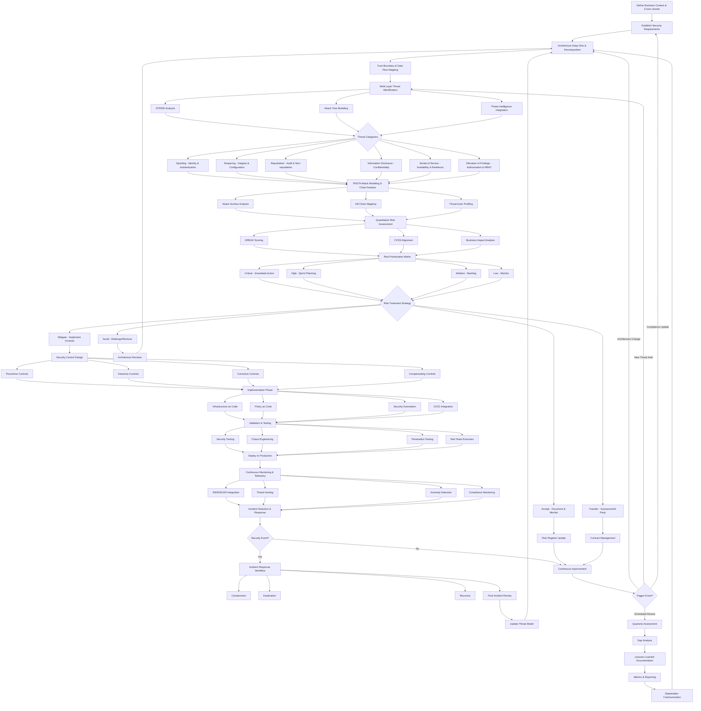
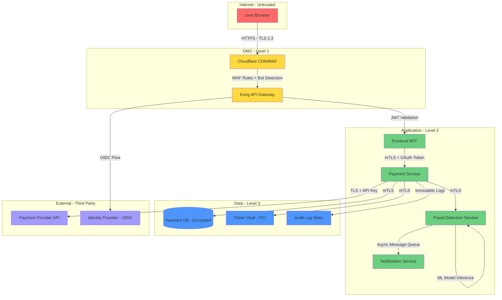
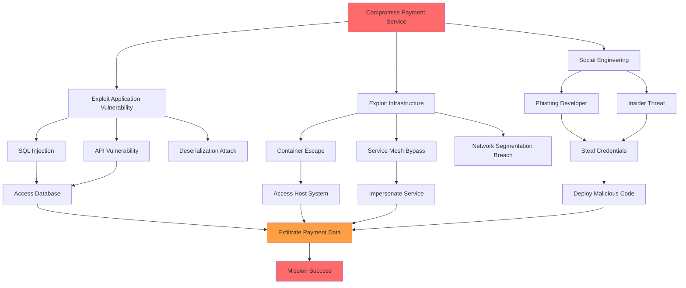

# Advanced Threat Modeling Framework for Cloud-Native Microservices Architecture

## Executive Summary

This framework integrates multiple threat modeling methodologies (STRIDE, PASTA, DREAD) with modern cloud-native security practices, service mesh architecture, and zero-trust principles. 
It provides a comprehensive, iterative approach to identifying, assessing, and mitigating security threats in distributed microservices environments.

---

## Enhanced Combined Threat Modeling Process



---

## Phase 1: Business Context & Asset Identification

### 1.1 Business Impact Analysis

**Critical Business Functions Mapping:**
```yaml
business_functions:
  payment_processing:
    criticality: "Tier-0"
    revenue_impact: "$50M/hour downtime"
    regulatory_requirements:
      - "PCI-DSS v4.0"
      - "PSD2 Strong Customer Authentication"
    dependencies:
      - "Payment Gateway API"
      - "Fraud Detection Service"
      - "Customer Wallet Service"
    
  user_authentication:
    criticality: "Tier-0"
    availability_target: "99.99%"
    security_controls:
      - "Multi-factor Authentication"
      - "Adaptive Authentication"
      - "Account Takeover Prevention"
    
  data_analytics_pipeline:
    criticality: "Tier-1"
    data_classification: "Confidential/PII"
    compliance_requirements:
      - "GDPR Art. 32 - Security of Processing"
      - "CCPA - Data Security"
    
  customer_support_portal:
    criticality: "Tier-2"
    uptime_sla: "99.5%"
    data_access: "PII with role-based access"
```

### 1.2 Crown Jewels Identification

**Asset Inventory & Classification:**
```yaml
critical_assets:
  databases:
    - name: "primary-customer-db"
      type: "PostgreSQL Multi-AZ Cluster"
      classification: "Restricted"
      data_types: ["PII", "Financial", "Health"]
      encryption:
        at_rest: "AES-256-GCM with AWS KMS"
        in_transit: "TLS 1.3 with client certificates"
      backup_strategy:
        rpo: "15 minutes"
        rto: "1 hour"
      access_controls:
        - "Service accounts with mTLS only"
        - "Break-glass emergency access logged"
        - "Column-level encryption for sensitive fields"
    
    - name: "session-store-redis"
      type: "Redis Sentinel Cluster"
      classification: "Confidential"
      data_types: ["Session Tokens", "OAuth Tokens"]
      ttl: "24 hours with automatic purge"
      encryption:
        at_rest: "Native Redis encryption"
        in_transit: "TLS with stunnel proxy"
  
  services:
    - name: "authentication-service"
      criticality: "Tier-0"
      attack_surface:
        - "Public API endpoints"
        - "Identity provider integration (OIDC)"
        - "Session management"
      threat_level: "High - Frequent attack target"
      security_controls:
        - "Rate limiting: 10 req/sec per IP"
        - "CAPTCHA on failed attempts"
        - "Geo-blocking for high-risk regions"
    
    - name: "payment-processing-service"
      criticality: "Tier-0"
      pci_scope: "In-scope"
      network_isolation: "Dedicated VPC with no internet egress"
      tokenization: "PCI-compliant token vault"
      fraud_detection: "Real-time ML-based scoring"
  
  secrets_and_keys:
    - name: "kms-master-keys"
      provider: "AWS KMS / Azure Key Vault"
      rotation_policy: "Automatic 90-day rotation"
      access_control: "Hardware Security Module (HSM) backed"
    
    - name: "service-mesh-root-ca"
      type: "X.509 Certificate Authority"
      validity: "10 years (offline root)"
      intermediate_ca_validity: "1 year with automatic rotation"
      certificate_transparency: "Enabled for public-facing certs"
    
    - name: "api-keys-secrets"
      storage: "HashiCorp Vault with dynamic secrets"
      access_pattern: "Just-in-time with 8-hour TTL"
      audit_logging: "All access events logged to SIEM"
```

### 1.3 Compliance & Regulatory Mapping

```yaml
compliance_requirements:
  pci_dss_v4:
    scope: ["payment-processing-service", "token-vault"]
    key_controls:
      - requirement: "1.2.1 - Network Segmentation"
        implementation: "Dedicated VPC with micro-segmentation"
        validation: "Quarterly network scans + annual audit"
      
      - requirement: "3.5.1 - Encryption Key Management"
        implementation: "AWS KMS with CloudHSM backing"
        validation: "Key rotation logs + access audits"
      
      - requirement: "11.3.1 - Penetration Testing"
        implementation: "Annual external + quarterly internal tests"
        validation: "Third-party attestation reports"
  
  gdpr:
    scope: "All services processing EU customer data"
    key_controls:
      - article: "Art. 25 - Data Protection by Design"
        implementation: "Privacy-by-default settings + encryption"
      
      - article: "Art. 32 - Security of Processing"
        implementation: "Pseudonymization + regular testing"
      
      - article: "Art. 33 - Breach Notification"
        implementation: "72-hour incident response SLA"
  
  sox:
    scope: ["Financial reporting systems"]
    key_controls:
      - control: "ITGC - Change Management"
        implementation: "Automated CI/CD with approval gates"
      
      - control: "ITGC - Access Controls"
        implementation: "RBAC with quarterly access reviews"
```

---

## Phase 2: Architecture Deep Dive & Decomposition

### 2.1 Service Mesh Topology Mapping

```yaml
service_mesh_architecture:
  control_plane:
    provider: "Istio 1.20+"
    components:
      - name: "istiod"
        replicas: 3
        resources:
          cpu: "2000m"
          memory: "4Gi"
        high_availability: true
        security_features:
          - "Automatic mTLS certificate management"
          - "Policy enforcement engine"
          - "Telemetry collection"
    
    security_policies:
      default_policy: "DENY_ALL"
      authentication_policy: "STRICT_MTLS"
      authorization_model: "Zero Trust - Explicit Allow"
  
  data_plane:
    proxy: "Envoy 1.28+"
    deployment_mode: "Sidecar injection"
    resource_limits:
      cpu: "500m"
      memory: "512Mi"
    
    security_configurations:
      - tls_version: "TLSv1.3"
        cipher_suites:
          - "TLS_AES_256_GCM_SHA384"
          - "TLS_CHACHA20_POLY1305_SHA256"
      
      - connection_limits:
          max_connections: 10000
          max_requests_per_connection: 1000
          connection_timeout: "30s"
      
      - circuit_breaker:
          consecutive_errors: 5
          interval: "30s"
          base_ejection_time: "30s"
          max_ejection_percent: 50
```

### 2.2 Container & Kubernetes Security Context

```yaml
kubernetes_security:
  cluster_hardening:
    - component: "API Server"
      configurations:
        - "Anonymous auth disabled"
        - "RBAC enabled with audit logging"
        - "Admission controllers: PodSecurityPolicy, NodeRestriction"
        - "Encryption at rest for etcd"
        - "Audit logging to immutable storage"
    
    - component: "Network Policies"
      default_policy: "DefaultDeny"
      egress_restrictions:
        - "Allow DNS to kube-dns only"
        - "Explicit allow-lists for external services"
        - "Block metadata API access (169.254.169.254)"
  
  pod_security_standards:
    baseline_policy:
      runAsNonRoot: true
      allowPrivilegeEscalation: false
      seccompProfile:
        type: "RuntimeDefault"
      capabilities:
        drop: ["ALL"]
        add: ["NET_BIND_SERVICE"]  # Only if needed
    
    restricted_policy:
      runAsUser: 1000
      fsGroup: 2000
      readOnlyRootFilesystem: true
      seccompProfile:
        type: "Localhost"
        localhostProfile: "profiles/audit.json"
  
  workload_identity:
    - name: "payment-service"
      service_account: "payment-sa"
      iam_bindings:
        - "roles/cloudkms.cryptoKeyEncrypterDecrypter"
        - "roles/secretmanager.secretAccessor"
      workload_identity_federation: true
      token_audience: "https://payment.internal"
      token_expiration: "3600s"
```

### 2.3 Multi-Cloud & Hybrid Architecture

```yaml
infrastructure_topology:
  primary_cloud: "AWS"
  regions:
    - name: "us-east-1"
      role: "Primary Production"
      availability_zones: 3
      services:
        - "EKS cluster with 50+ nodes"
        - "RDS PostgreSQL Multi-AZ"
        - "ElastiCache Redis Cluster"
      
    - name: "eu-west-1"
      role: "DR + EU Data Residency"
      replication: "Active-passive"
      failover_rto: "15 minutes"
  
  secondary_cloud: "Azure"
  regions:
    - name: "westus2"
      role: "Backup & Analytics Workloads"
      services:
        - "AKS cluster"
        - "Azure SQL Database"
        - "Synapse Analytics"
  
  network_connectivity:
    - type: "AWS Transit Gateway"
      connectivity: "Hub-and-spoke across regions"
      encryption: "IPSec VPN tunnels"
    
    - type: "Cloud Interconnect"
      provider: "Megaport"
      bandwidth: "10 Gbps"
      redundancy: "Dual circuits"
  
  edge_computing:
    - cdn_provider: "Cloudflare Enterprise"
      features:
        - "WAF with OWASP ruleset"
        - "DDoS protection (Layer 3-7)"
        - "Bot management"
        - "Rate limiting"
    
    - api_gateway: "Kong Enterprise"
      deployment: "Multi-region with geo-routing"
      security_plugins:
        - "JWT validation"
        - "OAuth 2.0 / OIDC"
        - "Rate limiting with Redis backend"
        - "Request/response transformation"
```

---

## Phase 3: Trust Boundaries & Data Flow Analysis

### 3.1 Trust Boundary Mapping

```yaml
trust_boundaries:
  level_0_untrusted:
    description: "Public internet - Zero trust"
    components:
      - "End-user browsers"
      - "Mobile applications"
      - "Third-party API consumers"
    security_controls:
      - "WAF + DDoS protection"
      - "API gateway with authentication"
      - "TLS 1.3 termination"
      - "Input validation & sanitization"
  
  level_1_dmz:
    description: "DMZ - Limited trust"
    components:
      - "API Gateway (Kong)"
      - "Load Balancers"
      - "CDN edge nodes"
    security_controls:
      - "Network ACLs"
      - "Security groups with minimal ports"
      - "Intrusion Detection System (IDS)"
  
  level_2_application:
    description: "Application tier - Authenticated services"
    components:
      - "Microservices in Kubernetes"
      - "Service mesh data plane"
    security_controls:
      - "mTLS between all services"
      - "Service-level authorization policies"
      - "Network policies (Calico/Cilium)"
      - "Runtime security (Falco)"
  
  level_3_data:
    description: "Data tier - Highest security"
    components:
      - "Primary databases"
      - "Secrets management (Vault)"
      - "KMS/HSM"
    security_controls:
      - "Private subnets with no internet access"
      - "Encryption at rest (always)"
      - "Audit logging of all access"
      - "IP whitelisting to application tier only"
  
  level_4_management:
    description: "Control plane - Administrative access"
    components:
      - "Kubernetes control plane"
      - "CI/CD systems (GitLab)"
      - "Monitoring & logging (Prometheus, ELK)"
    security_controls:
      - "Bastion hosts with MFA"
      - "Just-in-time privileged access"
      - "Comprehensive audit logging"
      - "Separate network segment"
```

### 3.2 Data Flow Diagrams (DFD)

**Critical Path: Payment Processing Flow**



**Data Flow Security Matrix:**

```yaml
data_flows:
  user_to_api_gateway:
    protocol: "HTTPS"
    encryption: "TLS 1.3"
    authentication: "OAuth 2.0 Bearer Token"
    authorization: "Scope-based access control"
    validation:
      - "Input sanitization (OWASP guidelines)"
      - "Rate limiting: 100 req/min per user"
      - "Payload size limit: 1MB"
    threats:
      - "T-001: Man-in-the-middle attacks"
      - "T-002: Token theft/replay"
      - "T-003: DDoS / Resource exhaustion"
  
  service_to_service:
    protocol: "gRPC over HTTP/2"
    encryption: "mTLS with certificate pinning"
    authentication: "SPIFFE/SPIRE identity"
    authorization: "Istio AuthorizationPolicy"
    validation:
      - "Schema validation (Protobuf)"
      - "Message size limits"
      - "Timeout enforcement: 5s"
    threats:
      - "T-010: Service impersonation"
      - "T-011: Certificate theft/compromise"
      - "T-012: Lateral movement"
  
  service_to_database:
    protocol: "PostgreSQL wire protocol"
    encryption: "TLS 1.3 with client certificates"
    authentication: "IAM database authentication"
    authorization: "Row-level security policies"
    validation:
      - "Prepared statements only (no dynamic SQL)"
      - "Connection pooling with limits"
      - "Query timeout: 30s"
    threats:
      - "T-020: SQL injection"
      - "T-021: Credential compromise"
      - "T-022: Data exfiltration"
      - "T-023: Privilege escalation"
```

---

## Phase 4: Enhanced STRIDE Threat Analysis

### 4.1 Spoofing Threats - Identity & Authentication

```yaml
spoofing_threats:
  S-001:
    title: "Service Identity Impersonation"
    description: |
      Attacker steals service mesh certificate or SPIFFE identity
      to impersonate legitimate microservice
    attack_vector:
      - "Compromised container with certificate access"
      - "Stolen private key from misconfigured volume mount"
      - "Exploit in certificate issuance process"
    affected_assets:
      - "All microservices in mesh"
      - "Service-to-service communication"
    likelihood: "Medium"
    impact: "Critical"
    dread_score:
      damage: 9
      reproducibility: 5
      exploitability: 6
      affected_users: 9
      discoverability: 5
      total: 34
    existing_controls:
      - "Short-lived certificates (1-hour TTL)"
      - "Automated rotation via cert-manager"
      - "Certificate pinning for critical services"
    recommended_mitigations:
      - "Implement hardware-backed key storage (TPM/HSM)"
      - "Certificate Transparency logging for all issuance"
      - "Anomaly detection on certificate requests"
      - "Mutual authentication with hardware attestation"
    residual_risk: "Low"
  
  S-002:
    title: "JWT Token Forgery"
    description: |
      Attacker forges JWT tokens due to weak signing keys,
      algorithm confusion (none/HS256), or key leakage
    attack_vector:
      - "Algorithm substitution (RS256 -> HS256)"
      - "Weak signing secret brute-forced"
      - "Key exposure in logs/config files"
    affected_assets:
      - "API Gateway authentication"
      - "User sessions"
      - "Service-to-service authorization"
    likelihood: "Low"
    impact: "High"
    dread_score:
      damage: 8
      reproducibility: 4
      exploitability: 5
      affected_users: 8
      discoverability: 6
      total: 31
    existing_controls:
      - "RS256 signing with 4096-bit keys"
      - "Key rotation every 90 days"
      - "Algorithm validation in middleware"
    recommended_mitigations:
      - "Implement JWT thumbprint verification"
      - "Add 'jti' claim for token revocation"
      - "Monitor for signature verification failures"
      - "Use short expiration times (15 min access, 7 day refresh)"
    residual_risk: "Low"
  
  S-003:
    title: "DNS Spoofing / Service Discovery Poisoning"
    description: |
      Attacker poisons CoreDNS or service registry to redirect
      traffic to malicious endpoints
    attack_vector:
      - "Compromise of CoreDNS pods"
      - "etcd manipulation if access gained"
      - "Service registry poisoning (Consul/etcd)"
    affected_assets:
      - "All service discovery mechanisms"
      - "Internal DNS resolution"
    likelihood: "Low"
    impact: "Critical"
    dread_score:
      damage: 10
      reproducibility: 3
      exploitability: 4
      affected_users: 10
      discoverability: 4
      total: 31
    existing_controls:
      - "DNSSEC validation"
      - "Service mesh with mTLS prevents MitM even if DNS poisoned"
      - "Restricted RBAC for DNS pods"
    recommended_mitigations:
      - "Implement DNS query logging and anomaly detection"
      - "Use service mesh native discovery (xDS protocol)"
      - "Certificate pinning for critical external services"
      - "Network policies preventing DNS pod compromise impact"
    residual_risk: "Low"
```

### 4.2 Tampering Threats - Integrity & Configuration

```yaml
tampering_threats:
  T-001:
    title: "Container Image Supply Chain Attack"
    description: |
      Malicious code injected into container images through
      compromised dependencies, base images, or build pipeline
    attack_vector:
      - "Compromised npm/pip package with backdoor"
      - "Malicious base image from Docker Hub"
      - "CI/CD pipeline compromise injecting code"
    affected_assets:
      - "All containerized services"
      - "Build pipeline"
      - "Container registries"
    likelihood: "Medium"
    impact: "Critical"
    dread_score:
      damage: 10
      reproducibility: 6
      exploitability: 7
      affected_users: 10
      discoverability: 5
      total: 38
    attack_chain:
      - step: 1
        action: "Attacker compromises popular npm package"
      - step: 2
        action: "Malicious code executed during 'npm install' in Dockerfile"
      - step: 3
        action: "Backdoor embedded in application container"
      - step: 4
        action: "Image signed and pushed to registry"
      - step: 5
        action: "Deployed to production via GitOps"
      - step: 6
        action: "Backdoor establishes C2 channel"
    existing_controls:
      - "Dependency scanning with Snyk/Dependabot"
      - "Image scanning with Trivy/Anchore"
      - "Use of private base images"
    recommended_mitigations:
      - "Implement Software Bill of Materials (SBOM) generation"
      - "Sigstore Cosign for image signing"
      - "Admission controller blocking unsigned images"
      - "Runtime integrity monitoring (Falco + eBPF)"
      - "Dependency pinning with hash verification"
      - "Isolated build environments (ephemeral runners)"
      - "Regular base image rebuilds from source"
    residual_risk: "Medium"
  
  T-002:
    title: "API Request/Response Manipulation"
    description: |
      Attacker intercepts and modifies API calls between services
      or from client to backend
    attack_vector:
      - "MitM attack if TLS misconfigured"
      - "Compromised service mesh proxy"
      - "Client-side code injection modifying requests"
    affected_assets:
      - "API transactions"
      - "Payment processing flows"
      - "User data updates"
    likelihood: "Low"
    impact: "High"
    dread_score:
      damage: 8
      reproducibility: 4
      exploitability: 5
      affected_users: 7
      discoverability: 6
      total: 30
    existing_controls:
      - "mTLS for all service-to-service communication"
      - "Request/response signing for critical APIs"
      - "Input validation on all endpoints"
    recommended_mitigations:
      - "Implement request/response payload signing (JWS)"
      - "Add integrity checks with HMAC for state-changing operations"
      - "Use idempotency keys for financial transactions"
      - "Monitor for unusual request patterns"
      - "Implement replay attack protection (nonce/timestamp)"
    residual_risk: "Low"
  
  T-003:
    title: "Infrastructure as Code (IaC) Tampering"
    description: |
      Unauthorized modifications to Terraform/Kubernetes manifests
      allowing backdoor access or privilege escalation
    attack_vector:
      - "Compromised developer account with repo access"
      - "Malicious pull request approved without review"
      - "Direct commit to main branch if protections bypass"
    affected_assets:
      - "Kubernetes cluster configuration"
      - "Cloud infrastructure (VPCs, IAM roles)"
      - "Service mesh policies"
    likelihood: "Low"
    impact: "Critical"
    dread_score:
      damage: 10
      reproducibility: 5
      exploitability: 6
      affected_users: 10
      discoverability: 4
      total: 35
    existing_controls:
      - "Branch protection with required reviews"
      - "Terraform Cloud with policy-as-code (Sentinel)"
      - "GitOps workflow with approval gates"
    recommended_mitigations:
      - "Mandatory code review by security team for IaC changes"
      - "Automated policy scanning (OPA/Kyverno)"
      - "Drift detection and auto-remediation"
      - "Audit logging of all infrastructure changes"
      - "Signed commits with GPG keys required"
      - "Immutable infrastructure patterns"
    residual_risk: "Low"
```

### 4.3 Repudiation Threats - Audit & Non-repudiation

```yaml
repudiation_threats:
  R-001:
    title: "Audit Log Tampering or Deletion"
    description: |
      Attacker modifies or deletes audit logs to hide malicious
      activity and evade detection
    attack_vector:
      - "Compromise of logging infrastructure (ELK stack)"
      - "Direct access to log storage (S3 buckets)"
      - "Privilege escalation to delete Kubernetes audit logs"
    affected_assets:
      - "Centralized logging system"
      - "Security audit trails"
      - "Compliance evidence"
    likelihood: "Medium"
    impact: "High"
    dread_score:
      damage: 8
      reproducibility: 5
      exploitability: 6
      affected_users: 9
      discoverability: 6
      total: 34
    existing_controls:
      - "Write-once storage (S3 Object Lock)"
      - "Separate logging infrastructure with minimal access"
      - "Log forwarding to SIEM in real-time"
    recommended_mitigations:
      - "Implement blockchain-based log integrity (e.g., Trillian)"
      - "Use hardware security modules (HSM) for log signing"
      - "Separate log retention with different access controls"
      - "Real-time log verification and alerting on anomalies"
      - "Regularly export logs to immutable archive (tape/glacier)"
      - "Implement log forwarding to multiple independent systems"
    residual_risk: "Low"
  
  R-002:
    title: "Transaction Non-repudiation Failure"
    description: |
      Lack of cryptographic proof for financial transactions
      allowing users or internal actors to deny actions
    attack_vector:
      - "User claims unauthorized transaction"
      - "Insufficient audit trail for transaction origin"
      - "Replay of transaction with modified details"
    affected_assets:
      - "Payment transactions"
      - "Account modifications"
      - "Admin actions"
    likelihood: "Low"
    impact: "Medium"
    dread_score:
      damage: 6
      reproducibility: 5
      exploitability: 4
      affected_users: 5
      discoverability: 7
      total: 27
    existing_controls:
      - "Transaction IDs with correlation across services"
      - "Timestamp and user ID captured"
      - "Database transaction logs"
    recommended_mitigations:
      - "Implement digital signatures for all financial transactions"
      - "Use blockchain or distributed ledger for audit trail"
      - "Capture device fingerprints and IP addresses"
      - "Implement strong customer authentication (SCA) per PSD2"
      - "Store signed transaction receipts immutably"
      - "Regular reconciliation audits"
    residual_risk: "Low"
  
  R-003:
    title: "Missing or Incomplete Audit Trails"
    description: |
      Critical security events not logged or logs lack sufficient
      context for investigation and compliance
    attack_vector:
      - "Logging not implemented for new services"
      - "Verbose logging disabled in production"
      - "Missing correlation IDs across distributed traces"
    affected_assets:
      - "Security incident investigations"
      - "Compliance audits"
      - "Forensic analysis capabilities"
    likelihood: "Medium"
    impact: "Medium"
    dread_score:
      damage: 5
      reproducibility: 7
      exploitability: 6
      affected_users: 6
      discoverability: 8
      total: 32
    existing_controls:
      - "Structured logging framework (ECS format)"
      - "Distributed tracing with OpenTelemetry"
      - "Correlation IDs in all requests"
    recommended_mitigations:
      - "Mandatory security logging requirements in SDLC"
      - "Automated validation of log completeness"
      - "Security event taxonomy (OCSF)"
      - "Periodic audit log review and gap analysis"
      - "Service-level logging SLOs"
      - "Centralized logging SDK/library enforcement"
    residual_risk: "Medium"
```

### 4.4 Information Disclosure - Confidentiality

```yaml
information_disclosure_threats:
  I-001:
    title: "Secrets Exposure in Container Images"
    description: |
      API keys, passwords, or certificates accidentally embedded
      in container images and pushed to registry
    attack_vector:
      - "Hardcoded secrets in application code"
      - "Secrets in environment variables in Dockerfile"
      - "Private keys committed to Git repository"
      - ".env files copied into image layers"
    affected_assets:
      - "Container images in registry"
      - "Git repository history"
      - "CI/CD pipeline logs"
    likelihood: "High"
    impact: "Critical"
    dread_score:
      damage: 10
      reproducibility: 8
      exploitability: 7
      affected_users: 9
      discoverability: 8
      total: 42
    existing_controls:
      - "Git pre-commit hooks scanning for secrets"
      - "Image scanning with secret detection (Trivy)"
      - "Use of Kubernetes Secrets instead of env vars"
    recommended_mitigations:
      - "Implement secret scanning in CI/CD (GitGuardian/TruffleHog)"
      - "Use external secret management (Vault/AWS Secrets Manager)"
      - "Implement dynamic secret injection at runtime"
      - "Regular automated scans of container registries"
      - "Mandatory .dockerignore with secret exclusions"
      - "Secret rotation upon detection of exposure"
      - "Use of sealed secrets or SOPS for GitOps"
    residual_risk: "Low"
  
  I-002:
    title: "Database Backup Exposure"
    description: |
      Unencrypted database backups stored in accessible locations
      or transferred over insecure channels
    attack_vector:
      - "S3 bucket misconfiguration (public access)"
      - "Backups on decommissioned storage media"
      - "Backup transfer without encryption"
      - "Snapshot sharing with untrusted accounts"
    affected_assets:
      - "Customer PII"
      - "Financial transaction history"
      - "Authentication credentials"
    likelihood: "Medium"
    impact: "Critical"
    dread_score:
      damage: 10
      reproducibility: 5
      exploitability: 6
      affected_users: 10
      discoverability: 7
      total: 38
    existing_controls:
      - "Backup encryption with KMS"
      - "Private S3 buckets with restrictive IAM"
      - "Backup retention policy (30 days)"
    recommended_mitigations:
      - "Implement backup encryption at multiple layers"
      - "Regular access audits for backup storage"
      - "Automated backup testing and validation"
      - "Backup access logging and monitoring"
      - "Use of separate encryption keys for backups"
      - "Secure backup transmission protocols (TLS + encryption)"
      - "Backup versioning with immutability"
    residual_risk: "Low"
  
  I-003:
    title: "Service Mesh Observability Data Leakage"
    description: |
      Sensitive data exposed through service mesh metrics, traces,
      or access logs (PII in URLs, request bodies logged)
    attack_vector:
      - "PII in URL query parameters captured in access logs"
      - "Request/response bodies in distributed traces"
      - "Metrics with high-cardinality labels containing PII"
      - "Unprotected observability endpoints"
    affected_assets:
      - "Prometheus metrics"
      - "Jaeger/Zipkin traces"
      - "Envoy access logs"
      - "Grafana dashboards"
    likelihood: "High"
    impact: "High"
    dread_score:
      damage: 8
      reproducibility: 7
      exploitability: 6
      affected_users: 7
      discoverability: 9
      total: 37
    existing_controls:
      - "Access logs sent to secure centralized logging"
      - "Observability stack behind authentication"
      - "Sampling of distributed traces (1% sampling)"
    recommended_mitigations:
      - "Implement PII scrubbing/redaction in logs and traces"
      - "Use parameterized URLs (POST bodies instead of query params)"
      - "Disable body logging for sensitive endpoints"
      - "Apply RBAC to observability stack"
      - "Encrypt traces and metrics in transit and at rest"
      - "Regular audits of logged data for PII"
      - "Implement data retention policies for observability data"
    residual_risk: "Medium"
  
  I-004:
    title: "Side-Channel Information Leakage"
    description: |
      Timing attacks, error messages, or resource consumption
      patterns reveal sensitive information
    attack_vector:
      - "Timing differences in authentication reveal valid usernames"
      - "Detailed error messages expose system internals"
      - "Resource usage patterns reveal user behavior"
      - "Cache timing attacks on encryption operations"
    affected_assets:
      - "Authentication endpoints"
      - "Database queries"
      - "Cryptographic operations"
    likelihood: "Medium"
    impact: "Medium"
    dread_score:
      damage: 5
      reproducibility: 6
      exploitability: 7
      affected_users: 6
      discoverability: 8
      total: 32
    existing_controls:
      - "Generic error messages in production"
      - "Rate limiting on authentication endpoints"
      - "Constant-time comparison for secrets"
    recommended_mitigations:
      - "Implement constant-time operations for all security-sensitive code"
      - "Use generic error responses (avoid enumeration)"
      - "Add random delays to prevent timing analysis"
      - "Monitor for enumeration attack patterns"
      - "Implement CAPTCHA on sensitive operations"
      - "Use blinding techniques for cryptographic operations"
    residual_risk: "Medium"
```

### 4.5 Denial of Service - Availability & Resilience

```yaml
denial_of_service_threats:
  D-001:
    title: "Resource Exhaustion - Container CPU/Memory Bombs"
    description: |
      Malicious or faulty service consumes excessive resources,
      impacting node and neighboring containers
    attack_vector:
      - "Algorithmic complexity attack (ReDoS, billion laughs)"
      - "Memory leak causing OOM kills"
      - "Infinite loop or CPU-intensive operation"
      - "Fork bomb in misconfigured container"
    affected_assets:
      - "Kubernetes worker nodes"
      - "Co-located services"
      - "Cluster stability"
    likelihood: "Medium"
    impact: "High"
    dread_score:
      damage: 7
      reproducibility: 7
      exploitability: 6
      affected_users: 8
      discoverability: 6
      total: 34
    existing_controls:
      - "Resource requests and limits set"
      - "Pod disruption budgets"
      - "Horizontal Pod Autoscaling"
    recommended_mitigations:
      - "Implement strict resource quotas per namespace"
      - "Use LimitRanges to enforce minimum/maximum resources"
      - "Deploy PodSecurityPolicies preventing privileged containers"
      - "Implement runtime security (Falco) detecting anomalies"
      - "Use vertical pod autoscaling for right-sizing"
      - "Implement pod priority classes for critical workloads"
      - "Set up node affinity/anti-affinity for blast radius reduction"
    residual_risk: "Low"
  
  D-002:
    title: "Service Mesh Control Plane Overload"
    description: |
      Excessive configuration changes or certificate requests
      overwhelm Istio control plane (istiod)
    attack_vector:
      - "Rapid service deployments triggering config pushes"
      - "Certificate rotation storms"
      - "Malicious pod repeatedly requesting certificates"
      - "Configuration changes causing full mesh reconfiguration"
    affected_assets:
      - "Istio control plane"
      - "Service mesh data plane (Envoy proxies)"
      - "Service-to-service communication"
    likelihood: "Low"
    impact: "Critical"
    dread_score:
      damage: 9
      reproducibility: 4
      exploitability: 5
      affected_users: 10
      discoverability: 5
      total: 33
    existing_controls:
      - "Control plane replicas: 3 instances"
      - "Resource limits on istiod pods"
      - "Certificate caching in Envoy"
    recommended_mitigations:
      - "Implement rate limiting on control plane API"
      - "Use HA control plane with automatic scaling"
      - "Implement certificate caching and longer TTLs (balance with rotation)"
      - "Monitor control plane health metrics"
      - "Implement gradual rollout strategies for config changes"
      - "Use namespace isolation to limit blast radius"
      - "Implement configuration validation webhooks"
    residual_risk: "Low"
  
  D-003:
    title: "Cascading Failure - Circuit Breaker Bypass"
    description: |
      Failure in one service propagates through dependencies,
      causing widespread outage despite circuit breakers
    attack_vector:
      - "Circuit breaker thresholds too permissive"
      - "Retry storms overwhelming failing service"
      - "Timeout configurations causing thread exhaustion"
      - "Synchronous dependencies without fallbacks"
    affected_assets:
      - "All dependent microservices"
      - "Customer-facing applications"
      - "Overall system availability"
    likelihood: "Medium"
    impact: "Critical"
    dread_score:
      damage: 9
      reproducibility: 6
      exploitability: 5
      affected_users: 10
      discoverability: 6
      total: 36
    existing_controls:
      - "Circuit breakers configured in Istio"
      - "Timeout policies per service"
      - "Retry policies with exponential backoff"
    recommended_mitigations:
      - "Implement bulkheads to isolate thread pools"
      - "Use asynchronous messaging for non-critical paths"
      - "Implement fallback responses and graceful degradation"
      - "Regular chaos engineering exercises (Chaos Mesh)"
      - "Implement health checks with proper thresholds"
      - "Use rate limiting at service boundaries"
      - "Implement request shedding when overloaded"
      - "Deploy across multiple failure domains"
    residual_risk: "Medium"
  
  D-004:
    title: "Distributed Denial of Service (DDoS)"
    description: |
      Large-scale attack overwhelming edge infrastructure
      (CDN, load balancers, API gateway)
    attack_vector:
      - "Volumetric attack (UDP/TCP flood)"
      - "Application-layer attack (HTTP flood)"
      - "Slowloris/slow POST attacks"
      - "Amplification attacks (DNS, NTP)"
    affected_assets:
      - "CDN and WAF"
      - "Load balancers"
      - "API Gateway"
      - "Public-facing services"
    likelihood: "High"
    impact: "High"
    dread_score:
      damage: 8
      reproducibility: 8
      exploitability: 9
      affected_users: 10
      discoverability: 9
      total: 44
    existing_controls:
      - "Cloudflare DDoS protection"
      - "WAF with rate limiting"
      - "Geo-blocking for high-risk regions"
    recommended_mitigations:
      - "Implement multiple layers of DDoS protection"
      - "Use Anycast routing for distributed traffic absorption"
      - "Deploy auto-scaling infrastructure"
      - "Implement bot detection and CAPTCHA challenges"
      - "Use SYN cookies and connection rate limiting"
      - "Maintain DDoS response playbooks"
      - "Conduct regular DDoS simulation exercises"
      - "Implement traffic scrubbing services"
    residual_risk: "Medium"
```

### 4.6 Elevation of Privilege - Authorization & RBAC

```yaml
elevation_of_privilege_threats:
  E-001:
    title: "Kubernetes RBAC Misconfiguration"
    description: |
      Overly permissive roles allowing unauthorized access
      to cluster resources or privilege escalation
    attack_vector:
      - "Service account with cluster-admin role"
      - "Wildcard permissions in RoleBinding"
      - "Default service account not restricted"
      - "Ability to create/modify ClusterRoleBindings"
    affected_assets:
      - "Kubernetes API server"
      - "All cluster resources"
      - "Secrets and ConfigMaps"
    likelihood: "Medium"
    impact: "Critical"
    dread_score:
      damage: 10
      reproducibility: 6
      exploitability: 7
      affected_users: 10
      discoverability: 7
      total: 40
    existing_controls:
      - "RBAC enabled on cluster"
      - "Separate namespaces per team/environment"
      - "Regular RBAC audits"
    recommended_mitigations:
      - "Implement least privilege principle for all service accounts"
      - "Use automated RBAC analysis tools (rbac-lookup, kubectl-who-can)"
      - "Disable default service account auto-mounting"
      - "Implement policy-as-code validation (OPA Gatekeeper)"
      - "Regular RBAC reviews and cleanup of unused roles"
      - "Implement just-in-time access for admin operations"
      - "Use admission controllers to prevent risky permissions"
      - "Implement RBAC for custom resources (CRDs)"
    residual_risk: "Low"
  
  E-002:
    title: "Container Escape - Runtime Vulnerability"
    description: |
      Attacker escapes container isolation to gain access
      to host system and potentially cluster control plane
    attack_vector:
      - "Kernel vulnerability exploitation (CVE-2022-0185 style)"
      - "Privileged container with host filesystem mounted"
      - "Docker socket mounted in container"
      - "CAP_SYS_ADMIN capability abuse"
    affected_assets:
      - "Kubernetes worker nodes"
      - "Host operating system"
      - "All containers on compromised node"
    likelihood: "Low"
    impact: "Critical"
    dread_score:
      damage: 10
      reproducibility: 3
      exploitability: 4
      affected_users: 10
      discoverability: 5
      total: 32
    existing_controls:
      - "Non-root containers enforced"
      - "Seccomp and AppArmor profiles"
      - "Read-only root filesystem"
      - "Regular node OS patching"
    recommended_mitigations:
      - "Use hardened container runtimes (gVisor, Kata Containers)"
      - "Implement runtime security monitoring (Falco)"
      - "Regularly update and patch kernel vulnerabilities"
      - "Use minimal base images (distroless, scratch)"
      - "Implement Pod Security Standards (restricted profile)"
      - "Drop all Linux capabilities by default"
      - "Use user namespaces for additional isolation"
      - "Implement eBPF-based runtime protection"
    residual_risk: "Low"
  
  E-003:
    title: "API Authorization Bypass"
    description: |
      Flaws in custom authorization logic allowing users
      to access resources beyond their privileges
    attack_vector:
      - "Missing authorization checks on endpoints"
      - "IDOR vulnerabilities (Insecure Direct Object References)"
      - "JWT scope/claim manipulation"
      - "Path traversal in resource IDs"
    affected_assets:
      - "API endpoints"
      - "User data and resources"
      - "Admin functionality"
    likelihood: "Medium"
    impact: "High"
    dread_score:
      damage: 8
      reproducibility: 7
      exploitability: 8
      affected_users: 7
      discoverability: 8
      total: 38
    existing_controls:
      - "OAuth 2.0 with scope-based authorization"
      - "Input validation on all endpoints"
      - "Unit tests covering authorization logic"
    recommended_mitigations:
      - "Implement centralized authorization service (OPA/Zanzibar)"
      - "Use policy-as-code for authorization rules"
      - "Implement attribute-based access control (ABAC)"
      - "Add authorization checks in every API handler"
      - "Use parameterized queries preventing injection"
      - "Implement resource-level permissions"
      - "Regular authorization testing and fuzzing"
      - "Deploy API security testing in CI/CD"
    residual_risk: "Medium"
  
  E-004:
    title: "Cloud IAM Privilege Escalation"
    description: |
      Misconfigured cloud IAM roles allowing escalation
      to admin-level access in AWS/Azure/GCP
    attack_vector:
      - "iam:PassRole allowing privilege escalation"
      - "Lambda/Function with excessive permissions"
      - "Service account with owner/admin role"
      - "Cross-account role assumption without restrictions"
    affected_assets:
      - "Cloud infrastructure"
      - "All managed services"
      - "Data storage (S3, blob storage)"
    likelihood: "Medium"
    impact: "Critical"
    dread_score:
      damage: 10
      reproducibility: 5
      exploitability: 6
      affected_users: 10
      discoverability: 6
      total: 37
    existing_controls:
      - "AWS Organizations with SCPs"
      - "CloudTrail logging all API calls"
      - "IAM Access Analyzer"
    recommended_mitigations:
      - "Implement least privilege for all IAM roles"
      - "Use permission boundaries to limit maximum permissions"
      - "Regular IAM policy reviews and rightsizing"
      - "Implement service control policies (SCPs)"
      - "Use temporary credentials with short TTLs"
      - "Implement cross-account access with external ID"
      - "Deploy automated IAM policy validation (Cloudsplaining)"
      - "Implement just-in-time privilege escalation workflows"
    residual_risk: "Low"
```

---

## Phase 5: PASTA Attack Modeling & Kill Chain Analysis

### 5.1 Attack Trees for Critical Threats

**Attack Tree: Payment Service Compromise**



**Attack Chain: Multi-Stage Supply Chain Attack**

```yaml
attack_scenario_001:
  name: "Supply Chain Compromise to Data Exfiltration"
  threat_actor: "APT Group / Nation-State"
  objective: "Steal customer PII and financial data"
  
  kill_chain:
    - phase: "Reconnaissance"
      tactic: "MITRE ATT&CK T1592 - Gather Victim Host Information"
      actions:
        - "Identify CI/CD pipeline technology stack"
        - "Enumerate public GitHub repositories"
        - "Discover npm dependencies used"
      detection_opportunities:
        - "Web scraping detection"
        - "Unusual GitHub API access patterns"
    
    - phase: "Weaponization"
      tactic: "MITRE ATT&CK T1195.002 - Compromise Software Supply Chain"
      actions:
        - "Compromise popular npm package (e.g., colors, faker)"
        - "Inject backdoor in package postinstall script"
        - "Publish malicious version to npm registry"
      detection_opportunities:
        - "Dependency version anomaly detection"
        - "npm package reputation scoring"
    
    - phase: "Delivery"
      tactic: "MITRE ATT&CK T1072 - Software Deployment Tools"
      actions:
        - "Wait for automated Dependabot update"
        - "Malicious dependency pulled during Docker build"
      detection_opportunities:
        - "Dependency scanning in CI/CD"
        - "SBOM generation and analysis"
    
    - phase: "Exploitation"
      tactic: "MITRE ATT&CK T1203 - Exploitation for Client Execution"
      actions:
        - "Backdoor executed during npm install"
        - "Reverse shell established to C2 server"
        - "Persistence via cron job in container"
      detection_opportunities:
        - "Behavioral analysis during build"
        - "Network egress monitoring"
        - "Runtime anomaly detection (Falco)"
    
    - phase: "Installation"
      tactic: "MITRE ATT&CK T1547 - Boot or Logon Autostart"
      actions:
        - "Backdoor embedded in application container"
        - "Image pushed to private registry"
        - "Deployed via GitOps (ArgoCD)"
      detection_opportunities:
        - "Image signing verification failure"
        - "Runtime integrity monitoring"
    
    - phase: "Command & Control"
      tactic: "MITRE ATT&CK T1071 - Application Layer Protocol"
      actions:
        - "Establish HTTPS C2 channel to attacker infrastructure"
        - "Beacon every 60 seconds for commands"
        - "Use DNS tunneling for data exfiltration"
      detection_opportunities:
        - "Unusual DNS queries"
        - "Network flow analysis"
        - "Threat intelligence feed matching"
    
    - phase: "Lateral Movement"
      tactic: "MITRE ATT&CK T1021 - Remote Services"
      actions:
        - "Steal service mesh certificates from container"
        - "Impersonate payment service identity"
        - "Access internal database service"
      detection_opportunities:
        - "Anomalous service-to-service communication"
        - "Certificate usage from unexpected source"
        - "Service mesh policy violations"
    
    - phase: "Data Exfiltration"
      tactic: "MITRE ATT&CK T1041 - Exfiltration Over C2 Channel"
      actions:
        - "Query customer database for PII"
        - "Encrypt data with attacker's public key"
        - "Exfiltrate via DNS tunneling and HTTPS"
      detection_opportunities:
        - "Abnormal database query patterns"
        - "Large data transfers to external IPs"
        - "DLP policy violations"
  
  estimated_timeline: "14-30 days from initial compromise to detection"
  
  mitigations:
    preventive:
      - "Dependency pinning with hash verification"
      - "Private npm registry with curated packages"
      - "Sigstore signing of all container images"
      - "Network policies blocking external DNS"
    
    detective:
      - "Runtime behavioral monitoring with Falco"
      - "SIEM correlation rules for supply chain indicators"
      - "Threat hunting for C2 beaconing patterns"
    
    corrective:
      - "Automated incident response playbooks"
      - "Container image quarantine and rollback"
      - "Certificate revocation and rotation"
```

### 5.2 Threat Actor Profiling

```yaml
threat_actors:
  external_opportunistic:
    profile: "Script kiddies, automated bots"
    motivation: "Financial gain, ransomware"
    sophistication: "Low"
    likely_attacks:
      - "Credential stuffing"
      - "Exploitation of known vulnerabilities"
      - "DDoS attacks"
    likelihood: "High"
    
  external_targeted:
    profile: "Organized cybercrime groups"
    motivation: "Financial theft, fraud"
    sophistication: "Medium to High"
    likely_attacks:
      - "Phishing campaigns"
      - "Business email compromise"
      - "Supply chain attacks"
      - "Ransomware with double extortion"
    likelihood: "Medium"
  
  nation_state:
    profile: "APT groups sponsored by foreign governments"
    motivation: "Espionage, disruption"
    sophistication: "Advanced"
    likely_attacks:
      - "Zero-day exploitation"
      - "Advanced persistent threats"
      - "Supply chain compromise"
      - "Infrastructure sabotage"
    likelihood: "Low (but high impact)"
  
  malicious_insider:
    profile: "Disgruntled employee, contractor"
    motivation: "Revenge, financial gain"
    sophistication: "Medium (leverages insider knowledge)"
    likely_attacks:
      - "Data theft/exfiltration"
      - "Sabotage of systems"
      - "Backdoor installation"
      - "Privilege abuse"
    likelihood: "Low"
    
  negligent_insider:
    profile: "Careless or untrained employee"
    motivation: "None (unintentional)"
    sophistication: "N/A"
    likely_attacks:
      - "Accidental data exposure"
      - "Misconfiguration"
      - "Falling for phishing"
      - "Lost devices"
    likelihood: "High"
```

---

## Phase 6: Quantitative Risk Assessment

### 6.1 Enhanced DREAD Scoring Matrix

```yaml
dread_methodology:
  damage_potential:
    10: "Complete system compromise, massive data breach"
    8: "Significant data loss or service disruption"
    6: "Partial data compromise or limited outage"
    4: "Minor data exposure or service degradation"
    2: "Minimal impact, easily recoverable"
  
  reproducibility:
    10: "Attack can be automated and repeated trivially"
    8: "Attack is easily repeatable with public tools"
    6: "Attack requires some skill but documented"
    4: "Attack requires significant expertise"
    2: "Attack is theoretical or extremely difficult"
  
  exploitability:
    10: "No authentication required, trivial to exploit"
    8: "Requires minimal authentication, easy exploit"
    6: "Requires standard user privileges"
    4: "Requires privileged access or complex attack"
    2: "Requires extensive resources and time"
  
  affected_users:
    10: "All users and customers impacted"
    8: "Large majority of users (>50%)"
    6: "Significant subset of users (10-50%)"
    4: "Small number of users (<10%)"
    2: "Only administrators or single user"
  
  discoverability:
    10: "Information is public or easily found"
    8: "Vulnerability scanners detect it easily"
    6: "Requires some investigation to discover"
    4: "Requires significant analysis"
    2: "Extremely difficult to discover"

risk_matrix:
  critical: "DREAD score 40-50"
  high: "DREAD score 30-39"
  medium: "DREAD score 20-29"
  low: "DREAD score 10-19"
```

### 6.2 CVSS Alignment

```yaml
cvss_mapping:
  example_vulnerability:
    title: "Container Runtime Escape (CVE-2024-XXXX equivalent)"
    
    cvss_v3_vector: "CVSS:3.1/AV:N/AC:L/PR:L/UI:N/S:C/C:H/I:H/A:H"
    
    base_score: 9.9
    base_metrics:
      attack_vector: "Network (AV:N)"
      attack_complexity: "Low (AC:L)"
      privileges_required: "Low (PR:L)"
      user_interaction: "None (UI:N)"
      scope: "Changed (S:C)"
      confidentiality_impact: "High (C:H)"
      integrity_impact: "High (I:H)"
      availability_impact: "High (A:H)"
    
    temporal_score: 9.1
    temporal_metrics:
      exploit_code_maturity: "Functional (E:F)"
      remediation_level: "Official Fix (RL:O)"
      report_confidence: "Confirmed (RC:C)"
    
    environmental_score: 9.5
    environmental_metrics:
      confidentiality_requirement: "High (CR:H)"
      integrity_requirement: "High (IR:H)"
      availability_requirement: "High (AR:H)"
    
    dread_correlation:
      damage: 10
      reproducibility: 8
      exploitability: 6
      affected_users: 10
      discoverability: 7
      total: 41
```

### 6.3 Business Impact Analysis

```yaml
impact_assessment:
  financial_impact:
    data_breach_cost:
      per_record: "$150 (Ponemon Institute average)"
      estimated_exposure: "10M customer records"
      total_potential_cost: "$1.5B"
    
    downtime_cost:
      revenue_per_hour: "$50M"
      rto_target: "1 hour"
      maximum_acceptable_outage: "4 hours"
      potential_revenue_loss: "$200M"
    
    regulatory_fines:
      gdpr: "Up to 4% of global revenue or €20M"
      pci_dss: "Up to $500K per incident"
      ccpa: "Up to $7,500 per violation"
  
  reputational_impact:
    customer_churn:
      estimated_percentage: "15%"
      customer_lifetime_value: "$2,000"
      total_impact: "$300M"
    
    brand_damage:
      recovery_timeline: "12-24 months"
      marketing_cost_increase: "50%"

That was **not** the end! Section 6.3 got cut off mid-sentence. Let me continue from where it stopped and complete the entire framework:

---

## Phase 6: Quantitative Risk Assessment (continued)

### 6.3 Business Impact Analysis (continued)

```yaml
impact_assessment:
  financial_impact:
    data_breach_cost:
      per_record: "$150 (Ponemon Institute average)"
      estimated_exposure: "10M customer records"
      total_potential_cost: "$1.5B"
    
    downtime_cost:
      revenue_per_hour: "$50M"
      rto_target: "1 hour"
      maximum_acceptable_outage: "4 hours"
      potential_revenue_loss: "$200M"
    
    regulatory_fines:
      gdpr: "Up to 4% of global revenue or €20M"
      pci_dss: "Up to $500K per incident"
      ccpa: "Up to $7,500 per violation"
  
  reputational_impact:
    customer_churn:
      estimated_percentage: "15%"
      customer_lifetime_value: "$2,000"
      total_impact: "$300M"
    
    brand_damage:
      recovery_timeline: "12-24 months"
      marketing_cost_increase: "50%"
      competitive_disadvantage: "Loss of market leadership"
    
    media_coverage:
      negative_press_value: "Immeasurable but significant"
      investor_confidence: "Stock price impact 10-30%"
  
  operational_impact:
    incident_response:
      estimated_duration: "30-90 days"
      team_resources: "20 FTEs dedicated"
      external_consultants: "$5M-$10M"
    
    recovery_costs:
      system_rebuilding: "$2M-$5M"
      data_restoration: "$1M-$3M"
      customer_notification: "$500K"
      credit_monitoring_services: "$10M (2 years)"
  
  legal_impact:
    litigation:
      class_action_lawsuits: "High probability"
      estimated_settlement: "$50M-$200M"
      legal_fees: "$10M-$30M"
    
    regulatory_investigations:
      number_of_jurisdictions: "Multiple (US, EU, APAC)"
      compliance_remediation: "$5M-$15M"
```

---

## Phase 7: Risk Prioritization & Treatment

### 7.1 Risk Priority Matrix

```yaml
risk_register:
  RISK-001:
    id: "RISK-001"
    title: "Container Image Supply Chain Attack"
    category: "Tampering"
    dread_score: 38
    cvss_score: 8.8
    business_impact: "Critical"
    likelihood: "Medium"
    risk_level: "Critical"
    affected_assets:
      - "All containerized microservices"
      - "CI/CD pipeline"
      - "Container registry"
    current_controls:
      - "Image scanning with Trivy"
      - "Dependency scanning with Snyk"
    control_effectiveness: "Partial"
    residual_risk: "High"
    treatment_decision: "Mitigate"
    owner: "Security Architecture Team"
    due_date: "2026-03-31"
  
  RISK-002:
    id: "RISK-002"
    title: "Secrets Exposure in Container Images"
    category: "Information Disclosure"
    dread_score: 42
    cvss_score: 9.1
    business_impact: "Critical"
    likelihood: "High"
    risk_level: "Critical"
    affected_assets:
      - "Container images"
      - "Git repositories"
      - "All services with credentials"
    current_controls:
      - "Git pre-commit hooks"
      - "Manual code reviews"
    control_effectiveness: "Low"
    residual_risk: "Critical"
    treatment_decision: "Mitigate (immediate)"
    owner: "Platform Engineering"
    due_date: "2026-02-15"
  
  RISK-003:
    id: "RISK-003"
    title: "Kubernetes RBAC Misconfiguration"
    category: "Elevation of Privilege"
    dread_score: 40
    cvss_score: 8.6
    business_impact: "Critical"
    likelihood: "Medium"
    risk_level: "Critical"
    affected_assets:
      - "Kubernetes clusters"
      - "All cluster resources"
      - "Secrets and ConfigMaps"
    current_controls:
      - "RBAC enabled"
      - "Quarterly audits"
    control_effectiveness: "Moderate"
    residual_risk: "Medium"
    treatment_decision: "Mitigate"
    owner: "Platform Team"
    due_date: "2026-04-30"
  
  RISK-004:
    id: "RISK-004"
    title: "DDoS Attack on Public Endpoints"
    category: "Denial of Service"
    dread_score: 44
    cvss_score: 7.5
    business_impact: "High"
    likelihood: "High"
    risk_level: "High"
    affected_assets:
      - "API Gateway"
      - "CDN/WAF"
      - "Public-facing services"
    current_controls:
      - "Cloudflare DDoS protection"
      - "Rate limiting"
    control_effectiveness: "High"
    residual_risk: "Medium"
    treatment_decision: "Accept with monitoring"
    owner: "Infrastructure Team"
    review_date: "2026-06-30"
```

### 7.2 Risk Treatment Strategies

```yaml
risk_treatment_options:
  mitigate:
    description: "Implement security controls to reduce likelihood or impact"
    applicable_scenarios:
      - "High/Critical risks with feasible controls"
      - "Cost of mitigation < potential loss"
      - "Technology solutions available"
    
    decision_criteria:
      - "Control cost-effectiveness analysis"
      - "Implementation timeline acceptable"
      - "Residual risk tolerance met"
    
    examples:
      - risk_id: "RISK-002"
        controls:
          - "Deploy GitGuardian enterprise"
          - "Implement HashiCorp Vault"
          - "Mandatory secret scanning in CI/CD"
        estimated_cost: "$200K/year"
        implementation_time: "2 months"
        residual_risk_reduction: "95%"
  
  accept:
    description: "Acknowledge risk and proceed without additional controls"
    applicable_scenarios:
      - "Low-risk items below risk appetite"
      - "Cost of mitigation > potential loss"
      - "Compensating controls sufficient"
    
    decision_criteria:
      - "Risk within organizational tolerance"
      - "Signed-off by senior management"
      - "Regular review scheduled"
    
    examples:
      - risk_id: "RISK-015"
        title: "Minor information disclosure in debug logs"
        justification: "Low business impact, expensive to fix"
        compensating_controls:
          - "Access logs restricted to security team"
          - "Automated PII redaction in logs"
        approver: "CISO"
        review_frequency: "Quarterly"
  
  transfer:
    description: "Shift financial impact to third party (insurance, outsourcing)"
    applicable_scenarios:
      - "Catastrophic but low-probability events"
      - "Outsourced services with SLAs"
      - "Regulatory requirement for insurance"
    
    decision_criteria:
      - "Insurance premium < potential loss"
      - "Coverage terms acceptable"
      - "Provider financially stable"
    
    examples:
      - risk_id: "RISK-025"
        title: "Catastrophic data breach"
        transfer_mechanism: "Cyber insurance policy"
        coverage_amount: "$100M"
        annual_premium: "$500K"
        deductible: "$1M"
        exclusions:
          - "Nation-state attacks"
          - "Known vulnerabilities not patched"
  
  avoid:
    description: "Eliminate risk by removing functionality or redesigning"
    applicable_scenarios:
      - "Risk exceeds organizational tolerance"
      - "No feasible mitigation available"
      - "Feature not business-critical"
    
    decision_criteria:
      - "Business impact of removal acceptable"
      - "Alternative solutions available"
      - "Strategic alignment maintained"
    
    examples:
      - risk_id: "RISK-030"
        title: "Legacy authentication system vulnerabilities"
        avoidance_strategy: "Decommission legacy system"
        migration_plan: "Move all users to new OIDC system"
        timeline: "6 months"
        cost: "$1M"
```

---

## Phase 8: Security Control Design & Implementation

### 8.1 Defense in Depth Strategy

```yaml
security_layers:
  layer_1_perimeter:
    controls:
      - type: "Preventive"
        name: "Web Application Firewall (WAF)"
        implementation: "Cloudflare Enterprise"
        configuration:
          - "OWASP Core Rule Set"
          - "Custom rules for API protection"
          - "Bot management with ML"
        effectiveness: "95% of automated attacks blocked"
      
      - type: "Preventive"
        name: "DDoS Protection"
        implementation: "Cloudflare Magic Transit"
        capacity: "Unlimited volumetric protection"
        sla: "99.99% uptime"
      
      - type: "Detective"
        name: "Edge Logging & Analytics"
        implementation: "Cloudflare Analytics + SIEM integration"
        retention: "90 days hot, 1 year archive"
  
  layer_2_network:
    controls:
      - type: "Preventive"
        name: "Network Segmentation"
        implementation: "VPC with private subnets + Security Groups"
        configuration:
          - "Default deny all traffic"
          - "Explicit allow-lists per service"
          - "No direct internet access for data tier"
      
      - type: "Preventive"
        name: "Service Mesh Network Policies"
        implementation: "Istio AuthorizationPolicy + Calico NetworkPolicy"
        configuration:
          - "Default deny-all policy"
          - "Service-to-service whitelist"
          - "Egress restrictions to external APIs"
      
      - type: "Detective"
        name: "Network Flow Monitoring"
        implementation: "AWS VPC Flow Logs + Suricata IDS"
        analysis: "Real-time anomaly detection with ML"
  
  layer_3_application:
    controls:
      - type: "Preventive"
        name: "API Gateway Security"
        implementation: "Kong Enterprise with plugins"
        features:
          - "OAuth 2.0 / OIDC authentication"
          - "JWT validation and verification"
          - "Rate limiting (per-user, per-IP, global)"
          - "Request/response transformation"
          - "Schema validation (OpenAPI)"
      
      - type: "Preventive"
        name: "Service Mesh mTLS"
        implementation: "Istio with SPIFFE/SPIRE"
        configuration:
          - "STRICT mTLS enforcement"
          - "Automatic certificate rotation (1-hour TTL)"
          - "Certificate pinning for critical services"
      
      - type: "Preventive"
        name: "Input Validation & Sanitization"
        implementation: "Framework-level middleware"
        standards:
          - "OWASP Input Validation Cheat Sheet"
          - "Content Security Policy headers"
          - "Output encoding for XSS prevention"
      
      - type: "Detective"
        name: "Application Security Monitoring"
        implementation: "Datadog APM + Custom instrumentation"
        metrics:
          - "Authentication failures"
          - "Authorization denials"
          - "Input validation errors"
          - "Suspicious activity patterns"
  
  layer_4_runtime:
    controls:
      - type: "Preventive"
        name: "Container Security Policies"
        implementation: "Pod Security Standards (Restricted)"
        enforcement:
          - "Non-root containers required"
          - "Read-only root filesystem"
          - "Privilege escalation blocked"
          - "Host namespaces prohibited"
      
      - type: "Preventive"
        name: "Runtime Security Profiles"
        implementation: "Seccomp + AppArmor/SELinux"
        configuration:
          - "Custom seccomp profiles per service"
          - "Syscall whitelisting"
          - "File system access controls"
      
      - type: "Detective"
        name: "Runtime Threat Detection"
        implementation: "Falco with custom rules"
        detection_rules:
          - "Unexpected process execution"
          - "Suspicious network connections"
          - "File integrity violations"
          - "Privilege escalation attempts"
      
      - type: "Corrective"
        name: "Automated Response"
        implementation: "Falco + Kubernetes Admission Controller"
        actions:
          - "Pod termination on critical alert"
          - "Network isolation of compromised container"
          - "Automatic incident ticket creation"
  
  layer_5_data:
    controls:
      - type: "Preventive"
        name: "Encryption at Rest"
        implementation: "Multi-layer encryption strategy"
        layers:
          - "Disk encryption: AWS EBS encryption (AES-256)"
          - "Database encryption: Transparent Data Encryption"
          - "Column-level encryption: Application-managed with KMS"
          - "Backup encryption: Separate KMS keys"
      
      - type: "Preventive"
        name: "Encryption in Transit"
        implementation: "TLS everywhere"
        configuration:
          - "TLS 1.3 minimum"
          - "Perfect Forward Secrecy (PFS)"
          - "HSTS with preload"
          - "Certificate transparency monitoring"
      
      - type: "Preventive"
        name: "Data Access Controls"
        implementation: "Database-level security"
        features:
          - "Row-level security (RLS)"
          - "Column-level masking"
          - "Audit logging of all queries"
          - "IP whitelisting to application tier only"
      
      - type: "Detective"
        name: "Data Loss Prevention (DLP)"
        implementation: "Custom DLP solution"
        monitoring:
          - "Database query pattern analysis"
          - "Large data export detection"
          - "Unusual access patterns"
          - "PII exfiltration attempts"
  
  layer_6_identity:
    controls:
      - type: "Preventive"
        name: "Multi-Factor Authentication (MFA)"
        implementation: "FIDO2 / WebAuthn + TOTP"
        enforcement:
          - "Required for all human users"
          - "Phishing-resistant MFA for admins"
          - "Adaptive authentication based on risk"
      
      - type: "Preventive"
        name: "Workload Identity"
        implementation: "SPIFFE/SPIRE + Cloud IAM"
        features:
          - "Service identity with x.509 certificates"
          - "Automatic credential rotation"
          - "Workload attestation"
      
      - type: "Preventive"
        name: "Privileged Access Management"
        implementation: "HashiCorp Boundary + Just-in-Time access"
        workflow:
          - "Break-glass access requires approval"
          - "Session recording for audit"
          - "Automatic credential rotation post-use"
      
      - type: "Detective"
        name: "Identity Threat Detection"
        implementation: "Auth0 Anomaly Detection + Custom rules"
        detection:
          - "Impossible travel"
          - "Brute force attempts"
          - "Account takeover indicators"
```

### 8.2 Security Control Implementation Roadmap

```yaml
implementation_phases:
  phase_1_immediate:
    timeline: "0-3 months"
    priority: "Critical risks"
    
    initiatives:
      - name: "Secret Management Overhaul"
        objective: "Eliminate secrets in images and code"
        deliverables:
          - "Deploy HashiCorp Vault to production"
          - "Migrate all secrets from env vars to Vault"
          - "Implement dynamic secret generation"
          - "Enable secret scanning in CI/CD (GitGuardian)"
        budget: "$200K"
        team: "Platform Engineering (4 FTEs)"
        success_metrics:
          - "Zero secrets found in image scans"
          - "100% of services using Vault"
          - "Secret rotation < 24 hours"
      
      - name: "Container Image Security"
        objective: "Prevent supply chain attacks"
        deliverables:
          - "Implement Sigstore Cosign signing"
          - "Deploy admission controller enforcing signatures"
          - "Generate SBOM for all images"
          - "Establish private base image repository"
        budget: "$150K"
        team: "Security Engineering (3 FTEs)"
        success_metrics:
          - "100% images signed and verified"
          - "SBOM available for all deployments"
          - "Vulnerability remediation SLA < 7 days (critical)"
      
      - name: "RBAC Hardening"
        objective: "Eliminate excessive permissions"
        deliverables:
          - "Audit all RBAC roles and bindings"
          - "Implement least privilege principle"
          - "Deploy OPA Gatekeeper policies"
          - "Implement just-in-time access for admins"
        budget: "$100K"
        team: "Platform Team (2 FTEs)"
        success_metrics:
          - "90% reduction in cluster-admin bindings"
          - "Zero wildcard permissions in production"
          - "100% policy compliance in deployments"
  
  phase_2_short_term:
    timeline: "3-6 months"
    priority: "High risks"
    
    initiatives:
      - name: "Zero Trust Architecture"
        objective: "Implement comprehensive zero trust"
        deliverables:
          - "Deploy service mesh to all services"
          - "Enable STRICT mTLS cluster-wide"
          - "Implement fine-grained authorization policies"
          - "Deploy workload identity (SPIFFE/SPIRE)"
        budget: "$500K"
        team: "Platform + Security (6 FTEs)"
        success_metrics:
          - "100% service-to-service traffic encrypted"
          - "Zero trust policies for all critical services"
          - "Reduced lateral movement risk by 90%"
      
      - name: "Enhanced Monitoring & Detection"
        objective: "Improve security visibility and response"
        deliverables:
          - "Deploy Falco runtime security monitoring"
          - "Integrate SIEM with all security tools"
          - "Implement automated response playbooks"
          - "Establish SOC with 24/7 monitoring"
        budget: "$800K"
        team: "Security Operations (8 FTEs)"
        success_metrics:
          - "MTTD (Mean Time to Detect) < 15 minutes"
          - "MTTR (Mean Time to Respond) < 1 hour"
          - "90% of incidents auto-remediated"
      
      - name: "Data Protection Enhancement"
        objective: "Strengthen data security controls"
        deliverables:
          - "Implement field-level encryption"
          - "Deploy DLP solution"
          - "Enable database activity monitoring"
          - "Implement data classification automation"
        budget: "$400K"
        team: "Data Security (4 FTEs)"
        success_metrics:
          - "100% of PII fields encrypted"
          - "Zero undetected data exfiltration attempts"
          - "Data classification accuracy > 95%"
  
  phase_3_medium_term:
    timeline: "6-12 months"
    priority: "Medium risks + continuous improvement"
    
    initiatives:
      - name: "Advanced Threat Protection"
        objective: "Implement proactive threat hunting"
        deliverables:
          - "Establish threat hunting program"
          - "Deploy deception technology (honeypots)"
          - "Implement behavioral analytics"
          - "Regular red team exercises"
        budget: "$600K"
        team: "Threat Intel + Red Team (5 FTEs)"
        success_metrics:
          - "Monthly threat hunting reports"
          - "Proactive threat discovery > 5 per quarter"
          - "Red team success rate < 20%"
      
      - name: "Security Automation & Orchestration"
        objective: "Reduce manual security operations"
        deliverables:
          - "Deploy SOAR platform"
          - "Automate vulnerability management"
          - "Implement security-as-code framework"
          - "Establish security metrics dashboard"
        budget: "$400K"
        team: "Security Engineering (3 FTEs)"
        success_metrics:
          - "80% of security tasks automated"
          - "Vulnerability patching cycle < 7 days"
          - "Real-time security posture visibility"
      
      - name: "Compliance & Governance"
        objective: "Maintain and enhance compliance posture"
        deliverables:
          - "Implement continuous compliance monitoring"
          - "Automate compliance reporting"
          - "Establish security champions program"
          - "Regular third-party audits"
        budget: "$300K"
        team: "GRC Team (3 FTEs)"
        success_metrics:
          - "100% compliance with SOC 2, ISO 27001"
          - "Audit findings < 5 per year"
          - "Security training completion > 95%"
```

### 8.3 Technology Stack for Security Controls

```yaml
security_technology_stack:
  identity_and_access:
    - tool: "Auth0 Enterprise"
      purpose: "Customer identity and access management"
      features: ["MFA", "Adaptive authentication", "Anomaly detection"]
    
    - tool: "Okta"
      purpose: "Workforce identity management"
      features: ["SSO", "SCIM provisioning", "Lifecycle management"]
    
    - tool: "HashiCorp Vault Enterprise"
      purpose: "Secrets management"
      features: ["Dynamic secrets", "Encryption as a service", "PKI"]
    
    - tool: "SPIFFE/SPIRE"
      purpose: "Workload identity"
      features: ["x.509 certificates", "JWT tokens", "Attestation"]
  
  network_security:
    - tool: "Istio 1.20+"
      purpose: "Service mesh"
      features: ["mTLS", "Authorization policies", "Traffic management"]
    
    - tool: "Calico Enterprise"
      purpose: "Network policy and security"
      features: ["Microsegmentation", "Threat detection", "Compliance reporting"]
    
    - tool: "Cloudflare Enterprise"
      purpose: "Edge security"
      features: ["WAF", "DDoS protection", "Bot management"]
    
    - tool: "Kong Enterprise"
      purpose: "API Gateway"
      features: ["Authentication", "Rate limiting", "Analytics"]
  
  container_security:
    - tool: "Trivy"
      purpose: "Container image scanning"
      features: ["Vulnerability scanning", "Secret detection", "Misconfiguration"]
    
    - tool: "Sigstore Cosign"
      purpose: "Container image signing"
      features: ["Keyless signing", "Transparency log", "Policy enforcement"]
    
    - tool: "Falco"
      purpose: "Runtime security monitoring"
      features: ["eBPF-based detection", "Custom rules", "Kubernetes integration"]
    
    - tool: "Aqua Security / Sysdig Secure"
      purpose: "Container security platform"
      features: ["Image scanning", "Runtime protection", "Compliance"]
  
  application_security:
    - tool: "Snyk"
      purpose: "Dependency scanning"
      features: ["Vulnerability detection", "License compliance", "Fix suggestions"]
    
    - tool: "SonarQube"
      purpose: "Static code analysis"
      features: ["Security hotspots", "Code quality", "Tech debt tracking"]
    
    - tool: "OWASP ZAP / Burp Suite"
      purpose: "Dynamic application security testing"
      features: ["Vulnerability scanning", "Penetration testing", "API testing"]
    
    - tool: "GitGuardian"
      purpose: "Secret scanning"
      features: ["Real-time scanning", "Historical analysis", "Incident response"]
  
  infrastructure_security:
    - tool: "Terraform Cloud"
      purpose: "Infrastructure as code"
      features: ["Policy as code (Sentinel)", "State encryption", "Audit logs"]
    
    - tool: "OPA (Open Policy Agent)"
      purpose: "Policy enforcement"
      features: ["Rego policy language", "Admission control", "API authorization"]
    
    - tool: "Kyverno"
      purpose: "Kubernetes policy management"
      features: ["Validation", "Mutation", "Generation"]
    
    - tool: "Prowler / CloudSploit"
      purpose: "Cloud security posture management"
      features: ["CIS benchmark checks", "Misconfiguration detection", "Compliance"]
  
  monitoring_and_siem:
    - tool: "Splunk Enterprise Security"
      purpose: "SIEM and log management"
      features: ["Correlation rules", "Threat intelligence", "Incident response"]
    
    - tool: "Datadog Security Monitoring"
      purpose: "Security monitoring and analytics"
      features: ["Threat detection", "Log analysis", "APM security"]
    
    - tool: "Prometheus + Grafana"
      purpose: "Metrics and alerting"
      features: ["Time-series data", "Custom dashboards", "Alert manager"]
    
    - tool: "Elastic Security (ELK)"
      purpose: "Security analytics"
      features: ["SIEM", "Endpoint protection", "Threat hunting"]
  
  data_protection:
    - tool: "AWS KMS / Azure Key Vault"
      purpose: "Key management"
      features: ["HSM-backed keys", "Automatic rotation", "Audit logging"]
    
    - tool: "HashiCorp Vault"
      purpose: "Dynamic encryption"
      features: ["Transit encryption", "Transform secrets", "Tokenization"]
    
    - tool: "Nightfall AI / BigID"
      purpose: "Data loss prevention"
      features: ["PII discovery", "Data classification", "DLP policies"]
  
  vulnerability_management:
    - tool: "Tenable.io"
      purpose: "Vulnerability scanning"
      features: ["Network scanning", "Cloud scanning", "Risk prioritization"]
    
    - tool: "Dependabot / Renovate"
      purpose: "Dependency updates"
      features: ["Automated PRs", "Security updates", "Version management"]
    
    - tool: "DefectDojo"
      purpose: "Vulnerability management platform"
      features: ["Centralized tracking", "SLA management", "Reporting"]
  
  incident_response:
    - tool: "PagerDuty"
      purpose: "Incident alerting and escalation"
      features: ["On-call schedules", "Alert routing", "Post-mortems"]
    
    - tool: "TheHive / Cortex"
      purpose: "Security incident response platform"
      features: ["Case management", "Observable analysis", "Playbooks"]
    
    - tool: "Shuffle / Tines"
      purpose: "Security orchestration (SOAR)"
      features: ["Workflow automation", "Integration hub", "No-code automation"]
```

---

## Phase 9: Validation & Testing

### 9.1 Security Testing Strategy

```yaml
security_testing_pyramid:
  level_1_unit_tests:
    frequency: "Every commit"
    automation: "100%"
    
    tests:
      - type: "Static Code Analysis"
        tools: ["SonarQube", "Semgrep", "Bandit (Python)", "Brakeman (Ruby)"]
        coverage:
          - "SQL injection patterns"
          - "Hardcoded secrets"
          - "Insecure crypto usage"
          - "Authentication bypasses"
        gate_threshold: "Zero critical/high findings"
      
      - type: "Dependency Scanning"
        tools: ["Snyk", "Dependabot", "OWASP Dependency-Check"]
        coverage:
          - "Known vulnerabilities (CVE)"
          - "License compliance"
          - "Malicious packages"
        gate_threshold: "Zero critical vulnerabilities"
      
      - type: "Secret Scanning"
        tools: ["GitGuardian", "TruffleHog", "detect-secrets"]
        coverage:
          - "API keys and tokens"
          - "Private keys and certificates"
          - "Passwords and credentials"
        gate_threshold: "Zero secrets found"
  
  level_2_integration_tests:
    frequency: "Every pull request"
    automation: "100%"
    
    tests:
      - type: "Container Image Scanning"
        tools: ["Trivy", "Grype", "Anchore"]
        coverage:
          - "OS package vulnerabilities"
          - "Application dependency vulnerabilities"
          - "Misconfigured container settings"
          - "Embedded secrets"
        gate_threshold: "Zero critical, < 5 high vulnerabilities"
      
      - type: "Infrastructure as Code Scanning"
        tools: ["Checkov", "tfsec", "Terrascan"]
        coverage:
          - "Misconfigured security groups"
          - "Unencrypted storage"
          - "Overly permissive IAM policies"
          - "Missing encryption in transit"
        gate_threshold: "Zero critical findings"
      
      - type: "Policy Validation"
        tools: ["OPA", "Conftest", "Kyverno"]
        coverage:
          - "RBAC policies"
          - "Network policies"
          - "Pod security standards"
          - "Service mesh authorization"
        gate_threshold: "100% policy compliance"
  
  level_3_system_tests:
    frequency: "Pre-production deployment"
    automation: "80%"
    
    tests:
      - type: "Dynamic Application Security Testing (DAST)"
        tools: ["OWASP ZAP", "Burp Suite", "Nuclei"]
        coverage:
          - "Injection vulnerabilities"
          - "Broken authentication"
          - "XSS and CSRF"
          - "Security misconfigurations"
        scope: "All public-facing APIs"
        duration: "2-4 hours per release"
      
      - type: "API Security Testing"
        tools: ["Postman + Newman", "REST-Assured", "Karate"]
        coverage:
          - "Authentication and authorization"
          - "Input validation"
          - "Rate limiting"
          - "API abuse scenarios"
        test_cases: "500+ security test scenarios"
      
      - type: "Chaos Engineering - Security"
        tools: ["Chaos Mesh", "Litmus"]
        scenarios:
          - "Certificate expiration simulation"
          - "Service mesh control plane failure"
          - "mTLS misconfiguration injection"
          - "Secrets rotation failure"
        frequency: "Weekly in staging"
  
  level_4_production_validation:
    frequency: "Continuous"
    automation: "90%"
    
    tests:
      - type: "Runtime Security Monitoring"
        tools: ["Falco", "Sysdig", "Aqua"]
        detection:
          - "Unexpected process execution"
          - "Privilege escalation attempts"
          - "Suspicious network connections"
          - "File integrity violations"
        alert_threshold: "Real-time for critical events"
      
      - type: "Compliance Scanning"
        tools: ["Prowler", "ScoutSuite", "Cloud Custodian"]
        standards: ["CIS Benchmarks", "PCI-DSS", "SOC 2"]
        frequency: "Daily automated scans"
        remediation_sla: "24 hours for critical findings"
      
      - type: "Penetration Testing"
        tools: ["Manual + automated tools"]
        scope: "Full infrastructure and applications"
        frequency:
          - "Quarterly internal pen tests"
          - "Annual external pen tests by third party"
        deliverables:
          - "Executive summary"
          - "Technical findings report"
          - "Remediation roadmap"
```

### 9.2 Red Team Exercises

```yaml
red_team_program:
  objectives:
    - "Validate security controls effectiveness"
    - "Identify gaps in detection and response"
    - "Test incident response procedures"
    - "Improve security team skills"
  
  exercise_1_external_attacker:
    name: "Operation Cloud Breach"
    scenario: "External attacker attempting data breach"
    duration: "2 weeks"
    team_size: "4 red team members"
    
    phases:
      - phase: "Reconnaissance"
        activities:
          - "OSINT gathering on infrastructure"
          - "Subdomain enumeration"
          - "Technology fingerprinting"
        success_criteria: "Map external attack surface"
      
      - phase: "Initial Access"
        activities:
          - "Phishing campaign (controlled)"
          - "Web application exploitation"
          - "API vulnerability exploitation"
        success_criteria: "Gain foothold in environment"
      
      - phase: "Lateral Movement"
        activities:
          - "Service mesh certificate theft attempt"
          - "Kubernetes RBAC exploitation"
          - "Container escape attempts"
        success_criteria: "Access internal services"
      
      - phase: "Exfiltration"
        activities:
          - "Database access attempts"
          - "Data exfiltration simulation"
          - "Persistence mechanism setup"
        success_criteria: "Exfiltrate simulated PII"
    
    rules_of_engagement:
      allowed:
        - "Social engineering (controlled scope)"
        - "Exploitation of vulnerabilities"
        - "Lateral movement within test environment"
      
      prohibited:
        - "Actual data exfiltration"
        - "Denial of service attacks"
        - "Permanent modifications to production"
    
    success_metrics:
      - metric: "Time to initial access"
        target: "> 48 hours (defensive success)"
      
      - metric: "Detection rate"
        target: "100% of attack phases detected"
      
      - metric: "Response time"
        target: "< 1 hour from detection to containment"
    
    post_exercise:
      - "Detailed debrief with blue team"
      - "Remediation plan for findings"
      - "Update threat model based on learnings"
  
  exercise_2_insider_threat:
    name: "Operation Inside Job"
    scenario: "Malicious insider with legitimate access"
    duration: "1 week"
    team_size: "2 red team members (as insider roles)"
    
    objectives:
      - "Test insider threat detection"
      - "Validate DLP controls"
      - "Assess privilege abuse monitoring"
    
    attack_vectors:
      - "Abuse of legitimate credentials"
      - "Data exfiltration via approved channels"
      - "Privilege escalation attempts"
      - "Backdoor installation"
    
    detection_expectations:
      - "Anomalous data access patterns"
      - "Unusual working hours activity"
      - "Large data downloads"
      - "Suspicious code commits"
```

### 9.3 Bug Bounty Program

```yaml
bug_bounty_program:
  platform: "HackerOne Enterprise"
  launch_date: "2026-04-01"
  program_type: "Private (invite-only) → Public after 6 months"
  
  scope:
    in_scope:
      - "*.company.com web applications"
      - "Public-facing APIs (api.company.com)"
      - "Mobile applications (iOS and Android)"
      - "CDN and edge infrastructure"
    
    out_of_scope:
      - "Third-party services and integrations"
      - "Social engineering attacks"
      - "Physical security testing"
      - "Denial of service attacks"
  
  severity_and_rewards:
    critical:
      examples:
        - "Remote code execution"
        - "Authentication bypass"
        - "SQL injection with data access"
      reward_range: "$10,000 - $50,000"
    
    high:
      examples:
        - "Privilege escalation"
        - "Sensitive data exposure"
        - "IDOR with PII access"
      reward_range: "$5,000 - $15,000"
    
    medium:
      examples:
        - "XSS (stored)"
        - "CSRF"
        - "Information disclosure"
      reward_range: "$1,000 - $5,000"
    
    low:
      examples:
        - "XSS (reflected)"
        - "Open redirects"
        - "Missing security headers"
      reward_range: "$250 - $1,000"
  
  program_rules:
    - "Avoid impacting production users"
    - "Do not access or modify user data"
    - "Report vulnerabilities privately"
    - "Allow 90 days for remediation before disclosure"
  
  response_slas:
    - first_response: "< 2 business days"
    - triage: "< 5 business days"
    - resolution: "< 30 days for critical, < 90 days for others"
  
  success_metrics:
    - submissions_per_month: "50-100"
    - valid_submissions_rate: "> 30%"
    - average_time_to_resolution: "< 45 days"
    - researcher_satisfaction: "> 4.5/5"
```

---

## Phase 10: Continuous Monitoring & Detection

### 10.1 Security Monitoring Architecture

```yaml
monitoring_architecture:
  data_sources:
    infrastructure:
      - "AWS CloudTrail (API audit logs)"
      - "VPC Flow Logs (network traffic)"
      - "EKS control plane logs"
      - "Load balancer access logs"
    
    platform:
      - "Kubernetes audit logs"
      - "Service mesh telemetry (Istio/Envoy)"
      - "Container runtime logs"
      - "Certificate issuance/renewal logs"
    
    application:
      - "Application logs (structured JSON)"
      - "Authentication/authorization events"
      - "Business transaction logs"
      - "Error and exception logs"
    
    security_tools:
      - "WAF logs (Cloudflare)"
      - "IDS/IPS alerts (Suricata)"
      - "Vulnerability scan results"
      - "Runtime security alerts (Falco)"
  
  data_pipeline:
    collection:
      - tool: "Fluent Bit"
        deployment: "DaemonSet on all nodes"
        forwarding: "To Kafka for buffering"
      
      - tool: "OpenTelemetry Collector"
        deployment: "Sidecar for applications"
        data_types: ["Logs", "Metrics", "Traces"]
    
    processing:
      - tool: "Apache Kafka"
        purpose: "Event streaming and buffering"
        retention: "7 days"
        partitions: "Segregated by data source"
      
      - tool: "Logstash / Vector"
        purpose: "Log enrichment and transformation"
        enrichment:
          - "GeoIP lookups"
          - "Threat intelligence matching"
          - "User/service context injection"
    
    storage:
      - tool: "Elasticsearch"
        purpose: "Hot storage for search and analysis"
        retention: "90 days"
        sizing: "50 TB cluster"
      
      - tool: "S3 / Glacier"
        purpose: "Long-term archival"
        retention: "7 years (compliance requirement)"
        encryption: "SSE-KMS"
    
    analysis:
      - tool: "Splunk Enterprise Security"
        purpose: "SIEM and correlation"
        use_cases:
          - "Real-time threat detection"
          - "Compliance reporting"
          - "Incident investigation"
      
      - tool: "Elastic Security"
        purpose: "Security analytics and ML"
        features:
          - "Anomaly detection"
          - "Behavioral analytics"
          - "Threat hunting"
```

### 10.2 Detection Use Cases

```yaml
detection_rules:
  authentication_attacks:
    - rule_id: "AUTH-001"
      name: "Brute Force Authentication Attempt"
      description: "Multiple failed login attempts from same source"
      data_source: "Application authentication logs"
      logic: |
        Source IP with > 10 failed authentications in 5 minutes
      severity: "Medium"
      action: "Alert + Rate limit source IP"
      false_positive_rate: "Low"
    
    - rule_id: "AUTH-002"
      name: "Credential Stuffing Attack"
      description: "Login attempts with known breached credentials"
      data_source: "Authentication logs + Threat intel feed"
      logic: |
        Login attempt with username/password in HaveIBeenPwned database
      severity: "High"
      action: "Block + Alert + Force password reset"
      false_positive_rate: "Very Low"
    
    - rule_id: "AUTH-003"
      name: "Impossible Travel"
      description: "User login from geographically distant locations"
      data_source: "Authentication logs with GeoIP enrichment"
      logic: |
        Successful logins from locations > 500 miles apart within 1 hour
      severity: "High"
      action: "Alert + Require re-authentication with MFA"
      false_positive_rate: "Low (VPN users)"
  
  lateral_movement:
    - rule_id: "LAT-001"
      name: "Anomalous Service-to-Service Communication"
      description: "Service communicating with unexpected endpoints"
      data_source: "Service mesh telemetry"
      logic: |
        Service A accessing Service B when no historical pattern exists
      severity: "High"
      action: "Alert + Network policy review"
      false_positive_rate: "Medium (new features)"
      ml_model: "Baseline behavior learned over 30 days"
    
    - rule_id: "LAT-002"
      name: "Certificate Theft Indicator"
      description: "Service certificate used from unexpected pod"
      data_source: "Service mesh certificate logs"
      logic: |
        Certificate presented from pod IP not matching issued pod
      severity: "Critical"
      action: "Alert + Revoke certificate + Isolate pod"
      false_positive_rate: "Very Low"
    
    - rule_id: "LAT-003"
      name: "Kubernetes API Abuse"
      description: "Suspicious Kubernetes API calls"
      data_source: "Kubernetes audit logs"
      logic: |
        Service account making admin-level API calls (create ClusterRoleBinding)
      severity: "Critical"
      action: "Block + Alert + Investigate"
      false_positive_rate: "Low"
  
  data_exfiltration:
    - rule_id: "EXFIL-001"
      name: "Large Database Query"
      description: "Unusually large dataset queried"
      data_source: "Database query logs"
      logic: |
        Query returning > 10,000 rows or > 100MB data
      severity: "Medium"
      action: "Alert + Review query legitimacy"
      false_positive_rate: "Medium (analytics jobs)"
    
    - rule_id: "EXFIL-002"
      name: "Data Upload to External Service"
      description: "Large data transfer to unknown destination"
      data_source: "Network flow logs + DLP"
      logic: |
        Outbound transfer > 1GB to non-whitelisted destination
      severity: "High"
      action: "Block + Alert + Forensic analysis"
      false_positive_rate: "Low"
    
    - rule_id: "EXFIL-003"
      name: "DNS Tunneling Detection"
      description: "Suspicious DNS query patterns indicating tunneling"
      data_source: "DNS query logs"
      logic: |
        > 100 DNS queries to same domain in 1 minute with long labels
      severity: "High"
      action: "Block domain + Alert + Investigate source"
      false_positive_rate: "Very Low"
  
  privilege_escalation:
    - rule_id: "PRIV-001"
      name: "Privilege Escalation via RBAC"
      description: "User/service gaining elevated permissions"
      data_source: "Kubernetes audit logs"
      logic: |
        RoleBinding created granting cluster-admin to non-admin account
      severity: "Critical"
      action: "Block + Alert + Revert change + Investigate"
      false_positive_rate: "Very Low"
    
    - rule_id: "PRIV-002"
      name: "Container Running as Root"
      description: "Container violating security policy"
      data_source: "Runtime security monitoring (Falco)"
      logic: |
        Container process running with UID 0 (root)
      severity: "High"
      action: "Alert + Terminate container + Block deployment"
      false_positive_rate: "Low (legacy containers)"
    
    - rule_id: "PRIV-003"
      name: "Cloud IAM Privilege Escalation"
      description: "AWS IAM role assumption chain leading to admin access"
      data_source: "CloudTrail logs"
      logic: |
        AssumeRole API call chain resulting in admin policy attachment
      severity: "Critical"
      action: "Alert + Revoke session + Investigate"
      false_positive_rate: "Very Low"
  
  supply_chain:
    - rule_id: "SUPPLY-001"
      name: "Unsigned Container Image Deployed"
      description: "Container image without valid signature"
      data_source: "Admission controller logs"
      logic: |
        Pod creation with image lacking Cosign signature
      severity: "High"
      action: "Block deployment + Alert"
      false_positive_rate: "Low (enforce signing policy)"
    
    - rule_id: "SUPPLY-002"
      name: "Suspicious Package Installation"
      description: "npm/pip package installed from non-approved registry"
      data_source: "CI/CD build logs"
      logic: |
        Package download from registry not in whitelist
      severity: "Medium"
      action: "Alert + Review package legitimacy"
      false_positive_rate: "Medium (new packages)"
    
    - rule_id: "SUPPLY-003"
      name: "Malicious Code Execution in Build"
      description: "Unexpected network connections during build"
      data_source: "Build environment network logs"
      logic: |
        Outbound connection to non-approved destination during build
      severity: "High"
      action: "Terminate build + Alert + Investigate"
      false_positive_rate: "Low"
```

### 10.3 Security Metrics & KPIs

```yaml
security_metrics:
  preventive_controls:
    - metric: "Vulnerability Remediation Time"
      definition: "Time from vulnerability detection to remediation"
      target:
        critical: "< 24 hours"
        high: "< 7 days"
        medium: "< 30 days"
      current_performance:
        critical: "18 hours (avg)"
        high: "5 days (avg)"
        medium: "22 days (avg)"
      trend: "Improving"
    
    - metric: "Patch Coverage"
      definition: "Percentage of systems with latest security patches"
      target: "> 95%"
      current_performance: "97%"
      measurement_frequency: "Daily"
    
    - metric: "Security Control Coverage"
      definition: "Percentage of identified threats with mitigating controls"
      target: "> 90%"
      current_performance: "94%"
      measurement_frequency: "Monthly"
  
  detective_controls:
    - metric: "Mean Time to Detect (MTTD)"
      definition: "Average time from incident occurrence to detection"
      target: "< 15 minutes"
      current_performance: "12 minutes"
      improvement_initiatives:
        - "Enhanced behavioral analytics"
        - "Additional log sources integration"
    
    - metric: "False Positive Rate"
      definition: "Percentage of alerts that are not actual security incidents"
      target: "< 10%"
      current_performance: "8%"
      measurement_frequency: "Weekly"
    
    - metric: "Detection Rule Coverage"
      definition: "Percentage of MITRE ATT&CK techniques with detection rules"
      target: "> 80%"
      current_performance: "76%"
      measurement_frequency: "Quarterly"
  
  responsive_controls:
    - metric: "Mean Time to Respond (MTTR)"
      definition: "Average time from detection to containment"
      target: "< 1 hour"
      current_performance: "45 minutes"
      sla_compliance: "98%"
    
    - metric: "Incident Response Automation Rate"
      definition: "Percentage of incidents with automated initial response"
      target: "> 70%"
      current_performance: "65%"
      improvement_initiatives:
        - "SOAR playbook expansion"
        - "Automated containment workflows"
    
    - metric: "Mean Time to Recovery (MTTR)"
      definition: "Average time from incident to full recovery"
      target: "< 4 hours"
      current_performance: "3.2 hours"
      measurement_frequency: "Per incident"
  
  security_posture:
    - metric: "Security Score"
      definition: "Composite score of security controls effectiveness"
      calculation: "Weighted average of control categories"
      target: "> 85/100"
      current_score: "87/100"
      trend: "Stable"
    
    - metric: "Attack Surface Size"
      definition: "Number of externally accessible endpoints"
      target: "Minimize over time"
      current: "47 public endpoints"
      previous_quarter: "52 public endpoints"
      trend: "Decreasing"
    
    - metric: "Zero-Day Exposure Window"
      definition: "Time between vulnerability disclosure and patching"
      target: "< 48 hours for critical vulnerabilities"
      current_performance: "36 hours (avg)"
  
  compliance_metrics:
    - metric: "Compliance Audit Pass Rate"
      definition: "Percentage of audit controls passing"
      target: "> 98%"
      current_performance: "99.2%"
      frameworks: ["SOC 2 Type II", "ISO 27001", "PCI-DSS"]
    
    - metric: "Policy Compliance Rate"
      definition: "Percentage of deployments compliant with security policies"
      target: "100%"
      current_performance: "99.7%"
      measurement: "Automated policy enforcement (OPA)"
    
    - metric: "Security Training Completion"
      definition: "Percentage of employees completing security awareness training"
      target: "> 95%"
      current_performance: "97%"
      frequency: "Annual + quarterly phishing simulations"
```

---

## Phase 11: Incident Response & Recovery

### 11.1 Incident Response Framework

```yaml
incident_response_process:
  phase_1_preparation:
    activities:
      - "Maintain incident response plan (updated quarterly)"
      - "Conduct tabletop exercises (monthly)"
      - "Establish on-call rotation for security team"
      - "Maintain forensic readiness (logging, backups)"
    
    tools:
      - "Incident response playbooks (TheHive)"
      - "Communication templates"
      - "Forensic toolkits"
      - "Backup and recovery systems"
    
    stakeholders:
      - "Security Operations Center (SOC)"
      - "Incident Response Team (IRT)"
      - "Legal and compliance teams"
      - "Executive leadership"
  
  phase_2_identification:
    triggers:
      - "SIEM alert (automated)"
      - "Security tool detection (Falco, WAF)"
      - "User report"
      - "Third-party notification"
    
    initial_assessment:
      - step: 1
        action: "Receive alert and acknowledge"
        sla: "< 5 minutes"
      
      - step: 2
        action: "Triage severity and scope"
        sla: "< 15 minutes"
      
      - step: 3
        action: "Classify incident type and severity"
        criteria:
          critical: "Active data breach, ransomware, system compromise"
          high: "Attempted breach, privilege escalation"
          medium: "Policy violation, suspicious activity"
          low: "False positive, informational"
      
      - step: 4
        action: "Assign incident commander and team"
        sla: "< 30 minutes for critical incidents"
    
    escalation_criteria:
      critical_incidents:
        - "Customer PII exposed or exfiltrated"
        - "Payment system compromised"
        - "Ransomware encryption detected"
        - "Sustained DDoS impacting services"
        escalation_chain:
          - "SOC Manager (immediate)"
          - "CISO (< 15 min)"
          - "CTO (< 30 min)"
          - "CEO (< 1 hour)"
  
  phase_3_containment:
    short_term_containment:
      - action: "Isolate affected systems"
        methods:
          - "Network segmentation / firewall rules"
          - "Disable compromised user accounts"
          - "Revoke stolen certificates/tokens"
          - "Block malicious IP addresses at WAF"
        sla: "< 1 hour for critical incidents"
      
      - action: "Preserve evidence"
        methods:
          - "Snapshot VM/container state"
          - "Capture network traffic (PCAP)"
          - "Export relevant logs to secure storage"
          - "Document all actions taken"
      
      - action: "Implement workarounds"
        methods:
          - "Failover to DR environment"
          - "Enable compensating controls"
          - "Rate limit or disable affected features"
    
    long_term_containment:
      - action: "Apply temporary fixes"
        methods:
          - "Apply emergency patches"
          - "Strengthen authentication requirements"
          - "Implement additional monitoring"
      
      - action: "Prepare for recovery"
        methods:
          - "Plan rollout of permanent fixes"
          - "Test recovery procedures"
          - "Coordinate with stakeholders"
  
  phase_4_eradication:
    activities:
      - "Remove malware and backdoors"
      - "Close exploited vulnerabilities"
      - "Reset compromised credentials"
      - "Rebuild affected systems from known-good state"
    
    validation:
      - "Vulnerability scan of remediated systems"
      - "Malware scan with updated signatures"
      - "Review logs for persistence mechanisms"
      - "Penetration test of affected areas"
    
    duration: "Varies by incident complexity (typically 1-7 days)"
  
  phase_5_recovery:
    activities:
      - "Restore systems from clean backups"
      - "Gradually restore services (phased approach)"
      - "Monitor for signs of re-infection"
      - "Validate business functionality"
    
    success_criteria:
      - "Systems operating normally for 24 hours"
      - "No detection of malicious activity"
      - "Performance metrics within acceptable range"
      - "User acceptance testing passed"
    
    communication:
      - "Notify affected customers (if applicable)"
      - "Update stakeholders on recovery progress"
      - "Public communication (if required by regulations)"
  
  phase_6_post_incident:
    activities:
      - "Conduct post-incident review (within 5 business days)"
      - "Document lessons learned"
      - "Update threat model and risk register"
      - "Implement preventive measures"
      - "Update incident response procedures"
    
    deliverables:
      - "Incident timeline and root cause analysis"
      - "Impact assessment (technical and business)"
      - "Remediation plan for identified gaps"
      - "Executive summary for leadership"
    
    follow_up:
      - "Track remediation action items"
      - "Conduct follow-up training if needed"
      - "Update security metrics and KPIs"
```

### 11.2 Incident Response Playbooks

**Playbook: Ransomware Attack**

```yaml
playbook_ransomware:
  scenario: "Ransomware detected encrypting files"
  severity: "Critical"
  
  immediate_actions:
    - action: "Isolate affected systems"
      commands:
        - "kubectl cordon <node-name>  # Prevent new pods"
        - "kubectl drain <node-name>  # Evict existing pods"
        - "aws ec2 modify-instance-attribute --instance-id <id> --no-source-dest-check"  # Network isolation
      timeline: "< 5 minutes"
    
    - action: "Identify ransomware variant"
      methods:
        - "Analyze ransom note"
        - "Check file extensions (.locked, .encrypted)"
        - "Submit sample to malware analysis (VirusTotal, hybrid-analysis)"
      timeline: "< 15 minutes"
    
    - action: "Assess blast radius"
      investigation:
        - "Check monitoring for spread timeline"
        - "Identify affected systems, services, data"
        - "Determine if backups are compromised"
      timeline: "< 30 minutes"
  
  containment:
    - "Disable compromised accounts"
    - "Block C2 domains/IPs at firewall and WAF"
    - "Isolate backup systems to prevent encryption"
    - "Enable enhanced logging on unaffected systems"
  
  eradication:
    - "Terminate all processes related to ransomware"
    - "Remove ransomware binaries and artifacts"
    - "Rebuild affected systems from scratch (not restore)"
    - "Apply all security patches"
  
  recovery:
    - "Restore data from clean, verified backups"
    - "Validate restored systems before production"
    - "Monitor for 72 hours for re-infection"
  
  communication:
    - internal:
        - "Notify executive team immediately"
        - "Brief all teams on situational awareness"
    - external:
        - "Engage law enforcement (FBI/Secret Service)"
        - "Notify affected customers within 72 hours (GDPR)"
        - "Coordinate with cyber insurance provider"
  
  decision_tree:
    question: "Are backups available and clean?"
    yes:
      action: "Restore from backups"
      timeline: "Hours to days depending on data volume"
    no:
      question: "Is decryption tool available?"
      yes:
        action: "Attempt decryption (NoMoreRansom.org)"
      no:
        question: "Is business continuity tenable without data?"
        yes:
          action: "Rebuild systems, accept data loss"
        no:
          action: "Consider ransom payment (LAST RESORT, coordinate with legal/exec)"
  
  prevention_recommendations:
    - "Implement offline, immutable backups"
    - "Deploy endpoint detection and response (EDR)"
    - "Enforce principle of least privilege"
    - "Segment network to prevent lateral spread"
    - "User training on phishing awareness"
```

**Playbook: Data Breach / Exfiltration**

```yaml
playbook_data_breach:
  scenario: "Unauthorized access to customer PII detected"
  severity: "Critical"
  
  immediate_actions:
    - action: "Confirm breach"
      steps:
        - "Review SIEM alerts and logs"
        - "Check DLP alerts"
        - "Analyze database query logs"
        - "Verify data actually left the environment"
      timeline: "< 30 minutes"
    
    - action: "Contain breach"
      steps:
        - "Revoke compromised credentials"
        - "Block attacker IP addresses"
        - "Disable compromised service accounts"
        - "Isolate affected databases"
      timeline: "< 1 hour"
  
  assessment:
    data_scope:
      - "What data was accessed/exfiltrated?"
      - "How many records affected?"
      - "What data classification (PII, financial, health)?"
      - "Which jurisdictions are impacted (for regulatory)"
    
    attack_vector:
      - "How did attacker gain access?"
      - "Was it insider or external?"
      - "What vulnerabilities were exploited?"
      - "Are there other potential victims (shared vuln)?"
    
    timeline:
      - "When did breach occur (first access)?"
      - "When was data exfiltrated?"
      - "When was it detected?"
      - "Dwell time (time attacker had access)?"
  
  legal_and_compliance:
    regulatory_requirements:
      gdpr:
        notification_deadline: "72 hours to supervisory authority"
        affected_individuals: "Without undue delay"
        breach_threshold: "Risk to rights and freedoms"
      
      ccpa:
        notification_deadline: "Without unreasonable delay"
        affected_individuals: "Written notice"
      
      hipaa:
        notification_deadline: "60 days"
        affected_individuals: "All individuals"
        hhs_notification: "If > 500 individuals"
    
    notification_content:
      - "Nature of the breach"
      - "Data elements involved"
      - "Steps individuals should take"
      - "Remedial actions by company"
      - "Contact information for questions"
  
  remediation:
    - "Fix exploited vulnerability"
    - "Strengthen authentication (force MFA)"
    - "Implement additional monitoring for similar attacks"
    - "Offer credit monitoring services to affected individuals"
    - "Review and enhance data access controls"
  
  communication_plan:
    internal:
      - "Brief executive team immediately"
      - "Coordinate with legal, compliance, PR teams"
      - "Prepare employee talking points"
    
    external:
      - "Notify regulators per requirements"
      - "Notify affected individuals"
      - "Prepare public statement (if warranted)"
      - "Coordinate with law enforcement"
    
    media_response:
      - "Designate spokesperson (typically CEO/CISO)"
      - "Prepare FAQ document"
      - "Monitor social media and news"
      - "Proactive vs reactive communication strategy"
```

---

## Phase 12: Continuous Improvement & Iteration

### 12.1 Threat Model Update Triggers

```yaml
update_triggers:
  architecture_changes:
    - trigger: "New microservice deployed"
      action: "Review service dependencies and trust boundaries"
      timeline: "Before production deployment"
    
    - trigger: "Major infrastructure change (e.g., cloud migration)"
      action: "Complete threat model reassessment"
      timeline: "During architecture phase"
    
    - trigger: "Third-party integration added"
      action: "Assess third-party security posture and data flows"
      timeline: "Before integration"
  
  threat_landscape_changes:
    - trigger: "New CVE affecting our stack"
      action: "Assess impact and update threat register"
      timeline: "Within 24 hours of disclosure"
    
    - trigger: "Threat intelligence indicates new attack technique"
      action: "Update attack scenarios and detection rules"
      timeline: "Weekly threat intel review"
    
    - trigger: "Security incident in our environment"
      action: "Update threat model based on lessons learned"
      timeline: "Post-incident review (within 5 days)"
  
  regulatory_changes:
    - trigger: "New compliance requirement"
      action: "Map controls to new requirements"
      timeline: "Before effective date"
    
    - trigger: "Audit findings"
      action: "Address gaps in threat model"
      timeline: "Per remediation plan"
  
  scheduled_reviews:
    - frequency: "Quarterly"
      scope: "High-risk services and critical assets"
      participants: ["Security architects", "Service owners"]
    
    - frequency: "Annual"
      scope: "Complete threat model review"
      participants: ["Security team", "Engineering leads", "Management"]
```

### 12.2 Metrics-Driven Improvement

```yaml
improvement_initiatives:
  reduce_attack_surface:
    current_metric: "47 public endpoints"
    target: "< 30 public endpoints"
    initiatives:
      - "Consolidate redundant APIs"
      - "Move admin interfaces to private network"
      - "Implement API gateway consolidation"
    timeline: "6 months"
  
  improve_detection_coverage:
    current_metric: "76% MITRE ATT&CK coverage"
    target: "> 90% coverage"
    initiatives:
      - "Develop detection rules for uncovered techniques"
      - "Integrate additional log sources"
      - "Deploy behavioral analytics"
    timeline: "12 months"
  
  accelerate_vulnerability_remediation:
    current_metric: "5 days (high severity avg)"
    target

