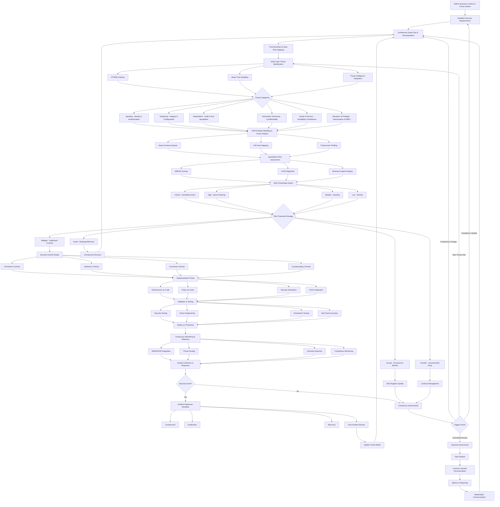
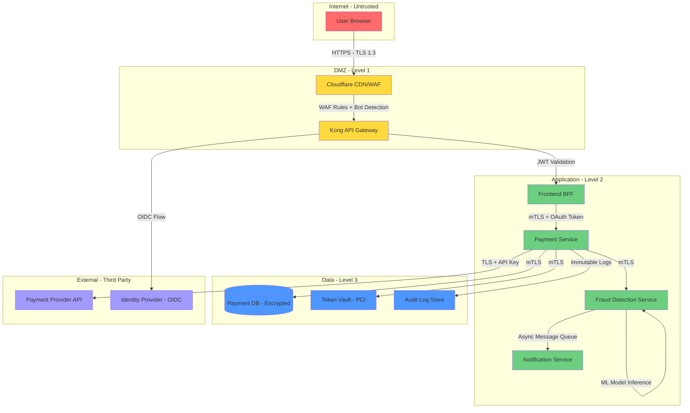
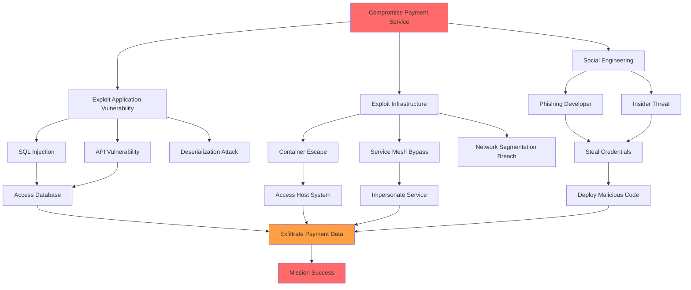

# Advanced Threat Modeling Framework for Cloud-Native Microservices Architecture

## Executive Summary

This framework integrates multiple threat modeling methodologies (STRIDE, PASTA, DREAD) with modern cloud-native security practices, service mesh architecture, and zero-trust principles. 
It provides a comprehensive, iterative approach to identifying, assessing, and mitigating security threats in distributed microservices environments.

---

## Enhanced Combined Threat Modeling Process



---

## Phase 1: Business Context & Asset Identification

### 1.1 Business Impact Analysis

**Critical Business Functions Mapping:**
```yaml
business_functions:
  payment_processing:
    criticality: "Tier-0"
    revenue_impact: "$50M/hour downtime"
    regulatory_requirements:
      - "PCI-DSS v4.0"
      - "PSD2 Strong Customer Authentication"
    dependencies:
      - "Payment Gateway API"
      - "Fraud Detection Service"
      - "Customer Wallet Service"
    
  user_authentication:
    criticality: "Tier-0"
    availability_target: "99.99%"
    security_controls:
      - "Multi-factor Authentication"
      - "Adaptive Authentication"
      - "Account Takeover Prevention"
    
  data_analytics_pipeline:
    criticality: "Tier-1"
    data_classification: "Confidential/PII"
    compliance_requirements:
      - "GDPR Art. 32 - Security of Processing"
      - "CCPA - Data Security"
    
  customer_support_portal:
    criticality: "Tier-2"
    uptime_sla: "99.5%"
    data_access: "PII with role-based access"
```

### 1.2 Crown Jewels Identification

**Asset Inventory & Classification:**
```yaml
critical_assets:
  databases:
    - name: "primary-customer-db"
      type: "PostgreSQL Multi-AZ Cluster"
      classification: "Restricted"
      data_types: ["PII", "Financial", "Health"]
      encryption:
        at_rest: "AES-256-GCM with AWS KMS"
        in_transit: "TLS 1.3 with client certificates"
      backup_strategy:
        rpo: "15 minutes"
        rto: "1 hour"
      access_controls:
        - "Service accounts with mTLS only"
        - "Break-glass emergency access logged"
        - "Column-level encryption for sensitive fields"
    
    - name: "session-store-redis"
      type: "Redis Sentinel Cluster"
      classification: "Confidential"
      data_types: ["Session Tokens", "OAuth Tokens"]
      ttl: "24 hours with automatic purge"
      encryption:
        at_rest: "Native Redis encryption"
        in_transit: "TLS with stunnel proxy"
  
  services:
    - name: "authentication-service"
      criticality: "Tier-0"
      attack_surface:
        - "Public API endpoints"
        - "Identity provider integration (OIDC)"
        - "Session management"
      threat_level: "High - Frequent attack target"
      security_controls:
        - "Rate limiting: 10 req/sec per IP"
        - "CAPTCHA on failed attempts"
        - "Geo-blocking for high-risk regions"
    
    - name: "payment-processing-service"
      criticality: "Tier-0"
      pci_scope: "In-scope"
      network_isolation: "Dedicated VPC with no internet egress"
      tokenization: "PCI-compliant token vault"
      fraud_detection: "Real-time ML-based scoring"
  
  secrets_and_keys:
    - name: "kms-master-keys"
      provider: "AWS KMS / Azure Key Vault"
      rotation_policy: "Automatic 90-day rotation"
      access_control: "Hardware Security Module (HSM) backed"
    
    - name: "service-mesh-root-ca"
      type: "X.509 Certificate Authority"
      validity: "10 years (offline root)"
      intermediate_ca_validity: "1 year with automatic rotation"
      certificate_transparency: "Enabled for public-facing certs"
    
    - name: "api-keys-secrets"
      storage: "HashiCorp Vault with dynamic secrets"
      access_pattern: "Just-in-time with 8-hour TTL"
      audit_logging: "All access events logged to SIEM"
```

### 1.3 Compliance & Regulatory Mapping

```yaml
compliance_requirements:
  pci_dss_v4:
    scope: ["payment-processing-service", "token-vault"]
    key_controls:
      - requirement: "1.2.1 - Network Segmentation"
        implementation: "Dedicated VPC with micro-segmentation"
        validation: "Quarterly network scans + annual audit"
      
      - requirement: "3.5.1 - Encryption Key Management"
        implementation: "AWS KMS with CloudHSM backing"
        validation: "Key rotation logs + access audits"
      
      - requirement: "11.3.1 - Penetration Testing"
        implementation: "Annual external + quarterly internal tests"
        validation: "Third-party attestation reports"
  
  gdpr:
    scope: "All services processing EU customer data"
    key_controls:
      - article: "Art. 25 - Data Protection by Design"
        implementation: "Privacy-by-default settings + encryption"
      
      - article: "Art. 32 - Security of Processing"
        implementation: "Pseudonymization + regular testing"
      
      - article: "Art. 33 - Breach Notification"
        implementation: "72-hour incident response SLA"
  
  sox:
    scope: ["Financial reporting systems"]
    key_controls:
      - control: "ITGC - Change Management"
        implementation: "Automated CI/CD with approval gates"
      
      - control: "ITGC - Access Controls"
        implementation: "RBAC with quarterly access reviews"
```

---

## Phase 2: Architecture Deep Dive & Decomposition

### 2.1 Service Mesh Topology Mapping

```yaml
service_mesh_architecture:
  control_plane:
    provider: "Istio 1.20+"
    components:
      - name: "istiod"
        replicas: 3
        resources:
          cpu: "2000m"
          memory: "4Gi"
        high_availability: true
        security_features:
          - "Automatic mTLS certificate management"
          - "Policy enforcement engine"
          - "Telemetry collection"
    
    security_policies:
      default_policy: "DENY_ALL"
      authentication_policy: "STRICT_MTLS"
      authorization_model: "Zero Trust - Explicit Allow"
  
  data_plane:
    proxy: "Envoy 1.28+"
    deployment_mode: "Sidecar injection"
    resource_limits:
      cpu: "500m"
      memory: "512Mi"
    
    security_configurations:
      - tls_version: "TLSv1.3"
        cipher_suites:
          - "TLS_AES_256_GCM_SHA384"
          - "TLS_CHACHA20_POLY1305_SHA256"
      
      - connection_limits:
          max_connections: 10000
          max_requests_per_connection: 1000
          connection_timeout: "30s"
      
      - circuit_breaker:
          consecutive_errors: 5
          interval: "30s"
          base_ejection_time: "30s"
          max_ejection_percent: 50
```

### 2.2 Container & Kubernetes Security Context

```yaml
kubernetes_security:
  cluster_hardening:
    - component: "API Server"
      configurations:
        - "Anonymous auth disabled"
        - "RBAC enabled with audit logging"
        - "Admission controllers: PodSecurityPolicy, NodeRestriction"
        - "Encryption at rest for etcd"
        - "Audit logging to immutable storage"
    
    - component: "Network Policies"
      default_policy: "DefaultDeny"
      egress_restrictions:
        - "Allow DNS to kube-dns only"
        - "Explicit allow-lists for external services"
        - "Block metadata API access (169.254.169.254)"
  
  pod_security_standards:
    baseline_policy:
      runAsNonRoot: true
      allowPrivilegeEscalation: false
      seccompProfile:
        type: "RuntimeDefault"
      capabilities:
        drop: ["ALL"]
        add: ["NET_BIND_SERVICE"]  # Only if needed
    
    restricted_policy:
      runAsUser: 1000
      fsGroup: 2000
      readOnlyRootFilesystem: true
      seccompProfile:
        type: "Localhost"
        localhostProfile: "profiles/audit.json"
  
  workload_identity:
    - name: "payment-service"
      service_account: "payment-sa"
      iam_bindings:
        - "roles/cloudkms.cryptoKeyEncrypterDecrypter"
        - "roles/secretmanager.secretAccessor"
      workload_identity_federation: true
      token_audience: "https://payment.internal"
      token_expiration: "3600s"
```

### 2.3 Multi-Cloud & Hybrid Architecture

```yaml
infrastructure_topology:
  primary_cloud: "AWS"
  regions:
    - name: "us-east-1"
      role: "Primary Production"
      availability_zones: 3
      services:
        - "EKS cluster with 50+ nodes"
        - "RDS PostgreSQL Multi-AZ"
        - "ElastiCache Redis Cluster"
      
    - name: "eu-west-1"
      role: "DR + EU Data Residency"
      replication: "Active-passive"
      failover_rto: "15 minutes"
  
  secondary_cloud: "Azure"
  regions:
    - name: "westus2"
      role: "Backup & Analytics Workloads"
      services:
        - "AKS cluster"
        - "Azure SQL Database"
        - "Synapse Analytics"
  
  network_connectivity:
    - type: "AWS Transit Gateway"
      connectivity: "Hub-and-spoke across regions"
      encryption: "IPSec VPN tunnels"
    
    - type: "Cloud Interconnect"
      provider: "Megaport"
      bandwidth: "10 Gbps"
      redundancy: "Dual circuits"
  
  edge_computing:
    - cdn_provider: "Cloudflare Enterprise"
      features:
        - "WAF with OWASP ruleset"
        - "DDoS protection (Layer 3-7)"
        - "Bot management"
        - "Rate limiting"
    
    - api_gateway: "Kong Enterprise"
      deployment: "Multi-region with geo-routing"
      security_plugins:
        - "JWT validation"
        - "OAuth 2.0 / OIDC"
        - "Rate limiting with Redis backend"
        - "Request/response transformation"
```

---

## Phase 3: Trust Boundaries & Data Flow Analysis

### 3.1 Trust Boundary Mapping

```yaml
trust_boundaries:
  level_0_untrusted:
    description: "Public internet - Zero trust"
    components:
      - "End-user browsers"
      - "Mobile applications"
      - "Third-party API consumers"
    security_controls:
      - "WAF + DDoS protection"
      - "API gateway with authentication"
      - "TLS 1.3 termination"
      - "Input validation & sanitization"
  
  level_1_dmz:
    description: "DMZ - Limited trust"
    components:
      - "API Gateway (Kong)"
      - "Load Balancers"
      - "CDN edge nodes"
    security_controls:
      - "Network ACLs"
      - "Security groups with minimal ports"
      - "Intrusion Detection System (IDS)"
  
  level_2_application:
    description: "Application tier - Authenticated services"
    components:
      - "Microservices in Kubernetes"
      - "Service mesh data plane"
    security_controls:
      - "mTLS between all services"
      - "Service-level authorization policies"
      - "Network policies (Calico/Cilium)"
      - "Runtime security (Falco)"
  
  level_3_data:
    description: "Data tier - Highest security"
    components:
      - "Primary databases"
      - "Secrets management (Vault)"
      - "KMS/HSM"
    security_controls:
      - "Private subnets with no internet access"
      - "Encryption at rest (always)"
      - "Audit logging of all access"
      - "IP whitelisting to application tier only"
  
  level_4_management:
    description: "Control plane - Administrative access"
    components:
      - "Kubernetes control plane"
      - "CI/CD systems (GitLab)"
      - "Monitoring & logging (Prometheus, ELK)"
    security_controls:
      - "Bastion hosts with MFA"
      - "Just-in-time privileged access"
      - "Comprehensive audit logging"
      - "Separate network segment"
```

### 3.2 Data Flow Diagrams (DFD)

**Critical Path: Payment Processing Flow**



**Data Flow Security Matrix:**

```yaml
data_flows:
  user_to_api_gateway:
    protocol: "HTTPS"
    encryption: "TLS 1.3"
    authentication: "OAuth 2.0 Bearer Token"
    authorization: "Scope-based access control"
    validation:
      - "Input sanitization (OWASP guidelines)"
      - "Rate limiting: 100 req/min per user"
      - "Payload size limit: 1MB"
    threats:
      - "T-001: Man-in-the-middle attacks"
      - "T-002: Token theft/replay"
      - "T-003: DDoS / Resource exhaustion"
  
  service_to_service:
    protocol: "gRPC over HTTP/2"
    encryption: "mTLS with certificate pinning"
    authentication: "SPIFFE/SPIRE identity"
    authorization: "Istio AuthorizationPolicy"
    validation:
      - "Schema validation (Protobuf)"
      - "Message size limits"
      - "Timeout enforcement: 5s"
    threats:
      - "T-010: Service impersonation"
      - "T-011: Certificate theft/compromise"
      - "T-012: Lateral movement"
  
  service_to_database:
    protocol: "PostgreSQL wire protocol"
    encryption: "TLS 1.3 with client certificates"
    authentication: "IAM database authentication"
    authorization: "Row-level security policies"
    validation:
      - "Prepared statements only (no dynamic SQL)"
      - "Connection pooling with limits"
      - "Query timeout: 30s"
    threats:
      - "T-020: SQL injection"
      - "T-021: Credential compromise"
      - "T-022: Data exfiltration"
      - "T-023: Privilege escalation"
```

---

## Phase 4: Enhanced STRIDE Threat Analysis

### 4.1 Spoofing Threats - Identity & Authentication

```yaml
spoofing_threats:
  S-001:
    title: "Service Identity Impersonation"
    description: |
      Attacker steals service mesh certificate or SPIFFE identity
      to impersonate legitimate microservice
    attack_vector:
      - "Compromised container with certificate access"
      - "Stolen private key from misconfigured volume mount"
      - "Exploit in certificate issuance process"
    affected_assets:
      - "All microservices in mesh"
      - "Service-to-service communication"
    likelihood: "Medium"
    impact: "Critical"
    dread_score:
      damage: 9
      reproducibility: 5
      exploitability: 6
      affected_users: 9
      discoverability: 5
      total: 34
    existing_controls:
      - "Short-lived certificates (1-hour TTL)"
      - "Automated rotation via cert-manager"
      - "Certificate pinning for critical services"
    recommended_mitigations:
      - "Implement hardware-backed key storage (TPM/HSM)"
      - "Certificate Transparency logging for all issuance"
      - "Anomaly detection on certificate requests"
      - "Mutual authentication with hardware attestation"
    residual_risk: "Low"
  
  S-002:
    title: "JWT Token Forgery"
    description: |
      Attacker forges JWT tokens due to weak signing keys,
      algorithm confusion (none/HS256), or key leakage
    attack_vector:
      - "Algorithm substitution (RS256 -> HS256)"
      - "Weak signing secret brute-forced"
      - "Key exposure in logs/config files"
    affected_assets:
      - "API Gateway authentication"
      - "User sessions"
      - "Service-to-service authorization"
    likelihood: "Low"
    impact: "High"
    dread_score:
      damage: 8
      reproducibility: 4
      exploitability: 5
      affected_users: 8
      discoverability: 6
      total: 31
    existing_controls:
      - "RS256 signing with 4096-bit keys"
      - "Key rotation every 90 days"
      - "Algorithm validation in middleware"
    recommended_mitigations:
      - "Implement JWT thumbprint verification"
      - "Add 'jti' claim for token revocation"
      - "Monitor for signature verification failures"
      - "Use short expiration times (15 min access, 7 day refresh)"
    residual_risk: "Low"
  
  S-003:
    title: "DNS Spoofing / Service Discovery Poisoning"
    description: |
      Attacker poisons CoreDNS or service registry to redirect
      traffic to malicious endpoints
    attack_vector:
      - "Compromise of CoreDNS pods"
      - "etcd manipulation if access gained"
      - "Service registry poisoning (Consul/etcd)"
    affected_assets:
      - "All service discovery mechanisms"
      - "Internal DNS resolution"
    likelihood: "Low"
    impact: "Critical"
    dread_score:
      damage: 10
      reproducibility: 3
      exploitability: 4
      affected_users: 10
      discoverability: 4
      total: 31
    existing_controls:
      - "DNSSEC validation"
      - "Service mesh with mTLS prevents MitM even if DNS poisoned"
      - "Restricted RBAC for DNS pods"
    recommended_mitigations:
      - "Implement DNS query logging and anomaly detection"
      - "Use service mesh native discovery (xDS protocol)"
      - "Certificate pinning for critical external services"
      - "Network policies preventing DNS pod compromise impact"
    residual_risk: "Low"
```

### 4.2 Tampering Threats - Integrity & Configuration

```yaml
tampering_threats:
  T-001:
    title: "Container Image Supply Chain Attack"
    description: |
      Malicious code injected into container images through
      compromised dependencies, base images, or build pipeline
    attack_vector:
      - "Compromised npm/pip package with backdoor"
      - "Malicious base image from Docker Hub"
      - "CI/CD pipeline compromise injecting code"
    affected_assets:
      - "All containerized services"
      - "Build pipeline"
      - "Container registries"
    likelihood: "Medium"
    impact: "Critical"
    dread_score:
      damage: 10
      reproducibility: 6
      exploitability: 7
      affected_users: 10
      discoverability: 5
      total: 38
    attack_chain:
      - step: 1
        action: "Attacker compromises popular npm package"
      - step: 2
        action: "Malicious code executed during 'npm install' in Dockerfile"
      - step: 3
        action: "Backdoor embedded in application container"
      - step: 4
        action: "Image signed and pushed to registry"
      - step: 5
        action: "Deployed to production via GitOps"
      - step: 6
        action: "Backdoor establishes C2 channel"
    existing_controls:
      - "Dependency scanning with Snyk/Dependabot"
      - "Image scanning with Trivy/Anchore"
      - "Use of private base images"
    recommended_mitigations:
      - "Implement Software Bill of Materials (SBOM) generation"
      - "Sigstore Cosign for image signing"
      - "Admission controller blocking unsigned images"
      - "Runtime integrity monitoring (Falco + eBPF)"
      - "Dependency pinning with hash verification"
      - "Isolated build environments (ephemeral runners)"
      - "Regular base image rebuilds from source"
    residual_risk: "Medium"
  
  T-002:
    title: "API Request/Response Manipulation"
    description: |
      Attacker intercepts and modifies API calls between services
      or from client to backend
    attack_vector:
      - "MitM attack if TLS misconfigured"
      - "Compromised service mesh proxy"
      - "Client-side code injection modifying requests"
    affected_assets:
      - "API transactions"
      - "Payment processing flows"
      - "User data updates"
    likelihood: "Low"
    impact: "High"
    dread_score:
      damage: 8
      reproducibility: 4
      exploitability: 5
      affected_users: 7
      discoverability: 6
      total: 30
    existing_controls:
      - "mTLS for all service-to-service communication"
      - "Request/response signing for critical APIs"
      - "Input validation on all endpoints"
    recommended_mitigations:
      - "Implement request/response payload signing (JWS)"
      - "Add integrity checks with HMAC for state-changing operations"
      - "Use idempotency keys for financial transactions"
      - "Monitor for unusual request patterns"
      - "Implement replay attack protection (nonce/timestamp)"
    residual_risk: "Low"
  
  T-003:
    title: "Infrastructure as Code (IaC) Tampering"
    description: |
      Unauthorized modifications to Terraform/Kubernetes manifests
      allowing backdoor access or privilege escalation
    attack_vector:
      - "Compromised developer account with repo access"
      - "Malicious pull request approved without review"
      - "Direct commit to main branch if protections bypass"
    affected_assets:
      - "Kubernetes cluster configuration"
      - "Cloud infrastructure (VPCs, IAM roles)"
      - "Service mesh policies"
    likelihood: "Low"
    impact: "Critical"
    dread_score:
      damage: 10
      reproducibility: 5
      exploitability: 6
      affected_users: 10
      discoverability: 4
      total: 35
    existing_controls:
      - "Branch protection with required reviews"
      - "Terraform Cloud with policy-as-code (Sentinel)"
      - "GitOps workflow with approval gates"
    recommended_mitigations:
      - "Mandatory code review by security team for IaC changes"
      - "Automated policy scanning (OPA/Kyverno)"
      - "Drift detection and auto-remediation"
      - "Audit logging of all infrastructure changes"
      - "Signed commits with GPG keys required"
      - "Immutable infrastructure patterns"
    residual_risk: "Low"
```

### 4.3 Repudiation Threats - Audit & Non-repudiation

```yaml
repudiation_threats:
  R-001:
    title: "Audit Log Tampering or Deletion"
    description: |
      Attacker modifies or deletes audit logs to hide malicious
      activity and evade detection
    attack_vector:
      - "Compromise of logging infrastructure (ELK stack)"
      - "Direct access to log storage (S3 buckets)"
      - "Privilege escalation to delete Kubernetes audit logs"
    affected_assets:
      - "Centralized logging system"
      - "Security audit trails"
      - "Compliance evidence"
    likelihood: "Medium"
    impact: "High"
    dread_score:
      damage: 8
      reproducibility: 5
      exploitability: 6
      affected_users: 9
      discoverability: 6
      total: 34
    existing_controls:
      - "Write-once storage (S3 Object Lock)"
      - "Separate logging infrastructure with minimal access"
      - "Log forwarding to SIEM in real-time"
    recommended_mitigations:
      - "Implement blockchain-based log integrity (e.g., Trillian)"
      - "Use hardware security modules (HSM) for log signing"
      - "Separate log retention with different access controls"
      - "Real-time log verification and alerting on anomalies"
      - "Regularly export logs to immutable archive (tape/glacier)"
      - "Implement log forwarding to multiple independent systems"
    residual_risk: "Low"
  
  R-002:
    title: "Transaction Non-repudiation Failure"
    description: |
      Lack of cryptographic proof for financial transactions
      allowing users or internal actors to deny actions
    attack_vector:
      - "User claims unauthorized transaction"
      - "Insufficient audit trail for transaction origin"
      - "Replay of transaction with modified details"
    affected_assets:
      - "Payment transactions"
      - "Account modifications"
      - "Admin actions"
    likelihood: "Low"
    impact: "Medium"
    dread_score:
      damage: 6
      reproducibility: 5
      exploitability: 4
      affected_users: 5
      discoverability: 7
      total: 27
    existing_controls:
      - "Transaction IDs with correlation across services"
      - "Timestamp and user ID captured"
      - "Database transaction logs"
    recommended_mitigations:
      - "Implement digital signatures for all financial transactions"
      - "Use blockchain or distributed ledger for audit trail"
      - "Capture device fingerprints and IP addresses"
      - "Implement strong customer authentication (SCA) per PSD2"
      - "Store signed transaction receipts immutably"
      - "Regular reconciliation audits"
    residual_risk: "Low"
  
  R-003:
    title: "Missing or Incomplete Audit Trails"
    description: |
      Critical security events not logged or logs lack sufficient
      context for investigation and compliance
    attack_vector:
      - "Logging not implemented for new services"
      - "Verbose logging disabled in production"
      - "Missing correlation IDs across distributed traces"
    affected_assets:
      - "Security incident investigations"
      - "Compliance audits"
      - "Forensic analysis capabilities"
    likelihood: "Medium"
    impact: "Medium"
    dread_score:
      damage: 5
      reproducibility: 7
      exploitability: 6
      affected_users: 6
      discoverability: 8
      total: 32
    existing_controls:
      - "Structured logging framework (ECS format)"
      - "Distributed tracing with OpenTelemetry"
      - "Correlation IDs in all requests"
    recommended_mitigations:
      - "Mandatory security logging requirements in SDLC"
      - "Automated validation of log completeness"
      - "Security event taxonomy (OCSF)"
      - "Periodic audit log review and gap analysis"
      - "Service-level logging SLOs"
      - "Centralized logging SDK/library enforcement"
    residual_risk: "Medium"
```

### 4.4 Information Disclosure - Confidentiality

```yaml
information_disclosure_threats:
  I-001:
    title: "Secrets Exposure in Container Images"
    description: |
      API keys, passwords, or certificates accidentally embedded
      in container images and pushed to registry
    attack_vector:
      - "Hardcoded secrets in application code"
      - "Secrets in environment variables in Dockerfile"
      - "Private keys committed to Git repository"
      - ".env files copied into image layers"
    affected_assets:
      - "Container images in registry"
      - "Git repository history"
      - "CI/CD pipeline logs"
    likelihood: "High"
    impact: "Critical"
    dread_score:
      damage: 10
      reproducibility: 8
      exploitability: 7
      affected_users: 9
      discoverability: 8
      total: 42
    existing_controls:
      - "Git pre-commit hooks scanning for secrets"
      - "Image scanning with secret detection (Trivy)"
      - "Use of Kubernetes Secrets instead of env vars"
    recommended_mitigations:
      - "Implement secret scanning in CI/CD (GitGuardian/TruffleHog)"
      - "Use external secret management (Vault/AWS Secrets Manager)"
      - "Implement dynamic secret injection at runtime"
      - "Regular automated scans of container registries"
      - "Mandatory .dockerignore with secret exclusions"
      - "Secret rotation upon detection of exposure"
      - "Use of sealed secrets or SOPS for GitOps"
    residual_risk: "Low"
  
  I-002:
    title: "Database Backup Exposure"
    description: |
      Unencrypted database backups stored in accessible locations
      or transferred over insecure channels
    attack_vector:
      - "S3 bucket misconfiguration (public access)"
      - "Backups on decommissioned storage media"
      - "Backup transfer without encryption"
      - "Snapshot sharing with untrusted accounts"
    affected_assets:
      - "Customer PII"
      - "Financial transaction history"
      - "Authentication credentials"
    likelihood: "Medium"
    impact: "Critical"
    dread_score:
      damage: 10
      reproducibility: 5
      exploitability: 6
      affected_users: 10
      discoverability: 7
      total: 38
    existing_controls:
      - "Backup encryption with KMS"
      - "Private S3 buckets with restrictive IAM"
      - "Backup retention policy (30 days)"
    recommended_mitigations:
      - "Implement backup encryption at multiple layers"
      - "Regular access audits for backup storage"
      - "Automated backup testing and validation"
      - "Backup access logging and monitoring"
      - "Use of separate encryption keys for backups"
      - "Secure backup transmission protocols (TLS + encryption)"
      - "Backup versioning with immutability"
    residual_risk: "Low"
  
  I-003:
    title: "Service Mesh Observability Data Leakage"
    description: |
      Sensitive data exposed through service mesh metrics, traces,
      or access logs (PII in URLs, request bodies logged)
    attack_vector:
      - "PII in URL query parameters captured in access logs"
      - "Request/response bodies in distributed traces"
      - "Metrics with high-cardinality labels containing PII"
      - "Unprotected observability endpoints"
    affected_assets:
      - "Prometheus metrics"
      - "Jaeger/Zipkin traces"
      - "Envoy access logs"
      - "Grafana dashboards"
    likelihood: "High"
    impact: "High"
    dread_score:
      damage: 8
      reproducibility: 7
      exploitability: 6
      affected_users: 7
      discoverability: 9
      total: 37
    existing_controls:
      - "Access logs sent to secure centralized logging"
      - "Observability stack behind authentication"
      - "Sampling of distributed traces (1% sampling)"
    recommended_mitigations:
      - "Implement PII scrubbing/redaction in logs and traces"
      - "Use parameterized URLs (POST bodies instead of query params)"
      - "Disable body logging for sensitive endpoints"
      - "Apply RBAC to observability stack"
      - "Encrypt traces and metrics in transit and at rest"
      - "Regular audits of logged data for PII"
      - "Implement data retention policies for observability data"
    residual_risk: "Medium"
  
  I-004:
    title: "Side-Channel Information Leakage"
    description: |
      Timing attacks, error messages, or resource consumption
      patterns reveal sensitive information
    attack_vector:
      - "Timing differences in authentication reveal valid usernames"
      - "Detailed error messages expose system internals"
      - "Resource usage patterns reveal user behavior"
      - "Cache timing attacks on encryption operations"
    affected_assets:
      - "Authentication endpoints"
      - "Database queries"
      - "Cryptographic operations"
    likelihood: "Medium"
    impact: "Medium"
    dread_score:
      damage: 5
      reproducibility: 6
      exploitability: 7
      affected_users: 6
      discoverability: 8
      total: 32
    existing_controls:
      - "Generic error messages in production"
      - "Rate limiting on authentication endpoints"
      - "Constant-time comparison for secrets"
    recommended_mitigations:
      - "Implement constant-time operations for all security-sensitive code"
      - "Use generic error responses (avoid enumeration)"
      - "Add random delays to prevent timing analysis"
      - "Monitor for enumeration attack patterns"
      - "Implement CAPTCHA on sensitive operations"
      - "Use blinding techniques for cryptographic operations"
    residual_risk: "Medium"
```

### 4.5 Denial of Service - Availability & Resilience

```yaml
denial_of_service_threats:
  D-001:
    title: "Resource Exhaustion - Container CPU/Memory Bombs"
    description: |
      Malicious or faulty service consumes excessive resources,
      impacting node and neighboring containers
    attack_vector:
      - "Algorithmic complexity attack (ReDoS, billion laughs)"
      - "Memory leak causing OOM kills"
      - "Infinite loop or CPU-intensive operation"
      - "Fork bomb in misconfigured container"
    affected_assets:
      - "Kubernetes worker nodes"
      - "Co-located services"
      - "Cluster stability"
    likelihood: "Medium"
    impact: "High"
    dread_score:
      damage: 7
      reproducibility: 7
      exploitability: 6
      affected_users: 8
      discoverability: 6
      total: 34
    existing_controls:
      - "Resource requests and limits set"
      - "Pod disruption budgets"
      - "Horizontal Pod Autoscaling"
    recommended_mitigations:
      - "Implement strict resource quotas per namespace"
      - "Use LimitRanges to enforce minimum/maximum resources"
      - "Deploy PodSecurityPolicies preventing privileged containers"
      - "Implement runtime security (Falco) detecting anomalies"
      - "Use vertical pod autoscaling for right-sizing"
      - "Implement pod priority classes for critical workloads"
      - "Set up node affinity/anti-affinity for blast radius reduction"
    residual_risk: "Low"
  
  D-002:
    title: "Service Mesh Control Plane Overload"
    description: |
      Excessive configuration changes or certificate requests
      overwhelm Istio control plane (istiod)
    attack_vector:
      - "Rapid service deployments triggering config pushes"
      - "Certificate rotation storms"
      - "Malicious pod repeatedly requesting certificates"
      - "Configuration changes causing full mesh reconfiguration"
    affected_assets:
      - "Istio control plane"
      - "Service mesh data plane (Envoy proxies)"
      - "Service-to-service communication"
    likelihood: "Low"
    impact: "Critical"
    dread_score:
      damage: 9
      reproducibility: 4
      exploitability: 5
      affected_users: 10
      discoverability: 5
      total: 33
    existing_controls:
      - "Control plane replicas: 3 instances"
      - "Resource limits on istiod pods"
      - "Certificate caching in Envoy"
    recommended_mitigations:
      - "Implement rate limiting on control plane API"
      - "Use HA control plane with automatic scaling"
      - "Implement certificate caching and longer TTLs (balance with rotation)"
      - "Monitor control plane health metrics"
      - "Implement gradual rollout strategies for config changes"
      - "Use namespace isolation to limit blast radius"
      - "Implement configuration validation webhooks"
    residual_risk: "Low"
  
  D-003:
    title: "Cascading Failure - Circuit Breaker Bypass"
    description: |
      Failure in one service propagates through dependencies,
      causing widespread outage despite circuit breakers
    attack_vector:
      - "Circuit breaker thresholds too permissive"
      - "Retry storms overwhelming failing service"
      - "Timeout configurations causing thread exhaustion"
      - "Synchronous dependencies without fallbacks"
    affected_assets:
      - "All dependent microservices"
      - "Customer-facing applications"
      - "Overall system availability"
    likelihood: "Medium"
    impact: "Critical"
    dread_score:
      damage: 9
      reproducibility: 6
      exploitability: 5
      affected_users: 10
      discoverability: 6
      total: 36
    existing_controls:
      - "Circuit breakers configured in Istio"
      - "Timeout policies per service"
      - "Retry policies with exponential backoff"
    recommended_mitigations:
      - "Implement bulkheads to isolate thread pools"
      - "Use asynchronous messaging for non-critical paths"
      - "Implement fallback responses and graceful degradation"
      - "Regular chaos engineering exercises (Chaos Mesh)"
      - "Implement health checks with proper thresholds"
      - "Use rate limiting at service boundaries"
      - "Implement request shedding when overloaded"
      - "Deploy across multiple failure domains"
    residual_risk: "Medium"
  
  D-004:
    title: "Distributed Denial of Service (DDoS)"
    description: |
      Large-scale attack overwhelming edge infrastructure
      (CDN, load balancers, API gateway)
    attack_vector:
      - "Volumetric attack (UDP/TCP flood)"
      - "Application-layer attack (HTTP flood)"
      - "Slowloris/slow POST attacks"
      - "Amplification attacks (DNS, NTP)"
    affected_assets:
      - "CDN and WAF"
      - "Load balancers"
      - "API Gateway"
      - "Public-facing services"
    likelihood: "High"
    impact: "High"
    dread_score:
      damage: 8
      reproducibility: 8
      exploitability: 9
      affected_users: 10
      discoverability: 9
      total: 44
    existing_controls:
      - "Cloudflare DDoS protection"
      - "WAF with rate limiting"
      - "Geo-blocking for high-risk regions"
    recommended_mitigations:
      - "Implement multiple layers of DDoS protection"
      - "Use Anycast routing for distributed traffic absorption"
      - "Deploy auto-scaling infrastructure"
      - "Implement bot detection and CAPTCHA challenges"
      - "Use SYN cookies and connection rate limiting"
      - "Maintain DDoS response playbooks"
      - "Conduct regular DDoS simulation exercises"
      - "Implement traffic scrubbing services"
    residual_risk: "Medium"
```

### 4.6 Elevation of Privilege - Authorization & RBAC

```yaml
elevation_of_privilege_threats:
  E-001:
    title: "Kubernetes RBAC Misconfiguration"
    description: |
      Overly permissive roles allowing unauthorized access
      to cluster resources or privilege escalation
    attack_vector:
      - "Service account with cluster-admin role"
      - "Wildcard permissions in RoleBinding"
      - "Default service account not restricted"
      - "Ability to create/modify ClusterRoleBindings"
    affected_assets:
      - "Kubernetes API server"
      - "All cluster resources"
      - "Secrets and ConfigMaps"
    likelihood: "Medium"
    impact: "Critical"
    dread_score:
      damage: 10
      reproducibility: 6
      exploitability: 7
      affected_users: 10
      discoverability: 7
      total: 40
    existing_controls:
      - "RBAC enabled on cluster"
      - "Separate namespaces per team/environment"
      - "Regular RBAC audits"
    recommended_mitigations:
      - "Implement least privilege principle for all service accounts"
      - "Use automated RBAC analysis tools (rbac-lookup, kubectl-who-can)"
      - "Disable default service account auto-mounting"
      - "Implement policy-as-code validation (OPA Gatekeeper)"
      - "Regular RBAC reviews and cleanup of unused roles"
      - "Implement just-in-time access for admin operations"
      - "Use admission controllers to prevent risky permissions"
      - "Implement RBAC for custom resources (CRDs)"
    residual_risk: "Low"
  
  E-002:
    title: "Container Escape - Runtime Vulnerability"
    description: |
      Attacker escapes container isolation to gain access
      to host system and potentially cluster control plane
    attack_vector:
      - "Kernel vulnerability exploitation (CVE-2022-0185 style)"
      - "Privileged container with host filesystem mounted"
      - "Docker socket mounted in container"
      - "CAP_SYS_ADMIN capability abuse"
    affected_assets:
      - "Kubernetes worker nodes"
      - "Host operating system"
      - "All containers on compromised node"
    likelihood: "Low"
    impact: "Critical"
    dread_score:
      damage: 10
      reproducibility: 3
      exploitability: 4
      affected_users: 10
      discoverability: 5
      total: 32
    existing_controls:
      - "Non-root containers enforced"
      - "Seccomp and AppArmor profiles"
      - "Read-only root filesystem"
      - "Regular node OS patching"
    recommended_mitigations:
      - "Use hardened container runtimes (gVisor, Kata Containers)"
      - "Implement runtime security monitoring (Falco)"
      - "Regularly update and patch kernel vulnerabilities"
      - "Use minimal base images (distroless, scratch)"
      - "Implement Pod Security Standards (restricted profile)"
      - "Drop all Linux capabilities by default"
      - "Use user namespaces for additional isolation"
      - "Implement eBPF-based runtime protection"
    residual_risk: "Low"
  
  E-003:
    title: "API Authorization Bypass"
    description: |
      Flaws in custom authorization logic allowing users
      to access resources beyond their privileges
    attack_vector:
      - "Missing authorization checks on endpoints"
      - "IDOR vulnerabilities (Insecure Direct Object References)"
      - "JWT scope/claim manipulation"
      - "Path traversal in resource IDs"
    affected_assets:
      - "API endpoints"
      - "User data and resources"
      - "Admin functionality"
    likelihood: "Medium"
    impact: "High"
    dread_score:
      damage: 8
      reproducibility: 7
      exploitability: 8
      affected_users: 7
      discoverability: 8
      total: 38
    existing_controls:
      - "OAuth 2.0 with scope-based authorization"
      - "Input validation on all endpoints"
      - "Unit tests covering authorization logic"
    recommended_mitigations:
      - "Implement centralized authorization service (OPA/Zanzibar)"
      - "Use policy-as-code for authorization rules"
      - "Implement attribute-based access control (ABAC)"
      - "Add authorization checks in every API handler"
      - "Use parameterized queries preventing injection"
      - "Implement resource-level permissions"
      - "Regular authorization testing and fuzzing"
      - "Deploy API security testing in CI/CD"
    residual_risk: "Medium"
  
  E-004:
    title: "Cloud IAM Privilege Escalation"
    description: |
      Misconfigured cloud IAM roles allowing escalation
      to admin-level access in AWS/Azure/GCP
    attack_vector:
      - "iam:PassRole allowing privilege escalation"
      - "Lambda/Function with excessive permissions"
      - "Service account with owner/admin role"
      - "Cross-account role assumption without restrictions"
    affected_assets:
      - "Cloud infrastructure"
      - "All managed services"
      - "Data storage (S3, blob storage)"
    likelihood: "Medium"
    impact: "Critical"
    dread_score:
      damage: 10
      reproducibility: 5
      exploitability: 6
      affected_users: 10
      discoverability: 6
      total: 37
    existing_controls:
      - "AWS Organizations with SCPs"
      - "CloudTrail logging all API calls"
      - "IAM Access Analyzer"
    recommended_mitigations:
      - "Implement least privilege for all IAM roles"
      - "Use permission boundaries to limit maximum permissions"
      - "Regular IAM policy reviews and rightsizing"
      - "Implement service control policies (SCPs)"
      - "Use temporary credentials with short TTLs"
      - "Implement cross-account access with external ID"
      - "Deploy automated IAM policy validation (Cloudsplaining)"
      - "Implement just-in-time privilege escalation workflows"
    residual_risk: "Low"
```

---

## Phase 5: PASTA Attack Modeling & Kill Chain Analysis

### 5.1 Attack Trees for Critical Threats

**Attack Tree: Payment Service Compromise**



**Attack Chain: Multi-Stage Supply Chain Attack**

```yaml
attack_scenario_001:
  name: "Supply Chain Compromise to Data Exfiltration"
  threat_actor: "APT Group / Nation-State"
  objective: "Steal customer PII and financial data"
  
  kill_chain:
    - phase: "Reconnaissance"
      tactic: "MITRE ATT&CK T1592 - Gather Victim Host Information"
      actions:
        - "Identify CI/CD pipeline technology stack"
        - "Enumerate public GitHub repositories"
        - "Discover npm dependencies used"
      detection_opportunities:
        - "Web scraping detection"
        - "Unusual GitHub API access patterns"
    
    - phase: "Weaponization"
      tactic: "MITRE ATT&CK T1195.002 - Compromise Software Supply Chain"
      actions:
        - "Compromise popular npm package (e.g., colors, faker)"
        - "Inject backdoor in package postinstall script"
        - "Publish malicious version to npm registry"
      detection_opportunities:
        - "Dependency version anomaly detection"
        - "npm package reputation scoring"
    
    - phase: "Delivery"
      tactic: "MITRE ATT&CK T1072 - Software Deployment Tools"
      actions:
        - "Wait for automated Dependabot update"
        - "Malicious dependency pulled during Docker build"
      detection_opportunities:
        - "Dependency scanning in CI/CD"
        - "SBOM generation and analysis"
    
    - phase: "Exploitation"
      tactic: "MITRE ATT&CK T1203 - Exploitation for Client Execution"
      actions:
        - "Backdoor executed during npm install"
        - "Reverse shell established to C2 server"
        - "Persistence via cron job in container"
      detection_opportunities:
        - "Behavioral analysis during build"
        - "Network egress monitoring"
        - "Runtime anomaly detection (Falco)"
    
    - phase: "Installation"
      tactic: "MITRE ATT&CK T1547 - Boot or Logon Autostart"
      actions:
        - "Backdoor embedded in application container"
        - "Image pushed to private registry"
        - "Deployed via GitOps (ArgoCD)"
      detection_opportunities:
        - "Image signing verification failure"
        - "Runtime integrity monitoring"
    
    - phase: "Command & Control"
      tactic: "MITRE ATT&CK T1071 - Application Layer Protocol"
      actions:
        - "Establish HTTPS C2 channel to attacker infrastructure"
        - "Beacon every 60 seconds for commands"
        - "Use DNS tunneling for data exfiltration"
      detection_opportunities:
        - "Unusual DNS queries"
        - "Network flow analysis"
        - "Threat intelligence feed matching"
    
    - phase: "Lateral Movement"
      tactic: "MITRE ATT&CK T1021 - Remote Services"
      actions:
        - "Steal service mesh certificates from container"
        - "Impersonate payment service identity"
        - "Access internal database service"
      detection_opportunities:
        - "Anomalous service-to-service communication"
        - "Certificate usage from unexpected source"
        - "Service mesh policy violations"
    
    - phase: "Data Exfiltration"
      tactic: "MITRE ATT&CK T1041 - Exfiltration Over C2 Channel"
      actions:
        - "Query customer database for PII"
        - "Encrypt data with attacker's public key"
        - "Exfiltrate via DNS tunneling and HTTPS"
      detection_opportunities:
        - "Abnormal database query patterns"
        - "Large data transfers to external IPs"
        - "DLP policy violations"
  
  estimated_timeline: "14-30 days from initial compromise to detection"
  
  mitigations:
    preventive:
      - "Dependency pinning with hash verification"
      - "Private npm registry with curated packages"
      - "Sigstore signing of all container images"
      - "Network policies blocking external DNS"
    
    detective:
      - "Runtime behavioral monitoring with Falco"
      - "SIEM correlation rules for supply chain indicators"
      - "Threat hunting for C2 beaconing patterns"
    
    corrective:
      - "Automated incident response playbooks"
      - "Container image quarantine and rollback"
      - "Certificate revocation and rotation"
```

### 5.2 Threat Actor Profiling

```yaml
threat_actors:
  external_opportunistic:
    profile: "Script kiddies, automated bots"
    motivation: "Financial gain, ransomware"
    sophistication: "Low"
    likely_attacks:
      - "Credential stuffing"
      - "Exploitation of known vulnerabilities"
      - "DDoS attacks"
    likelihood: "High"
    
  external_targeted:
    profile: "Organized cybercrime groups"
    motivation: "Financial theft, fraud"
    sophistication: "Medium to High"
    likely_attacks:
      - "Phishing campaigns"
      - "Business email compromise"
      - "Supply chain attacks"
      - "Ransomware with double extortion"
    likelihood: "Medium"
  
  nation_state:
    profile: "APT groups sponsored by foreign governments"
    motivation: "Espionage, disruption"
    sophistication: "Advanced"
    likely_attacks:
      - "Zero-day exploitation"
      - "Advanced persistent threats"
      - "Supply chain compromise"
      - "Infrastructure sabotage"
    likelihood: "Low (but high impact)"
  
  malicious_insider:
    profile: "Disgruntled employee, contractor"
    motivation: "Revenge, financial gain"
    sophistication: "Medium (leverages insider knowledge)"
    likely_attacks:
      - "Data theft/exfiltration"
      - "Sabotage of systems"
      - "Backdoor installation"
      - "Privilege abuse"
    likelihood: "Low"
    
  negligent_insider:
    profile: "Careless or untrained employee"
    motivation: "None (unintentional)"
    sophistication: "N/A"
    likely_attacks:
      - "Accidental data exposure"
      - "Misconfiguration"
      - "Falling for phishing"
      - "Lost devices"
    likelihood: "High"
```

---

## Phase 6: Quantitative Risk Assessment

### 6.1 Enhanced DREAD Scoring Matrix

```yaml
dread_methodology:
  damage_potential:
    10: "Complete system compromise, massive data breach"
    8: "Significant data loss or service disruption"
    6: "Partial data compromise or limited outage"
    4: "Minor data exposure or service degradation"
    2: "Minimal impact, easily recoverable"
  
  reproducibility:
    10: "Attack can be automated and repeated trivially"
    8: "Attack is easily repeatable with public tools"
    6: "Attack requires some skill but documented"
    4: "Attack requires significant expertise"
    2: "Attack is theoretical or extremely difficult"
  
  exploitability:
    10: "No authentication required, trivial to exploit"
    8: "Requires minimal authentication, easy exploit"
    6: "Requires standard user privileges"
    4: "Requires privileged access or complex attack"
    2: "Requires extensive resources and time"
  
  affected_users:
    10: "All users and customers impacted"
    8: "Large majority of users (>50%)"
    6: "Significant subset of users (10-50%)"
    4: "Small number of users (<10%)"
    2: "Only administrators or single user"
  
  discoverability:
    10: "Information is public or easily found"
    8: "Vulnerability scanners detect it easily"
    6: "Requires some investigation to discover"
    4: "Requires significant analysis"
    2: "Extremely difficult to discover"

risk_matrix:
  critical: "DREAD score 40-50"
  high: "DREAD score 30-39"
  medium: "DREAD score 20-29"
  low: "DREAD score 10-19"
```

### 6.2 CVSS Alignment

```yaml
cvss_mapping:
  example_vulnerability:
    title: "Container Runtime Escape (CVE-2024-XXXX equivalent)"
    
    cvss_v3_vector: "CVSS:3.1/AV:N/AC:L/PR:L/UI:N/S:C/C:H/I:H/A:H"
    
    base_score: 9.9
    base_metrics:
      attack_vector: "Network (AV:N)"
      attack_complexity: "Low (AC:L)"
      privileges_required: "Low (PR:L)"
      user_interaction: "None (UI:N)"
      scope: "Changed (S:C)"
      confidentiality_impact: "High (C:H)"
      integrity_impact: "High (I:H)"
      availability_impact: "High (A:H)"
    
    temporal_score: 9.1
    temporal_metrics:
      exploit_code_maturity: "Functional (E:F)"
      remediation_level: "Official Fix (RL:O)"
      report_confidence: "Confirmed (RC:C)"
    
    environmental_score: 9.5
    environmental_metrics:
      confidentiality_requirement: "High (CR:H)"
      integrity_requirement: "High (IR:H)"
      availability_requirement: "High (AR:H)"
    
    dread_correlation:
      damage: 10
      reproducibility: 8
      exploitability: 6
      affected_users: 10
      discoverability: 7
      total: 41
```

### 6.3 Business Impact Analysis

```yaml
impact_assessment:
  financial_impact:
    data_breach_cost:
      per_record: "$150 (Ponemon Institute average)"
      estimated_exposure: "10M customer records"
      total_potential_cost: "$1.5B"
    
    downtime_cost:
      revenue_per_hour: "$50M"
      rto_target: "1 hour"
      maximum_acceptable_outage: "4 hours"
      potential_revenue_loss: "$200M"
    
    regulatory_fines:
      gdpr: "Up to 4% of global revenue or €20M"
      pci_dss: "Up to $500K per incident"
      ccpa: "Up to $7,500 per violation"
  
  reputational_impact:
    customer_churn:
      estimated_percentage: "15%"
      customer_lifetime_value: "$2,000"
      total_impact: "$300M"
    
    brand_damage:
      recovery_timeline: "12-24 months"
      marketing_cost_increase: "50%"

##
##
