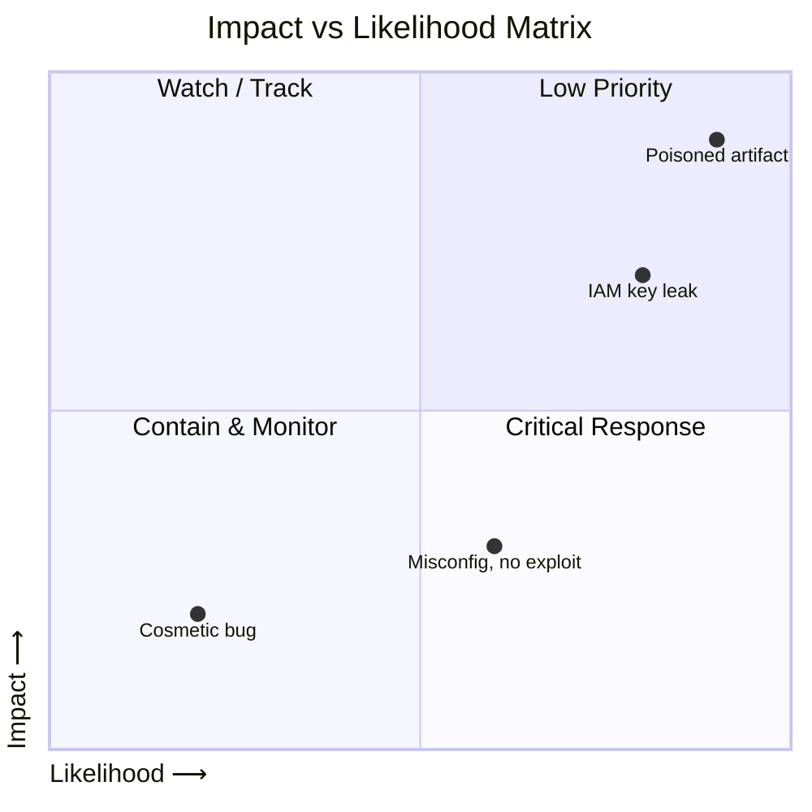

# 📘 Blast Radius Matrix & Scoring (..IRL..)



## 1. Scoring Dimensions

Each incident is measured across **four axes**:

* **Impact (1–5)** – severity of customer/product/data exposure.
* **Likelihood (1–5)** – exploitability (public exploit vs. theoretical).
* **Scope (1–5)** – breadth of impact (one account vs. global).
* **Duration (1–5)** – time exposure existed before containment.

👉 Formula:

```
Blast Radius Score = Impact × Likelihood × Scope × Duration
```

---

## 2. Blast Radius Matrix

| **Factor**     | 1 (Low)                 | 3 (Medium)              | 5 (High)                        |
| -------------- | ----------------------- | ----------------------- | ------------------------------- |
| **Impact**     | No data, minor internal | Product degraded        | Customer data/regulatory breach |
| **Likelihood** | Requires advanced skill | Exploitable with effort | Public exploit/active abuse     |
| **Scope**      | Single system/region    | Multi-service or region | Cross-region/systemic           |
| **Duration**   | <1 hour                 | 1–3 days                | Weeks/months                    |

---

## 3. Priority Mapping

| **BRS Score** | **Bucket**      | **Response Urgency**                           |
| ------------- | --------------- | ---------------------------------------------- |
| **100+**      | 🔴 Critical Now | Containment immediately, exec + customer comms |
| **50–99**     | 🟠 Short Term   | Remediation in days, proactive comms if needed |
| **20–49**     | 🟡 Medium Term  | Planned fixes, not urgent                      |
| **<20**       | 📋 Backlog      | Track for lessons learned & future prevention  |

---

## 4. Scoring Sheet Template

```markdown
# Incident Scoring Sheet

## Impact (1–5)
Notes: ____________________________________________

## Likelihood (1–5)
Notes: ____________________________________________

## Scope (1–5)
Notes: ____________________________________________

## Duration (1–5)
Notes: ____________________________________________

## Calculation
Impact × Likelihood × Scope × Duration = _______

## Priority Mapping
Score: _______ → [Critical Now / Short Term / Medium Term / Backlog]

## Strategic Notes
- Right people in right roles? [Y/N]
- Right tools available? [Off-the-shelf / Custom / Hybrid]
- Burnout rotation plan in place? [Y/N]
```

---

## 5. Experience Highlights (Your Style)

### A. **Discovery & Strategizing Phase**

* I always start with a **strategy huddle**: identify the underlying cause and possible tools needed.
* Decision: off-the-shelf vs. in-house vs. hybrid tool approach.
* *Example:* Use GuardDuty + custom Athena queries together for AWS log triage.

### B. **Right Tools, Right People**

* Assign **specialists where they fit**: cloud engineer on IAM blast, CI/CD engineer on pipeline tampering.
* Provide them **the right tool for the job** even if we need to spin something up quickly.
* *Example:* If Trivy or Scout misses, spin up a one-off Python parser mid-incident.

### C. **Burnout Avoidance**

* Strict rotation (IC max 4–6h, engineers max 8–10h).
* Encourage breaks and shift hand-offs with checklists.
* *Experience:* Keeps responders sharp — avoids “decision fatigue” that can cause mistakes.

### D. **Containment vs. Remediation**

* Containment always comes before deep remediation.
* Empower engineers to **stop-the-bleeding first** (revoke keys, lock buckets), then hand off to others for sustainable fixes.

---

## 6. Example Walkthroughs (with Experience Notes)

### Example 1: AWS IAM Key Leak

* **Impact = 3**, **Likelihood = 5**, **Scope = 2**, **Duration = 3**
* Score = 90 → 🟠 Short Term (but 🔴 containment done immediately)
  **Experience Notes:**
* *Right tools:* AWS CLI + CloudTrail + quick Athena script.
* *Right people:* Cloud IAM engineer led; researcher validated logs.
* *Rotation:* IC swapped at 4h, kept momentum.

---

### Example 2: Supply Chain Dependency Poisoning

* **Impact = 4**, **Likelihood = 4**, **Scope = 4**, **Duration = 3**
* Score = 192 → 🔴 Critical Now
  **Experience Notes:**
* *Right tools:* SBOM scanner + custom diffing script to find tampered package.
* *Right people:* CI/CD engineer + researcher paired.
* *Strategy:* Paused builds immediately, then huddle for longer-term fix.

---

### Example 3: Misconfigured S3 Bucket

* **Impact = 2**, **Likelihood = 3**, **Scope = 3**, **Duration = 2**
* Score = 36 → 🟡 Medium Term
  **Experience Notes:**
* *Right tools:* AWS Config audit + in-house S3 policy checker.
* *Strategy:* Scoped quickly, deferred to backlog remediation to preserve team energy.

---

##
##
