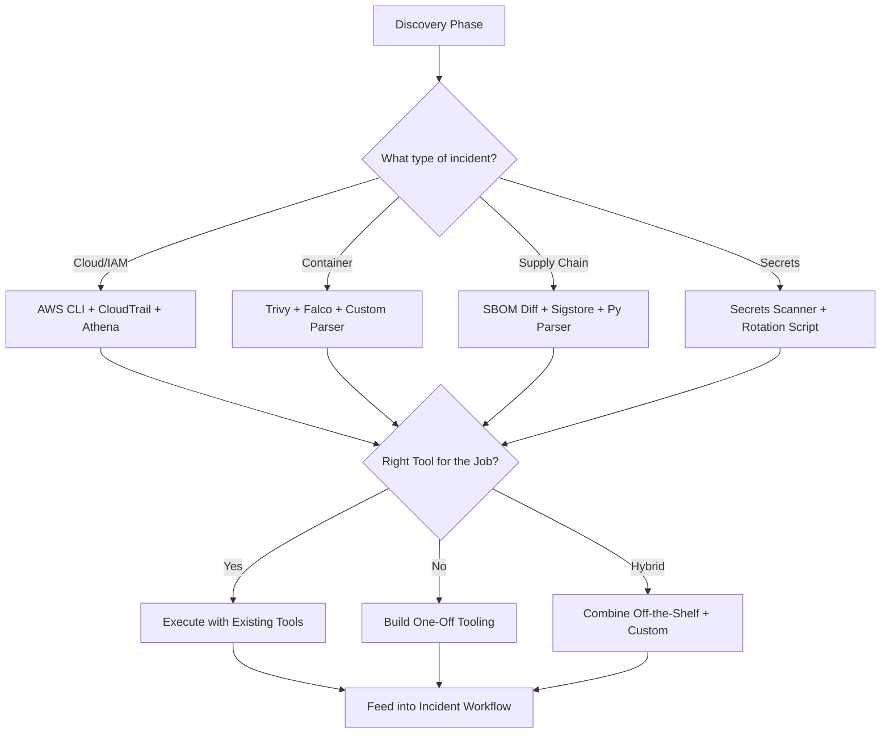
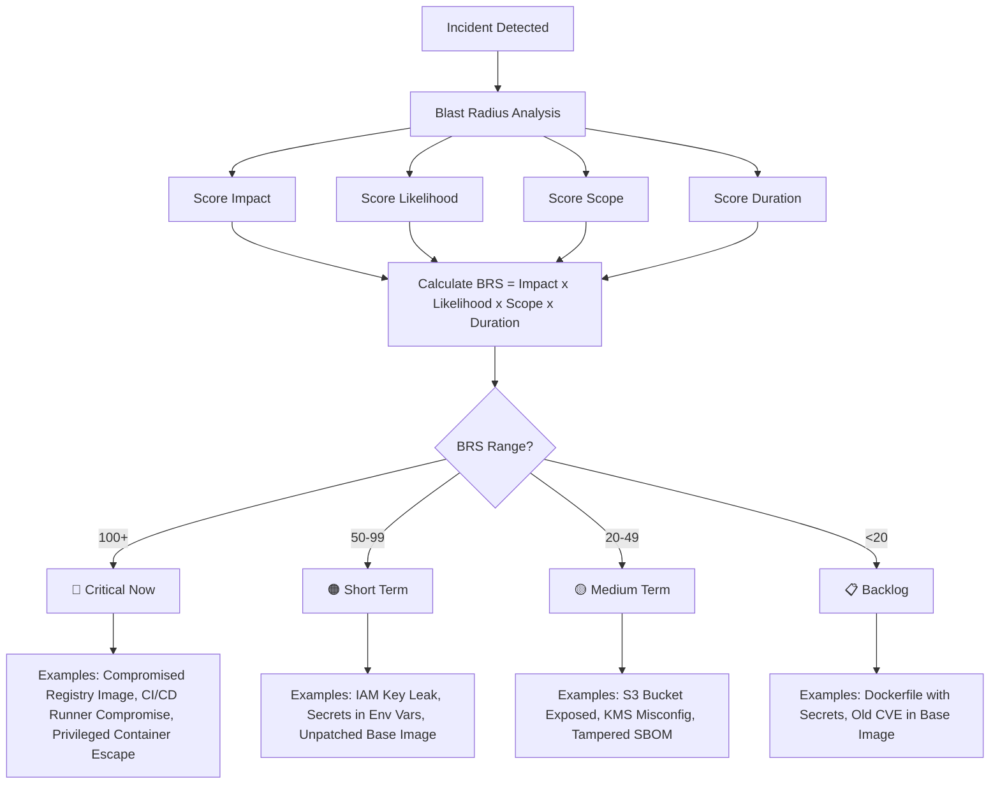

# 📘 Blast Radius Matrix & Scoring Runbook ..IRL..

This runbook defines a framework for analyzing, scoring, and prioritizing incidents by calculating their **blast radius**.  
It combines **quantitative rigor (scoring + matrix)** with **qualitative leadership strategies** (empowering people, right tools, burnout prevention).  

---

## 1. Core Formula

```

Blast Radius Score (BRS) = Impact × Likelihood × Scope × Duration

````

- **Impact (1–5)** → What happens if exploited?  
- **Likelihood (1–5)** → How realistic is exploitation?  
- **Scope (1–5)** → How wide is the blast radius?  
- **Duration (1–5)** → How long exposure existed before containment?  

---

## 2. Impact × Likelihood Matrix

```mermaid
quadrantChart
    title Impact vs Likelihood Matrix
    x-axis Likelihood -->  
    y-axis Impact -->
    quadrant-1 Low Priority
    quadrant-2 Watch / Track
    quadrant-3 Contain & Monitor
    quadrant-4 Critical Response
    "Cosmetic bug" : [0.2, 0.2]
    "Misconfig, no exploit" : [0.6, 0.3]
    "IAM key leak" : [0.8, 0.7]
    "Poisoned artifact" : [0.9, 0.9]
````

##
##

✅ This 2×2 chart provides a quick way to visualize incident placement.

---

## 3. Scope & Duration Modifiers

Even if an incident looks low/medium on the matrix, **Scope** and **Duration** can elevate it.

| Factor       | 1               | 3                            | 5                |
| ------------ | --------------- | ---------------------------- | ---------------- |
| **Scope**    | Isolated system | Multi-region / multi-service | Global, systemic |
| **Duration** | <1h             | 1–3 days                     | Weeks/months     |

👉 Example: Misconfigured S3 bucket (Impact=2, Likelihood=3 → Medium).
But Scope=5, Duration=5 → Final Score = 150 → **Critical Now**.

---

## 4. Priority Mapping

| **BRS Score** | **Priority** | **Bucket**      | **Response Strategy**                          |
| ------------- | ------------ | --------------- | ---------------------------------------------- |
| **100+**      | 🚨 Emergency | 🔴 Critical Now | Contain immediately, rotate IC, legal+PR comms |
| **50–99**     | High         | 🟠 Short Term   | Fix in days, notify customers if affected      |
| **20–49**     | Medium       | 🟡 Medium Term  | Planned fixes, add monitoring                  |
| **<20**       | Low          | 📋 Backlog      | Track for compliance/lessons                   |

---

## 5. Scoring Sheet (Detailed)

```markdown
# Incident Scoring Sheet

## Impact (1–5)
- What type of data/product affected?  
- Notes: ____________________________________________

## Likelihood (1–5)
- Is there a known exploit? Are mitigations in place?  
- Notes: ____________________________________________

## Scope (1–5)
- How wide is the blast (accounts, regions, customers)?  
- Notes: ____________________________________________

## Duration (1–5)
- How long has this been exploitable?  
- Notes: ____________________________________________

## Calculation
Impact × Likelihood × Scope × Duration = _______

## Priority Mapping
Score: _______ → [Critical Now / Short Term / Medium Term / Backlog]

## Strategic Notes
- Correct people in correct roles? [ ] Yes [ ] No  
- Right tools available? [Off-the-shelf / Custom / Hybrid]  
- Burnout rotation plan in place? [ ] Yes [ ] No  
```

---

## 6. Leadership Experience Notes

* **Empower people with right tools:**
  *Don’t force-fit tools. Decide in discovery phase if you need to use what you have, buy off-the-shelf, or spin up a custom one.*

* **Correct triage with correct people:**
  *Cloud engineers handle IAM/key issues, CI/CD engineers handle pipeline tampering, researchers validate exploits.*

* **Prevent burnout:**
  *IC rotates every 4–6h, engineers every 8–10h max. Hand-offs use checklists.*

* **Containment first, remediation second:**
  *Stop the bleeding (revoke keys, kill pods) before patching or re-architecting.*

---

## 7(a) 

## Strategic Notes
- Correct people in correct roles? [ ] Yes [ ] No  
- Right tools available? [Off-the-shelf / Custom / Hybrid]  
- TRTFTJ Justification: ___________________________________  
- Burnout rotation plan in place? [ ] Yes [ ] No  

##

## 7. Expanded Matrix of Examples

| Scenario                                        | Impact | Likelihood | Scope | Duration | Score | Priority        | Notes                                                                 |
| ----------------------------------------------- | ------ | ---------- | ----- | -------- | ----- | --------------- | --------------------------------------------------------------------- |
| Exposed Docker Daemon Socket                    | 4      | 5          | 3     | 3        | 180   | 🔴 Critical Now | Remote RCE, container breakout risk                                   |
| Compromised Container Image in Registry         | 4      | 4          | 4     | 3        | 192   | 🔴 Critical Now | Customers may already have pulled image                               |
| Public ECR Repo Misconfig                       | 3      | 4          | 4     | 4        | 192   | 🔴 Critical Now | Sensitive images exposed, attackers can base malicious images on them |
| K8s Pod Escape via Privileged Container         | 5      | 4          | 3     | 3        | 180   | 🔴 Critical Now | Full node takeover possible                                           |
| CI/CD Runner Compromise                         | 4      | 4          | 5     | 3        | 240   | 🔴 Critical Now | Attackers can poison all downstream builds                            |
| Tampered SBOM / Supply Chain                    | 3      | 4          | 4     | 3        | 144   | 🔴 Critical Now | Fake SBOM can hide malicious deps                                     |
| Poisoned Dependency (npm/PyPI)                  | 4      | 3          | 4     | 3        | 144   | 🔴 Critical Now | If injected into prod builds                                          |
| S3 Bucket with Configs Exposed                  | 3      | 3          | 3     | 3        | 81    | 🟠 Short Term   | No PII, but still sensitive                                           |
| Unpatched Docker Base Image (High CVEs)         | 3      | 3          | 3     | 5        | 135   | 🔴 Critical Now | Especially if image is widely deployed                                |
| IAM Key Leak (via GitHub repo)                  | 3      | 5          | 3     | 3        | 135   | 🔴 Critical Now | Confirmed active exploitation risk                                    |
| EKS Worker Node Compromise                      | 5      | 4          | 3     | 4        | 240   | 🔴 Critical Now | Attackers can pivot across cluster                                    |
| Secrets Leaked in Container Env Vars            | 3      | 4          | 3     | 3        | 108   | 🔴 Critical Now | Especially if DB/API keys are exposed                                 |
| Misconfigured KMS Policy (too broad)            | 3      | 3          | 3     | 4        | 108   | 🔴 Critical Now | Potential decryption of sensitive data                                |
| Unscanned Third-Party Container                 | 2      | 3          | 4     | 4        | 96    | 🟠 Short Term   | Risk depends on usage in prod                                         |
| K8s Dashboard Exposed Publicly                  | 4      | 4          | 3     | 2        | 96    | 🟠 Short Term   | Admin takeover if exploited                                           |
| Code Artifact Repo Misconfig                    | 3      | 2          | 3     | 3        | 54    | 🟠 Short Term   | Internal code leaked but no customer data                             |
| Container Escape Attempt (Falco alert, blocked) | 3      | 2          | 2     | 1        | 12    | 📋 Backlog      | Alert useful for tuning, no impact                                    |
| Dockerfile with Hardcoded Secrets               | 2      | 3          | 2     | 3        | 36    | 🟡 Medium Term  | Fix required but not urgent                                           |
| Old CVE in Base Image (already mitigated)       | 2      | 2          | 3     | 5        | 60    | 🟠 Short Term   | Depends on exploitability                                             |
| Non-Prod Cluster Breach (dev only)              | 2      | 3          | 2     | 3        | 36    | 🟡 Medium Term  | No direct customer impact                                             |

---

## 8. Example Walkthroughs (with Leadership Voice)

### Example A: Compromised Container Image in Registry

* **Score = 192 → 🔴 Critical Now**
* Immediate pause on pulls.
* SBOM diff + custom Python script to compare artifacts.
* Engineers rotated to avoid fatigue while Support + Comms drafted customer notice.

---

### Example B: CI/CD Runner Compromise

* **Score = 240 → 🔴 Critical Now**
* Paused builds in Jenkins/GitHub Actions.
* Used Trivy + in-house scanner to validate builds.
* IC rotated every 4h due to long-running nature.

---

### Example C: IAM Key Leak via GitHub Repo

* **Score = 135 → 🔴 Critical Now**
* IAM specialist revoked/rotated keys.
* Researcher audited CloudTrail.
* *Containment before remediation* — stopped attacker access first.

---

### Example D: Secrets in Container Env Vars

* **Score = 108 → 🔴 Critical Now**
* App engineer scrubbed configs, sec engineer rotated secrets.
* Parallelized work to avoid burnout.

---

## 9. Visual Example (Expanded Matrix with Containers & Supply Chain)


---

## 10. Key Takeaways

* **Quantitative Rigor**: scoring (BRS) makes prioritization objective.
* **Qualitative Leadership**: empower people, right tools, rotation, containment-first mindset.
* **Examples**: real-world container, supply chain, AWS, artifact incidents.
* **Visuals**: quadrant charts help communicate quickly to execs & engineers.

---

```

