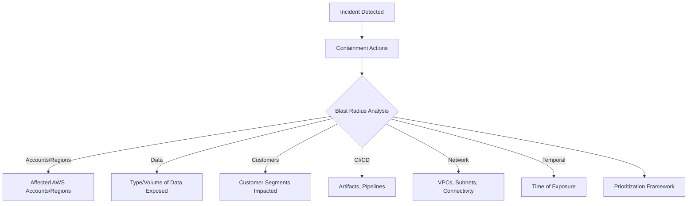

# 📘 Blast Radius Calculus Runbook

## 1. Purpose

The goal of blast radius analysis is to **understand and limit how far an incident can spread** across:

* Systems (AWS accounts, CI/CD pipelines, Kubernetes clusters)
* Data (customer, internal, regulatory-sensitive)
* Business impact (customers, regions, products)
* Time (how long until recovery, how long exposure existed)

---

## 2. Core Principles

1. **Containment Before Measurement** – stop the bleeding first.
2. **Breadth Over Depth** – assess horizontally (what’s exposed) before vertical technical root cause.
3. **Customer-Centric View** – always frame radius in terms of customers affected.
4. **Forward & Backward Analysis** –

   * Backward: How long exposure existed.
   * Forward: What could happen if not contained.

---

## 3. Blast Radius Categories

| Category               | What to Check                                       | Tools / Evidence                   |
| ---------------------- | --------------------------------------------------- | ---------------------------------- |
| **Accounts & Regions** | Which AWS accounts/regions are impacted             | AWS Organizations, IAM, CloudTrail |
| **Services**           | Which AWS services or SaaS systems are affected     | S3, RDS, EKS, CI/CD, third-party   |
| **Data Exposure**      | What type of data was exposed and for how long      | S3 logs, DLP scans, VPC flow logs  |
| **Customers**          | Which customers or tenants are affected             | CRM, billing, product telemetry    |
| **CI/CD Artifacts**    | Which builds, images, or registries are compromised | SBOM, build logs, registry scans   |
| **Network Scope**      | Which VPCs, subnets, or clusters are reachable      | VPC peering, Transit Gateway       |
| **Temporal**           | How long exposure existed                           | CloudTrail history, retention logs |

---

## 4. Blast Radius Calculation Worksheet

```markdown
# Blast Radius Worksheet

## Accounts & Regions
- AWS Accounts impacted: 
- Regions impacted: 

## Services
- Cloud services impacted (e.g. S3, RDS, EKS, CI/CD):
- Third-party SaaS dependencies: 

## Data
- Type of data exposed (PII, credentials, configs, telemetry):
- Estimated volume: 
- Exposure duration: 

## Customers
- Customer segments impacted (Enterprise, Gov, Free-tier):
- Customer count estimate: 
- High-value/regulatory customers affected? (Y/N) 

## CI/CD
- Build pipelines impacted:
- Artifacts/registries impacted:
- Version/tag ranges: 

## Network
- VPCs/subnets involved: 
- Peered or cross-region connections:
- Internet-facing exposure? (Y/N)

## Temporal
- Earliest evidence of compromise:
- Detection timestamp:
- Time to containment:
```

---

## 5. Blast Radius Checklists

### 5.1 Incident Commander Quick Checklist

* [ ] Have we scoped impacted accounts and services?
* [ ] Have we determined customer exposure?
* [ ] Do we know **when** exposure began and ended?
* [ ] Have we estimated data volume and sensitivity?
* [ ] Have we identified lateral movement paths (CI/CD → prod, dev → prod)?
* [ ] Have we flagged external reporting requirements?

### 5.2 Engineer Investigation Checklist

* [ ] Pull CloudTrail logs for IAM anomalies
* [ ] Review S3/RDS access logs for unusual queries
* [ ] Audit build artifacts for tampering (hash diff, SBOM)
* [ ] Inspect container images/pods for backdoors
* [ ] Correlate GuardDuty/Inspector alerts

---

## 6. Prioritization Integration

The blast radius directly informs remediation buckets:

* **Large blast radius + customer data exposed** → 🔴 Immediate
* **Limited radius but product integrity degraded** → 🟠 Short-term
* **Narrow radius, no customer impact** → 🟡 Medium-term

---

## 7. Visual Model



---

## 8. Example Walkthroughs

### Example 1: IAM Key Leak

* **Accounts & Regions**: 2 AWS accounts, us-east-1 + eu-central-1
* **Data**: Access to 3 S3 buckets with configs, no PII
* **Customers**: None directly affected (internal only)
* **Temporal**: Keys active 36 hours before revocation
* **Result**: Blast radius moderate → 🔴 Contain now, 🟠 patch + rotate secrets

### Example 2: Poisoned Build Artifact

* **Accounts & Regions**: 1 CI/CD account, global impact via registry
* **Data**: No direct customer data exposure
* **Customers**: 200 customers potentially pulled image version `1.2.4`
* **Temporal**: Artifact live for 5 days
* **Result**: Blast radius large due to customer exposure → 🔴 Suspend builds, notify customers

---

## 9. Output for Communications

Blast radius must always be part of updates:

```markdown
[Update @ 15:30 UTC]
- AWS Accounts impacted: 2
- Regions: us-east-1, eu-central-1
- Data: Config files, no PII
- Customers: None confirmed
- Exposure Duration: 36h
```


## 10. Blast Radius Scoring Formula

We calculate a **Blast Radius Score (BRS)** to quantify scope:

```
BRS = Impact × Likelihood × Scope × Duration
```

* **Impact (1–5)**

  * 1 = No customer exposure, minor internal
  * 3 = Product/service degradation
  * 5 = Customer PII/financial/regulatory data exposure

* **Likelihood (1–5)**

  * 1 = Requires highly specialized attack, mitigations in place
  * 3 = Exploitable with effort, no active exploit
  * 5 = Public exploit / active exploitation confirmed

* **Scope (1–5)**

  * 1 = Single service/region, isolated
  * 3 = Multi-service or multi-region, limited customers
  * 5 = Cross-region, multi-customer, systemic

* **Duration (1–5)**

  * 1 = <1h exposure
  * 3 = 24–72h exposure
  * 5 = Weeks/months exposure

---

### Example Scoring Table

| Factor     | Score | Notes                               |
| ---------- | ----- | ----------------------------------- |
| Impact     | 4     | Customer metadata + config exposure |
| Likelihood | 5     | Public exploit exists               |
| Scope      | 3     | Two AWS regions, limited accounts   |
| Duration   | 2     | 12h exposure                        |

**BRS = 4 × 5 × 3 × 2 = 120**

---

### Interpretation

| BRS Range | Priority  | Bucket                   |
| --------- | --------- | ------------------------ |
| **100+**  | Emergency | 🔴 Critical Now          |
| **50–99** | High      | 🟠 Short-Term            |
| **20–49** | Medium    | 🟡 Medium-Term           |
| **<20**   | Low       | 🟡 Medium-Term / Backlog |

---

## 11. Scoring Worksheet

```markdown
# Blast Radius Scoring

## Impact (1–5):
Notes: 

## Likelihood (1–5):
Notes: 

## Scope (1–5):
Notes: 

## Duration (1–5):
Notes: 

## Calculation:
Impact × Likelihood × Scope × Duration = ____

## Priority Assignment:
BRS Score: ____
Mapped to: 🔴 / 🟠 / 🟡
```

---

## 12. Worked Examples

### Example 1: AWS IAM Key Leak

* Impact = 3 (infra control, no PII)
* Likelihood = 5 (active exploit risk)
* Scope = 2 (1 account, 1 region)
* Duration = 3 (48h exposure)
  **BRS = 3 × 5 × 2 × 3 = 90 → 🟠 Short-Term (but 🔴 containment required)**

### Example 2: Poisoned Artifact in Registry

* Impact = 4 (product integrity, customers exposed)
* Likelihood = 4 (exploitable, not yet abused)
* Scope = 4 (multi-region, 200 customers)
* Duration = 3 (5 days)
  **BRS = 4 × 4 × 4 × 3 = 192 → 🔴 Critical Now**

---

## 13. Output for Comms

Blast radius scoring can be shared internally for clarity:

```markdown
[Update @ 17:00 UTC]
Blast Radius Score: 192
- Impact: Customer images pulled from poisoned registry
- Likelihood: Exploitable (no abuse confirmed yet)
- Scope: 200 customers, multi-region
- Duration: 5 days
→ Prioritized as 🔴 Critical Now
```


