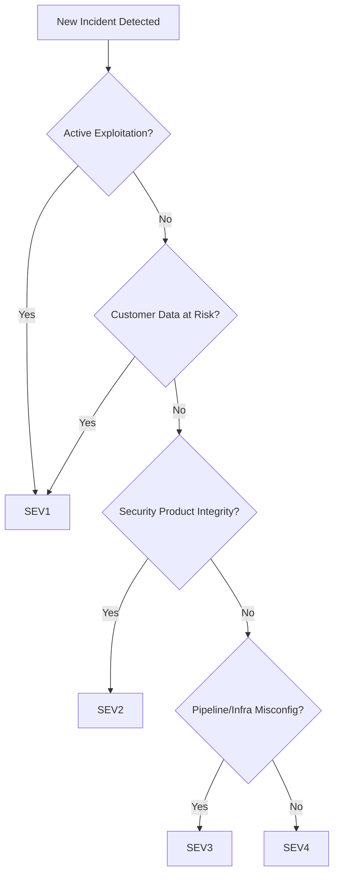

# 📘 Prioritization & Remediation Runbook

## 1. Core Principles

1. **Safety First** – contain active exploitation before anything else.
2. **Customer Impact Above All** – prioritize based on customer data exposure or product functionality degradation.
3. **Blast Radius Reduction** – minimize how far an issue can spread before permanent fixes are in place.
4. **Parallel Tracks** – containment, forensics, and remediation can run simultaneously.
5. **Sustainability** – build in rotation and avoid overloading engineers with “all now” urgency.

---

## 2. Prioritization Framework

### Step 1: Classify Severity (SEV Levels)

* **SEV1 (Critical)**: Active exploitation, customer impact, regulatory exposure, or product outage.
* **SEV2 (High)**: Exploitable vuln with high likelihood; not yet observed in the wild.
* **SEV3 (Medium)**: Misconfigurations or vulnerabilities with mitigations already in place.
* **SEV4 (Low)**: Cosmetic issues, non-exploitable misconfigs, low-risk dependencies.

---

### Step 2: Map to Impact Buckets

| Impact Category       | Examples                                                                   | Priority          |
| --------------------- | -------------------------------------------------------------------------- | ----------------- |
| **Customer Data**     | S3 leaks, RDS snapshots exposed, credential compromise                     | Highest           |
| **Product Integrity** | Security product failing to block/detect threats, CI/CD pipeline tampering | High              |
| **Availability**      | DDoS, resource exhaustion, outage in core infra                            | Medium–High       |
| **Reputation/Legal**  | Bug bounty disclosure, GDPR/SOC2 implications                              | High (time-bound) |
| **Internal Only**     | Non-customer test system compromised, dev secrets leaked                   | Lower             |

---

### Step 3: Place in Remediation Buckets

**🔴 Critical Now (Hours)**

* Containment actions: key revocation, traffic blocking, pipeline pause.
* Stop-the-bleeding first: disable vulnerable endpoints, kill compromised pods.
* Mandatory updates every 30–60 minutes.

**🟠 Short-Term (Days)**

* Hotfix patches and re-rollout.
* Customer notifications (if confirmed impact).
* Secrets rotation across systems.
* Validate AWS IAM policies & SCP enforcement.

**🟡 Medium-Term (Weeks)**

* Infra re-architecture (least privilege IAM, service mesh auth).
* Hardened CI/CD (SBOM, signed artifacts, dependency pinning).
* Secure coding guideline updates.

---

## 3. Prioritization Decision Tree



---

## 4. Detailed Prioritization Matrix

| Dimension          | High (SEV1/SEV2)                            | Medium (SEV3)                         | Low (SEV4)       |
| ------------------ | ------------------------------------------- | ------------------------------------- | ---------------- |
| **Exploitability** | Public exploit exists / active exploitation | Requires skill, mitigations available | Theoretical only |
| **Impact**         | Customer data loss, product ineffective     | Partial outage, internal tool impact  | Cosmetic/logging |
| **Scope**          | Multi-region, cross-product                 | Single region/system                  | Limited scope    |
| **Urgency**        | Hours                                       | Days                                  | Weeks            |

---

## 5. Checklists

### 5.1 Prioritization Checklist (for IC)

* [ ] Confirm SEV level.
* [ ] Run through **Impact Buckets**.
* [ ] Place actions into **Remediation Buckets**.
* [ ] Confirm containment actions started.
* [ ] Communicate priorities to leads and scribe.

### 5.2 Remediation Bucket Assignment Template

```markdown
### 🔴 Critical Now
- [ ] Action: 
- Owner:
- Deadline: 

### 🟠 Short-Term
- [ ] Action: 
- Owner:
- Deadline: 

### 🟡 Medium-Term
- [ ] Action: 
- Owner:
- Deadline: 
```

---

## 6. Examples

### Example 1: AWS IAM Key Leak

* **SEV1** (active exploitation risk)
* Impact: Customer data + infra exposure
* Actions:

  * 🔴 Revoke keys immediately
  * 🔴 Audit CloudTrail for misuse
  * 🟠 Rotate dependent secrets, rebuild AMIs
  * 🟡 Review IAM role trust architecture

### Example 2: Supply Chain Dependency Poisoning

* **SEV2** (not exploited yet, but high risk)
* Impact: Product integrity (security product reliability)
* Actions:

  * 🔴 Suspend builds using poisoned dep
  * 🟠 Roll back and rebuild artifacts with pinned versions
  * 🟡 Enforce SBOM + artifact signing in CI/CD

---

## 7. Integration with Comms

* Prioritization results should be communicated in **every update**:

```markdown
[Update @ 13:45 UTC]
- 🔴 Immediate: IAM keys revoked, S3 locked
- 🟠 Short-term: Hotfix in pipeline, patch rolling out
- 🟡 Medium-term: IAM policy redesign, SBOM enforcement
```


##
##
